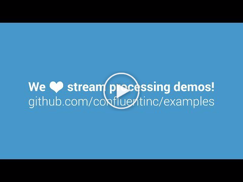
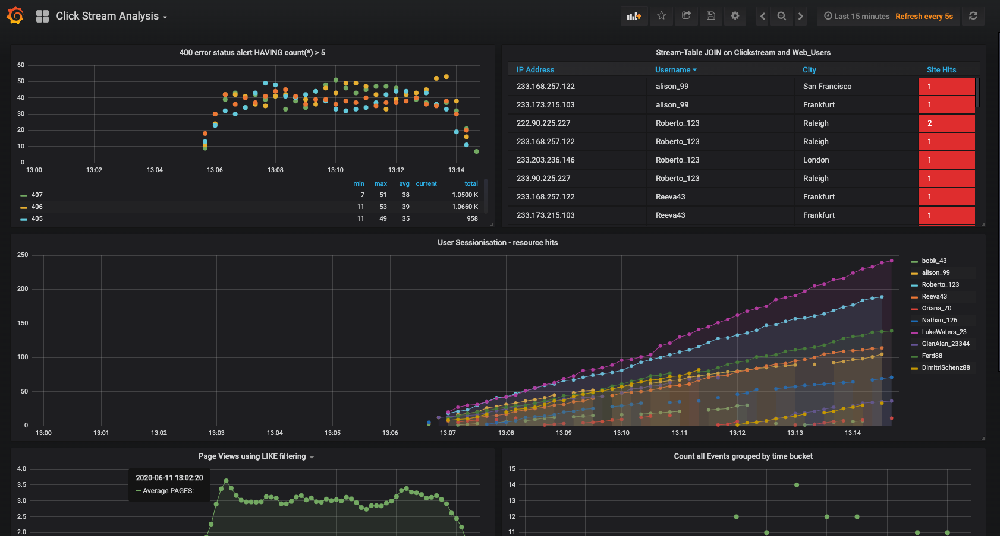
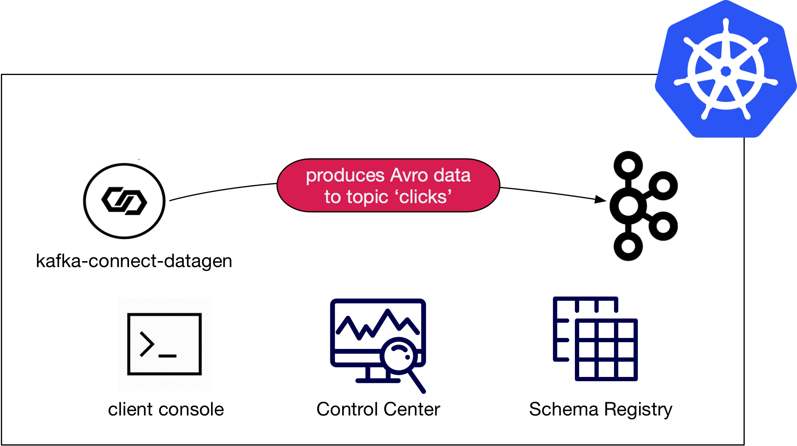
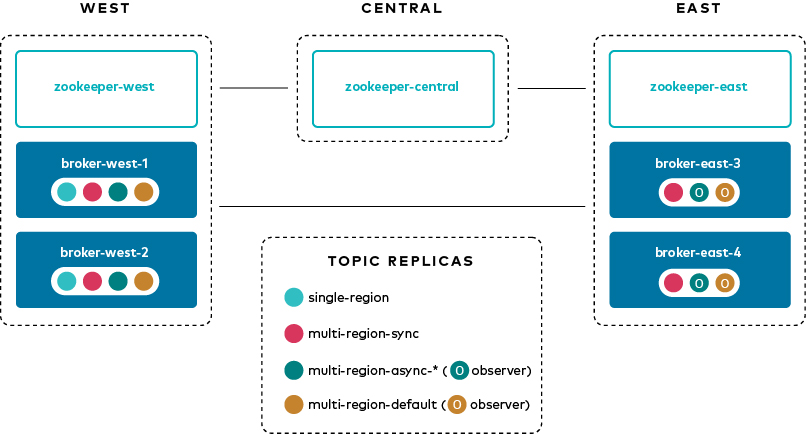
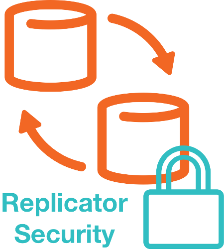

* [Overview](#overview)
* [Where to Start](#where-to-start)
* [Confluent Cloud](#confluent-cloud)
* [Stream Processing](#stream-processing)
* [Data Pipelines](#data-pipelines)
* [Confluent Platform](#confluent-platform)
* [Build Your Own](#build-your-own)
* [Additional Demos](#additional-demos)

# Overview

This is a curated list of demos that showcase Apache Kafka® event stream processing on the Confluent Platform, an event stream processing platform that enables you to process, organize, and manage massive amounts of streaming data across cloud, on-prem, and serverless deployments.

# Where to start

The best demo to start with is [cp-demo](https://github.com/confluentinc/cp-demo) which spins up a Kafka event streaming application using ksqlDB for stream processing, with many security features enabled, in an end-to-end streaming ETL pipeline with a source connector pulling from live data and a sink connector connecting to Elasticsearch and Kibana for visualizations.
`cp-demo` also comes with a tutorial and is a great configuration reference for Confluent Platform.

# Confluent Cloud

There are many examples from full end-to-end demos that create connectors, streams, and KSQL queries in Confluent Cloud, to resources that help you build your own demos.
You can find the documentation and instructions for all Confluent Cloud demos at [https://docs.confluent.io/platform/current/tutorials/examples/ccloud/docs/ccloud-demos-overview.html](https://docs.confluent.io/platform/current/tutorials/examples/ccloud/docs/ccloud-demos-overview.html?utm_source=github&utm_medium=demo&utm_campaign=ch.examples_type.community_content.top)

| Demo                                       | Local | Docker | Description
| ------------------------------------------ | ----- | ------ | ---------------------------------------------------------------------------
| [Confluent Cloud CLI](ccloud/beginner-cloud/README.md#confluent-cloud-cli) |  Y  |  N  | Fully automated demo interacting with your Confluent Cloud cluster using Confluent Cloud CLI  
| [Clients in Various Languages to Cloud](clients/cloud/README.md)                 |   [Y](clients/cloud/README.md)   |   N    | Client applications, showcasing producers and consumers, in various programming languages connecting to [Confluent Cloud](https://www.confluent.io/confluent-cloud/?utm_source=github&utm_medium=demo&utm_campaign=ch.examples_type.community_content.top)  
| [Cloud ETL](cloud-etl/README.md)                 |   [Y](cloud-etl/README.md)   |   N   | Fully automated cloud ETL solution using Confluent Cloud connectors (AWS Kinesis, Postgres with AWS RDS, GCP GCS, AWS S3, Azure Blob) and fully-managed ksqlDB  
| [ccloud-stack](ccloud/ccloud-stack/README.md) |  Y  |  N  | Creates a fully-managed stack in Confluent Cloud, including a new environment, service account, Kafka cluster, KSQL app, Schema Registry, and ACLs. The demo also generates a config file for use with client applications. 
| [On-Prem Kafka to Cloud](https://docs.confluent.io/current/tutorials/cp-demo/docs/index.html?utm_source=github&utm_medium=demo&utm_campaign=ch.examples_type.community_content.top) |   N   |   [Y](https://docs.confluent.io/current/tutorials/cp-demo/docs/index.html?utm_source=github&utm_medium=demo&utm_campaign=ch.examples_type.community_content.top)    | Module 2 of [Confluent Platform demo](https://docs.confluent.io/current/tutorials/cp-demo/docs/index.html?utm_source=github&utm_medium=demo&utm_campaign=ch.examples_type.community_content.top) (`cp-demo`) with a playbook for copying data between the on-prem and Confluent Cloud clusters  
| [GKE to Cloud](kubernetes/replicator-gke-cc/README.md)                 |   N   |   [Y](kubernetes/replicator-gke-cc/README.md)    | Uses Google Kubernetes Engine, [Confluent Cloud](https://www.confluent.io/confluent-cloud/?utm_source=github&utm_medium=demo&utm_campaign=ch.examples_type.community_content.top), and [Confluent Replicator](https://www.confluent.io/confluent-replicator/?utm_source=github&utm_medium=demo&utm_campaign=ch.examples_type.community_content.top) to explore a multicloud deployment  
| [DevOps for Apache Kafka® with Kubernetes and GitOps](https://docs.confluent.io/platform/current/tutorials/streaming-ops/index.html) | N | N | Simulated production environment running a streaming application targeting Apache Kafka on Confluent Cloud using Kubernetes and GitOps  

# Stream Processing

| Demo                                       | Local | Docker | Description
| ------------------------------------------ | ----- | ------ | ---------------------------------------------------------------------------
| [Clickstream](clickstream/README.md)       |   N   |   [Y](https://docs.confluent.io/platform/current/tutorials/examples/clickstream/docs/index.html#clickstream-demo?utm_source=github&utm_medium=demo&utm_campaign=ch.examples_type.community_content.top)    | Automated version of the [ksqlDB clickstream demo](https://docs.confluent.io/platform/current/tutorials/examples/clickstream/docs/index.html#clickstream-demo?utm_source=github&utm_medium=demo&utm_campaign=ch.examples_type.community_content.top)   
| [Kafka Tutorials](https://kafka-tutorials.confluent.io?utm_source=github&utm_medium=demo&utm_campaign=ch.examples_type.community_content.top)       |   [Y](https://kafka-tutorials.confluent.io?utm_source=github&utm_medium=demo&utm_campaign=ch.examples_type.community_content.top)   |   [Y](https://kafka-tutorials.confluent.io?utm_source=github&utm_medium=demo&utm_campaign=ch.examples_type.community_content.top)   | Collection of common event streaming use cases, with each tutorial featuring an example scenario and several complete code solutions  
| [Microservices ecosystem](microservices-orders/README.md) |   N   |   [Y](microservices-orders/README.md)    | [Microservices orders Demo Application](https://github.com/confluentinc/kafka-streams-examples/tree/5.2.2-post/src/main/java/io/confluent/examples/streams/microservices) integrated into the Confluent Platform  

# Data Pipelines

| Demo                                       | Local | Docker | Description
| ------------------------------------------ | ----- | ------ | ---------------------------------------------------------------------------
| [Clients in Various Languages](clients/cloud/README.md)                 |   [Y](clients/cloud/README.md)   |   N    | Client applications, showcasing producers and consumers, in various programming languages  
| [Connect and Kafka Streams](connect-streams-pipeline/README.md) |   [Y](connect-streams-pipeline/README.md)   |   N    | Demonstrate various ways, with and without Kafka Connect, to get data into Kafka topics and then loaded for use by the Kafka Streams API  

# Confluent Platform

| Demo                                       | Local | Docker | Description
| ------------------------------------------ | ----- | ------ | ---------------------------------------------------------------------------
| [Avro](clients/README.md)               |   [Y](clients/README.md)   |   N    | Client applications using Avro and Confluent Schema Registry  
| [CP Demo](https://github.com/confluentinc/cp-demo)           |   N   |   [Y](https://github.com/confluentinc/cp-demo)    | [Confluent Platform demo](https://docs.confluent.io/platform/current/tutorials/cp-demo/docs/index.html?utm_source=github&utm_medium=demo&utm_campaign=ch.examples_type.community_content.top) (`cp-demo`) with a playbook for Kafka event streaming ETL deployments  
| [Kubernetes](kubernetes/README.md)                 |   N   |   [Y](kubernetes/README.md)    | Demonstrations of Confluent Platform deployments using the  [Confluent Operator](https://docs.confluent.io/operator/current/overview.html?utm_source=github&utm_medium=demo&utm_campaign=ch.examples_type.community_content.top)  
| [Multi Datacenter](multi-datacenter/README.md) | N | [Y](multi-datacenter/README.md) | Active-active multi-datacenter design with two instances of Confluent Replicator copying data bidirectionally between the datacenters  
| [Multi-Region Clusters](multiregion/README.md) | N | [Y](multiregion/README.md) | Multi-Region clusters (MRC) with follower fetching, observers, and replica placement 
| [Quickstart](cp-quickstart/README.md)           |   [Y](cp-quickstart/README.md)   |   [Y](cp-quickstart/README.md)    | Automated version of the [Confluent Quickstart](https://docs.confluent.io/platform/current/quickstart/index.html?utm_source=github&utm_medium=demo&utm_campaign=ch.examples_type.community_content.top): for Confluent Platform on local install or Docker, community version, and Confluent Cloud  
| [Role-Based Access Control](security/rbac/README.md) |  Y  |  Y  | Role-based Access Control (RBAC) provides granular privileges for users and service accounts  
| [Replicator Security](replicator-security/README.md) | N | [Y](replicator-security/README.md) | Demos of various security configurations supported by Confluent Replicator and examples of how to implement them  

# Build Your Own

As a next step, you may want to build your own custom demo or test environment.
We have several resources that launch just the services in Confluent Cloud or on prem, with no pre-configured connectors, data sources, topics, schemas, etc.
Using these as a foundation, you can then add any connectors or applications.
You can find the documentation and instructions for these "build-your-own" resources at [https://docs.confluent.io/platform/current/tutorials/build-your-own-demos.html](https://docs.confluent.io/platform/current/tutorials/build-your-own-demos.html?utm_source=github&utm_medium=demo&utm_campaign=ch.examples_type.community_content.top).

# Additional Demos

Here are additional GitHub repos that offer an incredible set of nearly a hundred other Apache Kafka demos.
They are not maintained on a per-release basis like the demos in this repo, but they are an invaluable resource.

* [confluentinc/demo-scene](https://github.com/confluentinc/demo-scene/blob/master/README.md), the most popular demos include:

  * [Workshop: Apache Kafka and ksqlDB in Action: Let’s Build a Streaming Data Pipeline!](https://github.com/confluentinc/demo-scene/tree/master/build-a-streaming-pipeline/workshop)
  * [Introduction to ksqlDB](https://github.com/confluentinc/demo-scene/tree/master/introduction-to-ksqldb)
  * [Kafka Connect Zero to Hero](https://github.com/confluentinc/demo-scene/tree/master/kafka-connect-zero-to-hero)

* [vdesabou/kafka-docker-playground](https://github.com/vdesabou/kafka-docker-playground/blob/master/README.md)
