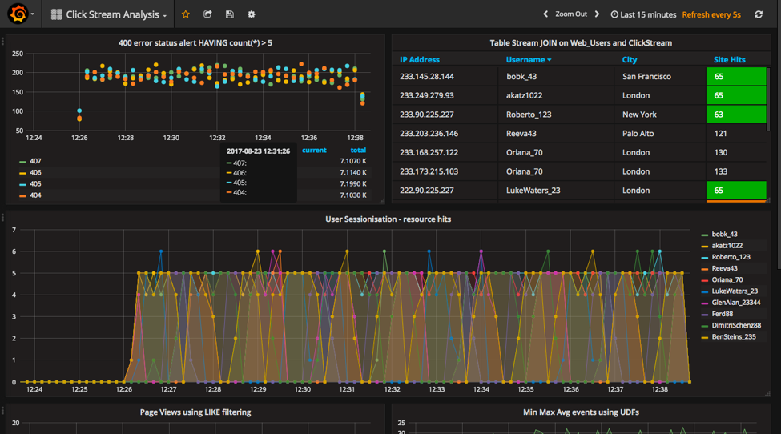

* [Demos](#demos)
* [Build Your Own](#build-your-own)
* [Additional Demos](#additional-demos)

# Demos

This is a curated list of demos that showcase Apache Kafka® event stream processing on the Confluent Platform, an event stream processing platform that enables you to process, organize, and manage massive amounts of streaming data across cloud, on-prem, and serverless deployments.

## Where to start

The best demo to start with is [cp-demo](https://github.com/confluentinc/cp-demo) which spins up a Kafka event streaming application using ksqlDB for stream processing, with many security features enabled, in an end-to-end streaming ETL pipeline with a source connector pulling from live data and a sink connector connecting to Elasticsearch and Kibana for visualizations.
`cp-demo` also comes with a tutorial and is a great configuration reference for Confluent Platform.

## Full demo list

* [Confluent Cloud](#confluent-cloud)
* [Stream Processing](#stream-processing)
* [Data Pipelines](#data-pipelines)
* [Confluent Platform](#confluent-platform)

### Confluent Cloud

| Demo                                       | Local | Docker | Description
| ------------------------------------------ | ----- | ------ | ---------------------------------------------------------------------------
| [Beginner Cloud](ccloud/beginner-cloud/README.md) |  Y  |  N  | Fully scripted demo that shows how to interact with your Confluent Cloud cluster and set ACLs using the CLI  
| [Clients to Cloud](clients/cloud/README.md)                 |   [Y](clients/cloud/README.md)   |   N    | Client applications in different programming languages connecting to [Confluent Cloud](https://www.confluent.io/confluent-cloud/?utm_source=github&utm_medium=demo&utm_campaign=ch.examples_type.community_content.top)  
| [Cloud ETL](cloud-etl/README.md)                 |   [Y](cloud-etl/README.md)   |   N   | Cloud ETL solution using fully-managed Confluent Cloud connectors and fully-managed ksqlDB  
| [On-Prem Kafka to Cloud](ccloud/README.md)                 |   [Y](ccloud/README.md)   |   [Y](ccloud/README.md)    | This more advanced demo showcases an on-prem Kafka cluster and [Confluent Cloud](https://www.confluent.io/confluent-cloud/?utm_source=github&utm_medium=demo&utm_campaign=ch.examples_type.community_content.top) cluster, and data copied between them with Confluent Replicator  
| [GKE to Cloud](kubernetes/replicator-gke-cc/README.md)                 |   N   |   [Y](kubernetes/replicator-gke-cc/README.md)    | Uses Google Kubernetes Engine, [Confluent Cloud](https://www.confluent.io/confluent-cloud/?utm_source=github&utm_medium=demo&utm_campaign=ch.examples_type.community_content.top), and [Confluent Replicator](https://www.confluent.io/confluent-replicator/?utm_source=github&utm_medium=demo&utm_campaign=ch.examples_type.community_content.top) to explore a multicloud deployment  

### Stream Processing

| Demo                                       | Local | Docker | Description
| ------------------------------------------ | ----- | ------ | ---------------------------------------------------------------------------
| [Clickstream](clickstream/README.md)       |   N   |   [Y](https://docs.confluent.io/current/tutorials/examples/clickstream/index.html?utm_source=github&utm_medium=demo&utm_campaign=ch.examples_type.community_content.top)    | Automated version of the [ksqlDB clickstream demo](https://docs.confluent.io/current/tutorials/examples/clickstream/index.html?utm_source=github&utm_medium=demo&utm_campaign=ch.examples_type.community_content.top)  
| [Kafka Tutorials](https://kafka-tutorials.confluent.io?utm_source=github&utm_medium=demo&utm_campaign=ch.examples_type.community_content.top)       |   [Y](https://kafka-tutorials.confluent.io?utm_source=github&utm_medium=demo&utm_campaign=ch.examples_type.community_content.top)   |   [Y](https://kafka-tutorials.confluent.io?utm_source=github&utm_medium=demo&utm_campaign=ch.examples_type.community_content.top)   | Collection of common event streaming use cases, with each tutorial featuring an example scenario and several complete code solutions  
| [Microservices ecosystem](microservices-orders/README.md) |   [Y](microservices-orders/README.md)   |   N    | [Microservices orders Demo Application](https://github.com/confluentinc/kafka-streams-examples/tree/5.2.2-post/src/main/java/io/confluent/examples/streams/microservices) integrated into the Confluent Platform  
| [Music demo](music/README.md)                   |   [Y](music/README.md)   |   [Y](music/README.md)    | ksqlDB version of the [Kafka Streams Demo Application](https://docs.confluent.io/current/streams/kafka-streams-examples/docs/index.html?utm_source=github&utm_medium=demo&utm_campaign=ch.examples_type.community_content.top)  

### Data Pipelines

| Demo                                       | Local | Docker | Description
| ------------------------------------------ | ----- | ------ | ---------------------------------------------------------------------------
| [Clients](clients/cloud/README.md)                 |   [Y](clients/cloud/README.md)   |   N    | Client applications in different programming languages  
| [Connect and Kafka Streams](connect-streams-pipeline/README.md) |   [Y](connect-streams-pipeline/README.md)   |   N    | Demonstrate various ways, with and without Kafka Connect, to get data into Kafka topics and then loaded for use by the Kafka Streams API  

### Confluent Platform

| Demo                                       | Local | Docker | Description
| ------------------------------------------ | ----- | ------ | ---------------------------------------------------------------------------
| [Avro](clients/README.md)               |   [Y](clients/README.md)   |   N    | Client applications using Avro and Confluent Schema Registry  
| [CP Demo](https://github.com/confluentinc/cp-demo)           |   N   |   [Y](https://github.com/confluentinc/cp-demo)    | [Confluent Platform demo](https://docs.confluent.io/current/tutorials/cp-demo/docs/index.html?utm_source=github&utm_medium=demo&utm_campaign=ch.examples_type.community_content.top) (`cp-demo`) with a playbook for Kafka event streaming ETL deployments  
| [Kubernetes](kubernetes/README.md)                 |   N   |   [Y](kubernetes/README.md)    | Demonstrations of Confluent Platform deployments using the  [Confluent Operator](https://docs.confluent.io/current/installation/operator/index.html?utm_source=github&utm_medium=demo&utm_campaign=ch.examples_type.community_content.top)  
| [Multi Datacenter](multi-datacenter/README.md) | N | [Y](multi-datacenter/README.md) | Active-active multi-datacenter design with two instances of Confluent Replicator copying data bidirectionally between the datacenters  
| [Multi Region Replication](multiregion/README.md) | N | [Y](multiregion/README.md) | Multi-region replication with follower fetching, observers, and replica placement 
| [Quickstart](cp-quickstart/README.md)           |   [Y](cp-quickstart/README.md)   |   [Y](https://docs.confluent.io/current/quickstart/ce-docker-quickstart.html#ce-docker-quickstart?utm_source=github&utm_medium=demo&utm_campaign=ch.examples_type.community_content.top)    | Automated version of the [Confluent Platform Quickstart](https://docs.confluent.io/current/quickstart.html?utm_source=github&utm_medium=demo&utm_campaign=ch.examples_type.community_content.top)  
| [Role-Based Access Control](security/rbac/README.md) |  Y  |  Y  | Role-based Access Control (RBAC) provides granular privileges for users and service accounts 
| [Secret Protection](security/secret-protection/README.adoc) |  Y  |  Y  | Secret Protection feature encrypts secrets in configuration files  
| [Replicator Security](replicator-security/README.md) | N | [Y](replicator-security/README.md) | Demos of various security configurations supported by Confluent Replicator and examples of how to implement them  

# Build Your Own

As a next step, you may want to build your own custom demo or test environment.
We have several resources that launch just the services in Confluent Platform with no pre-configured connectors, data sources, topics, schemas, etc.
Using these as a foundation, you can then add any connectors or applications.

* [cp-all-in-one](cp-all-in-one/README.md): This Docker Compose file launches all services in Confluent Platform, and runs them in containers in your local host.
* [cp-all-in-one-community](cp-all-in-one-community/README.md): This Docker Compose file launches only the community services in Confluent Platform, and runs them in containers in your local host.
* [cp-all-in-one-cloud](cp-all-in-one-cloud/README.md): Use this with your existing Confluent Cloud instance. This Docker Compose file launches all services in Confluent Platform (except for the Kafka brokers), runs them in containers in your local host, and automatically configures them to connect to Confluent Cloud.
* [Confluent CLI](https://docs.confluent.io/current/cli/index.html?utm_source=github&utm_medium=demo&utm_campaign=ch.examples_type.community_content.top): For local, non-Docker installs of Confluent Platform. Using this CLI, you can launch all services in Confluent Platform with just one command `confluent local start`, and they will all run on your local host.
* [Generate test data](https://www.confluent.io/blog/easy-ways-generate-test-data-kafka?utm_source=github&utm_medium=demo&utm_campaign=ch.examples_type.community_content.top): "Hello, World!" for launching Confluent Platform, plus different ways to generate more interesting test data for your topics

Additional documentation: [Getting Started](https://docs.confluent.io/current/getting-started.html?utm_source=github&utm_medium=demo&utm_campaign=ch.examples_type.community_content.top)

# Additional Demos

Here are additional GitHub repos that offer an incredible set of Apache Kafka demos.
They are not maintained on a per-release basis like the demos in this repo, but they are a great resource.

* [confluentinc/demo-scene](https://github.com/confluentinc/demo-scene/blob/master/README.md), the most popular demos include:
** [Workshop: Apache Kafka and ksqlDB in Action: Let’s Build a Streaming Data Pipeline!](https://github.com/confluentinc/demo-scene/tree/master/build-a-streaming-pipeline/workshop)
** [Introduction to ksqlDB](https://github.com/confluentinc/demo-scene/tree/master/introduction-to-ksqldb)
** [Kafka Connect Zero to Hero](https://github.com/confluentinc/demo-scene/tree/master/kafka-connect-zero-to-hero)
* [vdesabou/kafka-docker-playground](https://github.com/vdesabou/kafka-docker-playground/blob/master/README.md)
