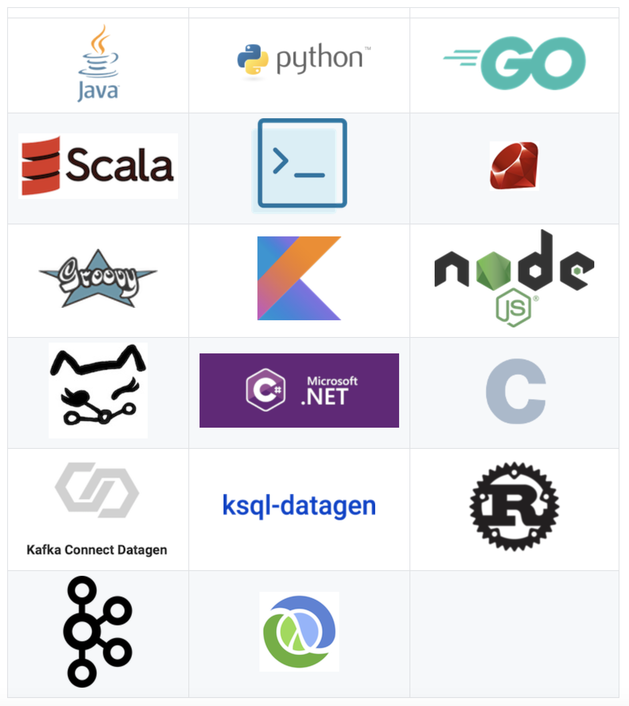
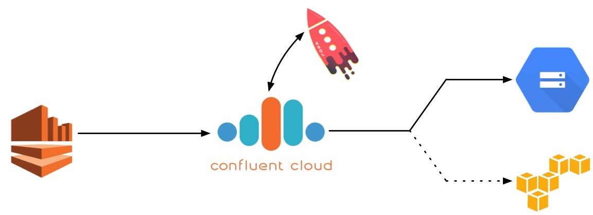

* [Demos](#demos)
* [Build Your Own](#build-your-own)
* [Prerequisities](#prerequisites)

# Demos

This is a curated list of demos that showcase Apache Kafka® stream processing on the Confluent Platform.
Some demos run on local Confluent Platform installs (download [Confluent Platform](https://www.confluent.io/download/)) and others run on Docker (install [Docker](https://docs.docker.com/install/) and [Docker Compose](https://docs.docker.com/compose/install/)).

The best demo to start with is [cp-demo](https://github.com/confluentinc/cp-demo), which spins up a Kafka event streaming application using KSQL for stream processing.
`cp-demo` also comes with a playbook and video series, and is a great configuration reference for Confluent Platform.

## Full demo list

### Confluent Platform

| Demo                                       | Local | Docker | Category | Description 
| ------------------------------------------ | ----- | ------ | -------- | ---------------------------------------------------------------------------
| [Avro](clients/README.md)               |   [Y](clients/README.md)   |   N    | Confluent Platform | Examples of client applications using Avro and Confluent Schema Registry
| [CP Demo](wikipedia/README.md)           |   [Y](wikipedia/README.md)   |   [Y](https://github.com/confluentinc/cp-demo)    | Confluent Platform | [Confluent Platform Demo](https://docs.confluent.io/current/tutorials/cp-demo/docs/index.html) with a playbook for Kafka streaming ETL deployments 
| [CP Quickstart](cp-quickstart/README.md)           |   [Y](cp-quickstart/README.md)   |   [Y](https://docs.confluent.io/current/quickstart/ce-docker-quickstart.html#ce-docker-quickstart)    | Confluent Platform | Automated version of the [Confluent Platform Quickstart](https://docs.confluent.io/current/quickstart.html)
| [Multi datacenter](multi-datacenter/README.md) | N | [Y](multi-datacenter/README.md) | Confluent Platform | This demo deploys an active-active multi-datacenter design, with two instances of Confluent Replicator copying data bidirectionally between the datacenters 
| [Security](security/README.md) |  Y  |  Y  | Confluent Platform | Examples of Confluent Platform security features including ACLs for Confluent Cloud Enterprise, Role-based Access Control (RBAC), and Secret Protection 

### Data Pipelines

| Demo                                       | Local | Docker | Category | Description 
| ------------------------------------------ | ----- | ------ | -------- | ---------------------------------------------------------------------------
| [CDC with MySQL](https://github.com/confluentinc/demo-scene/blob/master/no-more-silos/demo_no-more-silos.adoc) | N | [Y](https://github.com/confluentinc/demo-scene/blob/master/no-more-silos/demo_no-more-silos.adoc) | Data Pipelines | Self-paced steps to setup a change data capture (CDC) pipeline
| [CDC with Postgres](postgres-debezium-ksql-elasticsearch/README.md) |   N   |   [Y](postgres-debezium-ksql-elasticsearch/README.md)    | Data Pipelines | Enrich event stream data with CDC data from Postgres and then stream into Elasticsearch 
| [Connect and Kafka Streams](connect-streams-pipeline/README.md) |   [Y](connect-streams-pipeline/README.md)   |   N    | Data Pipelines | Demonstrate various ways, with and without Kafka Connect, to get data into Kafka topics and then loaded for use by the Kafka Streams API 
| [GCP pipeline](https://github.com/confluentinc/demo-scene/blob/master/gcp-pipeline/README.adoc) | N | [Y](https://github.com/confluentinc/demo-scene/blob/master/gcp-pipeline/README.adoc) | Data Pipelines | Work with [Confluent Cloud](https://www.confluent.io/confluent-cloud/) to build cool pipelines into Google Cloud Platform (GCP) 
| [MQTT](https://github.com/confluentinc/demo-scene/blob/master/mqtt-connect-connector-demo/README.md) | [Y](https://github.com/confluentinc/demo-scene/blob/master/mqtt-connect-connector-demo/README.md) | N | Data Pipelines | Internet of Things (IoT) integration example using Apache Kafka + Kafka Connect + MQTT Connector + Sensor Data
| [MySQL and Debezium](mysql-debezium/README.md) |   [Y](mysql-debezium/README.md)   |   [Y](https://github.com/confluentinc/demo-scene/tree/master/build-a-streaming-pipeline) | Data Pipelines | End-to-end streaming ETL with KSQL for stream processing using the [Debezium Connector for MySQL](http://debezium.io/docs/connectors/mysql/) 
| [Syslog](https://github.com/confluentinc/demo-scene/tree/master/syslog) |   N   |   Y    | Data Pipelines | Real-time syslog processing with Apache Kafka and KSQL: filtering logs, event-driven alerting, enriching events 

### Stream Processing

| Demo                                       | Local | Docker | Category | Description 
| ------------------------------------------ | ----- | ------ | -------- | ---------------------------------------------------------------------------
| [Clickstream](clickstream/README.md)       |   [Y](clickstream/README.md)   |   [Y](https://docs.confluent.io/current/ksql/docs/tutorials/clickstream-docker.html#ksql-clickstream-docker)    | Stream Processing | Automated version of the [KSQL Clickstream demo](https://docs.confluent.io/current/ksql/docs/tutorials/clickstream-docker.html#ksql-clickstream-docker)
| [Kafka Tutorials](https://kafka-tutorials.confluent.io)       |   [Y](https://kafka-tutorials.confluent.io)   |   [Y](https://kafka-tutorials.confluent.io)   | Stream Processing | Collection of common event streaming use cases, with each tutorial featuring an example scenario and several complete code solutions
| [KSQL UDF](https://github.com/confluentinc/demo-scene/blob/master/ksql-udf-advanced-example/README.md) | [Y](https://github.com/confluentinc/demo-scene/blob/master/ksql-udf-advanced-example/README.md) | N | Stream Processing | Advanced KSQL [UDF](https://www.confluent.io/blog/build-udf-udaf-ksql-5-0) use case for connected cars
| [KSQL workshop](https://github.com/confluentinc/demo-scene/blob/master/ksql-workshop/)   |   N   |   [Y](https://github.com/confluentinc/demo-scene/blob/master/ksql-workshop/)    | Stream Processing | showcases Kafka stream processing using KSQL and can run self-guided as a KSQL workshop 
| [Microservices ecosystem](microservices-orders/README.md) |   [Y](microservices-orders/README.md)   |   N    | Stream Processing | [Microservices Orders Demo Application](https://github.com/confluentinc/kafka-streams-examples/tree/5.2.2-post/src/main/java/io/confluent/examples/streams/microservices) integrated into the Confluent Platform 
| [Music demo](music/README.md)                   |   [Y](music/README.md)   |   [Y](music/README.md)    | Stream Processing | KSQL version of the [Kafka Streams Demo Application](https://docs.confluent.io/current/streams/kafka-streams-examples/docs/index.html) 

### Confluent Cloud

| Demo                                       | Local | Docker | Category | Description 
| ------------------------------------------ | ----- | ------ | -------- | ---------------------------------------------------------------------------
| [Clients to Cloud](clients/cloud/README.md)                 |   [Y](clients/cloud/README.md)   |   N    | Confluent Cloud | Examples of client applications in different programming languages connecting to [Confluent Cloud](https://www.confluent.io/confluent-cloud/) 
| [Hybrid cloud](ccloud/README.md)                 |   [Y](ccloud/README.md)   |   [Y](ccloud/README.md)    | Confluent Cloud | End-to-end demo of a hybrid Kafka Cluster between [Confluent Cloud](https://www.confluent.io/confluent-cloud/) and on-prem using Confluent Replicator 
| [Kinesis to Cloud](kinesis-cloud/README.md)                 |   [Y](kinesis-cloud/README.md)   |   N   | Confluent Cloud | AWS Kinesis -> Confluent Cloud -> Google Cloud Storage pipeline 

# Build Your Own

As a next step, you may want to build your own custom demo or test environment.
We have several resources that launch just the services in Confluent Platform with no pre-configured connectors, data sources, topics, schemas, etc.
Using these as a foundation, you can then add any connectors or applications.

* [cp-all-in-one](cp-all-in-one/README.md): this Docker Compose file launches all services in Confluent Platform, and runs them in containers in your local host.
* [cp-all-in-one-cloud](cp-all-in-one-cloud/README.md): use this with your pre-configured Confluent Cloud instance. This Docker Compose file launches all services in Confluent Platform (except for the Kafka brokers), runs them in containers in your local host, and automatically configures them to connect to Confluent Cloud.
* [Confluent CLI](https://docs.confluent.io/current/cli/index.html): for local, non-Docker installs of Confluent Platform. This CLI launches all services in Confluent Platform, and runs them on your local host.
* [Generate test data](https://www.confluent.io/blog/easy-ways-generate-test-data-kafka): Hello world for launching Confluent Platform, plus different ways to generate more interesting test data for your topics

Additional documentation: [Getting Started](https://docs.confluent.io/current/getting-started.html)

# Prerequisites

For local installs:

* [Confluent Platform 5.3](https://www.confluent.io/download/)
* Env var `CONFLUENT_HOME=/path/to/confluentplatform`
* Env var `PATH` includes `$CONFLUENT_HOME/bin`
* Each demo has its own set of prerequisites as well, documented in each demo's README

For Docker: demos have been validated with

* Docker version 17.06.1-ce
* Docker Compose version 1.14.0 with Docker Compose file format 2.1

