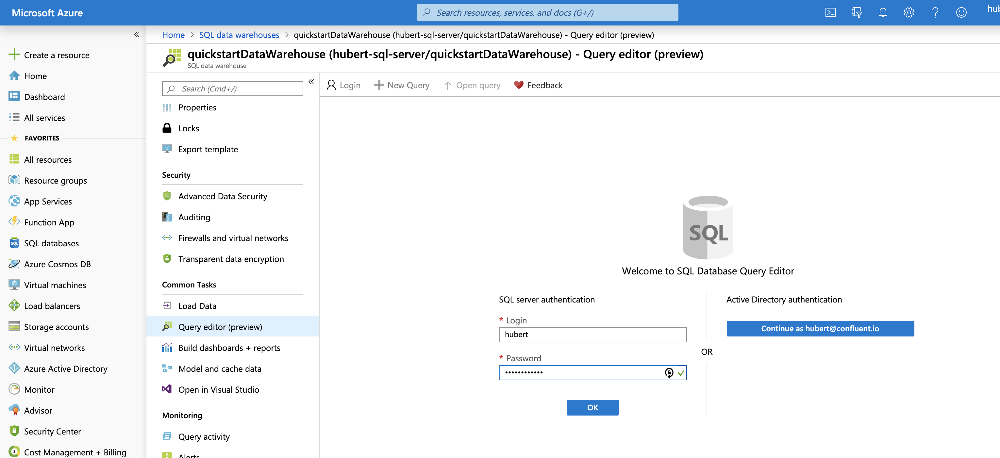
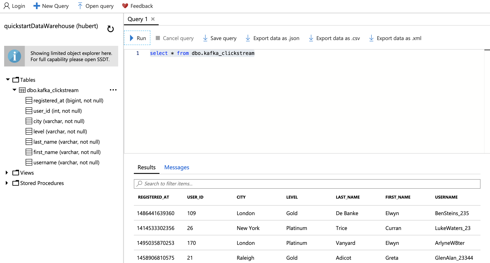

# Azure SQLDW Sink Connector Validation

This repository uses the datagen connector to mock clickstream data and sends it to Kafka. The Azure SQLDW Sink connector will consume the data and create a table in SQLDW. Instead of using the `mssql` command line tool to query from SQLDW, I will provide instructions select it from Azure.

This demo requires the `az` command line tool. Please follow the instructions [here](https://docs.microsoft.com/en-us/cli/azure/install-azure-cli?view=azure-cli-latest) too install.

## Environment Vairables

Create a env.sh file and set these variables

```bash
#!/bin/bash
export ADMIN_USER=# changeme exmaple: jay
export ADMIN_PASS=# changeme example: confluent10!
export IP_ADDRESS=#g o to google and ask "what is my ip"
export RESOURCE_GROUP=quickstartResourceGroup # change this if you want
export SERVER=# changeme-sql-server
export DWNAME=quickstartDataWarehouse # change this if you want
export REGION=eastus # change this if you want
```

## Login

```bash
az login
```

## Make commands

```bash
source env.sh # set environment variables
make build # builds the containers
make cluster # creates the CP cluster
make ps # lists the containers
make sqldw # creates the  Azure SQLDW
make topic # creaets the clickstream topic
make connect # creates the source and sink connectors (datagen and SQLDW sink)
```

## Query from Azure

- Goto https://portal.azure.com and type sqldw in the search bar.
- Find click on the resource group you created.
- Use your ADMIN_USER and AMDIN_PASSWORD to log into SQL server.

- Open tables folcer and click on dbo.kafka_clickstream
- Paste `select * from dbo.kafka_clickstream` into Query 1 and view results below.


## Clean up

```bash
make down # destroys the cluster and deletes the Azure resource group
```

<!--
kafka-avro-console-producer \
    --broker-list broker:29092 --topic azure-sqldw \
    --property schema.registry.url=http://schema-registry:8081 \
    --property value.schema='{"type":"record","name":"myrecord","fields":[{"name":"name","type":"string"}, {"name":"price","type":"float"}, {"name":"quantity","type":"int"}]}'

``` -->
