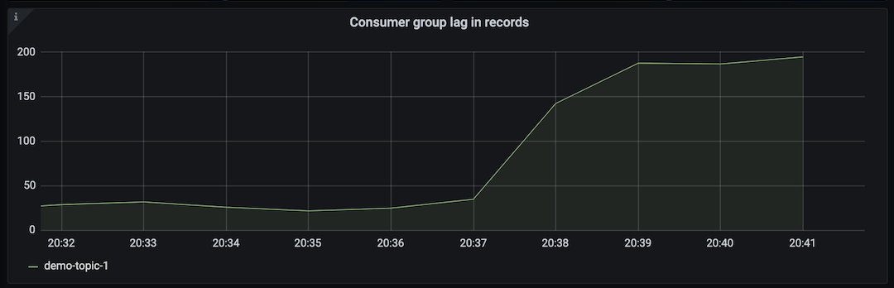

.. _ccloud-monitoring-consumer-connectivity-problem:

Consumer Lag Problem
********************

Consumer group lag is a tremendous performance indicator. It informs you how far behind the latest offset
a consumer group is, essentially the difference between the producer's last produced messaeg and
the consumer group's latest commit. `kafka-lag-exporter <https://github.com/lightbend/kafka-lag-exporter>`__
is an open source project that collects consumer group lag information and presents it in a Prometheus
scrapable format. A large or quickly growing lag indicates that the consumer is not able to keep up with
the volume of messages on a topic.

Introduce failure scenario
^^^^^^^^^^^^^^^^^^^^^^^^^^

#. Stop ``consumer-1`` container, thus removing a consumer from the consumer group and add 2 producers:

   .. code-block:: bash

      docker-compose up -d --scale consumer=1 --scale producer=5

   Which will produce the following output:

   .. code-block:: bash

      ccloud-exporter is up-to-date
      kafka-lag-exporter is up-to-date
      node-exporter is up-to-date
      grafana is up-to-date
      prometheus is up-to-date
      Stopping and removing ccloud-monitoring_consumer_2 ... done
      Starting ccloud-monitoring_producer_1              ... done
      Creating ccloud-monitoring_producer_2              ... done
      Creating ccloud-monitoring_producer_3              ... done
      Creating ccloud-monitoring_producer_4              ... done
      Creating ccloud-monitoring_producer_5              ... done
      Starting ccloud-monitoring_consumer_1              ... done

Diagnose the problem
^^^^^^^^^^^^^^^^^^^^

#. Open `Grafana <localhost:3000>`__ and login with the username ``admin`` and password ``password``.

#. Navigate to the ``Consumer Client Metrics`` dashboard. Wait 2 minutes and then observe:

   - Rebalance rate has a bump, indicating that the consumer group ``demo-cloud-monitoring-1`` underwent a rebalance, which is to be expected when a consumer leaves the group.

   |Consumer Rebalance Bump|

   - An upward trend in ``Consumer group lag in records``.  ``Consumer group lag in seconds`` will have a less dramatic increase. Both indicating that the producer is creating more messages than the consumer can fetch in a timely manner.

   |Consumer Lag Records|

   - An increase in ``Fetch request rate`` and ``Fetch size avg``, indicating the consumer is fetching more often and larger batches.

   |Consumer Fetch Increase|

   - All of the graphs in the ``Throughput`` are indicating the consumer is processing more bytes/records.

   |Consumer Throughput Increase|

Resolve failure scenario
^^^^^^^^^^^^^^^^^^^^^^^^

#. Start ``consumer-1`` container, thus adding a consumer back to the consumer group, and stop the extra producers:

   .. code-block:: bash

      docker-compose up -d --scale consumer=2 --scale producer=1

   Which will produce the following output:

   .. code-block:: bash

      node-exporter is up-to-date
      grafana is up-to-date
      kafka-lag-exporter is up-to-date
      prometheus is up-to-date
      ccloud-exporter is up-to-date
      Stopping and removing ccloud-monitoring_producer_2 ... done
      Stopping and removing ccloud-monitoring_producer_3 ... done
      Stopping and removing ccloud-monitoring_producer_4 ... done
      Stopping and removing ccloud-monitoring_producer_5 ... done
      Starting ccloud-monitoring_consumer_1              ... done
      Creating ccloud-monitoring_consumer_2              ... done
      Starting ccloud-monitoring_producer_1              ... done

.. |Consumer Rebalance Bump|
   image:: ../images/rebalance-bump.png
   :alt: Consumer Rebalance Bump

.. |Consumer Fetch Increase|
   image:: ../images/consumer-fetch-increase.png
   :alt: Consumer Fetch Increase

.. |Consumer Throughput Increase|
   image:: ../images/consumer-throughput-increase.png
   :alt: Consumer Throughput Increase