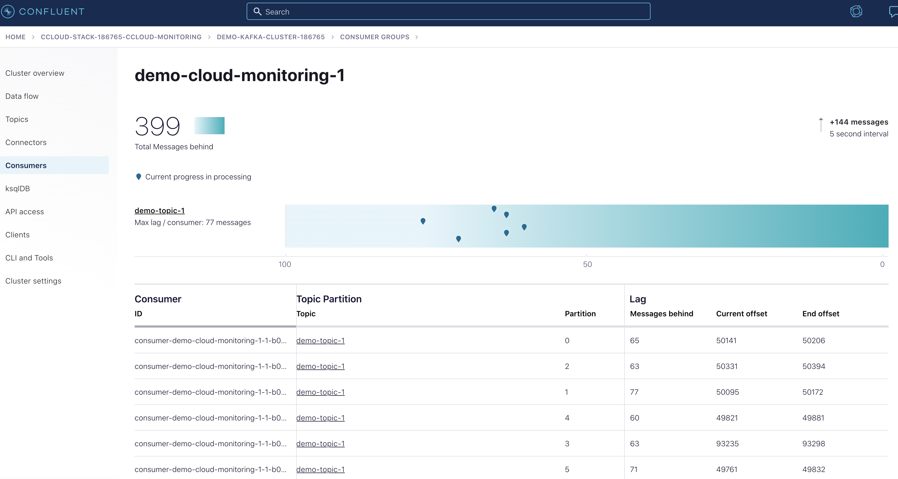

.. _ccloud-monitoring-consumer-connectivity-problem:

Consumer Lag Problem
********************

Consumer group lag is a tremendous performance indicator. It informs you how far behind the latest offset
a consumer group is, essentially the difference between the producer's last produced messaeg and
the consumer group's latest commit. `kafka-lag-exporter <https://github.com/lightbend/kafka-lag-exporter>`__
is an open source project that collects consumer group lag information and presents it in a Prometheus
scrapable format. A large or quickly growing lag indicates that the consumer is not able to keep up with
the volume of messages on a topic.

This scenario will look at Confluent Cloud metrics from the Metrics API, kafka-lag-exporter metrics, and
client metrics from the client application’s MBean object ``kafka.consumer:type=consumer-fetch-manager-metrics,client-id=<client_id>``.

Introduce failure scenario
^^^^^^^^^^^^^^^^^^^^^^^^^^

#. Stop ``consumer-1`` container, thus removing a consumer from the consumer group and add 2 producers:

   .. code-block:: bash

      docker-compose up -d --scale consumer=1 --scale producer=5

   Which will produce the following output:

   .. code-block:: bash

      ccloud-exporter is up-to-date
      kafka-lag-exporter is up-to-date
      node-exporter is up-to-date
      grafana is up-to-date
      prometheus is up-to-date
      Stopping and removing ccloud-monitoring_consumer_2 ... done
      Starting ccloud-monitoring_producer_1              ... done
      Creating ccloud-monitoring_producer_2              ... done
      Creating ccloud-monitoring_producer_3              ... done
      Creating ccloud-monitoring_producer_4              ... done
      Creating ccloud-monitoring_producer_5              ... done
      Starting ccloud-monitoring_consumer_1              ... done

Diagnose the problem
^^^^^^^^^^^^^^^^^^^^

#. Open `Grafana <localhost:3000>`__ and login with the username ``admin`` and password ``password``.

#. Navigate to the ``Consumer Client Metrics`` dashboard. Wait 2 minutes and then observe:

   - ``Rebalance rate`` (``rebalance-rate-per-hour``) has a bump, indicating that the consumer group ``demo-cloud-monitoring-1`` underwent a rebalance, which is to be expected when a consumer leaves the group.

   |Consumer Rebalance Bump|

   - An upward trend in ``Consumer group lag in records``.  ``Consumer group lag in seconds`` will have a less dramatic increase. Both indicating that the producer is creating more messages than the consumer can fetch in a timely manner. These metrics are derived from ``kafka-lag-exporter``.

   |Consumer Lag|

   - An increase in ``Fetch request rate`` (``fetch-total``) and ``Fetch size avg`` (``fetch-size-avg``) in the ``Consumer Fetch Metrics`` tab, indicating the consumer is fetching more often and larger batches.

   |Consumer Fetch Increase|

   - All of the graphs in the ``Throughput`` are indicating the consumer is processing more bytes/records.

   |Consumer Throughput Increase|

#. The current consumer lag can also be observed via the CLI if you have Confluent Platform installed.

   .. code-block:: bash

      kafka-consumer-groups --bootstrap-server $BOOTSTRAP_SERVERS --command-config $CONFIG_FILE --describe --group demo-cloud-monitoring-1

   Which will produce something similar to the following:

   .. code-block:: text

      GROUP                   TOPIC           PARTITION  CURRENT-OFFSET  LOG-END-OFFSET  LAG             CONSUMER-ID                                                             HOST            CLIENT-ID
      demo-cloud-monitoring-1 demo-topic-1    0          48163           48221           58              consumer-demo-cloud-monitoring-1-1-b0bec0b5-ec84-4233-9d3e-09d132b9a3c7 /10.2.10.251    consumer-demo-cloud-monitoring-1-1
      demo-cloud-monitoring-1 demo-topic-1    3          91212           91278           66              consumer-demo-cloud-monitoring-1-1-b0bec0b5-ec84-4233-9d3e-09d132b9a3c7 /10.2.10.251    consumer-demo-cloud-monitoring-1-1
      demo-cloud-monitoring-1 demo-topic-1    4          47854           47893           39              consumer-demo-cloud-monitoring-1-1-b0bec0b5-ec84-4233-9d3e-09d132b9a3c7 /10.2.10.251    consumer-demo-cloud-monitoring-1-1
      demo-cloud-monitoring-1 demo-topic-1    5          47748           47803           55              consumer-demo-cloud-monitoring-1-1-b0bec0b5-ec84-4233-9d3e-09d132b9a3c7 /10.2.10.251    consumer-demo-cloud-monitoring-1-1
      demo-cloud-monitoring-1 demo-topic-1    1          48097           48151           54              consumer-demo-cloud-monitoring-1-1-b0bec0b5-ec84-4233-9d3e-09d132b9a3c7 /10.2.10.251    consumer-demo-cloud-monitoring-1-1
      demo-cloud-monitoring-1 demo-topic-1    2          48310           48370           60              consumer-demo-cloud-monitoring-1-1-b0bec0b5-ec84-4233-9d3e-09d132b9a3c7 /10.2.10.251    consumer-demo-cloud-monitoring-1-1

   The downside of this view is the lack of historical context that the ``Consumer Client Metrics`` dashboard provides.

#. Another view of consumer lag can be found in |ccloud|. Open the UI, navigate to the "Consumers" section and click on the ``demo-cloud-monitoring-1`` consumer group.
   This page will update periodically, within two minutes you should see a steady increase is the offset lag.

   |Confluent Cloud Consumer Lag|

   Again the downside of this view is the lack of historical context that the ``Consumer Client Metrics`` dashboard provides.

#. A top level view of the |ccloud| cluster that reflects an increase in bytes produced and bytes consumed can be viewed in the ``Confluent Cloud`` dashboard in the panels highlighted below.

   |Confluent Cloud Request Increase|

#. The consumer logs won't show that the consumer is falling behind which is why it is important to keep an eye on consumer group metrics.
   Logs will tell us that the consumer group rebalanced, the logs can be accessed with the following command:

   .. code-block:: bash

      docker-compose logs consumer

   They should look something like what is below:

   .. code-block:: text

      consumer_1            | [2021-02-24 16:04:45,659] INFO [Consumer clientId=consumer-demo-cloud-monitoring-1-1, groupId=demo-cloud-monitoring-1] Attempt to heartbeat failed since group is rebalancing (org.apache.kafka.clients.consumer.internals.AbstractCoordinator)
      consumer_1            | [2021-02-24 16:04:45,695] INFO [Consumer clientId=consumer-demo-cloud-monitoring-1-1, groupId=demo-cloud-monitoring-1] Revoke previously assigned partitions demo-topic-1-1, demo-topic-1-2, demo-topic-1-0, demo-topic-1-5, demo-topic-1-3, demo-topic-1-4 (org.apache.kafka.clients.consumer.internals.ConsumerCoordinator)
      consumer_1            | [2021-02-24 16:04:45,695] INFO [Consumer clientId=consumer-demo-cloud-monitoring-1-1, groupId=demo-cloud-monitoring-1] (Re-)joining group (org.apache.kafka.clients.consumer.internals.AbstractCoordinator)
      consumer_1            | [2021-02-24 16:04:45,748] INFO [Consumer clientId=consumer-demo-cloud-monitoring-1-1, groupId=demo-cloud-monitoring-1] Successfully joined group with generation Generation{generationId=42, memberId='consumer-demo-cloud-monitoring-1-1-b0bec0b5-ec84-4233-9d3e-09d132b9a3c7', protocol='range'} (org.apache.kafka.clients.consumer.internals.AbstractCoordinator)
      consumer_1            | [2021-02-24 16:04:45,750] INFO [Consumer clientId=consumer-demo-cloud-monitoring-1-1, groupId=demo-cloud-monitoring-1] Finished assignment for group at generation 42: {consumer-demo-cloud-monitoring-1-1-b0bec0b5-ec84-4233-9d3e-09d132b9a3c7=Assignment(partitions=[demo-topic-1-3, demo-topic-1-4, demo-topic-1-5]), consumer-demo-cloud-monitoring-1-1-261ae825-8cd3-427b-a9f6-cde4849915b1=Assignment(partitions=[demo-topic-1-0, demo-topic-1-1, demo-topic-1-2])} (org.apache.kafka.clients.consumer.internals.ConsumerCoordinator)
      consumer_1            | [2021-02-24 16:04:45,794] INFO [Consumer clientId=consumer-demo-cloud-monitoring-1-1, groupId=demo-cloud-monitoring-1] Successfully synced group in generation Generation{generationId=42, memberId='consumer-demo-cloud-monitoring-1-1-b0bec0b5-ec84-4233-9d3e-09d132b9a3c7', protocol='range'}  (org.apache.kafka.clients.consumer.internals.AbstractCoordinator)

Resolve failure scenario
^^^^^^^^^^^^^^^^^^^^^^^^

#. Start ``consumer-1`` container, thus adding a consumer back to the consumer group, and stop the extra producers:

   .. code-block:: bash

      docker-compose up -d --scale consumer=2 --scale producer=1

   Which will produce the following output:

   .. code-block:: bash

      node-exporter is up-to-date
      grafana is up-to-date
      kafka-lag-exporter is up-to-date
      prometheus is up-to-date
      ccloud-exporter is up-to-date
      Stopping and removing ccloud-monitoring_producer_2 ... done
      Stopping and removing ccloud-monitoring_producer_3 ... done
      Stopping and removing ccloud-monitoring_producer_4 ... done
      Stopping and removing ccloud-monitoring_producer_5 ... done
      Starting ccloud-monitoring_consumer_1              ... done
      Creating ccloud-monitoring_consumer_2              ... done
      Starting ccloud-monitoring_producer_1              ... done

.. |Consumer Rebalance Bump|
   image:: ../images/rebalance-bump.png
   :alt: Consumer Rebalance Bump

.. |Consumer Lag|
   image:: ../images/consumer-group-lag.png
   :alt: Consumer Lag

.. |Consumer Fetch Increase|
   image:: ../images/consumer-fetch-increase.png
   :alt: Consumer Fetch Increase

.. |Consumer Throughput Increase|
   image:: ../images/consumer-throughput-increase.png
   :alt: Consumer Throughput Increase

.. |Confluent Cloud Request Increase|
   image:: ../images/ccloud-request-increase.png
   :alt: Confluent Cloud Request Increase

