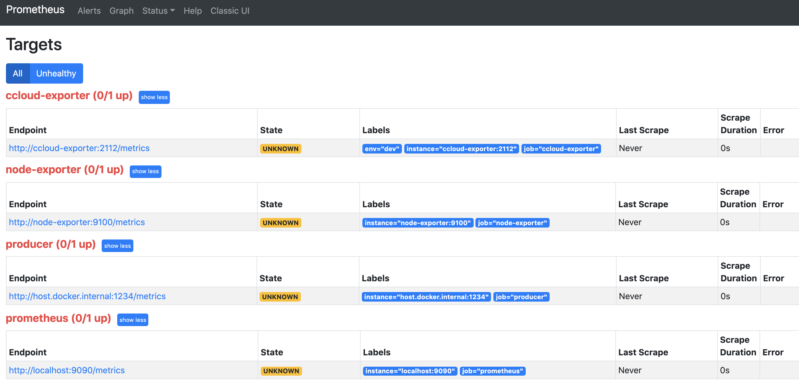
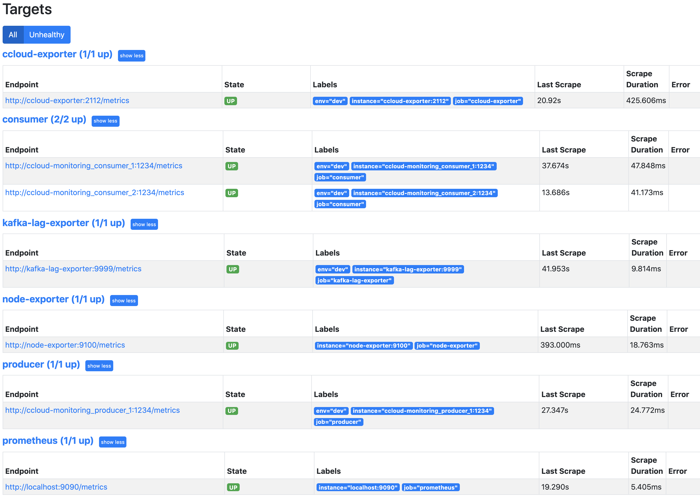

.. _ccloud-monitoring-overview:

Monitor Overview and Setup
--------------------------

Using |ccloud| has the advantage of circumventing the trials and tribulations one would face when monitoring
an on-prem Kafka cluster, but you still need to monitor your client applications and, to some degree, your |ccloud| cluster.
Your success in |ccloud| largely depends on how well your applications are performing. Monitoring your client
applications gives you insights on how to fine tune your producers and consumers, when to scale
your |ccloud| cluster, what might be going wrong, and how to resolve the problem.

This module covers how to set up a time-series database populated with data from the
|ccloud| Metrics API and client metrics from a locally running Java consumer and producer,
along with how to set up a data visualization tool. After the initial setup, you will
follow a series of scenarios to create failure scenarios and to be alerted when the errors occur.

.. note::

   This example uses Prometheus as the time-series database and Grafana for visualization, but the same principles can be applied to any other technologies.

Prerequisites
~~~~~~~~~~~~~

-  Access to `Confluent Cloud <https://confluent.cloud/login>`__.

-  Local `install of Confluent Cloud CLI
   <https://docs.confluent.io/ccloud-cli/current/install.html>`__ (v1.21.0 or later)

-  .. include:: ../../ccloud/docs/includes/prereq_timeout.rst

-  `mvn <https://maven.apache.org/install.html>`__ installed on your host

-  `jq <https://github.com/stedolan/jq/wiki/Installation>`__ installed on your host

-  `Docker <https://docs.docker.com/get-docker/>`__ installed on your host

Cost to Run Tutorial
~~~~~~~~~~~~~~~~~~~~

Caution
^^^^^^^

.. include:: ../../ccloud/docs/includes/ccloud-examples-caution.rst

|ccloud| Promo Code
^^^^^^^^^^^^^^^^^^^

.. include:: ../../ccloud/docs/includes/ccloud-examples-promo-code.rst

|ccloud| Cluster Setup
~~~~~~~~~~~~~~~~~~~~~~~~~~~~~

#. Log in to the |ccloud| CLI:

   .. code-block:: bash

      ccloud login --save

   The ``--save`` flag will save your |ccloud| login credentials to the
   ``~/.netrc`` file.

#. Clone the `confluentinc/examples <https://github.com/confluentinc/examples>`__ GitHub repository.

   .. code-block:: bash

       git clone https://github.com/confluentinc/examples.git

#. Navigate to the ``examples/ccloud-monitoring/`` directory and switch to
   the |cp| release branch:

   .. codewithvars:: bash

       cd examples/ccloud-monitoring/
       git checkout |release_post_branch|

#. Proceed to `Monitoring Container Setup`_ section if you would like to walk through how to setup a |ccloud| cluster, secrets, and monitoring pieces.
   Alternatively, you can setup a |ccloud| cluster along with everything described in the `Monitoring Container Setup`_ section by running
   :devx-examples:`start.sh script|ccloud-monitoring/start.sh`:

   .. code-block:: bash

      ./start.sh

#. It will take up to 3 minutes for data to become visible in Grafana.
   Open `Grafana <localhost:3000>`__ and use the username ``admin`` and password ``password`` to login.
   Now you are ready to proceed to Producer, Consumer, or General scenarios to see what different failure scenarios look like.

Monitoring Container Setup
~~~~~~~~~~~~~~~~~~~~~~~~~~
The following instructions will:

-  use ``ccloud-stack`` to create a |ccloud| cluster, a service account with proper acls, and a client configuration file

-  create a ``cloud`` resource api-key for the ``ccloud-exporter``

-  build a |ak| client docker image with the maven project's dependencies cache

-  stand up numerous docker containers (2 consumers with JMX exporter, 1 producer with JMX exporter, Prometheus, Grafana, a ccloud-exporter, and a node-exporter) with ``docker-compose``

-  direct you to Prometheus to validate Prometheus is able to scrape data from the various exporters

-  direct you to Grafana to validate data is being pulled from Prometheus

#. Create a |ccloud| cluster by running the following commands. This will take a few minutes:

   .. code-block:: bash

      source ../utils/ccloud_library.sh
      export EXAMPLE="ccloud-monitoring"
      ccloud::create_ccloud_stack false

   The output should resemble the content below:

   .. code-block:: text

      Creating Confluent Cloud stack for service account demo-app-16798, ID: 184498.
      Set Kafka cluster "lkc-36pwo" as the active cluster for environment "env-oz8kp".

      Waiting up to 720 seconds for Confluent Cloud cluster to be ready and for credentials to propagate

      Sleeping an additional 80 seconds to ensure propagation of all metadata
      Set API Key "242FB4O5U67ORXTT" as the active API key for "lkc-36pwo".

      Client configuration file saved to: stack-configs/java-service-account-184498.config

#. Map the client configuration file that was created above to the environment variable ``CONFIG_FILE``, see below.
   Your client configuration file name may differ from what is shown here.

   .. code-block:: text

      export CONFIG_FILE=stack-configs/java-service-account-184498.config

#. Prior to starting any docker containers, create an api-key for the ``cloud`` resource with the command below. The
   `ccloud-exporter <https://github.com/Dabz/ccloudexporter/blob/master/README.md>`_ uses the
   key and secret to authenticate to |ccloud|. ``ccloud-exporter`` queries the
   `Confluent Metrics API <https://docs.confluent.io/cloud/current/monitoring/metrics-api.html>`_
   for metrics about your |ccloud| deployment and displays them in a Prometheus scrapable
   webpage.

   .. code-block:: bash

      ccloud api-key create --resource cloud --description "confluent-cloud-metrics-api" -o json

   Verify your output resembles:

   .. code-block:: text

      {
        "key": "LUFEIWBMYXD2AMN5",
        "secret": "yad2iQkA9zxGvGYU1dmk+wiFJUNktQ3BtcRV9MrspaYhS9Z8g9ulZ7yhXtkRNNLd"
      }

   The value of the API key, in this case ``LUFEIWBMYXD2AMN5``, and API secret, in this case
   ``yad2iQkA9zxGvGYU1dmk+wiFJUNktQ3BtcRV9MrspaYhS9Z8g9ulZ7yhXtkRNNLd``, may differ in your output.

#. Create the following environment variables, substituting in your |ccloud| API key and secret created in the step earlier.

   .. code-block:: bash

      export METRICS_API_KEY=LUFEIWBMYXD2AMN5
      export METRICS_API_SECRET=yad2iQkA9zxGvGYU1dmk+wiFJUNktQ3BtcRV9MrspaYhS9Z8g9ulZ7yhXtkRNNLd"

   These environment variables will be used by the ``ccloud-exporter`` container.

#. Create one more environment variable, ``CCLOUD_CLUSTER``, that will be used by the ``ccloud-exporter``.
   You can find your |ccloud| cluster ID by either running ``ccloud kafka cluster list`` or looking in the client configuration file (``stack-configs/java-service-account-184498.config``) for ``# KAFKA CLUSTER ID: <cluster id>``.

   .. code-block:: bash

      export CLOUD_CLUSTER=lkc-x6m01

#. Next, prep the environment for the ``kafka-lag-exporter``--a Prometheus exporter that collect information about consumer groups.
   To do this, we need to set a few environment variables by executing the following:

   .. code-block:: bash

      ccloud::generate_configs $CONFIG_FILE
      source delta_configs/env.delta

   Then run the commands below to allow the service account to describe the cluster and consumer-groups.

   .. code-block:: bash

      ccloud kafka acl create --allow --service-account $SERVICE_ACCOUNT_ID --operation DESCRIBE --cluster-scope
      ccloud kafka acl create --allow --service-account $SERVICE_ACCOUNT_ID --operation DESCRIBE --consumer-group '*'

#. Create the ``localbuild/client:latest`` docker image with the following command:

   .. code-block:: bash

      docker build -t localbuild/client:latest .

   This image caches Kafka client dependencies so that they won't need to be pulled each time you start a client container.

#. Start up Prometheus, Grafana, a ccloud-exporter, a node-exporter, and a few Kafka clients in Docker:

   .. code-block:: bash

      docker-compose up -d --scale consumer=2

   Your output will resemble:

   .. code-block:: text

      Creating network "ccloud-monitoring_default" with the default driver
      Creating prometheus         ... done
      Creating node-exporter      ... done
      Creating grafana            ... done
      Creating kafka-lag-exporter ... done
      Creating ccloud-exporter              ... done
      Creating ccloud-monitoring_producer_1 ... done
      Creating ccloud-monitoring_consumer_1 ... done
      Creating ccloud-monitoring_consumer_2 ... done

#. Navigate to the `Prometheus Targets page <localhost:9090/targets>`__.

   |Prometheus Targets Unknown|

   This page will show you if Prometheus is scraping the targets you have created. It should look like below after 2 minutes if everything is working. You may need to refresh the page.

   |Prometheus Targets Up|

#. It will take up to 3 minutes for data to become visible in Grafana.
   Open `Grafana <localhost:3000>`__ and use the username ``admin`` and password ``password`` to login.
   Now you are ready to proceed to Producer, Consumer, or General scenarios to see what different failure scenarios look like.

