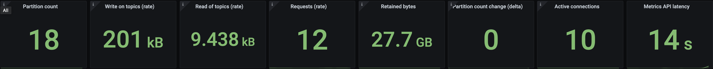

.. _ccloud-monitoring-producer-connectivity-problem:

Connectivity Problem
********************
In this use case we will simulate a network failure, see how your producer reacts when it can't reach the broker.

Introduce failure scenario
^^^^^^^^^^^^^^^^^^^^^^^^^^

#. Add a rule blocking traffic in the ``producer`` container on port ``9092`` which is used to talk to the broker:

   .. code-block:: bash

      docker-compose exec producer iptables -A OUTPUT -p tcp --dport 9092 -j DROP

Diagnose the problem
^^^^^^^^^^^^^^^^^^^^

#. Open `Grafana <localhost:3000>`__ and login with the username ``admin`` and password ``password``.

#. Navigate to the ``Producer Client Metrics`` dashboard. Within a minute you should see a downward
   trend in outgoing bytes which can be found by the expanding the ``Throughput`` tab.
   Within two minutes, the top level panels like ``Record error rate`` (derived from |ak| MBean ...) should turn red, a major indication something is wrong.
   You should see the spark line in the ``Free buffer space`` (derived from |ak| MBean ...) panel go down and a bump in ``Retry reate`` (derived from |ak| MBean ...)
   This means the producer is not producing data, which could happen for a few reasons.

   |Producer Connectivity Loss|

#. In order to say this is a truly a problem on the producer end, check the status of the |ccloud| cluster, specifically that it is accepting requests. Navigate to the ``Confluent Cloud`` dashboard.

#. Look at the top panels, they should all be green which means the cluster is operating safely within its resources.

   |Confluent Cloud Panel|

   For a connectivity problem in a client, look specifically at the ``Requests (rate)``. If this value
   were yellow or red, the client connectivity problem could be due to hitting the Confluent Cloud
   requests rate limit. If you exceed the maximum, requests may be refused. Producer and consumer
   clients may also be throttled to keep the cluster stable. This throttling would register as non-zero
   values for the producer client produce-throttle-time-max and produce-throttle-time-avg metrics and
   consumer client fetch-throttle-time-max and fetch-throttle-time-avg metrics.

#. Check the producer logs for more information about what is going wrong. Use the following docker command to get the producer logs:

   .. code-block:: bash

      docker-compose logs producer

   They should look something like what is below:

   .. code-block:: text

      producer           | [2021-02-11 18:16:12,231] WARN [Producer clientId=producer-1] Got error produce response with correlation id 15603 on topic-partition demo-topic-4-3, retrying (2147483646 attempts left). Error: NETWORK_EXCEPTION (org.apache.kafka.clients.producer.internals.Sender)
      producer           | [2021-02-11 18:16:12,232] WARN [Producer clientId=producer-1] Received invalid metadata error in produce request on partition demo-topic-4-3 due to org.apache.kafka.common.errors.NetworkException: The server disconnected before a response was received.. Going to request metadata update now (org.apache.kafka.clients.producer.internals.Sender)

   Note that the logs validate provide a clear picture of what is going on--``Error: NETWORK_EXCEPTION`` and ``server disconnected``. This was entirely to be expected because the failure scenario we introduced blocked outgoing traffic to the broker's post. Looking at metrics alone won't always lead you directly to an answer but they are a quick way to see if things are working as expected.

Resolve failure scenario
^^^^^^^^^^^^^^^^^^^^^^^^

#. Remove the rule we created earlier that blocked traffic with the following command:

   .. code-block:: bash

      docker-compose exec producer iptables -D OUTPUT -p tcp --dport 9092 -j DROP

#. It may take a few minutes for the producer to start sending requests again.

Troubleshooting
^^^^^^^^^^^^^^^

#. Producer output rate doesn't come back up after adding in the ``iptables`` rule.

   Restart the producer by running ``docker-compose restart producer``. This is advice specific to this tutorial.

.. |Producer Connectivity Loss|
   image:: ../images/producer-connectivity-loss.png
   :alt: Producer Connectivity Loss