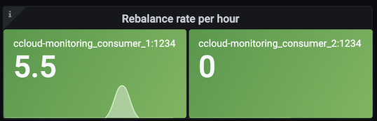
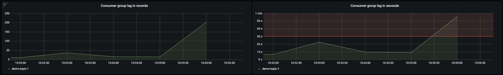
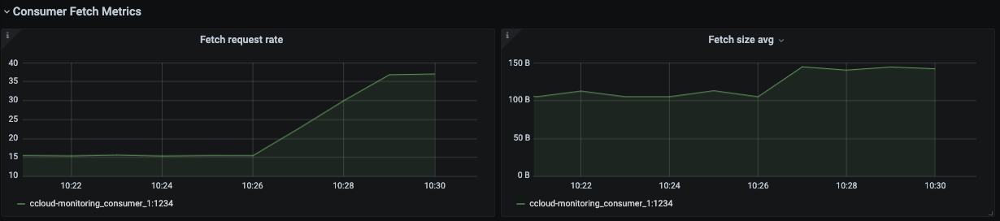
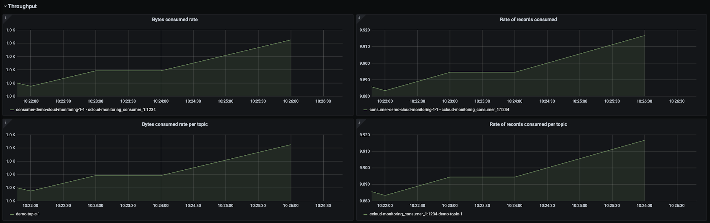
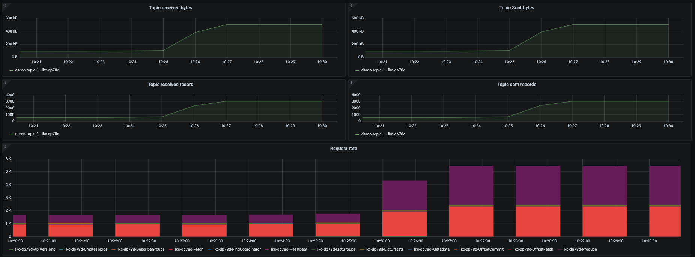
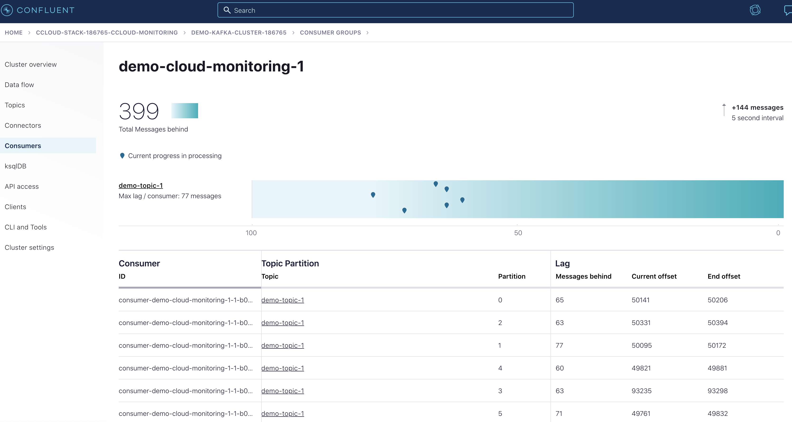

.. _ccloud-observability-consumer-increasing-consumer-lag:

Increasing Consumer Lag
***********************

Consumer lag is a tremendous performance indicator. It tells you the offset difference between the
producer's last produced message and the consumer group's last commit. If you are unfamiliar with
consumer groups or concepts like committing offsets, please refer to this
`Kafka Consumer documentation <https://docs.confluent.io/platform/current/clients/consumer.html>`__.

A large consumer lag, or a quickly growing lag, indicates that the consumer is not able to keep up with
the volume of messages on a topic.

This scenario will look at metrics from various sources. Consumer lag metrics are pulled from the
`kafka-lag-exporter <https://github.com/lightbend/kafka-lag-exporter>`__ container, a scala open source project
that collects data about consumer groups and presents them in a Prometheus scrapable format. Metrics
about |ccloud| cluster resource usage are pulled from the Metrics API endpoints. Consumer client metrics
are pulled from the client application’s MBean object ``kafka.consumer:type=consumer-fetch-manager-metrics,client-id=<client_id>``.

Introduce failure scenario
^^^^^^^^^^^^^^^^^^^^^^^^^^

#. By default 1 consumer and 1 producer are running. Adjust that to 1 consumer and 5 producers in order to force the condition where the consumer cannot keep up with the rate of messages being produced, which will cause an increase in consumer lag.
   The container scaling can be done with the command below:

   .. code-block:: bash

      docker-compose up -d --scale producer=5

   Which will produce the following output:

   .. code-block:: bash

      ccloud-exporter is up-to-date
      kafka-lag-exporter is up-to-date
      node-exporter is up-to-date
      grafana is up-to-date
      prometheus is up-to-date
      Starting ccloud-observability_producer_1              ... done
      Creating ccloud-observability_producer_2              ... done
      Creating ccloud-observability_producer_3              ... done
      Creating ccloud-observability_producer_4              ... done
      Creating ccloud-observability_producer_5              ... done
      Starting ccloud-observability_consumer_1              ... done

Diagnose the problem
^^^^^^^^^^^^^^^^^^^^

#. Open `Grafana <localhost:3000>`__ and login with the username ``admin`` and password ``password``.

#. Navigate to the ``Consumer Client Metrics`` dashboard. Wait 2 minutes and then observe:

   - An upward trend in ``Consumer group lag in records``.  ``Consumer group lag in seconds`` will have a less dramatic increase.
     Both indicate that the producer is creating more messages than the consumer can fetch in a timely manner.
     These metrics are derived from the ``kafka-lag-exporter`` container.

   |Consumer Lag|

   - An increase in ``Fetch request rate`` (``fetch-total``) and ``Fetch size avg`` (``fetch-size-avg``) in the ``Consumer Fetch Metrics`` tab, indicating the consumer is fetching more often and larger batches.

   |Consumer Fetch Increase|

   - All of the graphs in the ``Throughput`` are indicating the consumer is processing more bytes/records.

   |Consumer Throughput Increase|

   .. note::

      If a client is `properly tuned <https://docs.confluent.io/cloud/current/client-apps/optimizing/index.html>`__ and has adequate resources
      an increase in throughput metrics or fetch metrics won't necessarily mean the consumer lag will increase.

#. Another view of consumer lag can be found in |ccloud|. Open the UI, navigate to the "Consumers" section and click on the ``demo-cloud-observability-1`` consumer group.
   This page will update periodically, within two minutes you should see a steady increase is the offset lag.

   |Confluent Cloud Consumer Lag|

   This provides a snapshot in time, but it lacks the historical view that the ``Consumer Client Metrics`` dashboard provides.

#. The current consumer lag can also be observed via the CLI if you have Confluent Platform installed.

   .. code-block:: bash

      kafka-consumer-groups --bootstrap-server $BOOTSTRAP_SERVERS --command-config $CONFIG_FILE --describe --group demo-cloud-observability-1

   Which will produce something similar to the following:

   .. code-block:: text

      GROUP                   TOPIC           PARTITION  CURRENT-OFFSET  LOG-END-OFFSET  LAG             CONSUMER-ID                                                             HOST            CLIENT-ID
      demo-cloud-observability-1 demo-topic-1    0          48163           48221           58              consumer-demo-cloud-observability-1-1-b0bec0b5-ec84-4233-9d3e-09d132b9a3c7 /10.2.10.251    consumer-demo-cloud-observability-1-1
      demo-cloud-observability-1 demo-topic-1    3          91212           91278           66              consumer-demo-cloud-observability-1-1-b0bec0b5-ec84-4233-9d3e-09d132b9a3c7 /10.2.10.251    consumer-demo-cloud-observability-1-1
      demo-cloud-observability-1 demo-topic-1    4          47854           47893           39              consumer-demo-cloud-observability-1-1-b0bec0b5-ec84-4233-9d3e-09d132b9a3c7 /10.2.10.251    consumer-demo-cloud-observability-1-1
      demo-cloud-observability-1 demo-topic-1    5          47748           47803           55              consumer-demo-cloud-observability-1-1-b0bec0b5-ec84-4233-9d3e-09d132b9a3c7 /10.2.10.251    consumer-demo-cloud-observability-1-1
      demo-cloud-observability-1 demo-topic-1    1          48097           48151           54              consumer-demo-cloud-observability-1-1-b0bec0b5-ec84-4233-9d3e-09d132b9a3c7 /10.2.10.251    consumer-demo-cloud-observability-1-1
      demo-cloud-observability-1 demo-topic-1    2          48310           48370           60              consumer-demo-cloud-observability-1-1-b0bec0b5-ec84-4233-9d3e-09d132b9a3c7 /10.2.10.251    consumer-demo-cloud-observability-1-1

   Again the downside of this view is the lack of historical context that the ``Consumer Client Metrics`` dashboard provides.

#. A top level view of the |ccloud| cluster that reflects an increase in bytes produced and bytes consumed can be viewed in the ``Confluent Cloud`` dashboard in the panels highlighted below.

   |Confluent Cloud Request Increase|

#. The consumer logs won't show that the consumer is falling behind which is why it is important to have a robust monitoring solution that covers consumer lag.

Resolve failure scenario
^^^^^^^^^^^^^^^^^^^^^^^^

#. Start ``consumer-1`` container, thus adding a consumer back to the consumer group, and stop the extra producers:

   .. code-block:: bash

      docker-compose up -d --scale producer=1

   Which will produce the following output:

   .. code-block:: bash

      node-exporter is up-to-date
      grafana is up-to-date
      kafka-lag-exporter is up-to-date
      prometheus is up-to-date
      ccloud-exporter is up-to-date
      Stopping and removing ccloud-observability_producer_2 ... done
      Stopping and removing ccloud-observability_producer_3 ... done
      Stopping and removing ccloud-observability_producer_4 ... done
      Stopping and removing ccloud-observability_producer_5 ... done
      Starting ccloud-observability_consumer_1              ... done
      Starting ccloud-observability_producer_1              ... done

