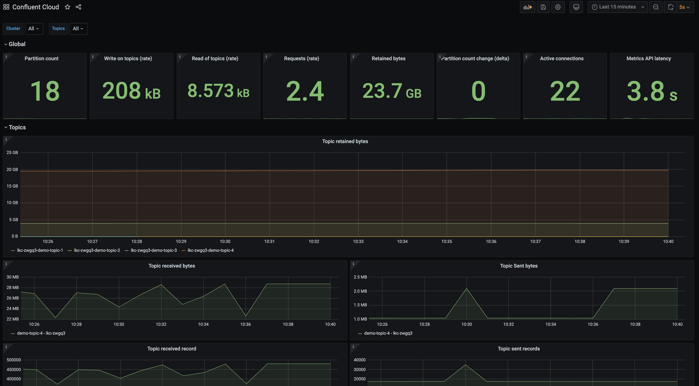

.. _ccloud-observability-general-overview:

General Client Scenarios
~~~~~~~~~~~~~~~~~~~~~~~~~
|ccloud| offers different cluster types, each with its own `usage limits <https://docs.confluent.io/cloud/current/clusters/cluster-types.html#basic-clusters>`__. This demo assumes
you are running on a "basic" or "standard" cluster; both have similar limitations. Limits are
important to be cognizant of, otherwise you will find client requests getting throttled or denied.
If you are bumping up against your limits, it might be time to consider upgrading your cluster to a different type.

The dashboard and scenarios in this section are powered by Metrics API data.
While it is not totally unrealistic to instruct you to hit cloud limits in this demo, we will not do so because
users may not have enough resources on their local machines or enough network bandwidth to reach |ccloud| limits.
In addition to that, we will not instruct you to hit |ccloud| limits because of the potential costs it could accrue.
Instead the following will walk you through where to look in this dashboard if you are experiencing a problem.

|Confluent Cloud Dashboard|

