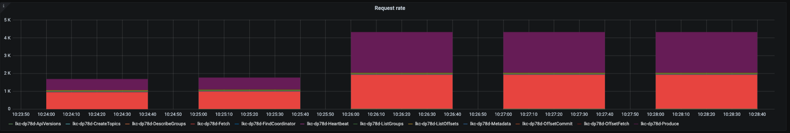

.. _ccloud-observability-general-request-rate-limits:

Request rate limits
********************

|ccloud| has a limit on the maximum number of client requests allowed within a second. Client
requests include but are not limited to requests from a producer to send a batch, requests from a
consumer to commit an offset, or requests from a consumer to fetch messages. If request rate limits
are hit, requests may be refused and clients may be throttled to keep the cluster stable. When a
client is throttled, |ccloud| will delay the client's requests for ``produce-throttle-time-avg`` (in ms) for
producers or ``fetch-throttle-time-avg`` (in ms) for consumers

|ccloud| offers different cluster types, each with its own `usage limits <https://docs.confluent.io/cloud/current/clusters/cluster-types.html#basic-clusters>`__. This demo assumes
you are running on a "basic" or "standard" cluster; both have a request limit of 1500 per second.

#. Open `Grafana <localhost:3000>`__ and use the username ``admin`` and password ``password`` to login.

#. Navigate to the ``Confluent Cloud`` dashboard.

#. Check the ``Requests (rate)`` panel. If this panel is yellow, you have used 80% of your allowed requests; if it's red, you have used 90%.
   See `Grafana documentation <https://grafana.com/docs/grafana/latest/panels/thresholds/>`_ for more information about about configuring thresholds.

   |Confluent Cloud Panel|

#. Scroll lower down on the dashboard to see a breakdown of where the requests are to in the ``Request rate`` stacked column chart.

   |Confluent Cloud Request Breakdown|

#. Reduce requests by adjusting producer batching configurations (``linger.ms``), consumer
   batching configurations (``fetch.max.wait.ms``), and shut down unnecessary clients.

.. |Confluent Cloud Panel|
   image:: ../images/cloud-panel.png
   :alt: Confluent Cloud Panel

