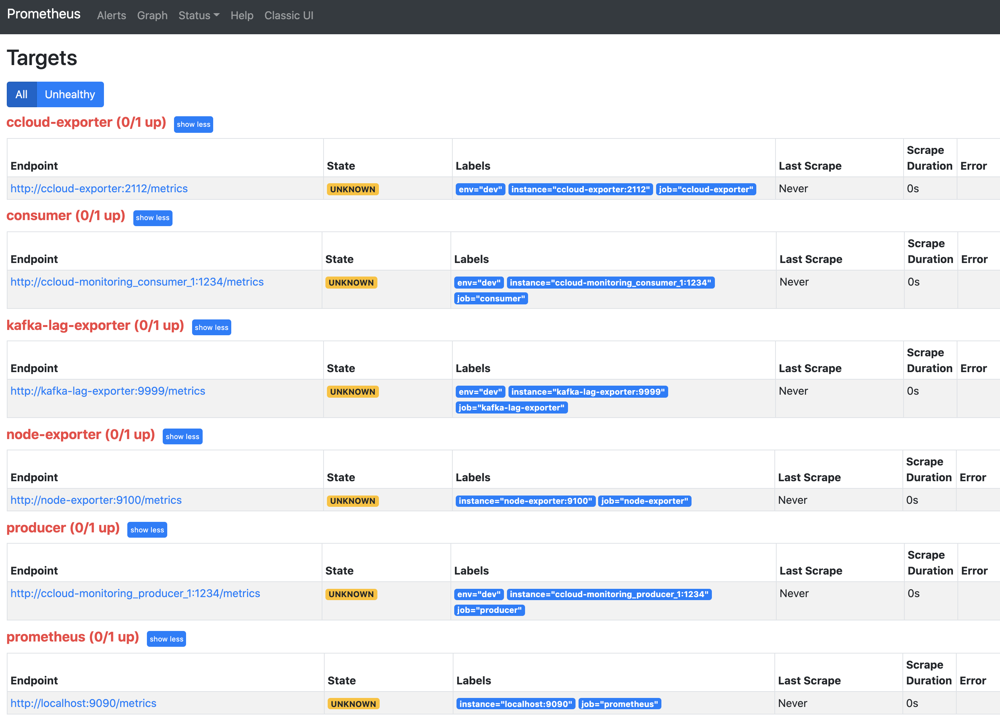
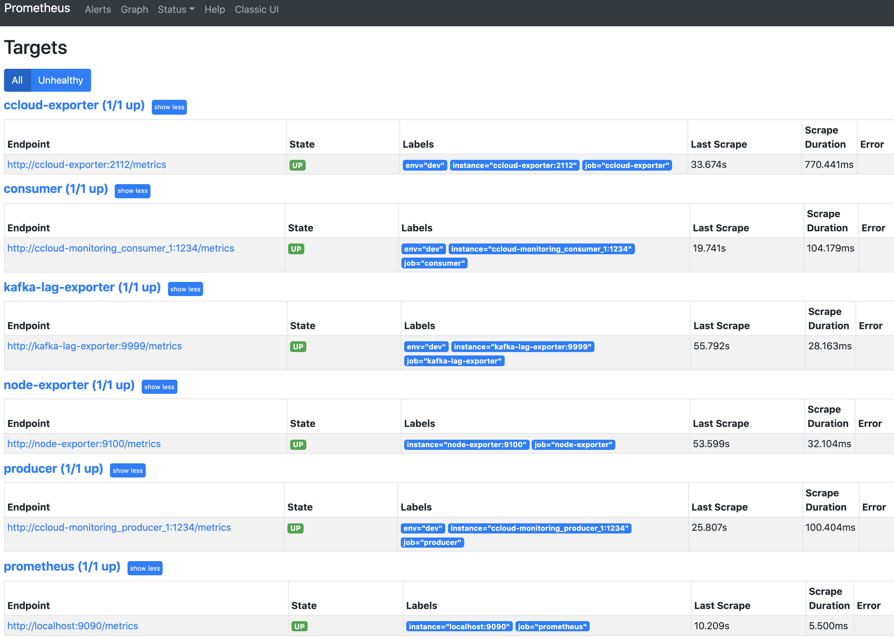
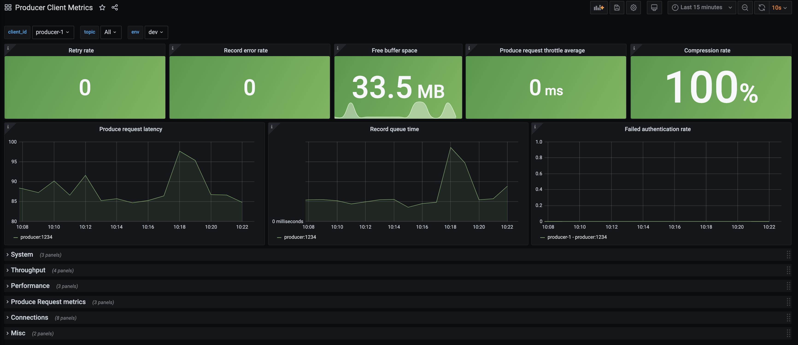
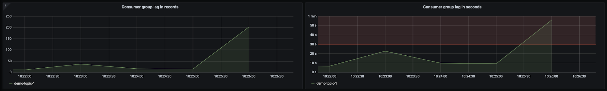
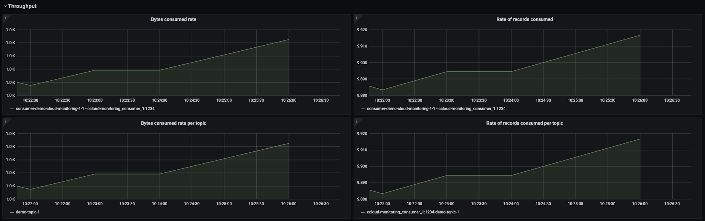
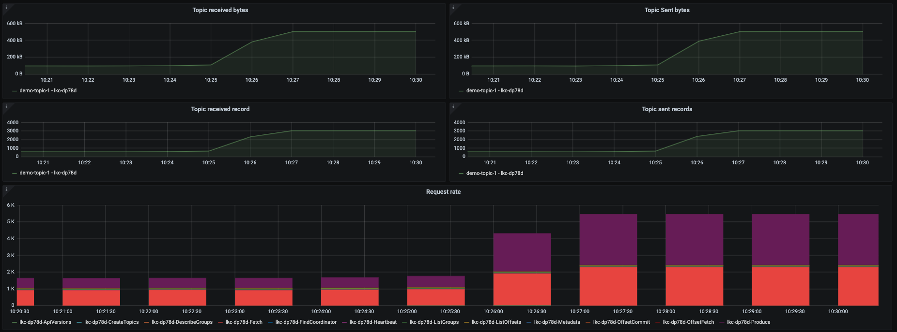
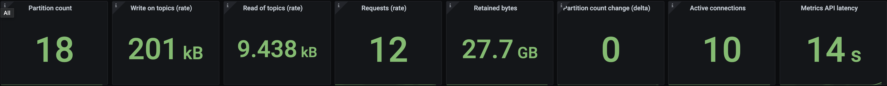

.. _ccloud-observability-index:

Observability Overview and Setup
--------------------------------

Using |ccloud| has the advantage of circumventing the trials and tribulations one would face when monitoring
an on-prem Kafka cluster, but you still need to monitor your client applications and, to some degree, your |ccloud| cluster.
Your success in |ccloud| largely depends on how well your applications are performing. Observability into the performance and status of your client
applications gives you insights on how to fine tune your producers and consumers, when to scale
your |ccloud| cluster, what might be going wrong, and how to resolve the problem.

This module covers how to set up a time-series database populated with data from the
|ccloud| Metrics API and client metrics from a locally running Java consumer and producer,
along with how to set up a data visualization tool. After the initial setup, you will
follow a series of scenarios to create failure scenarios and to be alerted when the errors occur.

.. note::

   This example uses Prometheus as the time-series database and Grafana for visualization, but the same principles can be applied to any other technologies.

Prerequisites
~~~~~~~~~~~~~

-  Access to `Confluent Cloud <https://confluent.cloud/login>`__.

-  Local `install of Confluent Cloud CLI
   <https://docs.confluent.io/ccloud-cli/current/install.html>`__ (v3.0.0 or later)

-  `jq <https://github.com/stedolan/jq/wiki/Installation>`__ installed on your host

-  `Docker <https://docs.docker.com/get-docker/>`__ installed on your host

Cost to Run Tutorial
~~~~~~~~~~~~~~~~~~~~

Caution
^^^^^^^

.. include:: ../../ccloud/docs/includes/ccloud-examples-caution.rst

|ccloud| Promo Code
^^^^^^^^^^^^^^^^^^^

.. include:: ../../ccloud/docs/includes/ccloud-examples-promo-code.rst

|ccloud| Cluster and Observability Container Setup
~~~~~~~~~~~~~~~~~~~~~~~~~~~~~~~~~~~~~~~~~~~~~~~~~~

The following instructions will:

-  use ``ccloud-stack`` to create a |ccloud| cluster, a service account with proper acls, and a client configuration file

-  create a ``cloud`` resource api-key for the ``ccloud-exporter``

-  build a |ak| client docker image with the maven project's dependencies cache

-  stand up numerous docker containers (1 consumer with JMX exporter, 1 producer with JMX exporter, Prometheus, Grafana, a ccloud-exporter, and a node-exporter) with ``docker-compose``

#. Log in to the |ccloud| CLI:

   .. code-block:: bash

      ccloud login --save

   The ``--save`` flag will save your |ccloud| login credentials to the
   ``~/.netrc`` file.

#. Clone the `confluentinc/examples <https://github.com/confluentinc/examples>`__ GitHub repository.

   .. code-block:: bash

       git clone https://github.com/confluentinc/examples.git

#. Navigate to the ``examples/ccloud-observability/`` directory and switch to
   the |cp| release branch:

   .. codewithvars:: bash

       cd examples/ccloud-observability/
       git checkout |release_post_branch|

#. Setup a |ccloud| cluster, secrets, and observability components by running :devx-examples:`start.sh script|ccloud-observability/start.sh`:

   .. code-block:: bash

      ./start.sh

#. It will take up to 3 minutes for data to become visible in Grafana.
   Open `Grafana <localhost:3000>`__ and use the username ``admin`` and password ``password`` to login.
   Now you are ready to proceed to Producer, Consumer, or General scenarios to see what different failure scenarios look like.

Validate Setup
~~~~~~~~~~~~~~

#. Validate the producer and consumer |ak| clients are running.  From the Confluent Cloud UI, view the **Data flow** in your newly created environment and |ak| cluster.

   |Data Flow|

#. Navigate to the `Prometheus Targets page <localhost:9090/targets>`__.

   |Prometheus Targets Unknown|

   This page will show you if Prometheus is scraping the targets you have created. It should look like below after 2 minutes if everything is working. You may need to refresh the page.

   |Prometheus Targets Up|

#. It will take up to 3 minutes for data to become visible in Grafana.
   Open `Grafana <localhost:3000>`__ and use the username ``admin`` and password ``password`` to login.

#. Now you are ready to proceed to Producer, Consumer, or General scenarios to see what different failure scenarios look like.

.. |Stream Lineage|
   image:: images/stream-lineage.png
   :alt: Stream Lineage

.. _ccloud-observability-producer-overview:

Producer Client Scenarios
~~~~~~~~~~~~~~~~~~~~~~~~~

The dashboard and scenarios in this section use client metrics from a Java producer. The same principles can be applied to any
other non-java clients--they generally offer similar metrics.

The source code for the client can found in the :devx-examples:`ccloud-observability/src|ccloud-observability/src` directory.
The sample client uses default configurations, this is not recommended for production use cases.
This Java producer will continue to produce the same message every 100 ms until the process is interrupted.
The content of the message is not important here, in these scenarios the focus is on the change in client metric values.

|Producer Dashboard|

.. _ccloud-observability-producer-confluent-cloud-unreachable:

|ccloud| Unreachable
^^^^^^^^^^^^^^^^^^^^

In the ``producer`` container, add a rule blocking network traffic that has a destination TCP port ``9092``. This will prevent the producer from reaching the |ak| cluster in |ccloud|.

This scenario will look at |ccloud| metrics from the Metrics API and client metrics from the client application's MBean object ``kafka.producer:type=producer-metrics,client-id=producer-1``.

^^^^^^^^^^^^^^^^^^^^^^^^^^
Introduce failure scenario
^^^^^^^^^^^^^^^^^^^^^^^^^^

#. Add a rule blocking traffic in the ``producer`` container on port ``9092`` which is used to talk to the broker:

   .. code-block:: bash

      docker-compose exec producer iptables -A OUTPUT -p tcp --dport 9092 -j DROP

^^^^^^^^^^^^^^^^^^^^
Diagnose the problem
^^^^^^^^^^^^^^^^^^^^

#. From your web browser, navigate to the Grafana dashboard at http://localhost:3000 and login with the username ``admin`` and password ``password``.

#. Navigate to the ``Producer Client Metrics`` dashboard.  Wait 2 minutes and then observe:

   -  A downward trend in outgoing bytes which can be found by the expanding the ``Throughput`` tab.

   -  The top level panels like ``Record error rate`` (derived from |ak| MBean attribute ``record-error-rate``) should turn red, a major indication something is wrong.

   -  The spark line in the ``Free buffer space`` (derived from |ak| MBean attribute ``buffer-available-bytes``) panel go down and a bump in ``Retry rate`` (derived from |ak| MBean attribute ``record-retry-rate``)

   This means the producer is not producing data, which could happen for a few reasons.

   |Producer Connectivity Loss|

#. In order to isolate this problem to the producer, check the status of the |ccloud| cluster, specifically that it is accepting requests. Navigate to the ``Confluent Cloud`` dashboard.

#. Look at the top panels, they should all be green which means the cluster is operating safely within its resources.

   |Confluent Cloud Panel|

   For a connectivity problem in a client, look specifically at the ``Requests (rate)``. If this value
   were yellow or red, the client connectivity problem could be due to hitting the |ccloud|
   requests rate limit. If you exceed the maximum, requests may be refused. See the
   :ref:`General Request Rate Limits scenario <ccloud-observability-general-request-rate-limits>` for more details.

#. Check the producer logs for more information about what is going wrong. Use the following docker command to get the producer logs:

   .. code-block:: bash

      docker-compose logs producer

#. Verify that you see log messages similar to what is shown below:

   .. code-block:: text

      producer           | [2021-02-11 18:16:12,231] WARN [Producer clientId=producer-1] Got error produce response with correlation id 15603 on topic-partition demo-topic-1-3, retrying (2147483646 attempts left). Error: NETWORK_EXCEPTION (org.apache.kafka.clients.producer.internals.Sender)
      producer           | [2021-02-11 18:16:12,232] WARN [Producer clientId=producer-1] Received invalid metadata error in produce request on partition demo-topic-1-3 due to org.apache.kafka.common.errors.NetworkException: The server disconnected before a response was received.. Going to request metadata update now (org.apache.kafka.clients.producer.internals.Sender)

   Note that the logs provide a clear picture of what is going on--``Error: NETWORK_EXCEPTION`` and ``server disconnected``. This was expected because the failure scenario we introduced blocked outgoing traffic to the broker's port. Looking at metrics alone won't always lead you directly to an answer but they are a quick way to see if things are working as expected.

^^^^^^^^^^^^^^^^^^^^^^^^
Resolve failure scenario
^^^^^^^^^^^^^^^^^^^^^^^^

#. Remove the rule we created earlier that blocked traffic with the following command:

   .. code-block:: bash

      docker-compose exec producer iptables -D OUTPUT -p tcp --dport 9092 -j DROP

#. It may take a few minutes for the producer to start sending requests again.

^^^^^^^^^^^^^^^
Troubleshooting
^^^^^^^^^^^^^^^

#. Producer output rate doesn't come back up after adding in the ``iptables`` rule.

   Restart the producer by running ``docker-compose restart producer``. This is advice specific to this tutorial.

   |Confluent Cloud Panel|

.. |Producer Connectivity Loss|
   image:: images/producer-connectivity-loss.png
   :alt: Producer Connectivity Loss

.. _ccloud-observability-producer-authorization-problem:

Authorization Revoked
^^^^^^^^^^^^^^^^^^^^^

Using the |ccloud| CLI, revoke the producer's authorization to write to the topic.

This scenario will look at |ccloud| metrics from the Metrics API and client metrics from the client application's MBean object ``kafka.producer:type=producer-metrics,client-id=producer-1``.

^^^^^^^^^^^^^^^^^^^^^^^^^^
Introduce failure scenario
^^^^^^^^^^^^^^^^^^^^^^^^^^

#. Delete the ACL that allowed the service account to write to the topic, inserting your service account ID instead of ``184498``:

   .. code-block:: bash

      ccloud kafka acl delete --service-account 184498 --operation write  --topic '*' --allow

^^^^^^^^^^^^^^^^^^^^
Diagnose the problem
^^^^^^^^^^^^^^^^^^^^

#. From your web browser, navigate to the Grafana dashboard at http://localhost:3000 and login with the username ``admin`` and password ``password``.

#. Navigate to the ``Producer Client Metrics`` dashboard.  Wait 2 minutes and then observe:

   -  The top level panel with ``Record error rate`` (``record-error-rate``) should turn red, a major indication something is wrong.

   -  Throughput, e.g. ``Outgoing byte rate`` (``outgoing-byte-rate``), shows the producer is successfully sending messages to the broker.  This is technically correct: the producer _is_ sending the batch of records to the cluster but they are not being written to the broker's log because of lack of authorization.

   |Producer Authorization Problem|

#. Check the status of the |ccloud| cluster, specifically that it is accepting requests. Navigate to the ``Confluent Cloud`` dashboard.

#. In the ``Confluent Cloud`` dashboard, look at the top panels, they should all be green which means the cluster is operating safely within its resources.

   |Confluent Cloud Panel|

#. Change the topics filter to show only ``demo-topic-1``.  Observe:

   - ``Topic received bytes`` (``io.confluent.kafka.server/received_bytes``) is still high because it |ccloud| is still receiving the records and using network bandwidth, before they get denied due to authorization errors.

   - ``Topic retained bytes`` (``io.confluent.kafka.server/retained_bytes``) has flattened because the records sent by the producer are not getting written to the log.

   - ``Topic sent bytes`` (``io.confluent.kafka.server/sent_bytes``), which are the records sent to the consumer, has dropped to zero because there are no new records to send.

   |Confluent Cloud Dashboard Producer Authorization Problem|

#. Check the producer logs for more information about what is going wrong. Use the following docker command to get the producer logs:

   .. code-block:: bash

      docker-compose logs producer

#. Verify that you see log messages similar to what is shown below:

   .. code-block:: text

      org.apache.kafka.common.errors.TopicAuthorizationException: Not authorized to access topics: [demo-topic-1]

   Note that the logs provide a clear picture of what is going on--``org.apache.kafka.common.errors.TopicAuthorizationException``.  This was expected because the failure scenario we introduced removed the ACL that permitted the service account to write to the topic.

#. View the source code that catches this exception, :devx-examples:`ccloud-observability/src|ccloud-observability/src/main/java/io/confluent/examples/clients/cloud/ProducerExample.java`, using a ``Callback()``.

   .. code-block:: java

        producer.send(new ProducerRecord<String, PageviewRecord>(topic, key, record), new Callback() {
            @Override
            public void onCompletion(RecordMetadata m, Exception e) {
              if (e != null) {
                e.printStackTrace();
              } else {
                System.out.printf("Produced record to topic %s%n", topic);
              }
            }
        });

^^^^^^^^^^^^^^^^^^^^^^^^
Resolve failure scenario
^^^^^^^^^^^^^^^^^^^^^^^^

#. Add the ACL allowing write to the topic, inserting your service account ID instead of ``184498``:

   .. code-block:: bash

      ccloud kafka acl create --service-account 184498 --operation write  --topic '*' --allow

#. Verify that the ``org.apache.kafka.common.errors.TopicAuthorizationException`` log messages stopped in the ``producer`` container.

   .. code-block:: bash

      docker-compose logs producer

.. _ccloud-observability-consumer-overview:

Consumer Client Scenarios
~~~~~~~~~~~~~~~~~~~~~~~~~
The dashboard and scenarios in this section use client metrics from a Java consumer. The same principles can be applied to any
other non-java clients--they generally offer similar metrics.

The source code for the client can found in the
devx-examples:`ccloud-observability/src|ccloud-observability/src` directory. The client
uses default configurations, this is not recommended for production use cases. This Java consumer
will continue to consumer the same message until the process is interrupted. The content of the
message is not important here, in these scenarios the focus is on the change in client metric values.

|Consumer Dashboard|

.. _ccloud-observability-consumer-increasing-consumer-lag:

Increasing Consumer Lag
^^^^^^^^^^^^^^^^^^^^^^^

Consumer lag is a tremendous performance indicator. It tells you the offset difference between the
producer's last produced message and the consumer group's last commit. If you are unfamiliar with
consumer groups or concepts like committing offsets, please refer to this
`Kafka Consumer documentation <https://docs.confluent.io/platform/current/clients/consumer.html>`__.

A large consumer lag, or a quickly growing lag, indicates that the consumer is not able to keep up with
the volume of messages on a topic.

This scenario will look at metrics from various sources. Consumer lag metrics are pulled from the
`kafka-lag-exporter <https://github.com/lightbend/kafka-lag-exporter>`__ container, a scala open source project
that collects data about consumer groups and presents them in a Prometheus scrapable format. Metrics
about |ccloud| cluster resource usage are pulled from the Metrics API endpoints. Consumer client metrics
are pulled from the client application’s MBean object ``kafka.consumer:type=consumer-fetch-manager-metrics,client-id=<client_id>``.

^^^^^^^^^^^^^^^^^^^^^^^^^^
Introduce failure scenario
^^^^^^^^^^^^^^^^^^^^^^^^^^

#. By default 1 consumer and 1 producer are running. Adjust that to 1 consumer and 5 producers in order to force the condition where the consumer cannot keep up with the rate of messages being produced, which will cause an increase in consumer lag.
   The container scaling can be done with the command below:

   .. code-block:: bash

      docker-compose up -d --scale producer=5

   Which will produce the following output:

   .. code-block:: bash

      ccloud-exporter is up-to-date
      kafka-lag-exporter is up-to-date
      node-exporter is up-to-date
      grafana is up-to-date
      prometheus is up-to-date
      Starting ccloud-observability_producer_1              ... done
      Creating ccloud-observability_producer_2              ... done
      Creating ccloud-observability_producer_3              ... done
      Creating ccloud-observability_producer_4              ... done
      Creating ccloud-observability_producer_5              ... done
      Starting ccloud-observability_consumer_1              ... done

^^^^^^^^^^^^^^^^^^^^
Diagnose the problem
^^^^^^^^^^^^^^^^^^^^

#. Open `Grafana <localhost:3000>`__ and login with the username ``admin`` and password ``password``.

#. Navigate to the ``Consumer Client Metrics`` dashboard. Wait 2 minutes and then observe:

   - An upward trend in ``Consumer group lag in records``.  ``Consumer group lag in seconds`` will have a less dramatic increase.
     Both indicate that the producer is creating more messages than the consumer can fetch in a timely manner.
     These metrics are derived from the ``kafka-lag-exporter`` container.

   |Consumer Lag|

   - An increase in ``Fetch request rate`` (``fetch-total``) and ``Fetch size avg`` (``fetch-size-avg``) in the ``Consumer Fetch Metrics`` tab, indicating the consumer is fetching more often and larger batches.

   |Consumer Fetch Increase|

   - All of the graphs in the ``Throughput`` are indicating the consumer is processing more bytes/records.

   |Consumer Throughput Increase|

   .. note::

      If a client is `properly tuned <https://docs.confluent.io/cloud/current/client-apps/optimizing/index.html>`__ and has adequate resources
      an increase in throughput metrics or fetch metrics won't necessarily mean the consumer lag will increase.

#. Another view of consumer lag can be found in |ccloud|. Open the UI, navigate to the "Consumers" section and click on the ``demo-cloud-observability-1`` consumer group.
   This page will update periodically, within two minutes you should see a steady increase is the offset lag.

   |Confluent Cloud Consumer Lag|

   This provides a snapshot in time, but it lacks the historical view that the ``Consumer Client Metrics`` dashboard provides.

#. The current consumer lag can also be observed via the CLI if you have Confluent Platform installed.

   .. code-block:: bash

      kafka-consumer-groups --bootstrap-server $BOOTSTRAP_SERVERS --command-config $CONFIG_FILE --describe --group demo-cloud-observability-1

   Which will produce something similar to the following:

   .. code-block:: text

      GROUP                   TOPIC           PARTITION  CURRENT-OFFSET  LOG-END-OFFSET  LAG             CONSUMER-ID                                                             HOST            CLIENT-ID
      demo-cloud-observability-1 demo-topic-1    0          48163           48221           58              consumer-demo-cloud-observability-1-1-b0bec0b5-ec84-4233-9d3e-09d132b9a3c7 /10.2.10.251    consumer-demo-cloud-observability-1-1
      demo-cloud-observability-1 demo-topic-1    3          91212           91278           66              consumer-demo-cloud-observability-1-1-b0bec0b5-ec84-4233-9d3e-09d132b9a3c7 /10.2.10.251    consumer-demo-cloud-observability-1-1
      demo-cloud-observability-1 demo-topic-1    4          47854           47893           39              consumer-demo-cloud-observability-1-1-b0bec0b5-ec84-4233-9d3e-09d132b9a3c7 /10.2.10.251    consumer-demo-cloud-observability-1-1
      demo-cloud-observability-1 demo-topic-1    5          47748           47803           55              consumer-demo-cloud-observability-1-1-b0bec0b5-ec84-4233-9d3e-09d132b9a3c7 /10.2.10.251    consumer-demo-cloud-observability-1-1
      demo-cloud-observability-1 demo-topic-1    1          48097           48151           54              consumer-demo-cloud-observability-1-1-b0bec0b5-ec84-4233-9d3e-09d132b9a3c7 /10.2.10.251    consumer-demo-cloud-observability-1-1
      demo-cloud-observability-1 demo-topic-1    2          48310           48370           60              consumer-demo-cloud-observability-1-1-b0bec0b5-ec84-4233-9d3e-09d132b9a3c7 /10.2.10.251    consumer-demo-cloud-observability-1-1

   Again the downside of this view is the lack of historical context that the ``Consumer Client Metrics`` dashboard provides.

#. A top level view of the |ccloud| cluster that reflects an increase in bytes produced and bytes consumed can be viewed in the ``Confluent Cloud`` dashboard in the panels highlighted below.

   |Confluent Cloud Request Increase|

#. The consumer logs won't show that the consumer is falling behind which is why it is important to have a robust monitoring solution that covers consumer lag.

^^^^^^^^^^^^^^^^^^^^^^^^
Resolve failure scenario
^^^^^^^^^^^^^^^^^^^^^^^^

#. Start ``consumer-1`` container, thus adding a consumer back to the consumer group, and stop the extra producers:

   .. code-block:: bash

      docker-compose up -d --scale producer=1

   Which will produce the following output:

   .. code-block:: bash

      node-exporter is up-to-date
      grafana is up-to-date
      kafka-lag-exporter is up-to-date
      prometheus is up-to-date
      ccloud-exporter is up-to-date
      Stopping and removing ccloud-observability_producer_2 ... done
      Stopping and removing ccloud-observability_producer_3 ... done
      Stopping and removing ccloud-observability_producer_4 ... done
      Stopping and removing ccloud-observability_producer_5 ... done
      Starting ccloud-observability_consumer_1              ... done
      Starting ccloud-observability_producer_1              ... done

.. _ccloud-observability-general-overview:

General Client Scenarios
~~~~~~~~~~~~~~~~~~~~~~~~~
|ccloud| offers different cluster types, each with its own `usage limits <https://docs.confluent.io/cloud/current/clusters/cluster-types.html#basic-clusters>`__. This demo assumes
you are running on a "basic" or "standard" cluster; both have similar limitations. Limits are
important to be cognizant of, otherwise you will find client requests getting throttled or denied.
If you are bumping up against your limits, it might be time to consider upgrading your cluster to a different type.

The dashboard and scenarios in this section are powered by Metrics API data.
While it is not totally unrealistic to instruct you to hit cloud limits in this demo, we will not do so because
users may not have enough resources on their local machines or enough network bandwidth to reach |ccloud| limits.
In addition to that, we will not instruct you to hit |ccloud| limits because of the potential costs it could accrue.
Instead the following will walk you through where to look in this dashboard if you are experiencing a problem.

|Confluent Cloud Dashboard|

.. _ccloud-observability-general-fail-to-create-partition:

Failing to create a new partition
^^^^^^^^^^^^^^^^^^^^^^^^^^^^^^^^^

It's possible you won't be able to create a partition because you have reached a one of |ccloud|'s partition limits.
Follow the instructions below to check if your cluster is getting close to its partition limits.

#. Open `Grafana <localhost:3000>`__ and use the username ``admin`` and password ``password`` to login.

#. Navigate to the ``Confluent Cloud`` dashboard.

#. Check the ``Partition Count`` panel. If this panel is yellow, you have used 80% of your allowed partitions; if it's red, you have used 90%.

   |Confluent Cloud Panel|

   A maximum number of partitions can exist on the cluster at one time, before replication.
   All topics that are created by you as well as internal topics that are automatically created by
   Confluent Platform components–such as ksqlDB, Kafka Streams, Connect, and Control Center–count towards the cluster partition limit.

#. Check the ``Partition count change (delta)`` panel. |ccloud| clusters have a limit on the
   number of partitions that can be created and deleted in a 5 minute period. This single stat
   provides the absolute difference between the number of partitions at the beginning and end of
   the 5 minute period. This over simplifies the problem. An example being, at the start of a 5
   minute window you have 18 partitions. During the 5 minute window you create a new topic with 6
   partitions and delete a topic with 6 partitions. At the end of the five minute window you still
   have 18 partitions but you actually created and deleted 12 partitions.

   More conservative thresholds are put in place--this panel will turn yellow when at 50%
   utilization and red at 60%.

.. _ccloud-observability-general-request-rate-limits:

Request rate limits
^^^^^^^^^^^^^^^^^^^

|ccloud| has a limit on the maximum number of client requests allowed within a second. Client
requests include but are not limited to requests from a producer to send a batch, requests from a
consumer to commit an offset, or requests from a consumer to fetch messages. If request rate limits
are hit, requests may be refused and clients may be throttled to keep the cluster stable. When a
client is throttled, |ccloud| will delay the client's requests for ``produce-throttle-time-avg`` (in ms) for
producers or ``fetch-throttle-time-avg`` (in ms) for consumers

|ccloud| offers different cluster types, each with its own `usage limits <https://docs.confluent.io/cloud/current/clusters/cluster-types.html#basic-clusters>`__. This demo assumes
you are running on a "basic" or "standard" cluster; both have a request limit of 1500 per second.

#. Open `Grafana <localhost:3000>`__ and use the username ``admin`` and password ``password`` to login.

#. Navigate to the ``Confluent Cloud`` dashboard.

#. Check the ``Requests (rate)`` panel. If this panel is yellow, you have used 80% of your allowed requests; if it's red, you have used 90%.
   See `Grafana documentation <https://grafana.com/docs/grafana/latest/panels/thresholds/>`_ for more information about about configuring thresholds.

   |Confluent Cloud Panel|

#. Scroll lower down on the dashboard to see a breakdown of where the requests are to in the ``Request rate`` stacked column chart.

   |Confluent Cloud Request Breakdown|

#. Reduce requests by adjusting producer batching configurations (``linger.ms``), consumer
   batching configurations (``fetch.max.wait.ms``), and shut down unnecessary clients.

.. _ccloud-observability-teardown:

Clean up |ccloud| resources
---------------------------

#. Tear down the Docker monitoring containers:

   .. code-block:: bash

      docker-compose down

#. Delete the cloud api key created for the ``ccloud-exporter``:

   .. code-block:: bash

      ccloud api-key delete $METRICS_API_KEY

#. Run the following to teardown the ccloud-stack, inserting your service account ID instead of ``184498``.
   Your service account ID can be found in your client configuration file (ie ``stack-configs/java-service-account-184498.config``).

   .. code-block:: bash

      source ../utils/ccloud_library.sh
      ccloud::destroy_ccloud_stack 184498

.. _ccloud-observability-advanced-usage:

Additional Resources
--------------------

-  Read `Monitoring Your Event Streams: Tutorial for Observability Into Apache Kafka Clients <https://www.confluent.io/blog/monitoring-event-streams-visualize-kafka-clients-in-confluent-cloud/>`__.

-  See other :cloud:`Confluent Cloud Examples|get-started/cloud-demos.html`.

-  See advanced options for working with the :cloud:`ccloud-stack utility for Confluent Cloud|get-started/examples/ccloud/docs/ccloud-stack.html#advanced-options`.

-  See `Developing Client Applications on Confluent Cloud <https://docs.confluent.io/cloud/current/client-apps/index.html>`__ for a guide to configuring, monitoring, and
   optimizing your |ak| client applications when using |ccloud|.

-  See `jmx-monitoring-stacks <https://github.com/confluentinc/jmx-monitoring-stacks>`__ for examples of monitoring on-prem |ak| clusters and other clients with different monitoring technologies.

.. |Confluent Cloud Request Breakdown|
   image:: images/cloud-request-rate-breakdown.png
   :alt: Confluent Cloud Request Breakdown

.. |Confluent Cloud Dashboard|
   image:: images/confluent-cloud-dashboard.png
   :alt: Confluent Cloud Dashboard

.. |Consumer Rebalance Bump|
   image:: images/rebalance-bump.png
   :alt: Consumer Rebalance Bump

.. |Consumer Fetch Increase|
   image:: images/consumer-fetch-increase.png
   :alt: Consumer Fetch Increase

.. |Confluent Cloud Consumer Lag|
   image:: images/ccloud-consumer-lag-view.png
   :alt: Confluent Cloud Consumer Lag

.. |Consumer Dashboard|
   image:: images/consumer-dashboard.png
   :alt: Consumer Dashboard

.. |Confluent Cloud Dashboard Producer Authorization Problem|
   image:: images/confluent-cloud-dashboard-producer-authorization-problem.png
   :alt: Confluent Cloud Dashboard

.. |Producer Authorization Problem|
   image:: images/producer-authorization-problem.png
   :alt: Producer Authorization Problem

