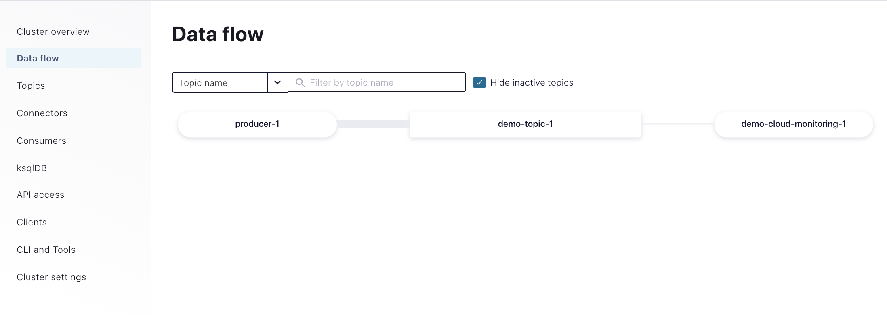
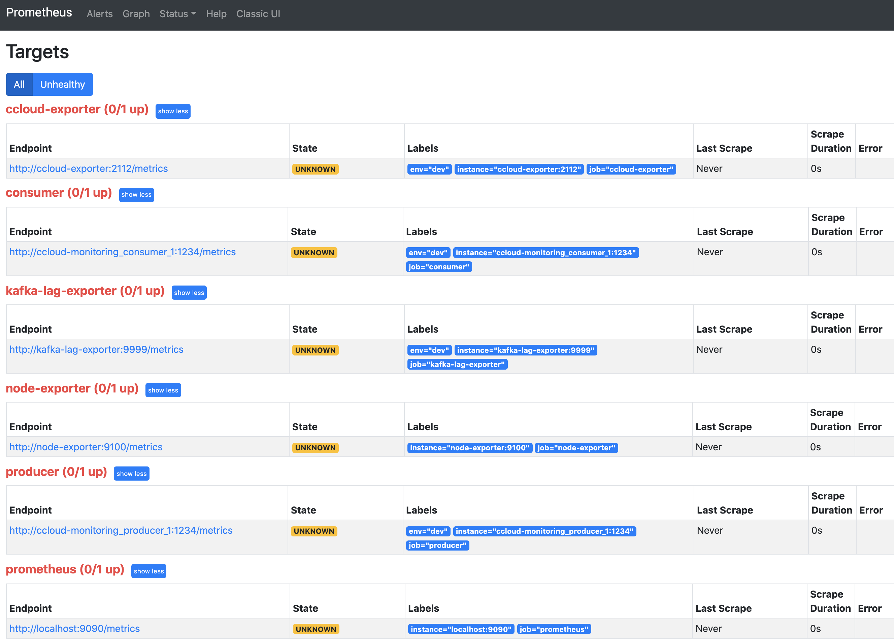
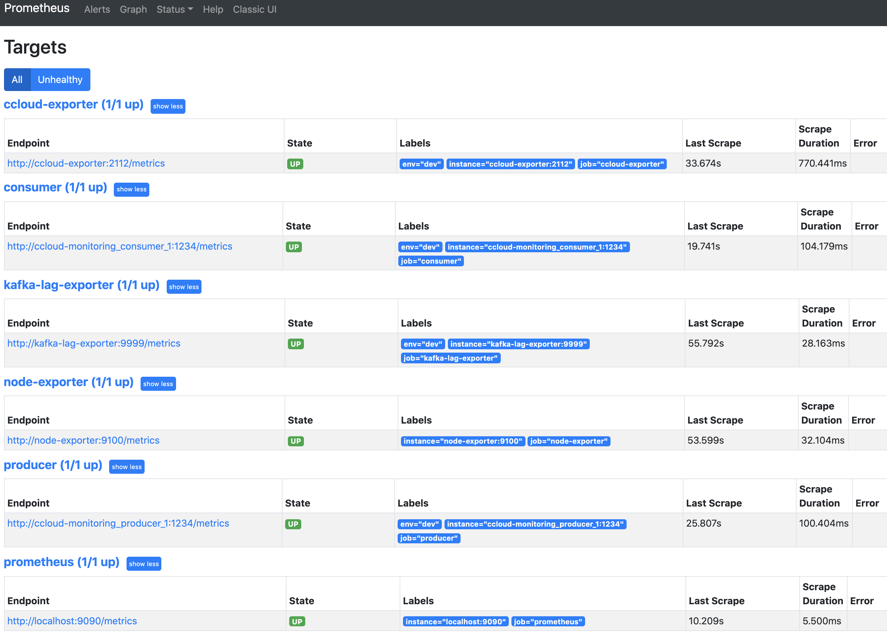

.. _ccloud-observability-overview:

Observability Overview and Setup
--------------------------------

Using |ccloud| has the advantage of circumventing the trials and tribulations one would face when monitoring
an on-prem Kafka cluster, but you still need to monitor your client applications and, to some degree, your |ccloud| cluster.
Your success in |ccloud| largely depends on how well your applications are performing. Observability into the performance and status of your client
applications gives you insights on how to fine tune your producers and consumers, when to scale
your |ccloud| cluster, what might be going wrong, and how to resolve the problem.

This module covers how to set up a time-series database populated with data from the
|ccloud| Metrics API and client metrics from a locally running Java consumer and producer,
along with how to set up a data visualization tool. After the initial setup, you will
follow a series of scenarios to create failure scenarios and to be alerted when the errors occur.

.. note::

   This example uses Prometheus as the time-series database and Grafana for visualization, but the same principles can be applied to any other technologies.

Prerequisites
~~~~~~~~~~~~~

-  Access to `Confluent Cloud <https://confluent.cloud/login>`__.

-  Local `install of Confluent Cloud CLI
   <https://docs.confluent.io/ccloud-cli/current/install.html>`__ (v1.25.0 or later)

-  `jq <https://github.com/stedolan/jq/wiki/Installation>`__ installed on your host

-  `Docker <https://docs.docker.com/get-docker/>`__ installed on your host

Cost to Run Tutorial
~~~~~~~~~~~~~~~~~~~~

Caution
^^^^^^^

.. include:: ../../ccloud/docs/includes/ccloud-examples-caution.rst

|ccloud| Promo Code
^^^^^^^^^^^^^^^^^^^

.. include:: ../../ccloud/docs/includes/ccloud-examples-promo-code.rst

|ccloud| Cluster and Observability Container Setup
~~~~~~~~~~~~~~~~~~~~~~~~~~~~~~~~~~~~~~~~~~~~~~~~~~

The following instructions will:

-  use ``ccloud-stack`` to create a |ccloud| cluster, a service account with proper acls, and a client configuration file

-  create a ``cloud`` resource api-key for the ``ccloud-exporter``

-  build a |ak| client docker image with the maven project's dependencies cache

-  stand up numerous docker containers (1 consumer with JMX exporter, 1 producer with JMX exporter, Prometheus, Grafana, a ccloud-exporter, and a node-exporter) with ``docker-compose``

#. Log in to the |ccloud| CLI:

   .. code-block:: bash

      ccloud login --save

   The ``--save`` flag will save your |ccloud| login credentials to the
   ``~/.netrc`` file.

#. Clone the `confluentinc/examples <https://github.com/confluentinc/examples>`__ GitHub repository.

   .. code-block:: bash

       git clone https://github.com/confluentinc/examples.git

#. Navigate to the ``examples/ccloud-observability/`` directory and switch to
   the |cp| release branch:

   .. codewithvars:: bash

       cd examples/ccloud-observability/
       git checkout |release_post_branch|

#. Setup a |ccloud| cluster, secrets, and observability components by running :devx-examples:`start.sh script|ccloud-observability/start.sh`:

   .. code-block:: bash

      ./start.sh

#. It will take up to 3 minutes for data to become visible in Grafana.
   Open `Grafana <localhost:3000>`__ and use the username ``admin`` and password ``password`` to login.
   Now you are ready to proceed to Producer, Consumer, or General scenarios to see what different failure scenarios look like.

Validate Setup
~~~~~~~~~~~~~~

#. Validate the producer and consumer |ak| clients are running.  From the Confluent Cloud UI, view the **Data flow** in your newly created environment and |ak| cluster.

   |Data Flow|

#. Navigate to the `Prometheus Targets page <localhost:9090/targets>`__.

   |Prometheus Targets Unknown|

   This page will show you if Prometheus is scraping the targets you have created. It should look like below after 2 minutes if everything is working. You may need to refresh the page.

   |Prometheus Targets Up|

#. It will take up to 3 minutes for data to become visible in Grafana.
   Open `Grafana <localhost:3000>`__ and use the username ``admin`` and password ``password`` to login.

#. Now you are ready to proceed to Producer, Consumer, or General scenarios to see what different failure scenarios look like.

