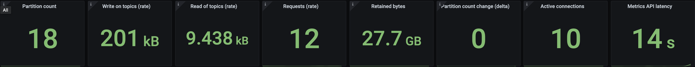
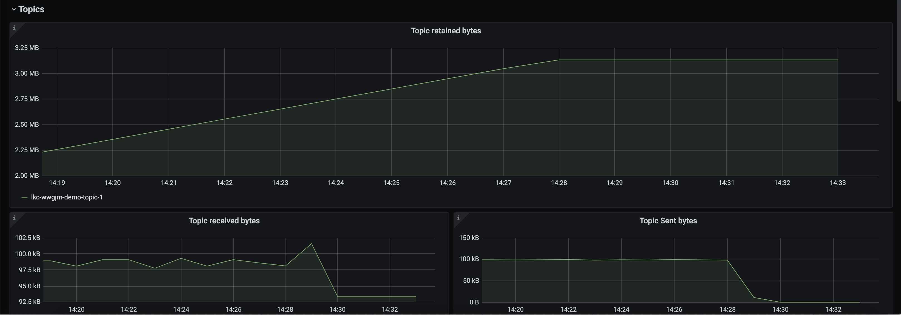
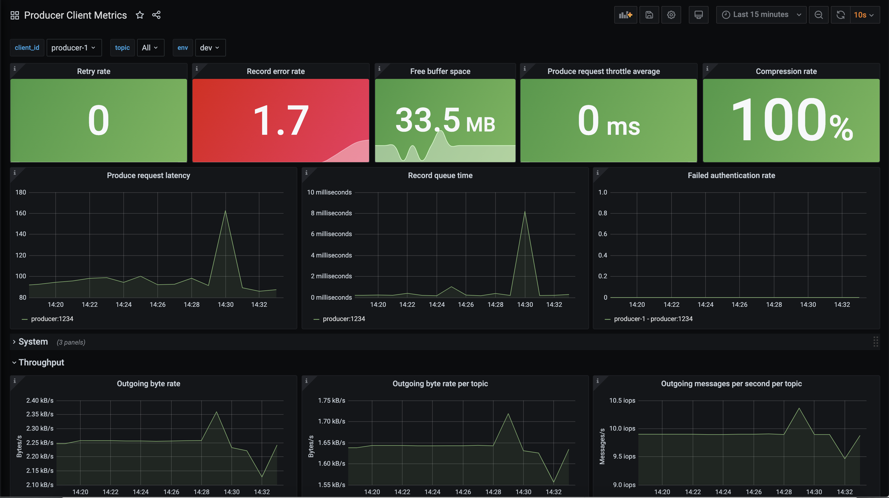

.. _ccloud-observability-producer-authorization-problem:

Authorization Revoked
*********************

Using the |ccloud| CLI, revoke the producer's authorization to write to the topic.

This scenario will look at |ccloud| metrics from the Metrics API and client metrics from the client application's MBean object ``kafka.producer:type=producer-metrics,client-id=producer-1``.

Introduce failure scenario
^^^^^^^^^^^^^^^^^^^^^^^^^^

#. Delete the ACL that allowed the service account to write to the topic, inserting your service account ID instead of ``184498``:

   .. code-block:: bash

      ccloud kafka acl delete --service-account 184498 --operation write  --topic '*' --allow

Diagnose the problem
^^^^^^^^^^^^^^^^^^^^

#. From your web browser, navigate to the Grafana dashboard at http://localhost:3000 and login with the username ``admin`` and password ``password``.

#. Navigate to the ``Producer Client Metrics`` dashboard.  Wait 2 minutes and then observe:

   -  The top level panel with ``Record error rate`` (``record-error-rate``) should turn red, a major indication something is wrong.

   -  Throughput, e.g. ``Outgoing byte rate`` (``outgoing-byte-rate``), shows the producer is successfully sending messages to the broker.  This is technically correct: the producer _is_ sending the batch of records to the cluster but they are not being written to the broker's log because of lack of authorization.

   |Producer Authorization Problem|

#. Check the status of the |ccloud| cluster, specifically that it is accepting requests. Navigate to the ``Confluent Cloud`` dashboard.

#. In the ``Confluent Cloud`` dashboard, look at the top panels, they should all be green which means the cluster is operating safely within its resources.

   |Confluent Cloud Panel|

#. Change the topics filter to show only ``demo-topic-1``.  Observe:

   - ``Topic received bytes`` (``io.confluent.kafka.server/received_bytes``) is still high because it |ccloud| is still receiving the records and using network bandwidth, before they get denied due to authorization errors.

   - ``Topic retained bytes`` (``io.confluent.kafka.server/retained_bytes``) has flattened because the records sent by the producer are not getting written to the log.

   - ``Topic sent bytes`` (``io.confluent.kafka.server/sent_bytes``), which are the records sent to the consumer, has dropped to zero because there are no new records to send.

   |Confluent Cloud Dashboard Producer Authorization Problem|

#. Check the producer logs for more information about what is going wrong. Use the following docker command to get the producer logs:

   .. code-block:: bash

      docker-compose logs producer

#. Verify that you see log messages similar to what is shown below:

   .. code-block:: text

      org.apache.kafka.common.errors.TopicAuthorizationException: Not authorized to access topics: [demo-topic-1]

   Note that the logs provide a clear picture of what is going on--``org.apache.kafka.common.errors.TopicAuthorizationException``.  This was expected because the failure scenario we introduced removed the ACL that permitted the service account to write to the topic.

#. View the source code that catches this exception, :devx-examples:`ccloud-observability/src|ccloud-observability/src/main/java/io/confluent/examples/clients/cloud/ProducerExample.java`, using a ``Callback()``.

   .. code-block:: java

        producer.send(new ProducerRecord<String, PageviewRecord>(topic, key, record), new Callback() {
            @Override
            public void onCompletion(RecordMetadata m, Exception e) {
              if (e != null) {
                e.printStackTrace();
              } else {
                System.out.printf("Produced record to topic %s%n", topic);
              }
            }
        });

Resolve failure scenario
^^^^^^^^^^^^^^^^^^^^^^^^

#. Add the ACL allowing write to the topic, inserting your service account ID instead of ``184498``:

   .. code-block:: bash

      ccloud kafka acl create --service-account 184498 --operation write  --topic '*' --allow

#. Verify that the ``org.apache.kafka.common.errors.TopicAuthorizationException`` log messages stopped in the ``producer`` container.

   .. code-block:: bash

      docker-compose logs producer

