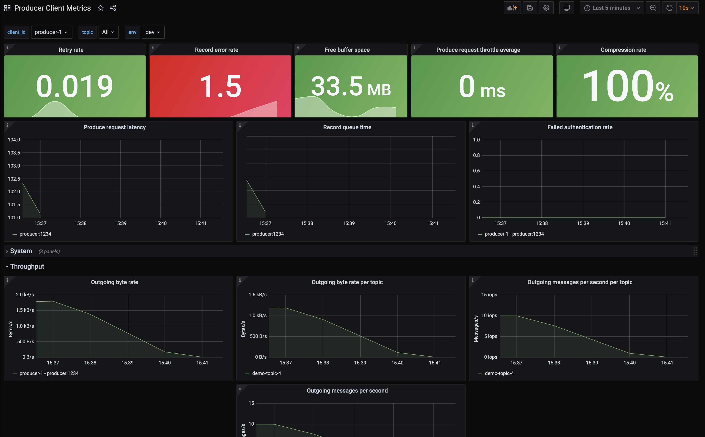

.. _ccloud-observability-producer-confluent-cloud-unreachable:

|ccloud| Unreachable
********************

In the ``producer`` container, add a rule blocking network traffic that has a destination TCP port ``9092``. This will prevent the producer from reaching the |ak| cluster in |ccloud|.

This scenario will look at |ccloud| metrics from the Metrics API and client metrics from the client application's MBean object ``kafka.producer:type=producer-metrics,client-id=producer-1``.

Introduce failure scenario
^^^^^^^^^^^^^^^^^^^^^^^^^^

#. Add a rule blocking traffic in the ``producer`` container on port ``9092`` which is used to talk to the broker:

   .. code-block:: bash

      docker-compose exec producer iptables -A OUTPUT -p tcp --dport 9092 -j DROP

Diagnose the problem
^^^^^^^^^^^^^^^^^^^^

#. From your web browser, navigate to the Grafana dashboard at http://localhost:3000 and login with the username ``admin`` and password ``password``.

#. Navigate to the ``Producer Client Metrics`` dashboard.  Wait 2 minutes and then observe:

   -  A downward trend in outgoing bytes which can be found by the expanding the ``Throughput`` tab.

   -  The top level panels like ``Record error rate`` (derived from |ak| MBean attribute ``record-error-rate``) should turn red, a major indication something is wrong.

   -  The spark line in the ``Free buffer space`` (derived from |ak| MBean attribute ``buffer-available-bytes``) panel go down and a bump in ``Retry rate`` (derived from |ak| MBean attribute ``record-retry-rate``)

   This means the producer is not producing data, which could happen for a few reasons.

   |Producer Connectivity Loss|

#. In order to isolate this problem to the producer, check the status of the |ccloud| cluster, specifically that it is accepting requests. Navigate to the ``Confluent Cloud`` dashboard.

#. Look at the top panels, they should all be green which means the cluster is operating safely within its resources.

   |Confluent Cloud Panel|

   For a connectivity problem in a client, look specifically at the ``Requests (rate)``. If this value
   were yellow or red, the client connectivity problem could be due to hitting the |ccloud|
   requests rate limit. If you exceed the maximum, requests may be refused. See the
   :ref:`General Request Rate Limits scenario <ccloud-observability-general-request-rate-limits>` for more details.

#. Check the producer logs for more information about what is going wrong. Use the following docker command to get the producer logs:

   .. code-block:: bash

      docker-compose logs producer

#. Verify that you see log messages similar to what is shown below:

   .. code-block:: text

      producer           | [2021-02-11 18:16:12,231] WARN [Producer clientId=producer-1] Got error produce response with correlation id 15603 on topic-partition demo-topic-1-3, retrying (2147483646 attempts left). Error: NETWORK_EXCEPTION (org.apache.kafka.clients.producer.internals.Sender)
      producer           | [2021-02-11 18:16:12,232] WARN [Producer clientId=producer-1] Received invalid metadata error in produce request on partition demo-topic-1-3 due to org.apache.kafka.common.errors.NetworkException: The server disconnected before a response was received.. Going to request metadata update now (org.apache.kafka.clients.producer.internals.Sender)

   Note that the logs provide a clear picture of what is going on--``Error: NETWORK_EXCEPTION`` and ``server disconnected``. This was expected because the failure scenario we introduced blocked outgoing traffic to the broker's port. Looking at metrics alone won't always lead you directly to an answer but they are a quick way to see if things are working as expected.

Resolve failure scenario
^^^^^^^^^^^^^^^^^^^^^^^^

#. Remove the rule we created earlier that blocked traffic with the following command:

   .. code-block:: bash

      docker-compose exec producer iptables -D OUTPUT -p tcp --dport 9092 -j DROP

#. It may take a few minutes for the producer to start sending requests again.

Troubleshooting
^^^^^^^^^^^^^^^

#. Producer output rate doesn't come back up after adding in the ``iptables`` rule.

   Restart the producer by running ``docker-compose restart producer``. This is advice specific to this tutorial.

.. |Confluent Cloud Panel|
   image:: ../images/cloud-panel.png
   :alt: Confluent Cloud Panel

