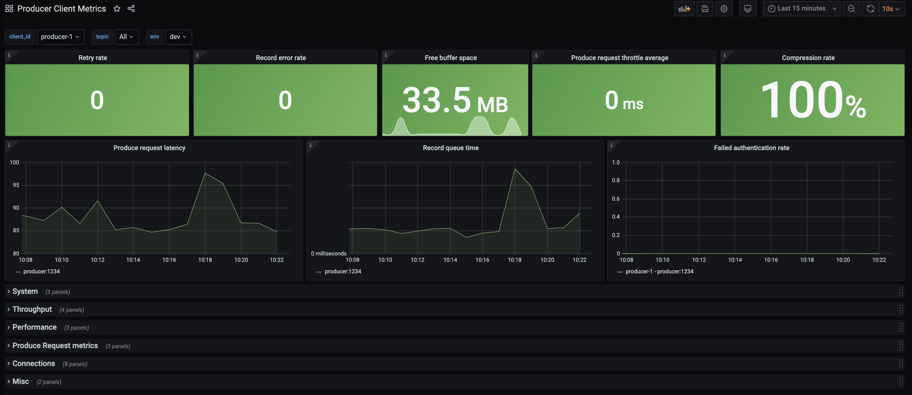

.. _ccloud-observability-producer-overview:

Producer Client Scenarios
~~~~~~~~~~~~~~~~~~~~~~~~~

The dashboard and scenarios in this section use client metrics from a Java producer. The same principles can be applied to any
other non-java clients--they generally offer similar metrics.

The source code for the client can found in the :devx-examples:`ccloud-observability/src|ccloud-observability/src` directory.
The sample client uses default configurations, this is not recommended for production use cases.
This Java producer will continue to produce the same message every 100 ms until the process is interrupted.
The content of the message is not important here, in these scenarios the focus is on the change in client metric values.

|Producer Dashboard|

