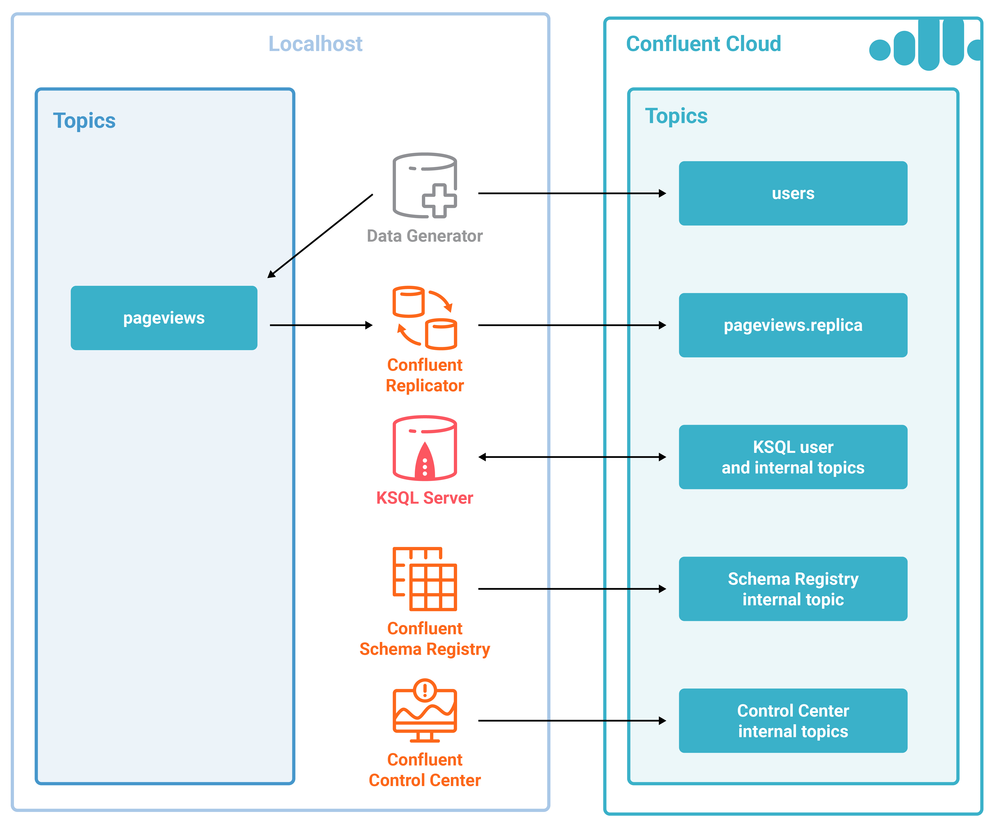

# Overview

This Confluent Cloud demo showcases Hybrid Kafka Clusters from Self-Hosted to Confluent Cloud. This automated demo is an expansion of the [KSQL Tutorial](https://docs.confluent.io/current/ksql/docs/tutorials/basics-local.html#create-a-stream-and-table>). Instead of the Kafka cluster backing the KSQL stream processing running on your local install, it runs on your Confluent Cloud cluster. There are also additional Confluent Platform components including Confluent Control Center and Confluent Replicator.

This demo showcases:
* Confluent Cloud
* KSQL
* Confluent Replicator
* Confluent Control Center

# Prerequisites

* [Common demo prerequisites](https://github.com/confluentinc/quickstart-demos#prerequisites)
* [Confluent Platform 5.0: Enterprise](https://www.confluent.io/download/)
* [Confluent Cloud CLI](https://docs.confluent.io/current/cloud-quickstart.html#step-2-install-ccloud-cli)
* [An initialized Confluent Cloud cluster used for development only](https://confluent.cloud)

NOTE: Do not run this demo against your production Confluent Cloud cluster. Run this demo only in a development cluster.

# Documentation

You can find the documentation for running this demo, and its accompanying playbook, at [https://docs.confluent.io/current/tutorials/quickstart-demos/ccloud/docs/index.html](https://docs.confluent.io/current/tutorials/quickstart-demos/ccloud/docs/index.html)
