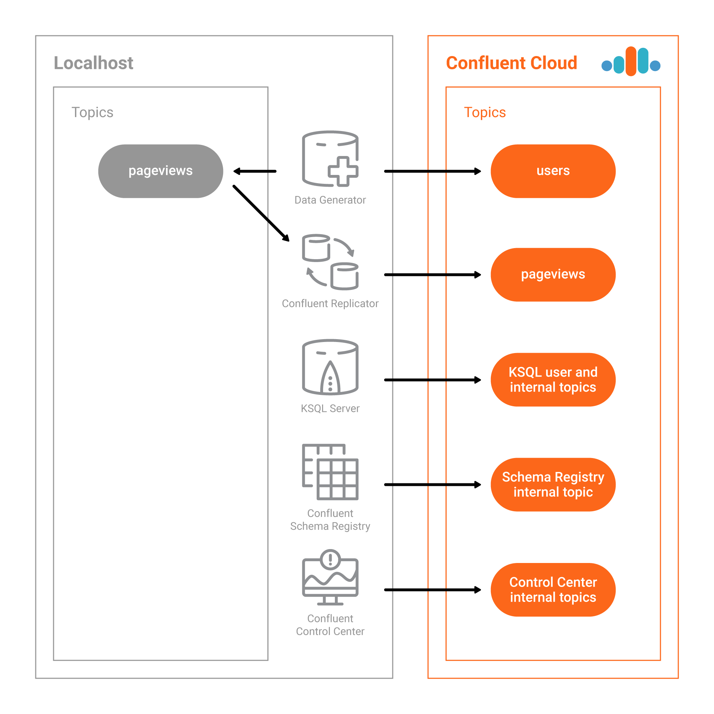

# Overview

This Confluent Cloud demo showcases Hybrid Kafka Clusters for Bridge to Cloud: moving from Self-Hosted to Confluent Cloud. Data streams into topics both a local cluster and a cluster in Confluent Cloud, and Replicator copies the on-prem data to Cloud so that stream processing can happen in the Cloud.

Note: if you are looking for code examples of producers writing to and consumers reading from Confluent Cloud, or producers and consumers using Avro with Confluent Schema Registry, checkout the [clients subdirectory of examples](../clients). It provides client examples written in various programming languages.

This automated demo is an expansion of the [KSQL Tutorial](https://docs.confluent.io/current/ksql/docs/tutorials/basics-local.html#create-a-stream-and-table>). Instead of the Kafka cluster backing the KSQL stream processing running on your local install, it runs on your Confluent Cloud cluster. There are also additional Confluent Platform components including Confluent Control Center and Confluent Replicator.



## End-to-end Solution

This demo showcases:

* Confluent Cloud
* KSQL
* Confluent Replicator
* Confluent Control Center

## Automated Configurations

It also includes a [script](ccloud-generate-cp-configs.sh) that reads the Confluent Cloud configuration in ``$HOME/.ccloud/config`` and writes delta configuration files into ``./delta_configs`` for Confluent Platform components and clients connecting to Confluent Cloud, including the following:

* Confluent Platform Components:
  * Confluent Schema Registry
  * KSQL Data Generator
  * KSQL server
  * Confluent Replicator (standalone binary)
  * Confluent Control Center
* Kafka Clients:
  * Java (Producer/Consumer)
  * Java (Streams)
  * Python
  * .NET
  * Go
  * Node.js (https://github.com/Blizzard/node-rdkafka)
  * C++

# Prerequisites

## Local

As with the other demos in this repo, you may run the entire demo end-to-end with `./start.sh`, and it runs on your local Confluent Platform install.  This requires the following:

* [Common demo prerequisites](https://github.com/confluentinc/examples#prerequisites)
* [Confluent Platform 5.1](https://www.confluent.io/download/)
* [Confluent Cloud CLI](https://docs.confluent.io/current/cloud-quickstart.html#step-2-install-ccloud-cli)
* [An initialized Confluent Cloud cluster used for development only](https://confluent.cloud)
* Maven to compile the data generator, i.e. the `KafkaMusicExampleDriver` class

To run the local setup:

```bash
$ ./start.sh
```

## Docker

* Docker version 17.06.1-ce
* Docker Compose version 1.14.0 with Docker Compose file format 2.1
* [Confluent Cloud CLI](https://docs.confluent.io/current/cloud-quickstart.html#step-2-install-ccloud-cli)
* [An initialized Confluent Cloud cluster used for development only](https://confluent.cloud)

To run the Docker setup:

```bash
$ ./start-docker.sh
```

NOTE: Do not run this demo against your production Confluent Cloud cluster. Run this demo only in a development cluster.

# Documentation

You can find the documentation for running this demo, and its accompanying playbook, at [https://docs.confluent.io/current/tutorials/examples/ccloud/docs/index.html](https://docs.confluent.io/current/tutorials/examples/ccloud/docs/index.html)
