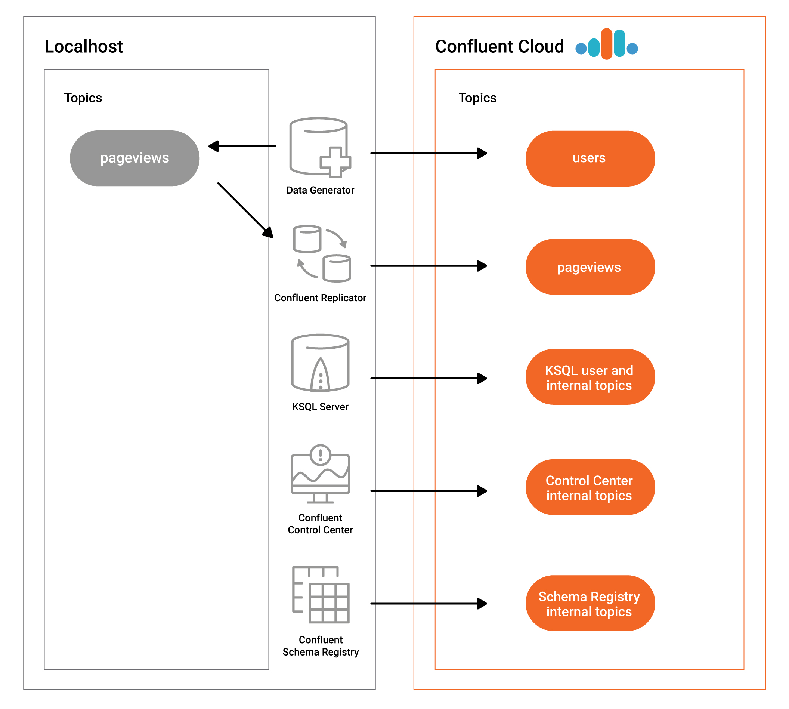

* [Overview](#overview)
* [Beginner Cloud](#beginner-cloud)
* [Advanced Demo](#advanced-demo)
* [Client Code Examples](#client-code-examples)
* [Auto-generate Configurations to connect to Confluent Cloud](#auto-generate-configurations-to-connect-to-confluent-cloud)

# Overview

[Confluent Cloud](https://docs.confluent.io/current/cloud/index.html?utm_source=github&utm_medium=demo&utm_campaign=ch.examples_type.community_content.ccloud) is a resilient, scalable streaming data service based on Apache Kafka®, delivered as a fully managed service.
It has a web interface and local command line interface that you can use to manage cluster resources, Kafka topics, Schema Registry, and other services.

This repo has a few resources to help you validate your solutions on Confluent Cloud.

# Beginner Cloud

[This beginner demo](beginner-cloud/README.md) is a fully scripted demo that shows users how to interact with Confluent Cloud using the CLI.
It steps through the following workflow.

* Log in to Confluent Cloud
* Create a new environment and specify it as the default
* Create a new Kafka cluster and specify it as the default
* Create a user key/secret pair and specify it as the default
* Produce and consume with Confluent Cloud CLI
* Create a service account key/secret pair
* Run a Java producer: before and after ACLs
* Run a Java producer: showcase a Prefix ACL
* Run Connect and kafka-connect-datagen connector with permissions
* Run a Java consumer: showcase a Wildcard ACL
* Delete the API key, service account, Kafka topics, Kafka cluster, environment, and the log files

# Advanced Demo

[This end-to-end Confluent Cloud demo](https://docs.confluent.io/current/tutorials/examples/ccloud/docs/index.html?utm_source=github&utm_medium=demo&utm_campaign=ch.examples_type.community_content.ccloud) showcases a hybrid Kafka deployment: one cluster is a self-managed cluster running locally, the other is a |ccloud| cluster.
Data streams into topics both a local cluster and a cluster in Confluent Cloud, and Confluent Replicator copies the on-prem data to Confluent Cloud so that stream processing can happen in the Cloud.

The documentation for running this demo, and its accompanying playbook, is at [https://docs.confluent.io/current/tutorials/examples/ccloud/docs/index.html](https://docs.confluent.io/current/tutorials/examples/ccloud/docs/index.html?utm_source=github&utm_medium=demo&utm_campaign=ch.examples_type.community_content.ccloud)

It includes:

* Confluent Cloud
* Confluent Cloud Schema Registry
* KSQL
* Confluent Replicator
* Confluent Control Center
* Kafka Connect
* `kafka-connect-datagen` connectors

NOTE: Do not run this demo against your production Confluent Cloud cluster. Run this demo only in a development cluster.

# Client Code Examples

If you are looking for code examples of producers writing to and consumers reading from Confluent Cloud, or producers and consumers using Avro with Confluent Schema Registry, checkout the [clients subdirectory of examples](../clients).
It provides client examples written in various programming languages.

# Auto-generate Configurations to connect to Confluent Cloud

[This script](ccloud-generate-cp-configs.sh) reads a configuration file (by default assumed to be at ``$HOME/.ccloud/config``) and auto-generates delta configurations into ``./delta_configs``.
Use these per-component configurations for Confluent Platform components and clients connecting to Confluent Cloud:

* Confluent Platform Components:
  * Confluent Schema Registry
  * KSQL Data Generator
  * KSQL server
  * Confluent Replicator (standalone binary)
  * Confluent Control Center
  * Kafka Connect
* Kafka Clients:
  * Java (Producer/Consumer)
  * Java (Streams)
  * Python
  * .NET
  * Go
  * Node.js (https://github.com/Blizzard/node-rdkafka)
  * C++

The [template examples](template_delta_configs) have delta configuration lines to add to each component or client.
See [documentation](https://docs.confluent.io/current/cloud/connect/auto-generate-configs.html?utm_source=github&utm_medium=demo&utm_campaign=ch.examples_type.community_content.ccloud) for more information.

