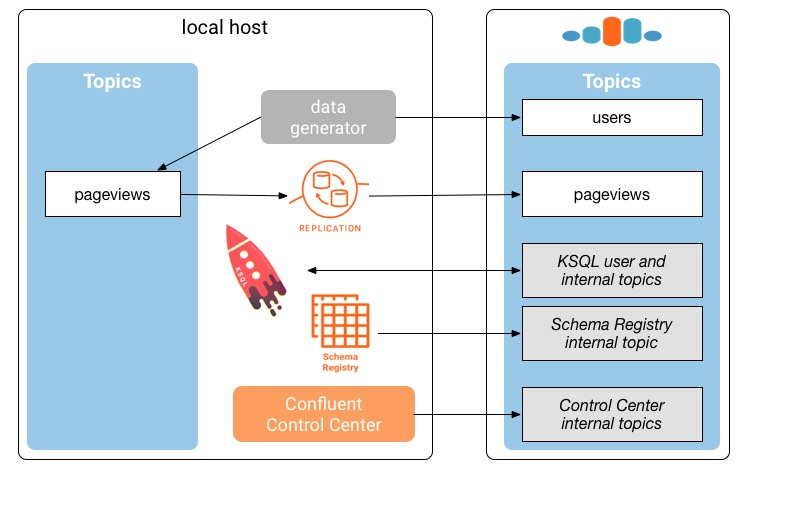

# Overview

This Confluent Cloud demo showcases Hybrid Kafka Clusters from Self-Hosted to Confluent Cloud. This demo is the automated cloud version of the [Confluent Platform 4.1 Quickstart](https://docs.confluent.io/current/quickstart.html), but instead of KSQL stream processing running on your local install, it runs on your Confluent Cloud cluster.

This demo showcases:
* Confluent Cloud
* KSQL
* Confluent Replicator
* |c3|

# Prerequisites

* [Common demo prerequisites](https://github.com/confluentinc/quickstart-demos#prerequisites)
* [Confluent Platform 4.1: Enterprise](https://www.confluent.io/download/)
* [Confluent Cloud CLI](https://docs.confluent.io/current/cloud-quickstart.html#step-2-install-ccloud-cli)
* [An initialized Confluent Cloud cluster used for development only](https://confluent.cloud)

NOTE: Do not run this demo against a production Confluent Cloud cluster. Run it only in a cluster used for development only.

# Documentation

You can find the documentation for running this demo, and its accompanying playbook, at [https://docs.confluent.io/current/tutorials/quickstart-demos/ccloud/docs/index.html](https://docs.confluent.io/current/tutorials/quickstart-demos/ccloud/docs/index.html)
