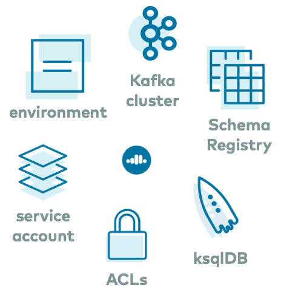

# Overview
  
The `ccloud-stack` utility creates a stack of fully managed services in Confluent Cloud.
It is a quick way to create fully managed resources in Confluent Cloud, which you can then use for learning and building other demos.
Do not use this in a production environment.
The script uses the Confluent Cloud CLI to dynamically do the following in Confluent Cloud:

* Create a new environment
* Create a new service account
* Create a new Kafka cluster and associated credentials
* Enable Schema Registry and associated credentials
* Create a new ksqlDB app and associated credentials
* Create ACLs with wildcard for the service account
* Generate a local configuration file with all above connection information, useful for other demos/automation

# Documentation

You can find the documentation and instructions for running `ccloud-stack` at [https://docs.confluent.io/platform/current/tutorials/examples/ccloud/docs/ccloud-stack.html](https://docs.confluent.io/platform/current/tutorials/examples/ccloud/docs/ccloud-stack.html?utm_source=github&utm_medium=demo&utm_campaign=ch.examples_type.community_content.clients-ccloud)

