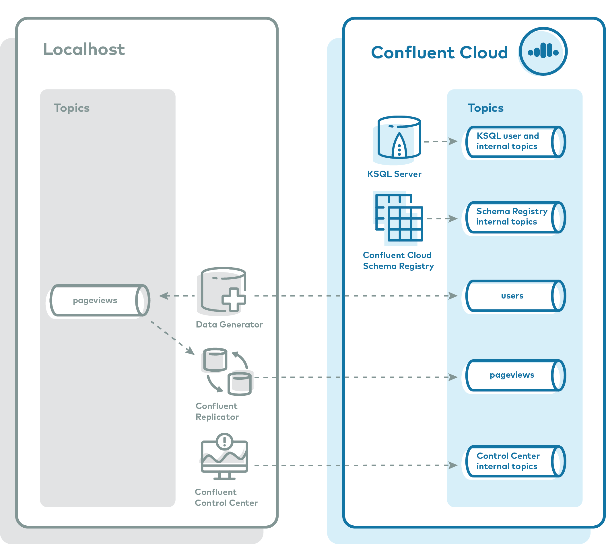

.. _ccloud-demos-overview:

|ccloud| Demos
==============

`Confluent Cloud <https://docs.confluent.io/current/cloud/index.html>`__ is a resilient, scalable streaming data service based on |ak|, delivered as a fully managed service. It has a web interface and local command-line interface that you can use to manage cluster resources, |ak| topics, |sr|, and other services.

This page describes a few resources to help you build and validate your solutions on |ccloud|.

=======
Caution
=======

All the following demos and examples use real |ccloud| resources.
They create |ccloud| environments, clusters, topics, ACLs, service accounts, KSQL applications, and potentially other |ccloud| resources that are billable.
To avoid unexpected charges, carefully evaluate the cost of resources before launching any demo and manually verify that all |ccloud| resources are destroyed after you are done.

These demos are meant for development environments only.
Do not run any demo against your production |ccloud| cluster.

=====
Demos
=====

|ccloud| Quickstart
--------------------------

The :devx-examples:`Confluent Cloud Quickstart|cp-quickstart/` is an automated version of the :ref:`Confluent Platform Quickstart <quickstart>`, but this one runs in |ccloud|.

.. figure:: ../../cp-quickstart/images/quickstart.png

Fully Managed Stack in |ccloud|
-------------------------------

The :devx-examples:`ccloud stack|ccloud/ccloud-stack/README.md` creates a stack of fully managed services in |ccloud|.
Executed with a single command, it is a quick way to create fully managed components in |ccloud|, which you can then use for learning and building other demos.
Do not use this in a production environment.
The script uses the |ccloud| CLI to dynamically do the following in |ccloud|:

-  Create a new environment.
-  Create a new service account.
-  Create a new Kafka cluster and associated credentials.
-  Enable |sr-ccloud| and associated credentials.
-  Create a new KSQL app and associated credentials.
-  Create ACLs with wildcard for the service account.
-  Generate a local configuration file with all above connection information, useful for other demos/automation.

Client Code Examples
--------------------

If you are looking for code examples of producers writing to and consumers reading from |ccloud|, or producers and consumers using Avro with |sr-long|, refer to the :devx-examples:`client examples|clients/cloud/README.md`.
It provides client examples written in various programming languages.

.. figure:: ../clients/images/clients-all.png

|ccloud| CLI
------------

The :devx-examples:`Confluent Cloud CLI demo|ccloud/beginner-cloud/README.md` is a fully scripted demo that shows users how to interact with |ccloud| using the |ccloud| CLI.
It steps through the following workflow:

-  Create a new environment and specify it as the default.
-  Create a new Kafka cluster and specify it as the default.
-  Create a user key/secret pair and specify it as the default.
-  Produce and consume with |ccloud| CLI.
-  Create a service account key/secret pair.
-  Run a Java producer: before and after ACLs.
-  Run a Java producer: showcase a Prefix ACL.
-  Run Connect and kafka-connect-datagen connector with permissions.
-  Run a Java consumer: showcase a Wildcard ACL.
-  Delete the API key, service account, Kafka topics, Kafka cluster, environment, and the log files.

Cloud ETL
---------

The :ref:`cloud ETL demo <cloud-etl>` showcases a cloud ETL solution leveraging all fully-managed services on |ccloud|.
Using |ccloud| CLI, the demo creates a source connector that reads data from an AWS Kinesis stream into |ccloud|, then a |ccloud| KSQL application processes that data, and then a sink connector writes the output data into cloud storage in the provider of your choice (GCP GCS, AWS S3, or Azure Blob).

.. figure:: ../../cloud-etl/docs/images/topology.png

Hybrid Cloud
------------

The :ref:`hybrid cloud demo <quickstart-demos-ccloud>` and playbook showcase a hybrid Kafka deployment: one cluster is a self-managed cluster running locally, the other is a |ccloud| cluster.
Data streams into topics, in both the local cluster and the |ccloud| cluster. |crep| copies the on-prem data to |ccloud| so that stream processing can happen in the cloud.

Confluent Operator with Cloud
-----------------------------

The :ref:`Kubernetes demo <quickstart-demos-operator-replicator-gke-cc>` features a deployment of |cp| on Google Kubernetes Engine (GKE) leveraging Confluent Operator and |crep|, highlighting a data replication strategy to |ccloud|.
Upon running this demo, you will have a GKE-based |cp| deployment with simulated data replicating to your |ccloud| cluster.

.. figure:: ../../kubernetes/replicator-gke-cc/docs/images/operator-demo-phase-2.png

=========================
Build Your Own Cloud Demo
=========================

Fully Managed Stack in |ccloud|
-------------------------------

The :devx-examples:`ccloud stack|ccloud/ccloud-stack/README.md` creates a stack of fully managed services in |ccloud|.
Executed with a single command, it is a quick way to create fully managed components in |ccloud|, which you can then use for learning and building other demos.
Do not use this in a production environment.
The script uses the |ccloud| CLI to dynamically do the following in |ccloud|:

-  Create a new environment.
-  Create a new service account.
-  Create a new Kafka cluster and associated credentials.
-  Enable |sr-ccloud| and associated credentials.
-  Create a new KSQL app and associated credentials.
-  Create ACLs with wildcard for the service account.
-  Generate a local configuration file with all above connection information, useful for other demos/automation.

Auto-generate Configurations to connect to |ccloud|
---------------------------------------------------

The :ref:`configuration generation script <auto-generate-configs>` reads a configuration file and auto-generates delta configurations for all |cp| components and clients.
Use these per-component configurations for |cp| components and clients connecting to |ccloud|:

* |cp| Components:

  * |sr|

  * |ksql-cloud| Data Generator

  * |ksql-cloud|

  * |crep-full|

  * |c3|

  * |kconnect-long|

  * Kafka connector

  * |ak| command line tools

* Kafka Clients:

  * Java (Producer/Consumer)

  * Java (Streams)

  * Python

  * .NET

  * Go

  * Node.js

  * C++

* OS:

  * ENV file

Self Managed Components to |ccloud|
-----------------------------------

This :devx-cp-all-in-one:`Docker-based environment|cp-all-in-one-cloud` can be used with |ccloud|.
The ``docker-compose.yml`` launches all services in |cp| (except for the Kafka brokers), runs them in containers on localhost, and automatically configures them to connect to |ccloud|.
Using this as a foundation, you can then add any connectors or applications.

.. figure:: images/cp-all-in-one-cloud.png

Put It All Together
-------------------

You can chain these utilities to build your own hybrid demos that span |ccloud| and on-prem.
For example, you want an easy way to test an end-to-end workflow with a connector not yet available in |ccloud|.
Or perhaps you want to build a |ak| demo in |ccloud| and run the |crest| client or |c3| against it.
You can build a demo with a mix of fully-managed services in |ccloud| and self-managed components on localhost, in a few easy steps.

#. Create a :devx-examples:`ccloud stack|ccloud/ccloud-stack/README.md` of fully managed services in |ccloud|. One of the outputs is a local configuration file with key-value pairs of the required connection values to |ccloud|.

   .. sourcecode:: bash

      # https://github.com/confluentinc/examples/blob/latest/ccloud/ccloud-stack/ccloud_stack_create.sh
      ./ccloud_stack_create.sh

#. Run the :ref:`configuration generation script <auto-generate-configs>`, passing in that local configuration file (created in previous step) as input. This script generates delta configuration files for all |cp| components and clients. One of these delta configuration files is for environment variables, and it resembles :devx-examples:`this example|ccloud/template_delta_configs/env.delta`.

   .. sourcecode:: bash

      # https://github.com/confluentinc/examples/blob/latest/ccloud/ccloud-generate-cp-configs.sh
      ./ccloud-generate-cp-configs.sh stack-configs/java-service-account-<SERVICE_ACCOUNT_ID>.config

#. Source that delta file (created in previous step) to export variables into the shell environment.

   .. sourcecode:: bash

      # File is generated by step above
      source delta_configs/env.delta

#. Run the desired |cp| services locally using :devx-cp-all-in-one:`this Docker-based example|cp-all-in-one-cloud`. The Docker Compose file launches |cp| services on your localhost and uses environment variable substitution to populate the parameters with the connection values to your |ccloud| so that they can communicate with |ccloud|.
 
   .. sourcecode:: bash

      # https://github.com/confluentinc/cp-all-in-one/blob/latest/cp-all-in-one-cloud/docker-compose.yml
      docker-compose up -d <service>

#. Refer to the :devx-examples:`library of bash functions|utils/helper_cloud.sh` for examples on how to interact with |ccloud| via the |ccloud| CLI.

====================
Additional Resources
====================

-  For a practical guide to configuring, monitoring, and optimizing your |ak| client applications, see the `Best Practices for Developing Kafka Applications on Confluent Cloud <https://assets.confluent.io/m/14397e757459a58d/original/20200205-WP-Best_Practices_for_Developing_Apache_Kafka_Applications_on_Confluent_Cloud.pdf>`__ whitepaper.
