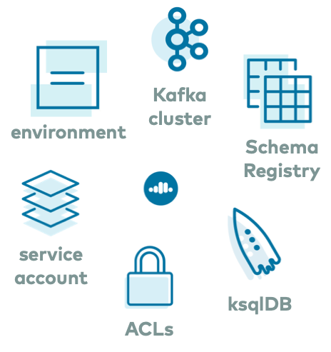

.. _ccloud-stack:

ccloud-stack Utility for |ccloud|
=================================

========
Overview
========

This ``ccloud-stack`` utility creates a stack of fully managed services in |ccloud|.
It is a quick way to create resources in |ccloud| with correct credentials and permissions, useful as a starting point from which you can then use for learning, extending, and building other examples.
The utility uses |ccloud| CLI under the hood to dynamically do the following in |ccloud| :

-  Create a new environment
-  Create a new service account
-  Create a new Kafka cluster and associated credentials
-  Enable Schema Registry and associated credentials
-  (Optional) Create a new ksqlDB app and associated credentials
-  Create ACLs with wildcard for the service account

In addition to creating these resources, ``ccloud-stack`` also generates a local configuration file with connection information to all of the above services.
This file is particularly useful because it contains connection information to your |ccloud| instance, and any downstream application or |ak| client can use it, or you can use it for other demos or automation workflows.

========================
Cost to Run ccloud-stack
========================

Caution
-------

.. include:: includes/ccloud-examples-caution.rst

This utility uses real |ccloud| resources.
It is intended to be a quick way to create resources in |ccloud| with correct credentials and permissions, useful as a starting point from which you can then use for learning, extending, and building other examples.

- If you just run ``ccloud-stack`` without explicitly enabling |ccloud| ksqlDB, then there is no billing charge until you create a topic, produce data to the |ak| cluster, or provision any other fully-managed service.
- If you run ``ccloud-stack`` with enabling |ccloud| ksqlDB, then you will begin to accrue charges immediately.

Here is a list of |ccloud| CLI commands issued by the utility that create resources in |ccloud| (function ``ccloud::create_ccloud_stack()`` source code is in :devx-examples:`ccloud_library|utils/ccloud_library.sh`).
By default, the |ccloud| ksqlDB app is not created with ``ccloud-stack``, you have to explicitly enable it.

.. code-block:: text

   ccloud service-account create $SERVICE_NAME --description $SERVICE_NAME -o json

   ccloud environment create $ENVIRONMENT_NAME -o json

   ccloud kafka cluster create "$CLUSTER_NAME" --cloud $CLUSTER_CLOUD --region $CLUSTER_REGION
   ccloud api-key create --service-account $SERVICE_ACCOUNT_ID --resource $RESOURCE -o json    // for kafka

   ccloud schema-registry cluster enable --cloud $SCHEMA_REGISTRY_CLOUD --geo $SCHEMA_REGISTRY_GEO -o json
   ccloud api-key create --service-account $SERVICE_ACCOUNT_ID --resource $RESOURCE -o json    // for schema-registry

   # By default, ccloud-stack does not enable Confluent Cloud ksqlDB, but if you explicitly enable it:
   ccloud ksql app create --cluster $CLUSTER --api-key "$KAFKA_API_KEY" --api-secret "$KAFKA_API_SECRET" -o json "$KSQLDB_NAME"
   ccloud api-key create --service-account $SERVICE_ACCOUNT_ID --resource $RESOURCE -o json    // for ksqlDB REST API

   ccloud kafka acl create --allow --service-account $SERVICE_ACCOUNT_ID --operation <....>    // permissive ACLs for all services

|ccloud| Promo Code
-------------------

.. include:: includes/ccloud-examples-promo-code.rst

=============
Prerequisites
=============

- Create a user account in `Confluent Cloud <https://www.confluent.io/confluent-cloud/>`__
- Local install of `Confluent Cloud CLI <https://docs.confluent.io/ccloud-cli/current/install.html>`__ v1.25.0 or later.
- ``jq`` tool

Note that ``ccloud-stack`` has been validated on macOS 10.15.3 with bash version 3.2.57.
If you encounter issues on any other operating systems or versions, please open a GitHub issue at `confluentinc/examples <https://github.com/confluentinc/examples>`__.

.. _ccloud-stack-usage:

=====
Usage
=====

Setup
-----

#. .. include:: ../../clients/docs/includes/clients-checkout.rst

#. Change directory to the ccloud-stack utility:

   .. code-block:: bash

      cd ccloud/ccloud-stack/

#. Log in to |ccloud| with the command ``ccloud login``, and use your |ccloud| username and password. The ``--save`` argument saves your |ccloud| user login credentials or refresh token (in the case of SSO) to the local ``netrc`` file.

   .. code:: shell

      ccloud login --save

Create a ccloud-stack
---------------------

#. By default, the ``cloud-stack`` utility creates resources in the cloud provider ``aws`` in region ``us-west-2``. If this is the target provider and region, create the stack by calling the bash script :devx-examples:`ccloud_stack_create.sh|ccloud/ccloud-stack/ccloud_stack_create.sh`. For more options when configuring your ``ccloud-stack``, see :ref:`ccloud-stack-options`.

   .. code:: bash

      ./ccloud_stack_create.sh

#. You will be prompted twice. Note the second prompt which is where you can optionally enable |ccloud| ksqlDB.

   .. code-block:: text

      Do you still want to run this script? [y/n] y
      Do you also want to create a Confluent Cloud ksqlDB app (hourly charges may apply)? [y/n] n

#. ``ccloud-stack`` configures permissive ACLs with wildcards, which is useful for development and learning environments. In production, configure much stricter ACLs.

   If you ran without ksqlDB:

   .. code-block:: text

        ServiceAccountId | Permission |    Operation     |     Resource     |     Name      |  Type
      +------------------+------------+------------------+------------------+---------------+---------+
        User:186607      | ALLOW      | DESCRIBE         | TRANSACTIONAL_ID | *             | LITERAL
        User:186607      | ALLOW      | WRITE            | TRANSACTIONAL_ID | *             | LITERAL
        User:186607      | ALLOW      | IDEMPOTENT_WRITE | CLUSTER          | kafka-cluster | LITERAL
        User:186607      | ALLOW      | READ             | GROUP            | *             | LITERAL
        User:186607      | ALLOW      | WRITE            | GROUP            | *             | LITERAL
        User:186607      | ALLOW      | CREATE           | GROUP            | *             | LITERAL
        User:186607      | ALLOW      | DESCRIBE         | TOPIC            | *             | LITERAL
        User:186607      | ALLOW      | DELETE           | TOPIC            | *             | LITERAL
        User:186607      | ALLOW      | CREATE           | TOPIC            | *             | LITERAL
        User:186607      | ALLOW      | DESCRIBE_CONFIGS | TOPIC            | *             | LITERAL
        User:186607      | ALLOW      | WRITE            | TOPIC            | *             | LITERAL
        User:186607      | ALLOW      | READ             | TOPIC            | *             | LITERAL

   If you ran with ksqlDB:

   .. code-block:: text

        ServiceAccountId | Permission |    Operation     |     Resource     |             Name             |   Type
      +------------------+------------+------------------+------------------+------------------------------+----------+
        User:186588      | ALLOW      | DESCRIBE_CONFIGS | GROUP            | *                            | LITERAL
        User:186588      | ALLOW      | DESCRIBE         | GROUP            | *                            | LITERAL
        User:186588      | ALLOW      | DELETE           | TOPIC            | pksqlc-o3g5o                 | PREFIXED
        User:186588      | ALLOW      | READ             | TOPIC            | pksqlc-o3g5o                 | PREFIXED
        User:186588      | ALLOW      | ALTER            | TOPIC            | pksqlc-o3g5o                 | PREFIXED
        User:186588      | ALLOW      | DESCRIBE         | TOPIC            | pksqlc-o3g5o                 | PREFIXED
        User:186588      | ALLOW      | ALTER_CONFIGS    | TOPIC            | pksqlc-o3g5o                 | PREFIXED
        User:186588      | ALLOW      | DESCRIBE_CONFIGS | TOPIC            | pksqlc-o3g5o                 | PREFIXED
        User:186588      | ALLOW      | CREATE           | TOPIC            | pksqlc-o3g5o                 | PREFIXED
        User:186588      | ALLOW      | WRITE            | TOPIC            | pksqlc-o3g5o                 | PREFIXED
        User:186588      | ALLOW      | DESCRIBE         | TOPIC            | *                            | LITERAL
        User:186588      | ALLOW      | DESCRIBE_CONFIGS | TOPIC            | *                            | LITERAL
        User:186588      | ALLOW      | DESCRIBE         | TRANSACTIONAL_ID | pksqlc-o3g5o                 | LITERAL
        User:186588      | ALLOW      | WRITE            | TRANSACTIONAL_ID | pksqlc-o3g5o                 | LITERAL
        User:186588      | ALLOW      | ALTER            | TOPIC            | _confluent-ksql-pksqlc-o3g5o | PREFIXED
        User:186588      | ALLOW      | WRITE            | TOPIC            | _confluent-ksql-pksqlc-o3g5o | PREFIXED
        User:186588      | ALLOW      | READ             | TOPIC            | _confluent-ksql-pksqlc-o3g5o | PREFIXED
        User:186588      | ALLOW      | DELETE           | TOPIC            | _confluent-ksql-pksqlc-o3g5o | PREFIXED
        User:186588      | ALLOW      | DESCRIBE         | TOPIC            | _confluent-ksql-pksqlc-o3g5o | PREFIXED
        User:186588      | ALLOW      | ALTER_CONFIGS    | TOPIC            | _confluent-ksql-pksqlc-o3g5o | PREFIXED
        User:186588      | ALLOW      | CREATE           | TOPIC            | _confluent-ksql-pksqlc-o3g5o | PREFIXED
        User:186588      | ALLOW      | DESCRIBE_CONFIGS | TOPIC            | _confluent-ksql-pksqlc-o3g5o | PREFIXED
        User:186588      | ALLOW      | IDEMPOTENT_WRITE | CLUSTER          | kafka-cluster                | LITERAL
        User:186588      | ALLOW      | DESCRIBE         | CLUSTER          | kafka-cluster                | LITERAL
        User:186588      | ALLOW      | DESCRIBE_CONFIGS | CLUSTER          | kafka-cluster                | LITERAL
        User:186588      | ALLOW      | WRITE            | GROUP            | _confluent-ksql-pksqlc-o3g5o | PREFIXED
        User:186588      | ALLOW      | DESCRIBE         | GROUP            | _confluent-ksql-pksqlc-o3g5o | PREFIXED
        User:186588      | ALLOW      | DELETE           | GROUP            | _confluent-ksql-pksqlc-o3g5o | PREFIXED
        User:186588      | ALLOW      | READ             | GROUP            | _confluent-ksql-pksqlc-o3g5o | PREFIXED
        User:186588      | ALLOW      | CREATE           | GROUP            | _confluent-ksql-pksqlc-o3g5o | PREFIXED
        User:186588      | ALLOW      | ALTER            | GROUP            | _confluent-ksql-pksqlc-o3g5o | PREFIXED
        User:186588      | ALLOW      | ALTER_CONFIGS    | GROUP            | _confluent-ksql-pksqlc-o3g5o | PREFIXED
        User:186588      | ALLOW      | DESCRIBE_CONFIGS | GROUP            | _confluent-ksql-pksqlc-o3g5o | PREFIXED

#. In addition to creating all the resources in |ccloud| with associated service account and ACLs, running ``ccloud-stack`` also generates a local configuration file with all the |ccloud| connection information, which is useful for other demos/automation. View this file at ``stack-configs/java-service-account-<SERVICE_ACCOUNT_ID>.config``. It resembles:

   .. code-block:: text

      # ------------------------------
      # ENVIRONMENT ID: <ENVIRONMENT ID>
      # SERVICE ACCOUNT ID: <SERVICE ACCOUNT ID>
      # KAFKA CLUSTER ID: <KAFKA CLUSTER ID>
      # SCHEMA REGISTRY CLUSTER ID: <SCHEMA REGISTRY CLUSTER ID>
      # KSQLDB APP ID: <KSQLDB APP ID>
      # ------------------------------
      security.protocol=SASL_SSL
      sasl.mechanism=PLAIN
      bootstrap.servers=<BROKER ENDPOINT>
      sasl.jaas.config=org.apache.kafka.common.security.plain.PlainLoginModule required username='<API KEY>' password='<API SECRET>';
      basic.auth.credentials.source=USER_INFO
      basic.auth.user.info=<SR API KEY>:<SR API SECRET>
      schema.registry.url=https://<SR ENDPOINT>
      ksql.endpoint=<KSQLDB ENDPOINT>
      ksql.basic.auth.user.info=<KSQLDB API KEY>:<KSQLDB API SECRET>

.. _ccloud-stack-destroy:

Destroy a ccloud-stack
----------------------

#. To destroy a ``cloud-stack`` created in the previous step, call the bash script :devx-examples:`ccloud_stack_destroy.sh|ccloud/ccloud-stack/ccloud_stack_destroy.sh` and pass in the client properties file auto-generated in the step above. By default, this deletes all resources, including the |ccloud| environment specified by the service account ID in the configuration file.

   .. code:: bash

      ./ccloud_stack_destroy.sh stack-configs/java-service-account-<SERVICE_ACCOUNT_ID>.config

.. include:: includes/ccloud-examples-terminate.rst

Details
-------

See section :ref:`ccloud-stack-destroy` for more details.

.. _ccloud-stack-options:

================
Advanced Options
================

Select Cloud Provider and Region
--------------------------------

By default, the ``cloud-stack`` utility creates resources in the cloud provider ``aws`` in region ``us-west-2``. To create resources in another cloud provider or region other than the default, complete the following steps:

#. View the available cloud providers and regions using the |ccloud| CLI:

   .. code-block:: bash

      ccloud kafka region list

#. Create the ``ccloud-stack`` and override the parameters ``CLUSTER_CLOUD`` and ``CLUSTER_REGION``, as shown in the following example:

   .. code-block:: bash

      CLUSTER_CLOUD=aws CLUSTER_REGION=us-west-2 ./ccloud_stack_create.sh

Re-use Existing Environment
---------------------------

By default, a new ``ccloud-stack`` creates a new environment.
This means that, by default, ``./ccloud_stack_create.sh`` creates a new environment and ``./ccloud_stack_destroy.sh`` deletes the environment specified in the configuration file.
However, due to |ccloud| `environment limits per organization <https://docs.confluent.io/cloud/features.html#resource-limits-for-ccloud>`__, it may be desirable to work within an existing environment.

When you create a new stack, to reuse an existing environment, set the parameter ``ENVIRONMENT`` with an existing environment ID, as shown in the example:

.. code-block:: bash

   ENVIRONMENT=env-oxv5x ./ccloud_stack_create.sh

When you destroy resources that were created by ``ccloud-stack``, the default behavior is that the environment specified by the service account ID in the configuration file is deleted.
However, there are two additional options.

To preserve the environment when destroying all the other resources in the ``ccloud-stack``, set the parameter ``PRESERVE_ENVIRONMENT=true``, as shown in the following example.
If you do not specify ``PRESERVE_ENVIRONMENT=true``, then the environment specified by the service account ID in the configuration file is deleted.

.. code-block:: bash

   PRESERVE_ENVIRONMENT=true ./ccloud_stack_destroy.sh stack-configs/java-service-account-<SERVICE_ACCOUNT_ID>.config

To destroy the environment when destroying all the other resources in the ``ccloud-stack``, but the service account is not part of the environment name (i.e., multiple ``ccloud-stacks`` were created in the same environment), set the parameter ``ENVIRONMENT_NAME_PREFIX=ccloud-stack-<SERVICE_ACCOUNT_ID>``, as shown in the following example.
Note that the service account ID in the environment name is not the same as the service account ID in the config name.
If you do not specify the environment name prefix, then the destroy function will not be able to identify the proper environment ID to delete.

.. code-block:: bash

   ENVIRONMENT_NAME_PREFIX=ccloud-stack-<SERVICE_ACCOUNT_ID_original> ./ccloud_stack_destroy.sh stack-configs/java-service-account-<SERVICE_ACCOUNT_ID_current>.config

Automated Workflows
-------------------

If you don't want to create and destroy a ``ccloud-stack`` using the provided bash scripts :devx-examples:`ccloud_stack_create.sh|ccloud/ccloud-stack/ccloud_stack_create.sh` and :devx-examples:`ccloud_stack_destroy.sh|ccloud/ccloud-stack/ccloud_stack_destroy.sh`, you may pull in the :devx-examples:`ccloud_library|utils/ccloud_library.sh` and call the functions ``ccloud::create_ccloud_stack()`` and ``ccloud::destroy_ccloud_stack()`` directly.

#. Get the :devx-examples:`ccloud_library|utils/ccloud_library.sh`:

   .. code:: bash

      wget -O ccloud_library.sh https://raw.githubusercontent.com/confluentinc/examples/latest/utils/ccloud_library.sh

#. Source the library

   .. code:: bash

      source ./ccloud_library.sh

#. Optionally override the ``CLUSTER_CLOUD`` and ``CLUSTER_REGION`` configuration parameters.

   .. code:: bash

      CLUSTER_CLOUD=aws
      CLUSTER_REGION=us-west-2 

#. Run the bash function directly from the command line.

   To create the ``cloud-stack`` without |ccloud| ksqlDB:

   .. code:: bash

      ccloud::create_ccloud_stack

   To create the ``cloud-stack`` with |ccloud| ksqlDB:

   .. code:: bash

      ccloud::create_ccloud_stack true

#. To destroy the ``ccloud-stack``, run the following command. By default, it deletes all resources, including the |ccloud| environment specified by the service account ID in the configuration file.

   .. code:: bash

      ccloud::destroy_ccloud_stack $SERVICE_ACCOUNT_ID

====================
Additional Resources
====================

- For a practical guide to configuring, monitoring, and optimizing your Kafka
  client applications when using |ccloud|, see `Developing Client Applications on Confluent Cloud <https://docs.confluent.io/cloud/best-practices/index.html>`__.
- Read this blog post about `using Confluent Cloud to manage data pipelines that use both on-premise and cloud deployments <https://www.confluent.io/blog/multi-cloud-integration-across-distributed-systems-with-kafka-connect/>`__.
- For sample usage of ``ccloud-stack``, see :ref:`ccloud-demos-overview` or :ref:`Observability for Apache Kafka® Clients to Confluent Cloud demo <ccloud-observability-index>`.
