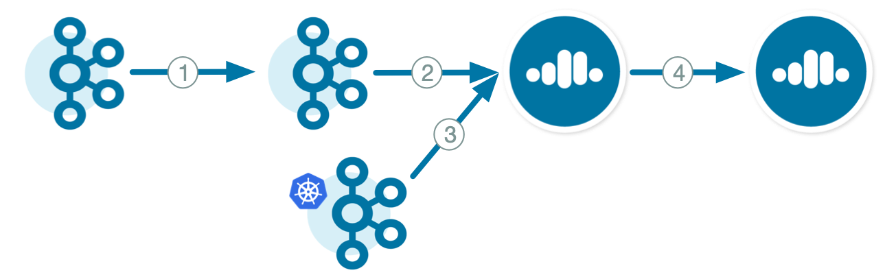

There are many demos and tutorials for running |crep| between |ak| clusters or |ccloud| clusters.
Refer to the diagram below to select the scenario that you are looking for.

1. |ak| on-prem to |ak| on-prem

   - :ref:`replicator` 
   - :ref:`replicator_detail`

2. |ak| on-prem to |ccloud|

   - :ref:`quickstart-demos-ccloud`
   - :ref:`onprem-cloud-destination`
   - :ref:`onprem-cloud-origin`

3. |ak| in GKE to |ccloud|

   - :ref:`quickstart-demos-operator-replicator-gke-cc`

4. |ccloud| to |ccloud|

   - :ref:`cloud-cloud-destination`
   - :ref:`cloud-cloud-origin`
   - :ref:`cloud-migrate-topics`
