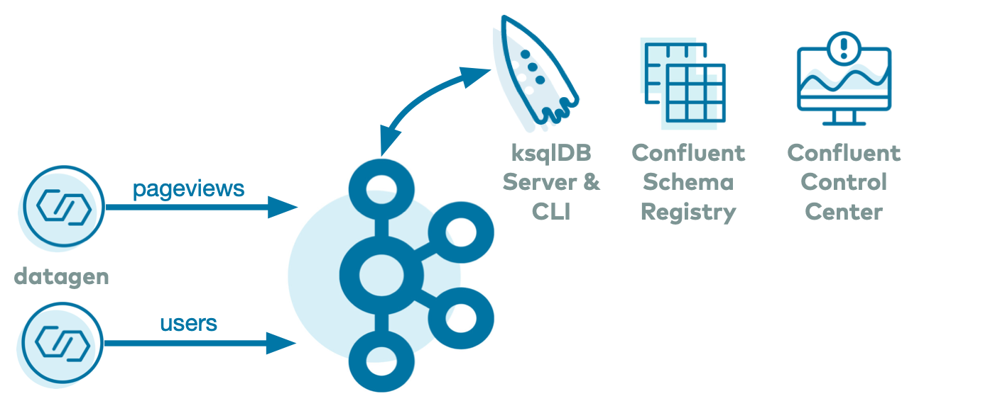
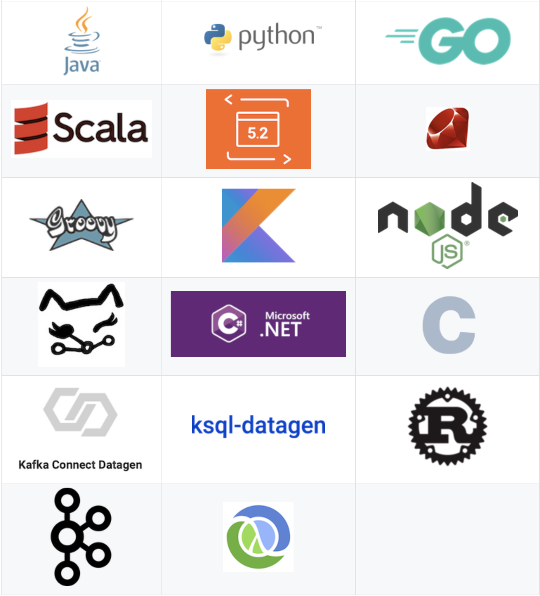
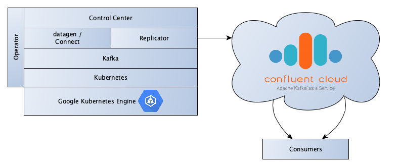
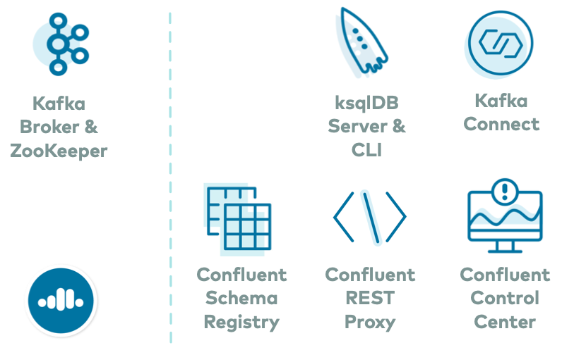

.. _ccloud-demos-overview:

|ccloud| Examples
=================

`Confluent Cloud <https://www.confluent.io/confluent-cloud>`__ is a resilient, scalable streaming data service based on |ak|, delivered as a fully managed service. It has a web interface and local command-line interface that you can use to manage cluster resources, |ak| topics, |sr|, and other services.

This page describes a few resources to help you build and validate your solutions on |ccloud|.

====================
Cost to Run Examples
====================

Caution
-------

.. include:: includes/ccloud-examples-caution.rst

|ccloud| Promo Code
-------------------

.. include:: includes/ccloud-examples-promo-code.rst

========
Examples
========

|ccloud| Quickstart
--------------------------

The :devx-examples:`Confluent Cloud Quickstart|cp-quickstart/` is an automated version of the :ref:`Confluent Platform Quickstart <quickstart>`, but this one runs in |ccloud|.

ccloud-stack Utility
--------------------

The :ref:`ccloud-stack` creates a stack of fully managed services in |ccloud|.
Executed with a single command, it is a quick way to create fully managed components in |ccloud|, which you can then use for learning and building other demos.
Do not use this in a production environment.
The script uses the |ccloud| CLI to dynamically do the following in |ccloud|:

-  Create a new environment.
-  Create a new service account.
-  Create a new Kafka cluster and associated credentials.
-  Enable |sr-ccloud| and associated credentials.
-  Create a new ksqlDB app and associated credentials.
-  Create ACLs with wildcard for the service account.
-  Generate a local configuration file with all above connection information, useful for other demos/automation.

.. figure:: images/ccloud-stack-resources.png

Client Code Examples
--------------------

If you are looking for code examples of producers writing to and consumers reading from |ccloud|, or producers and consumers using Avro with |sr-long|, refer to :ref:`clients-all-examples`.
It provides client examples written in various programming languages.

|ccloud| CLI
------------

The :ref:`ccloud-cli-tutorial` is a fully scripted example that shows users how to interact with |ccloud| using the |ccloud| CLI.
It steps through the following workflow:

-  Create a new environment and specify it as the default.
-  Create a new Kafka cluster and specify it as the default.
-  Create a user key/secret pair and specify it as the default.
-  Produce and consume with |ccloud| CLI.
-  Create a service account key/secret pair.
-  Run a Java producer: before and after ACLs.
-  Run a Java producer: showcase a Prefix ACL.
-  Run Connect and kafka-connect-datagen connector with permissions.
-  Run a Java consumer: showcase a Wildcard ACL.
-  Delete the API key, service account, Kafka topics, Kafka cluster, environment, and the log files.

Observability for |ak-tm| Clients to Confluent Cloud
----------------------------------------------------

The :ref:`observability for Apache Kafka clients to Confluent Cloud example <ccloud-observability-index>` showcases which client metrics to monitor with various failure scenarios and dashboards.
The clients are running against |ccloud|. The example creates a |ccloud| cluster, Java producers and consumers, Prometheus, Grafana, and various exporters.
The same principles can be applied to any other time-series database or visualization technology and non-java clients--they generally offer similar metrics.

Cloud ETL
---------

The :ref:`cloud ETL example <cloud-etl>` showcases a cloud ETL solution leveraging all fully-managed services on |ccloud|.
Using |ccloud| CLI, the example creates a source connector that reads data from an AWS Kinesis stream into |ccloud|, then a |ccloud| ksqlDB application processes that data, and then a sink connector writes the output data into cloud storage in the provider of your choice (GCP GCS, AWS S3, or Azure Blob).

.. figure:: ../../cloud-etl/docs/images/topology.png

On-Prem Kafka to Cloud
----------------------

The :ref:`hybrid cloud example <cp-demo>` and playbook showcase a hybrid Kafka deployment: one cluster is a self-managed cluster running locally, the other is a |ccloud| cluster.
|crep| copies the on-prem data to |ccloud| so that stream processing can happen in the cloud.

.. figure:: ../../../cp-demo/docs/images/cp-demo-overview-with-ccloud.jpg

Microservices in the Cloud
--------------------------

The :ref:`microservices cloud example <tutorial-microservices-orders>` showcases an order management workflow targeting |ccloud|.
Microservices are deployed locally on Docker, and they are configured to use a |ak| cluster, |ksqldb|, and |sr-long| in |ccloud|.
|kconnect-long| is also deployed locally on Docker, and it runs a SQL source connector to produce to |ccloud| and a Elasticsearch sink connector to consume from |ccloud|.

.. figure:: ../../microservices-orders/docs/images/microservices-demo.png

Confluent Operator with Cloud
-----------------------------

The Kubernetes examples feature a deployment of |cp| on Google Kubernetes Engine (GKE) or Microsoft Azure leveraging Confluent Operator and |crep|, highlighting a data replication strategy to |ccloud|.
Upon running this example, you will have a GKE-based or Azure-based |cp| deployment with simulated data replicating to your |ccloud| cluster.

You can choose between two examples:

- :ref:`quickstart-demos-operator-replicator-gke-cc`
- :ref:`quickstart-demos-operator-replicator-aks-cc`

DevOps for Apache Kafka® with Kubernetes and GitOps
---------------------------------------------------

The :ref:`streaming-ops` project is a simulated production-environment running a streaming application targeting |ak-tm| on |ccloud|.  Applications and resources are managed by GitOps with a declarative infrastructure, Kubernetes, and the Operator Pattern.

=========================
Build Your Own Cloud Demo
=========================

ccloud-stack Utility
--------------------

The :ref:`ccloud-stack` creates a stack of fully managed services in |ccloud|.
Executed with a single command, it is a quick way to create fully managed components in |ccloud|, which you can then use for learning and building other demos.
Do not use this in a production environment.
The script uses the |ccloud| CLI to dynamically do the following in |ccloud|:

-  Create a new environment.
-  Create a new service account.
-  Create a new Kafka cluster and associated credentials.
-  Enable |sr-ccloud| and associated credentials.
-  Create a new ksqlDB app and associated credentials.
-  Create ACLs with wildcard for the service account.
-  Generate a local configuration file with all above connection information, useful for other demos/automation.

.. figure:: images/ccloud-stack-resources.png

Auto-generate Configurations to connect to |ccloud|
---------------------------------------------------

The `configuration generation script <https://docs.confluent.io/cloud/cp-component/auto-generate-configs.html>`__ reads a configuration file and auto-generates delta configurations for all |cp| components and clients.
Use these per-component configurations for |cp| components and clients connecting to |ccloud|:

* |cp| Components:

  * |sr|

  * |ksql-cloud| Data Generator

  * |ksql-cloud|

  * |crep-full|

  * |c3|

  * |kconnect-long|

  * Kafka connector

  * |ak| command line tools

* Kafka Clients:

  * Java (Producer/Consumer)

  * Java (Streams)

  * Python

  * .NET

  * Go

  * Node.js

  * C++

* OS:

  * ENV file

Self Managed Components to |ccloud|
-----------------------------------

This :devx-cp-all-in-one:`Docker-based environment|cp-all-in-one-cloud` can be used with |ccloud|.
The ``docker-compose.yml`` launches all services in |cp| (except for the Kafka brokers), runs them in containers on localhost, and automatically configures them to connect to |ccloud|.
Using this as a foundation, you can then add any connectors or applications.

Put It All Together
-------------------

You can chain these utilities to build your own hybrid examples that span on-prem and |ccloud|, where some self-managed components run on-prem and fully-managed services run in |ccloud|.

For example, you may want an easy way to run a connector not yet available in |ccloud|.
In this case, you can run a self-managed connect worker and connector on prem and connect it to your |ccloud| cluster.
Or perhaps you want to build a |ak| demo in |ccloud| and run the |crest| client or |c3| against it.

You can build any example with a mix of fully-managed services in |ccloud| and self-managed components on localhost, in a few easy steps.

#. Create a :ref:`ccloud-stack <ccloud-stack>` of fully managed services in |ccloud|. One of the outputs is a local configuration file with key-value pairs of the required connection values to |ccloud|. (If you already have provisioned your |ccloud| resources, you can skip this step).

   .. sourcecode:: bash

      ./ccloud_stack_create.sh

#. Run the `configuration generation script <https://docs.confluent.io/cloud/cp-component/auto-generate-configs.html>`__ , passing in that local configuration file (created in previous step) as input. This script generates delta configuration files for all |cp| components and clients, including information for bootstrap servers, endpoints, and credentials required to connect to |ccloud|.

   .. sourcecode:: bash

      # stack-configs/java-service-account-<SERVICE_ACCOUNT_ID>.config is generated by step above
      ./ccloud-generate-cp-configs.sh stack-configs/java-service-account-<SERVICE_ACCOUNT_ID>.config

   One of the generated delta configuration files from this step is for environment variables, and it resembles :devx-examples:`this example|ccloud/template_delta_configs/env.delta`, with credentials filled in.

   .. literalinclude:: ../template_delta_configs/env.delta

#. Source the above delta env file to export variables into the shell environment.

   .. sourcecode:: bash

      # delta_configs/env.delta is generated by step above
      source delta_configs/env.delta

#. Run the desired |cp| services locally using :devx-cp-all-in-one:`this Docker-based example|cp-all-in-one-cloud`. The Docker Compose file launches |cp| services on your localhost and uses environment variable substitution to populate the parameters with the connection values to your |ccloud| so that they can connect to |ccloud|. If you want to run a single service, you can bring up just that service.
 
   .. sourcecode:: bash

      docker-compose up -d <service>

   In the case of running a self-managed connector locally that connects to |ccloud|, first add your desired connector to the base |kconnect-long| Docker image as described in `Add Connectors or Software <https://docs.confluent.io/connect/extending.html>`__, and then substitute that Docker image in your Docker Compose file.

#. Refer to the :devx-examples:`library of bash functions|utils/ccloud_library.sh` for examples on how to interact with |ccloud| via the |ccloud| CLI.

.. include:: includes/ccloud-examples-terminate.rst

====================
Additional Resources
====================

-  For a practical guide to configuring, monitoring, and optimizing your |ak|
   client applications, see `Developing Client Applications on Confluent Cloud <https://docs.confluent.io/cloud/best-practices/index.html>`__.
-  Learn how to use |crep-full| to copy Kafka data to |ccloud|, in different
   configurations that allow |kconnect-long| to be backed to |ccloud| or to your
   origin Kafka cluster. See :ref:`replicator-to-cloud-configurations` for more
   information.
