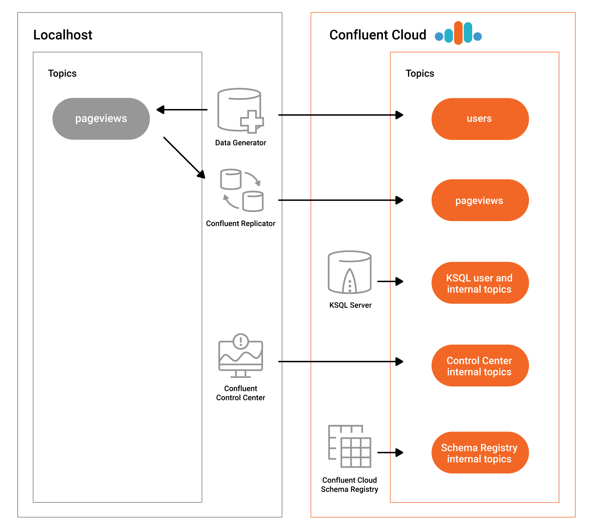

.. _quickstart-demos-ccloud:

On-Prem Kafka to Cloud
======================

This |ccloud| demo showcases a hybrid Kafka cluster: one cluster is a self-managed Kafka cluster running locally, the other is a |ccloud| cluster.
The use case is "Bridge to Cloud" as customers migrate from on premises to cloud.

========
Overview
========

The major components of the demo are:

* Two Kafka clusters: one cluster is a self-managed cluster running locally, the other is a |ccloud| cluster.
* |c3|: manages and monitors the deployment. Use it for topic inspection, viewing the schema, viewing and creating ksqlDB queries, streams monitoring, and more.
* ksqlDB: Confluent Cloud ksqlDB running queries on input topics `users` and `pageviews` in |ccloud|.
* Two Kafka Connect clusters: one cluster connects to the local self-managed cluster and one connects to the |ccloud| cluster. Both Connect worker processes themselves are running locally.

  * One instance of `kafka-connect-datagen`: a source connector that produces mock data to prepopulate the topic `pageviews` locally
  * One instance of `kafka-connect-datagen`: a source connector that produces mock data to prepopulate the topic `users` in the |ccloud| cluster
  * Confluent Replicator: copies the topic `pageviews` from the local cluster to the |ccloud| cluster

* |sr-long|: the demo runs with Confluent Cloud Schema Registry, and the Kafka data is written in Avro format.

.. note:: This is a demo environment and has many services running on one host. Do not use this demo in production, and
          do not use Confluent CLI in production. This is meant exclusively to easily demo the |cp| and |ccloud|.

Warning
=======

This demo uses real |ccloud| resources.
To avoid unexpected charges, carefully evaluate the cost of resources before launching the demo and ensure all resources are destroyed after you are done running it.

Prerequisites
=============

1. The following are prerequisites for the demo:

-  An initialized `Confluent Cloud cluster <https://confluent.cloud/>`__ used for development only. Do not use a production cluster.
-  `Confluent Cloud CLI <https://docs.confluent.io/current/quickstart/cloud-quickstart/index.html#step-2-install-the-ccloud-cli>`__ v0.239.0 or later
-  `Download <https://www.confluent.io/download/>`__ |cp| if using the local install (not required for Docker)
-  jq

2. Create a |ccloud| configuration file with information on connecting to your Confluent Cloud cluster (see :ref:`auto-generate-configs` for more information).
By default, the demo looks for this configuration file at ``~/.ccloud/config``.

3. This demo has been validated with:

-  Docker version 17.06.1-ce
-  Docker Compose version 1.14.0 with Docker Compose file format 2.1
-  Java version 1.8.0_162
-  MacOS 10.12

========
Run demo
========

Setup
-----

#. By default, the demo reads the configuration parameters for your |ccloud| environment from a file at ``$HOME/.ccloud/config``. You can change this filename via the parameter ``CONFIG_FILE`` in :devx-examples:`config/demo.cfg|cloud-etl/config/demo.cfg`. Enter the configuration parameters for your |ccloud| cluster, replacing the values in ``<...>`` below particular for your |ccloud| environment:

   .. code:: shell

      $ cat $HOME/.ccloud/config
      bootstrap.servers=<BROKER ENDPOINT>
      ssl.endpoint.identification.algorithm=https
      security.protocol=SASL_SSL
      sasl.mechanism=PLAIN
      sasl.jaas.config=org.apache.kafka.common.security.plain.PlainLoginModule required username\="<API KEY>" password\="<API SECRET>";
      schema.registry.url=https://<SR ENDPOINT>
      schema.registry.basic.auth.user.info=<SR API KEY>:<SR API SECRET>
      basic.auth.credentials.source=USER_INFO
      ksql.endpoint=https://<ksqlDB ENDPOINT>
      ksql.basic.auth.user.info=<ksqlDB API KEY>:<ksqlDB API SECRET>

   To retrieve the values for the endpoints and credentials in the file above, find them using either the |ccloud| UI or |ccloud| CLI commands. If you have multiple |ccloud| clusters, make sure to use the one with the associated ksqlDB cluster.  The commands below demonstrate how to retrieve the values using the |ccloud| CLI.

   .. code:: shell

      # Login
      ccloud login --url https://confluent.cloud

      # BROKER ENDPOINT
      ccloud kafka cluster list
      ccloud kafka cluster use <Id>
      ccloud kafka cluster describe <Id>

      # SR ENDPOINT
      ccloud schema-registry cluster describe

      # ksqlDB ENDPOINT
      ccloud ksql app list

      # Credentials: API key and secret, one for each resource above
      ccloud api-key create

#. Clone the `examples GitHub repository <https://github.com/confluentinc/examples>`__ and check out the :litwithvars:`|release|-post` branch.

   .. codewithvars:: bash

     git clone https://github.com/confluentinc/examples
     cd examples
     git checkout |release|-post

#. Change directory to the |ccloud| demo.

   .. sourcecode:: bash

     $ cd ccloud

Run
---

#. Log in to |ccloud| with the command ``ccloud login``, and use your |ccloud| username and password.

   .. code:: shell

      ccloud login --url https://confluent.cloud

#. Start the entire demo by running a single command.  You have two choices: using a |cp| local install or Docker Compose. This will take less than 5 minutes to complete.

   .. sourcecode:: bash

      # For Confluent Platform local install using Confluent CLI
      $ ./start.sh

      # For Docker Compose
      $ ./start-docker.sh

#. Log into the Confluent Cloud UI at http://confluent.cloud . Use Google Chrome to view the |c3| GUI at http://localhost:9021 . 

========
Playbook
========

|ccloud|
-------------------

#. Validate you can list topics in your cluster.

   .. sourcecode:: bash

     ccloud kafka topic list

#. Get familiar with the |ccloud| CLI.  For example, create a new topic called ``test``, produce some messages to that topic, and then consume from that topic.

   .. sourcecode:: bash

     ccloud kafka topic create test
     ccloud kafka topic produce test
     ccloud kafka topic consume test -b

|c3|
----

#. **Monitoring –> Data Streams –> Message Delivery**: hover over
   any chart to see number of messages and average latency within a
   minute time interval.

   .. figure:: images/message_delivery_ccloud.png
      :alt: image

#. **Management –> Kafka Connect**: |c3| uses the Kafka Connect API to manage :ref:`Kafka
   connectors <controlcenter_userguide_connect>`, and more
   specifically for this demo, :ref:`Confluent Replicator <multi_dc>`.

   -  Kafka Connect **Sources** tab shows the connector
      ``replicator``. Click ``Edit`` to see the details of the connector configuration.

      .. figure:: images/connect_source_ccloud.png
         :alt: image

#. **Management –> Topics –> Topic Information**: For a given topic,
   click on the three dots ``...`` next to the topic name to see more
   options per topic including in sync replicas, schema, topic
   messages, and configuration settings. Shown below is replica info.

   .. figure:: images/topic_info_ccloud.png
      :alt: image
  
.. note:: There will not be any details on the |c3| System Health pages about brokers or topics because |ccloud| does not provide the Confluent Metrics Reporter instrumentation outside of the |ccloud|. Therefore, you should expect to see the following graphic on the System Health page.

   .. figure:: images/rocketship.png
      :alt: image

  

ksqlDB
------

#. At the Confluent Cloud ksqlDB prompt, view the configured ksqlDB properties that were set with the ksqlDB server configuration file shown earlier.

   .. sourcecode:: bash

      ksql> SHOW PROPERTIES;

#. View the existing ksqlDB streams and describe one of those streams called ``PAGEVIEWS_FEMALE_LIKE_89``.

   .. sourcecode:: bash

      ksql> SHOW STREAMS;
      
       Stream Name              | Kafka Topic              | Format 
      --------------------------------------------------------------
       PAGEVIEWS_ORIGINAL       | pageviews                | AVRO
       PAGEVIEWS_FEMALE         | PAGEVIEWS_FEMALE         | AVRO   
       PAGEVIEWS_FEMALE_LIKE_89 | pageviews_enriched_r8_r9 | AVRO
      --------------------------------------------------------------

      ksql> DESCRIBE PAGEVIEWS_FEMALE_LIKE_89;
      
       Field    | Type                      
      --------------------------------------
       ROWTIME  | BIGINT           (system) 
       ROWKEY   | VARCHAR(STRING)  (system) 
       USERID   | VARCHAR(STRING)
       PAGEID   | VARCHAR(STRING)           
       REGIONID | VARCHAR(STRING)           
       GENDER   | VARCHAR(STRING)           
      --------------------------------------
      For runtime statistics and query details run: DESCRIBE EXTENDED <Stream,Table>;

#. View the existing ksqlDB tables and describe one of those tables called ``PAGEVIEWS_REGIONS``.

   .. sourcecode:: bash

      ksql> SHOW TABLES;
      
       Table Name        | Kafka Topic       | Format | Windowed 
      -----------------------------------------------------------
       PAGEVIEWS_REGIONS | PAGEVIEWS_REGIONS | AVRO   | true     
       USERS_ORIGINAL    | users             | AVRO   | false    
      -----------------------------------------------------------

      ksql> DESCRIBE PAGEVIEWS_REGIONS;
      
       Field    | Type                      
      --------------------------------------
       ROWTIME  | BIGINT           (system) 
       ROWKEY   | VARCHAR(STRING)  (system) 
       GENDER   | VARCHAR(STRING)
       REGIONID | VARCHAR(STRING)
       NUMUSERS | BIGINT                    
      --------------------------------------
      For runtime statistics and query details run: DESCRIBE EXTENDED <Stream,Table>;

#. View the existing ksqlDB queries, which are continuously running, and explain one of those queries called ``CSAS_PAGEVIEWS_FEMALE_LIKE_89``.

   .. sourcecode:: bash

      ksql> SHOW QUERIES;

       Query ID                      | Kafka Topic              | Query String
      ----------------------------------------------------------------------------------------------------------
       CTAS_PAGEVIEWS_REGIONS        | PAGEVIEWS_REGIONS        | CREATE TABLE pageviews_regions WITH (value_format='avro') AS SELECT gender, regionid , COUNT(*) AS numusers FROM pageviews_female WINDOW TUMBLING (size 30 second) GROUP BY gender, regionid HAVING COUNT(*) > 1;                 
       CSAS_PAGEVIEWS_FEMALE         | PAGEVIEWS_FEMALE         | CREATE STREAM pageviews_female AS SELECT users_original.userid AS userid, pageid, regionid, gender FROM pageviews_original LEFT JOIN users_original ON pageviews_original.userid = users_original.userid WHERE gender = 'FEMALE'; 
       CSAS_PAGEVIEWS_FEMALE_LIKE_89 | pageviews_enriched_r8_r9 | CREATE STREAM pageviews_female_like_89 WITH (kafka_topic='pageviews_enriched_r8_r9', value_format='AVRO') AS SELECT * FROM pageviews_female WHERE regionid LIKE '%_8' OR regionid LIKE '%_9';                                     
      ----------------------------------------------------------------------------------------------------------

      ksql> EXPLAIN CSAS_PAGEVIEWS_FEMALE_LIKE_89;
      
      Type                 : QUERY
      SQL                  : CREATE STREAM pageviews_female_like_89 WITH (kafka_topic='pageviews_enriched_r8_r9', value_format='AVRO') AS SELECT * FROM pageviews_female WHERE regionid LIKE '%_8' OR regionid LIKE '%_9';
      
      
      Local runtime statistics
      ------------------------
      messages-per-sec:         0   total-messages:        43     last-message: 4/23/18 10:28:29 AM EDT
       failed-messages:         0 failed-messages-per-sec:         0      last-failed:       n/a
      (Statistics of the local KSQL server interaction with the Kafka topic pageviews_enriched_r8_r9)
      

#. At the ksqlDB prompt, view three messages from different ksqlDB streams and tables.

   .. sourcecode:: bash

      ksql> SELECT * FROM PAGEVIEWS_FEMALE_LIKE_89 EMIT CHANGES LIMIT 3;
      ksql> SELECT * FROM USERS_ORIGINAL EMIT CHANGES LIMIT 3;

#. In this demo, ksqlDB is run with Confluent Monitoring Interceptors configured which enables |c3| Data Streams to monitor ksqlDB queries. The consumer group names ``_confluent-ksql-default_query_`` correlate to the ksqlDB query names shown above, and |c3| is showing the records that are incoming to each query.

For example, view throughput and latency of the incoming records for the persistent ksqlDB "Create Stream As Select" query ``CSAS_PAGEVIEWS_FEMALE``, which is displayed as ``_confluent-ksql-default_query_CSAS_PAGEVIEWS_FEMALE`` in |c3|.

.. figure:: images/ksql_query_CSAS_PAGEVIEWS_FEMALE.png
    :alt: image

Confluent Replicator
--------------------

Confluent Replicator copies data from a source Kafka cluster to a
destination Kafka cluster. In this demo, the source cluster is a local install that represents
a self-managed cluster, and the destination cluster is |ccloud|.

1. View the Confluent Replicator configuration.

   .. sourcecode:: bash

      # For Confluent Platform local install using Confluent CLI
      $ cat connectors/submit_replicator_config.sh

      # For Docker Compose
      $ cat connectors/submit_replicator_docker_config.sh
      
2. View topic ``pageviews`` in the local cluster

   .. sourcecode:: bash

     $ ccloud kafka topic describe test
     Topic: test PartitionCount: 6 ReplicationFactor: 3
       Topic | Partition | Leader | Replicas |   ISR    
     +-------+-----------+--------+----------+---------+
       test  |         0 |      3 | [3 4 0]  | [3 4 0]  
       test  |         1 |      6 | [6 3 7]  | [6 3 7]  
       test  |         2 |      7 | [7 8 6]  | [7 8 6]  
       test  |         3 |      1 | [1 2 3]  | [1 2 3]  
       test  |         4 |      8 | [8 5 1]  | [8 5 1]  
       test  |         5 |      0 | [0 1 4]  | [0 1 4]  
     
     Configuration
      
                        Name                   |        Value         
     +-----------------------------------------+---------------------+
       compression.type                        | producer             
       leader.replication.throttled.replicas   |                      
       message.downconversion.enable           | true                 
       min.insync.replicas                     |                   2  
       segment.jitter.ms                       |                   0  
       cleanup.policy                          | delete               
       flush.ms                                | 9223372036854775807  
       follower.replication.throttled.replicas |                      
       segment.bytes                           |          1073741824  
       retention.ms                            |           604800000  
       flush.messages                          | 9223372036854775807  
       message.format.version                  | 2.3-IV1              
       file.delete.delay.ms                    |               60000  
       max.compaction.lag.ms                   | 9223372036854775807  
       max.message.bytes                       |             2097164  
       min.compaction.lag.ms                   |                   0  
       message.timestamp.type                  | CreateTime           
       preallocate                             | false                
       index.interval.bytes                    |                4096  
       min.cleanable.dirty.ratio               |                 0.5  
       unclean.leader.election.enable          | false                
       delete.retention.ms                     |            86400000  
       retention.bytes                         |                  -1  
       segment.ms                              |           604800000  
       message.timestamp.difference.max.ms     | 9223372036854775807  
       segment.index.bytes                     |            10485760  

3. View the replicated topics ``pageviews`` in the |ccloud| cluster. In |c3|, for a given topic listed
   in **Management –> Topics**, click on the three dots ``...`` next to the topic name to see more
   options per topic including in sync replicas, schema, topic
   messages, and configuration settings. Shown below is replica info.

   .. figure:: images/topic_info_ccloud_pageviews.png 
      :alt: image

4. You can manage Confluent Replicator in the **Management –> Kafka Connect** page. The **Sources** tab shows the connector ``replicator``. Click ``Edit`` to see the details of the connector configuration.

   .. figure:: images/connect_source_ccloud.png
    :alt: image

Confluent Schema Registry
-------------------------

The connectors used in this demo are configured to automatically write Avro-formatted data, leveraging the |ccloud| |sr|.

1. View all the |sr| subjects.

   .. sourcecode:: bash

        # Confluent Cloud Schema Registry
        $ curl -u <SR API KEY>:<SR API SECRET> https://<SR ENDPOINT>/subjects

2. From |c3|, under **MANAGEMENT –> Topics -> Schema**: view the schema for `pageviews` and `users`.  The topic value is using a Schema registered with |sr| (the topic key is just a String).

   .. figure:: images/topic_schema.png
      :alt: image

3. From |c3|, view the ksqlDB streams which are configured for Avro format.

   .. figure:: images/ksql_dataformat.png
      :alt: image

4. To migrate schemas from on-prem |sr| to |ccloud| |sr|, follow this :ref:`step-by-step guide <schemaregistry_migrate>`. Refer to the file :devx-examples:`submit_replicator_schema_migration_config.sh|ccloud/connectors/submit_replicator_schema_migration_config.sh#L13-L33>` for an example of a working Replicator configuration for schema migration.

===============================
Confluent Cloud Configurations
===============================

1. View the the template delta configuration for Confluent Platform components and clients to connect to Confluent Cloud:

   .. sourcecode:: bash

        $ ls template_delta_configs/

2. View your Confluent Cloud configuration file

   .. sourcecode:: bash

        $ cat $HOME/.ccloud/config

3. Generate the per-component delta configuration parameters, automatically derived from your Confluent Cloud configuration file:

   .. sourcecode:: bash

        $ ./ccloud-generate-cp-configs.sh

4. If you ran this demo as `start.sh` which uses Confluent CLI, it saves all configuration files and log files in the respective component subfolders in the current Confluent CLI temp directory (requires demo to be actively running):

   .. sourcecode:: bash

        # For Confluent Platform local install using Confluent CLI
        $ ls `confluent local current | tail -1`

5. If you ran this demo as `start-docker.sh`, the configuration is available in the `docker-compose.yml` file.

   ::

        # For Docker Compose
        $ cat docker-compose.yml

========================
Troubleshooting the demo
========================

1. If you can't run the demo due to error messages such as "'ccloud' is not found" or "'ccloud' is not initialized", validate that you have access to an initialized, working |ccloud| cluster and you have locally installed |ccloud| CLI.

2. To view log files, look in the current Confluent CLI temp directory (requires demo to be actively running):

   .. sourcecode:: bash

        # View all files
        $ ls `confluent local current | tail -1`

        # View log file per service, e.g. for the Kafka broker
        $ confluent local log kafka

3. If you ran with Docker, then run `docker-compose logs | grep ERROR`.

========
Teardown
========

1. Stop the demo, destroy all local components.

   .. sourcecode:: bash

      # For Confluent Platform local install using Confluent CLI
      $ ./stop.sh

      # For Docker Compose
      $ ./stop-docker.sh

2. Delete all |cp| topics in CCloud that this demo used, including topics used for |c3|, Kafka Connect, ksqlDB, and Confluent Schema Registry. Warning: this may have unintended consequence of deleting topics that you wanted to keep.

   .. sourcecode:: bash

        $ ./ccloud-delete-all-topics.sh

