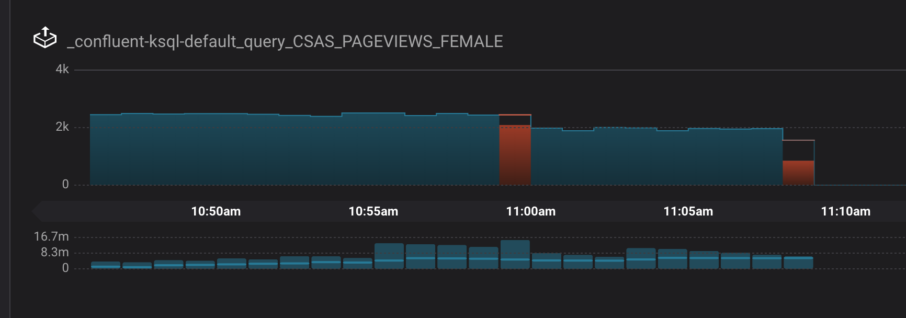

.. _quickstart-demos-ccloud:

On-Prem Kafka to Cloud
======================

This |ccloud| demo showcases a hybrid Kafka cluster: one cluster is a self-managed Kafka cluster running locally, the other is a |ccloud| cluster.
The use case is "Bridge to Cloud" as customers migrate from on premises to cloud.

.. figure:: images/schema-registry-local.jpg
    :alt: image

========
Overview
========

The major components of the demo are:

* Two Kafka clusters: one cluster is a self-managed cluster running locally, the other is a |ccloud| cluster.
* |c3|: manages and monitors the deployment. Use it for topic inspection, viewing the schema, viewing and creating KSQL queries, streams monitoring, and more.
* KSQL: stream processing on topics `users` and `pageviews` in |ccloud|.  The KSQL queries resemble those in the :ref:`KSQL Tutorial <ksql-create-a-stream-and-table>`, but instead of KSQL streams backed to a local cluster, they are backed to your |ccloud| cluster. The KSQL server itself is running locally.
* Two Kafka Connect clusters: one cluster connects to the local self-managed cluster and one connects to the |ccloud| cluster. Both Connect worker processes themselves are running locally.

  * One instance of `kafka-connect-datagen`: a source connector that produces mock data to prepopulate the topic `pageviews` locally
  * One instance of `kafka-connect-datagen`: a source connector that produces mock data to prepopulate the topic `users` in the |ccloud| cluster
  * Confluent Replicator: copies the topic `pageviews` from the local cluster to the |ccloud| cluster

* |sr-long|: by default, the demo runs with a locally-running |sr| and the Kafka data is written in Avro format.

.. note:: This is a demo environment and has many services running on one host. Do not use this demo in production, and
          do not use Confluent CLI in production. This is meant exclusively to easily demo the |cp| and |ccloud| with KSQL.

========
Run demo
========

Prerequisites
-------------

1. The following are prerequisites for the demo:

-  An initialized `Confluent Cloud cluster <https://confluent.cloud/>`__ used for development only
-  :ref:`Confluent Cloud CLI <ccloud-install-cli>` installed on your machine, version `v0.185.0` or higher
-  :ref:`Confluent CLI <cli-install>` installed on your machine, version `v0.157.0` or higher (note: as of CP 5.3, the Confluent CLI is a separate download)
-  `Download <https://www.confluent.io/download/>`__ |cp| if using the local install (not required for Docker)
-  jq

2. Create a |ccloud| configuration file with information on connecting to your Confluent Cloud cluster (see :ref:`auto-generate-configs` for more information).
By default, the demo looks for this configuration file at ``~/.ccloud/config``. You can change this file location in the demo's ``config.sh``.

3. This demo has been validated with:

-  Docker version 17.06.1-ce
-  Docker Compose version 1.14.0 with Docker Compose file format 2.1
-  Java version 1.8.0_162
-  MacOS 10.12

Steps
-----

1. Confirm the prerequisites above are satisfied, especially the |ccloud| configuration file at ``~/.ccloud/config``. 

2. Clone the `examples GitHub repository <https://github.com/confluentinc/examples>`__.

   .. sourcecode:: bash

     $ git clone https://github.com/confluentinc/examples

3. Change directory to the |ccloud| demo.

   .. sourcecode:: bash

     $ cd examples/ccloud

4. By default, the demo runs with a locally running |sr| and locally running KSQL server. However, both of these services are available in |ccloud|, and if you prefer to use either of those |ccloud| services instead:

   .. figure:: images/services-in-cloud.jpg
       :alt: image

   For Confluent Cloud |sr| (in `preview`):

   a. :ref:`Enable <cloud-sr-config>` Confluent Cloud |sr| prior to running the demo
   b.  Modify `config.sh` and set `export USE_CONFLUENT_CLOUD_SCHEMA_REGISTRY=true`

   For Confluent Cloud KSQL (in `preview`):

   a. :ref:`Enable <cloud-ksql-create-application>` |ccloud| KSQL prior to running the demo
   b. Modify `config.sh` and set `export USE_CONFLUENT_CLOUD_KSQL=true`

5. Start the entire demo by running a single command.  You have two choices: using a |cp| local install or Docker Compose. This will take less than 5 minutes to complete.

   .. sourcecode:: bash

      # For Confluent Platform local install using Confluent CLI
      $ ./start.sh

      # For Docker Compose
      $ ./start-docker.sh

6. Use Google Chrome to view the |c3| GUI at http://localhost:9021 . Click on the top-right button that shows the current date, and change ``Last 4 hours`` to ``Last 30 minutes``.

========
Playbook
========

|ccloud|
-------------------

1. You must have access to an initialized, working |ccloud| cluster. To sign up for the service, go to `Confluent Cloud page <https://www.confluent.io/confluent-cloud/>`__. Validate you have a configuration file for your |ccloud| cluster. By default, the demo looks for the configuration file at `~/.ccloud/config` (you can change this file location in `config.sh`).

   .. sourcecode:: bash

     $ cat ~/.ccloud/config
     bootstrap.servers=<BROKER ENDPOINT>
     ssl.endpoint.identification.algorithm=https
     security.protocol=SASL_SSL
     sasl.mechanism=PLAIN
     sasl.jaas.config=org.apache.kafka.common.security.plain.PlainLoginModule required username\="<API KEY>" password\="<API SECRET>";
     # If you are using Confluent Cloud Schema Registry
     basic.auth.credentials.source=USER_INFO
     schema.registry.basic.auth.user.info=<SR API KEY>:<SR API SECRET>
     schema.registry.url=https://<SR ENDPOINT>

2. Validate you can list topics in your cluster.

   .. sourcecode:: bash

     $ kafka-topics --bootstrap-server `grep "^\s*bootstrap.server" ~/.ccloud/config | tail -1` --command-config ~/.ccloud/config --list

3. Get familiar with the |ccloud| CLI.  For example, create a new topic called ``test``, produce some messages to that topic, and then consume from that topic.

   .. sourcecode:: bash

     $ kafka-topics --bootstrap-server `grep "^\s*bootstrap.server" ~/.ccloud/config | tail -1` --command-config ~/.ccloud/config --topic test --create --replication-factor 3 --partitions 6
     Topic "test" created.
     $ confluent local produce test -- --cloud --config ~/.ccloud/config 
     a
     b
     c
     ^C
     $ confluent local consume test -- --cloud --config ~/.ccloud/config --from-beginning
     a
     b
     c
     ^CProcessed a total of 3 messages.

|c3|
----

#. **Monitoring –> Data Streams –> Message Delivery**: hover over
   any chart to see number of messages and average latency within a
   minute time interval.

   .. figure:: images/message_delivery_ccloud.png
      :alt: image

#. **Management –> Kafka Connect**: |c3| uses the Kafka Connect API to manage :ref:`Kafka
   connectors <controlcenter_userguide_connect>`, and more
   specifically for this demo, :ref:`Confluent Replicator <multi_dc>`.

   -  Kafka Connect **Sources** tab shows the connector
      ``replicator``. Click ``Edit`` to see the details of the connector configuration.

      .. figure:: images/connect_source_ccloud.png
         :alt: image

#. **Management –> Topics –> Topic Information**: For a given topic,
   click on the three dots ``...`` next to the topic name to see more
   options per topic including in sync replicas, schema, topic
   messages, and configuration settings. Shown below is replica info.

   .. figure:: images/topic_info_ccloud.png
      :alt: image
  
.. note:: There will not be any details on the |c3| System Health pages about brokers or topics because |ccloud| does not provide the Confluent Metrics Reporter instrumentation outside of the |ccloud|. Therefore, you should expect to see the following graphic on the System Health page.

   .. figure:: images/rocketship.png
      :alt: image

  

KSQL
----

1. If you are running Confluent Cloud KSQL, you will need to use the Cloud UI to copy/paste the KSQL queries from the `ksql.commands` file.  Otherwise, for locally running KSQL server, the KSQL are automatically created.

2. If you are running KSQL server locally, it is listening on port 8089 for KSQL CLI connections. You have two options for interfacing with KSQL.

   (a) Run KSQL CLI to get to the KSQL CLI prompt.

       .. sourcecode:: bash

          $ ksql http://localhost:8089

   (b) Run the preview KSQL web interface. Navigate your browser to ``http://localhost:8089/index.html``

3. At the KSQL prompt, view the configured KSQL properties that were set with the KSQL server configuration file shown earlier.

   .. sourcecode:: bash

      ksql> SHOW PROPERTIES;

4. View the existing KSQL streams and describe one of those streams called ``PAGEVIEWS_FEMALE_LIKE_89``.

   .. sourcecode:: bash

      ksql> SHOW STREAMS;
      
       Stream Name              | Kafka Topic              | Format 
      --------------------------------------------------------------
       PAGEVIEWS_ORIGINAL       | pageviews                | AVRO   
       PAGEVIEWS_FEMALE         | PAGEVIEWS_FEMALE         | AVRO   
       PAGEVIEWS_FEMALE_LIKE_89 | pageviews_enriched_r8_r9 | AVRO   
      --------------------------------------------------------------

      ksql> DESCRIBE PAGEVIEWS_FEMALE_LIKE_89;
      
       Field    | Type                      
      --------------------------------------
       ROWTIME  | BIGINT           (system) 
       ROWKEY   | VARCHAR(STRING)  (system) 
       USERID   | VARCHAR(STRING)  (key)    
       PAGEID   | VARCHAR(STRING)           
       REGIONID | VARCHAR(STRING)           
       GENDER   | VARCHAR(STRING)           
      --------------------------------------
      For runtime statistics and query details run: DESCRIBE EXTENDED <Stream,Table>;

5. View the existing KSQL tables and describe one of those tables called ``PAGEVIEWS_REGIONS``.

   .. sourcecode:: bash

      ksql> SHOW TABLES;
      
       Table Name        | Kafka Topic       | Format | Windowed 
      -----------------------------------------------------------
       PAGEVIEWS_REGIONS | PAGEVIEWS_REGIONS | AVRO   | true     
       USERS_ORIGINAL    | users             | AVRO   | false    
      -----------------------------------------------------------

      ksql> DESCRIBE PAGEVIEWS_REGIONS;
      
       Field    | Type                      
      --------------------------------------
       ROWTIME  | BIGINT           (system) 
       ROWKEY   | VARCHAR(STRING)  (system) 
       GENDER   | VARCHAR(STRING)  (key)    
       REGIONID | VARCHAR(STRING)  (key)    
       NUMUSERS | BIGINT                    
      --------------------------------------
      For runtime statistics and query details run: DESCRIBE EXTENDED <Stream,Table>;

6. View the existing KSQL queries, which are continuously running, and explain one of those queries called ``CSAS_PAGEVIEWS_FEMALE_LIKE_89``.

   .. sourcecode:: bash

      ksql> SHOW QUERIES;

       Query ID                      | Kafka Topic              | Query String
      ----------------------------------------------------------------------------------------------------------
       CTAS_PAGEVIEWS_REGIONS        | PAGEVIEWS_REGIONS        | CREATE TABLE pageviews_regions WITH (value_format='avro') AS SELECT gender, regionid , COUNT(*) AS numusers FROM pageviews_female WINDOW TUMBLING (size 30 second) GROUP BY gender, regionid HAVING COUNT(*) > 1;                 
       CSAS_PAGEVIEWS_FEMALE         | PAGEVIEWS_FEMALE         | CREATE STREAM pageviews_female AS SELECT users_original.userid AS userid, pageid, regionid, gender FROM pageviews_original LEFT JOIN users_original ON pageviews_original.userid = users_original.userid WHERE gender = 'FEMALE'; 
       CSAS_PAGEVIEWS_FEMALE_LIKE_89 | pageviews_enriched_r8_r9 | CREATE STREAM pageviews_female_like_89 WITH (kafka_topic='pageviews_enriched_r8_r9', value_format='AVRO') AS SELECT * FROM pageviews_female WHERE regionid LIKE '%_8' OR regionid LIKE '%_9';                                     
      ----------------------------------------------------------------------------------------------------------

      ksql> EXPLAIN CSAS_PAGEVIEWS_FEMALE_LIKE_89;
      
      Type                 : QUERY
      SQL                  : CREATE STREAM pageviews_female_like_89 WITH (kafka_topic='pageviews_enriched_r8_r9', value_format='AVRO') AS SELECT * FROM pageviews_female WHERE regionid LIKE '%_8' OR regionid LIKE '%_9';
      
      
      Local runtime statistics
      ------------------------
      messages-per-sec:         0   total-messages:        43     last-message: 4/23/18 10:28:29 AM EDT
       failed-messages:         0 failed-messages-per-sec:         0      last-failed:       n/a
      (Statistics of the local KSQL server interaction with the Kafka topic pageviews_enriched_r8_r9)
      

7. At the KSQL prompt, view three messages from different KSQL streams and tables.

   .. sourcecode:: bash

      ksql> SELECT * FROM PAGEVIEWS_FEMALE_LIKE_89 LIMIT 3;
      ksql> SELECT * FROM USERS_ORIGINAL LIMIT 3;

8. In this demo, KSQL is run with Confluent Monitoring Interceptors configured which enables |c3| Data Streams to monitor KSQL queries. The consumer group names ``_confluent-ksql-default_query_`` correlate to the KSQL query names shown above, and |c3| is showing the records that are incoming to each query.

For example, view throughput and latency of the incoming records for the persistent KSQL "Create Stream As Select" query ``CSAS_PAGEVIEWS_FEMALE``, which is displayed as ``_confluent-ksql-default_query_CSAS_PAGEVIEWS_FEMALE`` in |c3|.

Confluent Replicator
--------------------

Confluent Replicator copies data from a source Kafka cluster to a
destination Kafka cluster. In this demo, the source cluster is a local install that represents
a self-managed cluster, and the destination cluster is |ccloud|.

1. View the Confluent Replicator configuration.

   .. sourcecode:: bash

      # For Confluent Platform local install using Confluent CLI
      $ cat connectors/submit_replicator_config.sh

      # For Docker Compose
      $ cat connectors/submit_replicator_docker_config.sh
      
2. View topic ``pageviews`` in the local cluster

   .. sourcecode:: bash

     $ kafka-topics --zookeeper localhost:2181  --describe --topic pageviews
     Topic:pageviews	PartitionCount:12	ReplicationFactor:1	Configs:
	     Topic: pageviews	Partition: 0	Leader: 0	Replicas: 0	Isr: 0
	     Topic: pageviews	Partition: 1	Leader: 0	Replicas: 0	Isr: 0
	     Topic: pageviews	Partition: 2	Leader: 0	Replicas: 0	Isr: 0
	     Topic: pageviews	Partition: 3	Leader: 0	Replicas: 0	Isr: 0
	     Topic: pageviews	Partition: 4	Leader: 0	Replicas: 0	Isr: 0
	     Topic: pageviews	Partition: 5	Leader: 0	Replicas: 0	Isr: 0
	     Topic: pageviews	Partition: 6	Leader: 0	Replicas: 0	Isr: 0
	     Topic: pageviews	Partition: 7	Leader: 0	Replicas: 0	Isr: 0
	     Topic: pageviews	Partition: 8	Leader: 0	Replicas: 0	Isr: 0
	     Topic: pageviews	Partition: 9	Leader: 0	Replicas: 0	Isr: 0
	     Topic: pageviews	Partition: 10	Leader: 0	Replicas: 0	Isr: 0
	     Topic: pageviews	Partition: 11	Leader: 0	Replicas: 0	Isr: 0

3. View the replicated topics ``pageviews`` in the |ccloud| cluster. In |c3|, for a given topic listed
   in **Management –> Topics**, click on the three dots ``...`` next to the topic name to see more
   options per topic including in sync replicas, schema, topic
   messages, and configuration settings. Shown below is replica info.

   .. figure:: images/topic_info_ccloud_pageviews.png 
      :alt: image

4. You can manage Confluent Replicator in the **Management –> Kafka Connect** page. The **Sources** tab shows the connector ``replicator``. Click ``Edit`` to see the details of the connector configuration.

   .. figure:: images/connect_source_ccloud.png
    :alt: image

Confluent Schema Registry
-------------------------

The connectors used in this demo are configured to automatically write Avro-formatted data, leveraging the :ref:`Confluent Schema Registry <schemaregistry_intro>`.
Depending on how you set `USE_CONFLUENT_CLOUD_SCHEMA_REGISTRY` in the start script, you may be running |sr-long| locally or |ccloud| |sr|.
Either way, you will get a consistent experience with |sr|.

1. View all the |sr| subjects.

   .. sourcecode:: bash

        # Locally running Schema Registry
        $ curl http://localhost:8085/subjects/ | jq .

        # Confluent Cloud Schema Registry
        $ curl -u <SR API KEY>:<SR API SECRET> https://<SR ENDPOINT>/subjects

2. From |c3|, under **MANAGEMENT –> Topics -> Schema**: view the schema for `pageviews` and `users`.  The topic value is using a Schema registered with |sr| (the topic key is just a String).

   .. figure:: images/topic_schema.png
      :alt: image

3. From |c3|, view the KSQL streams which are configured for Avro format.

   .. figure:: images/ksql_dataformat.png
      :alt: image

4. To migrate schemas from on-prem |sr| to |ccloud| |sr|, follow this :ref:`step-by-step guide <schemaregistry_migrate>`. Refer to the file :devx-examples:`submit_replicator_schema_migration_config.sh|ccloud/connectors/submit_replicator_schema_migration_config.sh#L13-L33>` for an example of a working Replicator configuration for schema migration.

===============================
Confluent Cloud Configurations
===============================

1. View the the template delta configuration for Confluent Platform components and clients to connect to Confluent Cloud:

   .. sourcecode:: bash

        $ ls template_delta_configs/

2. View your Confluent Cloud configuration file

   .. sourcecode:: bash

        $ cat $HOME/.ccloud/config

3. Generate the per-component delta configuration parameters, automatically derived from your Confluent Cloud configuration file:

   .. sourcecode:: bash

        $ ./ccloud-generate-cp-configs.sh

4. If you ran this demo as `start.sh` which uses Confluent CLI, it saves all configuration files and log files in the respective component subfolders in the current Confluent CLI temp directory (requires demo to be actively running):

   .. sourcecode:: bash

        # For Confluent Platform local install using Confluent CLI
        $ ls `confluent local current | tail -1`

5. If you ran this demo as `start-docker.sh`, the configuration is available in the `docker-compose.yml` file.

   ::

        # For Docker Compose
        $ cat docker-compose.yml

========================
Troubleshooting the demo
========================

1. If you can't run the demo due to error messages such as "'ccloud' is not found" or "'ccloud' is not initialized", validate that you have access to an initialized, working |ccloud| cluster and you have locally installed |ccloud| CLI.

2. To view log files, look in the current Confluent CLI temp directory (requires demo to be actively running):

   .. sourcecode:: bash

        # View all files
        $ ls `confluent local current | tail -1`

        # View log file per service, e.g. for the Kafka broker
        $ confluent local log kafka

3. If you ran with Docker, then run `docker-compose logs | grep ERROR`.

========
Teardown
========

1. Stop the demo, destroy all local components.

   .. sourcecode:: bash

      # For Confluent Platform local install using Confluent CLI
      $ ./stop.sh

      # For Docker Compose
      $ ./stop-docker.sh

2. Delete all |cp| topics in CCloud that this demo used, including topics used for |c3|, Kafka Connect, KSQL, and Confluent Schema Registry. Warning: this may have unintended consequence of deleting topics that you wanted to keep.

   .. sourcecode:: bash

        $ ./ccloud-delete-all-topics.sh

