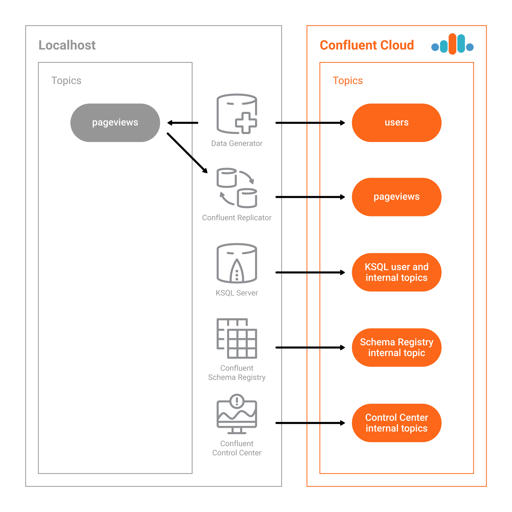

.. _quickstart-demos-ccloud:

Hybrid Kafka Clusters from Self-Hosted to Confluent Cloud
============================================================

This Confluent Cloud demo showcases Hybrid Kafka Clusters from Self-Hosted to |ccloud|. This automated demo is an expansion of the `KSQL Tutorial <https://docs.confluent.io/current/ksql/docs/tutorials/basics-local.html#create-a-stream-and-table>`__. Instead of the Kafka cluster backing the KSQL stream processing running on your local machine, it runs on your |ccloud| cluster. There are also additional |cp| components including |c3| and Confluent Replicator.

========
Overview
========

This |ccloud| demo showcases Hybrid Kafka Clusters from Self-Hosted to |ccloud|. This automated demo is an expansion of the `KSQL Tutorial <https://docs.confluent.io/current/ksql/docs/tutorials/basics-local.html#create-a-stream-and-table>`__ , but instead of KSQL stream processing running on your local install, it runs on your |ccloud| cluster.

You can monitor the KSQL streams in |c3|. This demo also showcases the Confluent Replicator executable for self-hosted Confluent to |ccloud|. Confluent Replicator can be used to transfer data from another cluster into |ccloud|, or it can be used for Disaster Recovery scenarios. In this case demo, Replicator is used to bootstrap the topic `pageviews` into Confluent Cloud which is used for KSQL stream processing.

.. note:: This is a demo environment and has many services running on one host. Do not use this demo in production, and do not use `confluent cli` in production. This is meant exclusively to easily demo the |cp| and |ccloud| with KSQL.

========
Run demo
========

**Demo validated with:**

-  Confluent Platform 5.1
-  |ccloud|
-  |ccloud| CLI
-  Java version 1.8.0_162
-  MacOS 10.12

1. Clone the `examples GitHub repository <https://github.com/confluentinc/examples>`__.

   .. sourcecode:: bash

     $ git clone https://github.com/confluentinc/examples

2. Change directory to the |ccloud| demo.

   .. sourcecode:: bash

     $ cd examples/ccloud

3. Start the entire demo by running a single command that brings up the local self-hosted Confluent Platform using `confluent cli, Confluent Replicator, and the KSQL streaming application. This will take less than 5 minutes to complete.

   .. sourcecode:: bash

      $ ./start.sh

4. Use Google Chrome to view the |c3| GUI at http://localhost:9021 . Click on the top-right button that shows the current date, and change ``Last 4 hours`` to ``Last 30 minutes``.

========
Playbook
========

|ccloud|
-------------------

1. You must have access to an initialized, working |ccloud| cluster. To sign up for the service, go to `Confluent Cloud page <https://www.confluent.io/confluent-cloud/>`__. Validate you have a configuration file for your |ccloud| cluster.

   .. sourcecode:: bash

     $ cat ~/.ccloud/config

2. You must have locally installed |ccloud| CLI. To install the CLI, follow `these steps <https://docs.confluent.io/current/cloud-quickstart.html#step-2-install-ccloud-cli>`__. Validate you can list topics in your cluster.

   .. sourcecode:: bash

     $ ccloud topic list

3. Get familar with the |ccloud| CLI.  For example, create a new topic called `test`, produce some messages to that topic, and then consume from that topic.

   .. sourcecode:: bash

     $ ccloud topic create test
     Topic "test" created.
     $ ccloud produce -t test  
     a
     b
     c
     ^C
     $ ccloud consume -b -t test
     a
     b
     c
     ^CProcessed a total of 3 messages.

|c3|
----

1. View the Confluent Control Center configuration file.

   .. sourcecode:: bash

        # Control Center servers point to Confluent Cloud
        $ cat `confluent current | tail -1`/control-center/control-center-ccloud.properties

1. **Monitoring –> Data Streams –> Message Delivery**: hover over
   any chart to see number of messages and average latency within a
   minute time interval.

   .. figure:: images/message_delivery_ccloud.png
      :alt: image

2. **Management –> Kafka Connect**: |c3| uses the Kafka Connect API to manage `Kafka
   connectors <https://docs.confluent.io/current/control-center/docs/connect.html>`__, and more
   specifically for this demo, `Confluent Replicator <https://docs.confluent.io/current/multi-dc/index.html>`__.

   -  Kafka Connect **Sources** tab shows the connector
      ``replicator``. Click ``Edit`` to see the details of the connector configuration.

      .. figure:: images/connect_source_ccloud.png
         :alt: image

3. **Management –> Topics –> Topic Information**: For a given topic,
   click on the three dots ``...`` next to the topic name to see more
   options per topic including in sync replicas, schema, topic
   messages, and configuration settings. Shown below is replica info.

   .. figure:: images/topic_info_ccloud.png
      :alt: image
  
.. note:: There will not be any details on the |c3| System Health pages about brokers or topics because |ccloud| does not provide the Confluent Metrics Reporter instrumentation outside of the |ccloud|. Therefore, you should expect to see the following graphic on the System Health page.

   .. figure:: images/rocketship.png
      :alt: image

  

KSQL
----

1. View the KSQL server configuration file.

   .. sourcecode:: bash

        # KSQL bootstrap servers point to Confluent Cloud
        $ cat `confluent current | tail -1`/ksql-server/ksql-server-ccloud.properties

2. The KSQL server that is connected to |ccloud| is listening on port 8089 for KSQL CLI connections. You have two options for interfacing with KSQL.

   (a) Run KSQL CLI to get to the KSQL CLI prompt.

       .. sourcecode:: bash

          $ ksql http://localhost:8089

   (b) Run the preview KSQL web interface. Navigate your browser to ``http://localhost:8089/index.html``

3. At the KSQL prompt, view the configured KSQL properties that were set with the KSQL server configuration file shown earlier.

   .. sourcecode:: bash

      ksql> SHOW PROPERTIES;

4. View the existing KSQL streams and describe one of those streams called ``PAGEVIEWS_FEMALE_LIKE_89``.

   .. sourcecode:: bash

      ksql> SHOW STREAMS;
      
       Stream Name              | Kafka Topic              | Format 
      --------------------------------------------------------------
       PAGEVIEWS_ORIGINAL       | pageviews                | AVRO   
       PAGEVIEWS_FEMALE         | PAGEVIEWS_FEMALE         | AVRO   
       PAGEVIEWS_FEMALE_LIKE_89 | pageviews_enriched_r8_r9 | AVRO   
      --------------------------------------------------------------

      ksql> DESCRIBE PAGEVIEWS_FEMALE_LIKE_89;
      
       Field    | Type                      
      --------------------------------------
       ROWTIME  | BIGINT           (system) 
       ROWKEY   | VARCHAR(STRING)  (system) 
       USERID   | VARCHAR(STRING)  (key)    
       PAGEID   | VARCHAR(STRING)           
       REGIONID | VARCHAR(STRING)           
       GENDER   | VARCHAR(STRING)           
      --------------------------------------
      For runtime statistics and query details run: DESCRIBE EXTENDED <Stream,Table>;

5. View the existing KSQL tables and describe one of those tables called ``PAGEVIEWS_REGIONS``.

   .. sourcecode:: bash

      ksql> SHOW TABLES;
      
       Table Name        | Kafka Topic       | Format | Windowed 
      -----------------------------------------------------------
       PAGEVIEWS_REGIONS | PAGEVIEWS_REGIONS | AVRO   | true     
       USERS_ORIGINAL    | users             | AVRO   | false    
      -----------------------------------------------------------

      ksql> DESCRIBE PAGEVIEWS_REGIONS;
      
       Field    | Type                      
      --------------------------------------
       ROWTIME  | BIGINT           (system) 
       ROWKEY   | VARCHAR(STRING)  (system) 
       GENDER   | VARCHAR(STRING)  (key)    
       REGIONID | VARCHAR(STRING)  (key)    
       NUMUSERS | BIGINT                    
      --------------------------------------
      For runtime statistics and query details run: DESCRIBE EXTENDED <Stream,Table>;

6. View the existing KSQL queries, which are continuously running, and explain one of those queries called ``CSAS_PAGEVIEWS_FEMALE_LIKE_89``.

   .. sourcecode:: bash

      ksql> SHOW QUERIES;

       Query ID                      | Kafka Topic              | Query String
      ----------------------------------------------------------------------------------------------------------
       CTAS_PAGEVIEWS_REGIONS        | PAGEVIEWS_REGIONS        | CREATE TABLE pageviews_regions WITH (value_format='avro') AS SELECT gender, regionid , COUNT(*) AS numusers FROM pageviews_female WINDOW TUMBLING (size 30 second) GROUP BY gender, regionid HAVING COUNT(*) > 1;                 
       CSAS_PAGEVIEWS_FEMALE         | PAGEVIEWS_FEMALE         | CREATE STREAM pageviews_female AS SELECT users_original.userid AS userid, pageid, regionid, gender FROM pageviews_original LEFT JOIN users_original ON pageviews_original.userid = users_original.userid WHERE gender = 'FEMALE'; 
       CSAS_PAGEVIEWS_FEMALE_LIKE_89 | pageviews_enriched_r8_r9 | CREATE STREAM pageviews_female_like_89 WITH (kafka_topic='pageviews_enriched_r8_r9', value_format='AVRO') AS SELECT * FROM pageviews_female WHERE regionid LIKE '%_8' OR regionid LIKE '%_9';                                     
      ----------------------------------------------------------------------------------------------------------

      ksql> EXPLAIN CSAS_PAGEVIEWS_FEMALE_LIKE_89;
      
      Type                 : QUERY
      SQL                  : CREATE STREAM pageviews_female_like_89 WITH (kafka_topic='pageviews_enriched_r8_r9', value_format='AVRO') AS SELECT * FROM pageviews_female WHERE regionid LIKE '%_8' OR regionid LIKE '%_9';
      
      
      Local runtime statistics
      ------------------------
      messages-per-sec:         0   total-messages:        43     last-message: 4/23/18 10:28:29 AM EDT
       failed-messages:         0 failed-messages-per-sec:         0      last-failed:       n/a
      (Statistics of the local KSQL server interaction with the Kafka topic pageviews_enriched_r8_r9)
      

7. At the KSQL prompt, view three messages from different KSQL streams and tables.

   .. sourcecode:: bash

      ksql> SELECT * FROM PAGEVIEWS_FEMALE_LIKE_89 LIMIT 3;
      ksql> SELECT * FROM USERS_ORIGINAL LIMIT 3;

8. In this demo, KSQL is run with Confluent Monitoring Interceptors configured which enables |c3| Data Streams to monitor KSQL queries. The consumer group names ``_confluent-ksql-default_query_`` correlate to the KSQL query names shown above, and |c3| is showing the records that are incoming to each query.

For example, view throughput and latency of the incoming records for the persistent KSQL "Create Stream As Select" query ``CSAS_PAGEVIEWS_FEMALE``, which is displayed as ``_confluent-ksql-default_query_CSAS_PAGEVIEWS_FEMALE`` in |c3|.

   .. figure:: images/ksql_query_CSAS_PAGEVIEWS_FEMALE.png
      :alt: image

Replicator
------------

Confluent Replicator copies data from a source Kafka cluster to a
destination Kafka cluster. In this demo, the source cluster is a local install that represents
a self-hosted cluster, and the destination cluster is |ccloud|.

1. View the Confluent Replicator configuration files.  Note that in this demo, Replicator is run as a standalone binary.

   .. sourcecode:: bash

        # Replicator's consumer points to the local cluster
        $ cat `confluent current | tail -1`/connect/replicator-to-ccloud-consumer.properties
        bootstrap.servers=localhost:9092

        # Replicator's producer points to the |ccloud| cluster and configures Confluent Monitoring Interceptors for Control Center stream monitoring to work
        $ cat `confluent current | tail -1`/connect/replicator-to-ccloud-producer.properties
        ssl.endpoint.identification.algorithm=https
        confluent.monitoring.interceptor.ssl.endpoint.identification.algorithm=https
        sasl.mechanism=PLAIN
        confluent.monitoring.interceptor.sasl.mechanism=PLAIN
        security.protocol=SASL_SSL
        confluent.monitoring.interceptor.security.protocol=SASL_SSL
        retry.backoff.ms=500
        bootstrap.servers=<broker1>,<broker2>,<broker3>
        confluent.monitoring.interceptor.bootstrap.servers=<broker1>,<broker2>,<broker3>
        sasl.jaas.config=org.apache.kafka.common.security.plain.PlainLoginModule required username="<username>" password="<password>";
        confluent.monitoring.interceptor.sasl.jaas.config=org.apache.kafka.common.security.plain.PlainLoginModule required username="<username>" password="<password>";

        # General Replicator properties define the replication policy
        $ cat `confluent current | tail -1`/connect/replicator-to-ccloud.properties
        topic.whitelist=pageviews

2. View topics `pageviews` in the local cluster

   .. sourcecode:: bash

     $ kafka-topics --zookeeper localhost:2181  --describe --topic pageviews
     Topic:pageviews	PartitionCount:12	ReplicationFactor:1	Configs:
	     Topic: pageviews	Partition: 0	Leader: 0	Replicas: 0	Isr: 0
	     Topic: pageviews	Partition: 1	Leader: 0	Replicas: 0	Isr: 0
	     Topic: pageviews	Partition: 2	Leader: 0	Replicas: 0	Isr: 0
	     Topic: pageviews	Partition: 3	Leader: 0	Replicas: 0	Isr: 0
	     Topic: pageviews	Partition: 4	Leader: 0	Replicas: 0	Isr: 0
	     Topic: pageviews	Partition: 5	Leader: 0	Replicas: 0	Isr: 0
	     Topic: pageviews	Partition: 6	Leader: 0	Replicas: 0	Isr: 0
	     Topic: pageviews	Partition: 7	Leader: 0	Replicas: 0	Isr: 0
	     Topic: pageviews	Partition: 8	Leader: 0	Replicas: 0	Isr: 0
	     Topic: pageviews	Partition: 9	Leader: 0	Replicas: 0	Isr: 0
	     Topic: pageviews	Partition: 10	Leader: 0	Replicas: 0	Isr: 0
	     Topic: pageviews	Partition: 11	Leader: 0	Replicas: 0	Isr: 0

3. View the replicated topics `pageviews` in the |ccloud| cluster. In |c3|, for a given topic listed
   in **Management –> Topics**, click on the three dots ``...`` next to the topic name to see more
   options per topic including in sync replicas, schema, topic
   messages, and configuration settings. Shown below is replica info.

   .. figure:: images/topic_info_ccloud_pageviews.png 
      :alt: image

4. You can manage Confluent Replicator in the **Management –> Kafka Connect** page. The **Sources** tab shows the connector ``replicator``. Click ``Edit`` to see the details of the connector configuration.

      .. figure:: images/connect_source_ccloud.png
         :alt: image

===============================
Confluent Cloud Configurations
===============================

This demo uses Confluent CLI (for development and demos only!) and saves all modified configuration files and log files in the respective component subfolders in the current Confluent CLI temp directory.

1. View your Confluent Cloud configuration file

   .. sourcecode:: bash

        $ cat $HOME/.ccloud/config

2. Generate the per-component delta configuration parameters, automatically derived from your Confluent Cloud cluster configuration:

   .. sourcecode:: bash

        $ ./ccloud-generate-cp-configs.sh

3. View the full configuration file for the KSQL server that connects to your Confluent Cloud cluster (requires demo to be actively running):

   .. sourcecode:: bash

        $ cat `confluent current | tail -1`/ksql-server/ksql-server-ccloud.properties

4. View the full configuration file for Confluent Replicator that copies data from your local cluster to your Confluent Cloud cluster (requires demo to be actively running):

   .. sourcecode:: bash

        $ cat `confluent current | tail -1`/connect/replicator-to-ccloud-consumer.properties
        $ cat `confluent current | tail -1`/connect/replicator-to-ccloud-producer.properties
        $ cat `confluent current | tail -1`/connect/replicator-to-ccloud.properties

5. View the full configuration file for Confluent control Center that connects to your Confluent Cloud cluster (requires demo to be actively running):

   .. sourcecode:: bash

        $ cat `confluent current | tail -1`/control-center/control-center-ccloud.properties

6. View the full configuration file for Confluent Schema Registry that connects to your Confluent Cloud cluster (requires demo to be actively running):

   .. sourcecode:: bash

        $ cat `confluent current | tail -1`/schema-registry/schema-registry-ccloud.properties

========================
Troubleshooting the demo
========================

1. If you can't run the demo due to error messages such as "'ccloud' is not found" or "'ccloud' is not initialized", validate that you have access to an initialized, working |ccloud| cluster and you have locally installed |ccloud| CLI.

2. To view log files, look in the current Confluent CLI temp director (requires demo to be actively running):

   .. sourcecode:: bash

        $ ls `confluent current | tail -1`

========
Teardown
========

1. Stop the demo, destroy all local components created by `Confluent CLI`, delete topics backing KSQL queries.

   .. sourcecode:: bash

        $ ./stop.sh

2. Delete all |cp| internal topics in CCloud, including topics used for |c3|, Kafka Connect, KSQL, and Confluent Schema Registry.

   .. sourcecode:: bash

        $ ./ccloud-delete-all-topics.sh

