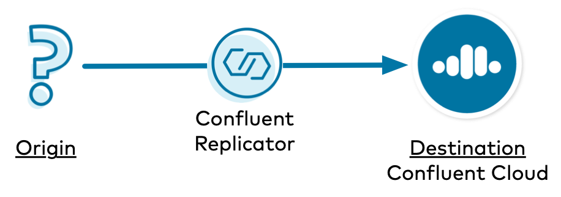
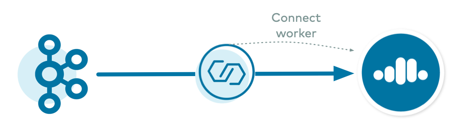
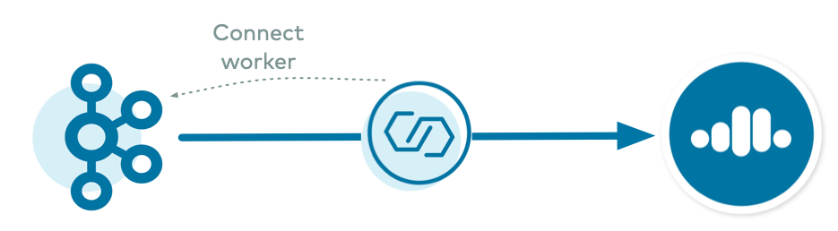
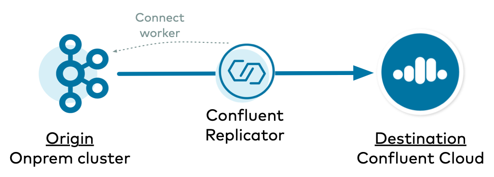
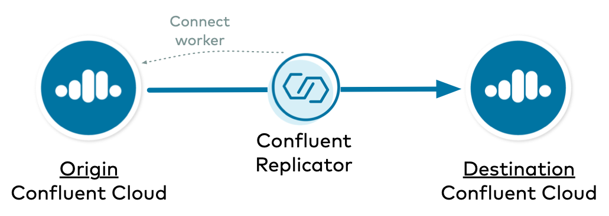

.. _replicator-to-cloud-configurations:

|crep-full| to |ccloud| Configurations
======================================

========
Overview
========

Whether you are migrating from on-premises to cloud or have a persistent "bridge to cloud" strategy, you can use |crep-full| to copy |ak| data to |ccloud|.
Learn the different ways to configure |crep| and |kconnect-long|.

===================
Cost to Run Example
===================

Caution
-------

.. include:: includes/ccloud-examples-caution.rst

|ccloud| Promo Code
-------------------

.. include:: includes/ccloud-examples-promo-code.rst

===============
Concepts Review
===============

Before diving into the different ways to configure |crep|, first review some basic concepts regarding |crep| and |kconnect-long|.
This will help you understand the logic for configuring |crep| because the way that the |kconnect-long| cluster is configured dictates how |crep| should be configured.

|crep| is a |ak| connector and runs on |kconnect| workers.
Even the :ref:`Replicator executable <replicator_executable>` has a bundled |kconnect| worker inside.

|crep| has an embedded consumer that reads data from the origin cluster, and the |kconnect| worker has an embedded producer that copies that data to the destination cluster, which in this case is |ccloud|.
To configure the proper connection information for |crep| to interact with the origin cluster, use the prefix ``src.``.
|crep| also has an admin client that it needs for interacting with the destination cluster, and this client can be configured with the prefix ``dest.``.

A |kconnect| worker also has an admin client for creating |ak| topics for its own management, ``offset.storage.topic``, ``config.storage.topic``, and ``status.storage.topic``, and these are in the |ak| cluster that backs the |kconnect| worker.
The |kconnect-long| embedded producer can be configured directly on the |kconnect| worker or overridden by any connector, including |crep|.

===================
Configuration Types
===================

The first type is where |crep| runs on a self-managed |kconnect| cluster that is backed to the destination |ccloud| cluster.
This allows |crep|, which is a source connector, to leverage the default behavior of the |kconnect| worker's admin client and embedded producer.

For this case where |crep| runs on a :ref:`connect-backed-destination`, there are two configuration examples:

- Example 1.1: :ref:`onprem-cloud-destination`
- Example 1.2: :ref:`cloud-cloud-destination`

There are scenarios in which your self-managed |kconnect| cluster may not be able to be backed to the destination |ccloud| cluster.
For example, some highly secure clusters may block incoming network connections and only allow push connections, in which case an incoming connection from |crep| running on the destination cluster to the origin cluster would fail.
In this case, you can have a |kconnect| cluster backed to the origin cluster instead and push the replicated data to the destination cluster.
This second configuration type is more complex because there are overrides you will need to configure.

For this case where |crep| runs on a :ref:`connect-backed-origin`, there are two configuration examples:

- Example 2.1: :ref:`onprem-cloud-origin`
- Example 2.2: :ref:`cloud-cloud-origin`

.. _connect-backed-destination:

========================================
|kconnect| Cluster Backed to Destination
========================================

For this case where |crep| runs on a :ref:`connect-backed-destination`, there are two configuration examples:

- Example 1.1: :ref:`onprem-cloud-destination`
- Example 1.2: :ref:`cloud-cloud-destination`

.. _onprem-cloud-destination:

On-premises to |ccloud| with |kconnect| Backed to Destination
-------------------------------------------------------------

In this example, |crep| copies data from an on-premises |ak| cluster to |ccloud|, and |crep| runs on a |kconnect| cluster backed to the destination |ccloud| cluster.

.. seealso:: There are many other configuration parameters for the |kconnect| worker and |crep|, but these examples show you only the significant ones. For an example with complete configurations, refer to the :devx-examples:`Connect worker backed to destination|ccloud/docs/config/backed-to-destination/docker-compose.yml` Docker configuration and the :devx-examples:`Replicator reading from an on-premises cluster|ccloud/docs/config/backed-to-destination/replicator-origin-onprem-backed-to-destination.cfg` configuration file.

.. figure:: images/onprem-ccloud-destination.png

Configure |kconnect-long|
^^^^^^^^^^^^^^^^^^^^^^^^^

.. include:: includes/connect-worker-to-destination-ccloud.rst 

Configure |crep|
^^^^^^^^^^^^^^^^

.. include:: includes/replicator-from-origin-onprem.rst

.. include:: includes/replicator-connect-worker-to-destination.rst

Configure ACLs
^^^^^^^^^^^^^^

.. include:: includes/set-acls-destination.rst

.. _cloud-cloud-destination:

|ccloud| to |ccloud| with |kconnect| Backed to Destination
----------------------------------------------------------

In this example, |crep| copies data from one |ccloud| cluster to another |ccloud| cluster, and |crep| runs on a |kconnect| cluster backed to the destination |ccloud| cluster.

.. seealso:: There are many other configuration parameters for the Connect worker and |crep|, but we will show you only the significant ones. For an example with complete configurations, refer to the :devx-examples:`Connect worker backed to destination|ccloud/docs/config/backed-to-destination/docker-compose.yml` Docker configuration and the :devx-examples:`Replicator reading from Confluent Cloud|ccloud/docs/config/backed-to-destination/replicator-origin-ccloud-backed-to-destination.cfg` configuration file.

Configure |kconnect-long|
^^^^^^^^^^^^^^^^^^^^^^^^^

.. include:: includes/connect-worker-to-destination-ccloud.rst

Configure |crep|
^^^^^^^^^^^^^^^^

.. include:: includes/replicator-from-origin-ccloud.rst

.. include:: includes/replicator-connect-worker-to-destination.rst

Configure ACLs
^^^^^^^^^^^^^^

.. include:: includes/set-acls-origin-and-destination.rst

.. _connect-backed-origin:

===================================
|kconnect| Cluster Backed to Origin
===================================

For this case where |crep| runs on a :ref:`connect-backed-origin`, there are two configuration examples:

- Example 2.1: :ref:`onprem-cloud-origin`
- Example 2.2: :ref:`cloud-cloud-origin`

.. _onprem-cloud-origin:

On-premises to |ccloud| with |kconnect| Backed to Origin
--------------------------------------------------------

In this example, |crep| copies data from an on-premises |ak| cluster to |ccloud|, and |crep| runs on a |kconnect| cluster backed to the origin on-premises cluster.

.. seealso:: There are many other configuration parameters for the Connect worker and |crep|, but we will show you only the significant ones. For an example with complete configurations, refer to the :devx-examples:`Connect worker backed to origin|ccloud/docs/config/backed-to-origin/docker-compose.yml` Docker configuration and the :devx-examples:`Replicator reading from an on-premises cluster|ccloud/docs/config/backed-to-origin/replicator-origin-onprem-backed-to-origin.cfg` configuration file.

Configure |kconnect-long|
^^^^^^^^^^^^^^^^^^^^^^^^^

.. include:: includes/connect-worker-to-origin-onprem.rst

.. include:: includes/connect-worker-override-policy.rst

Configure |crep|
^^^^^^^^^^^^^^^^

.. include:: includes/replicator-from-origin-onprem.rst

.. include:: includes/replicator-connect-worker-to-origin.rst

.. include:: includes/replicator-overrides.rst

Configure ACLs
^^^^^^^^^^^^^^

.. include:: includes/set-acls-destination.rst

.. _cloud-cloud-origin:

|ccloud| to |ccloud| with Connect Backed to Origin
--------------------------------------------------

In this example, |crep| copies data from one |ccloud| cluster to another |ccloud| cluster, and |crep| runs on a Connect cluster backed to the origin on-prem cluster.

.. seealso:: There are many other configuration parameters for the Connect worker and |crep|, but we will show you only the significant ones. For an example with complete configurations, refer to the :devx-examples:`Connect worker backed to origin|ccloud/docs/config/backed-to-origin/docker-compose.yml` Docker configuration and the :devx-examples:`Replicator reading from Confluent Cloud|ccloud/docs/config/backed-to-origin/replicator-origin-ccloud-backed-to-origin.cfg` configuration file.

Configure |kconnect-long|
^^^^^^^^^^^^^^^^^^^^^^^^^

.. include:: includes/connect-worker-to-origin-ccloud.rst

.. include:: includes/connect-worker-override-policy.rst

Configure |crep|
^^^^^^^^^^^^^^^^

.. include:: includes/replicator-from-origin-ccloud.rst

.. include:: includes/replicator-connect-worker-to-origin.rst

.. include:: includes/replicator-overrides.rst

Configure ACLs
^^^^^^^^^^^^^^

.. include:: includes/set-acls-origin-and-destination.rst

.. include:: includes/ccloud-examples-terminate.rst

====================
Additional Resources
====================

- For additional considerations on running |crep| to |ccloud|, refer to `Migrate Topics on Confluent Cloud Clusters <https://docs.confluent.io/cloud/migrate-topics-on-cloud-clusters.html>`__.
- To run a |ccloud| demo that showcases a hybrid |ak| cluster: one cluster is a
  self-managed |ak| cluster running locally, the other is a |ccloud| cluster, see
  :ref:`cp-demo`.
- To find additional |ccloud| demos, see :ref:`Confluent Cloud Demos Overview<ccloud-demos-overview>`.
- For a practical guide to configuring, monitoring, and optimizing your |ak|
  client applications, see `Developing Client Applications on Confluent Cloud <https://docs.confluent.io/cloud/best-practices/index.html>`__.
- To run a |crep| tutorial with an active-active multi-datacenter design, with
  two instances of |crep-full| that copy data bidirectionally between the
  datacenters, see :ref:`replicator`.
