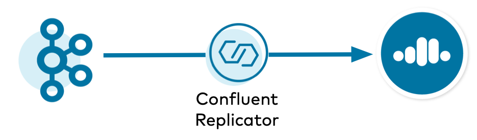

.. _replicator-to-cloud-configurations:

|crep-full| to |ccloud| Configurations
======================================

Whether you are migrating from on-prem to cloud or have a persistent "bridge to cloud" strategy, you can use |crep-full| to copy Kafka data to |ccloud|.
Learn the different ways to configure |crep| and |kconnect-long|.

=======================
Brief Concepts Overview
=======================

Before diving into the different ways to configure |crep|, let's first reprise some basic concepts regarding |crep| and |kconnect-long|.
This will help you understand the logic for configuring |crep| because how the |kconnect-long| cluster is configured will affect how |crep| should be configured.

|crep| is a Kafka connector and runs on Connect workers.
Even the :ref:`Replicator executable <replicator_executable>` has a bundled Connect worker inside.

|crep| has an embedded consumer that reads data from the origin cluster, and the Connect worker has an embedded producer that writes data to the destination cluster, which in this case is |ccloud|.
Connect's embedded producer configuration can be configured directly on the Connect worker or overridden by any connector, including |crep|.
Unlike other source connectors, |crep| has an admin client that it needs for interacting with the destination cluster, and it can be configured with the prefix ``dest.``.

A Connect cluster also has an admin client for creating Kafka topics for its own management, ``offset.storage.topic``, ``config.storage.topic``, and ``status.storage.topic``, and these are in the Kafka cluster that backs the Connect worker.

===================
Configuration Types
===================

The simplest configuration is where |crep| runs on a self-managed Connect cluster that is backed to the destination |ccloud| cluster.
This allows |crep| to leverage the default behavior of the Connect worker's admin client and embedded producer.

.. figure:: images/replicator-worker-destination.png

There are two configuration examples of where |crep| runs on a :ref:`connect-backed-destination`:

- :ref:`onprem-cloud-destination`
- :ref:`cloud-cloud-destination`

There are scenarios where you may not be able to have your self-managed Connect cluster backed to the destination |ccloud| cluster.
For example, highly secure origin clusters may block incoming network connections and only allow push connections, in which case an incoming connection from |crep| running on the destination cluster would not work.
In this case, you can have a Connect cluster backed to the origin cluster instead and push the replicated data to the destination cluster.
This configuration is more complex because there are overrides you will need to configure.

.. figure:: images/replicator-worker-origin.png

There are two configuration examples of where |crep| runs on a :ref:`connect-backed-origin`:

- :ref:`onprem-cloud-origin`
- :ref:`cloud-cloud-origin`

.. _connect-backed-destination:

=====================================
Connect Cluster Backed to Destination
=====================================

.. _onprem-cloud-destination:

On-prem to |ccloud| with Connect Backed to Destination
------------------------------------------------------

In this example, |crep| copies data from an on-prem Kafka cluster to |ccloud|, and |crep| runs on a Connect cluster backed to the destination |ccloud| cluster.

.. include:: includes/generic-subset.rst

.. figure:: images/onprem-ccloud-destination.png

Configure |kconnect-long|
^^^^^^^^^^^^^^^^^^^^^^^^^

.. include:: includes/connect-worker-to-destination-ccloud.rst 

Configure |crep|
^^^^^^^^^^^^^^^^

.. include:: includes/replicator-from-origin-onprem.rst

.. include:: includes/replicator-to-destination-ccloud.rst

Configure ACLs
^^^^^^^^^^^^^^

.. include:: includes/set-acls-destination.rst

.. seealso:: Try this out with the :devx-examples:`Connect worker backed to destination|ccloud/docs/config/backed-to-destination/docker-compose.yml` Docker configuration and the :devx-examples:`Replicator reading from an on-prem cluster|ccloud/docs/config/backed-to-destination/replicator-origin-onprem-backed-to-destination.cfg` configuration file.

.. _cloud-cloud-destination:

|ccloud| to |ccloud| with Connect Backed to Destination
-------------------------------------------------------

In this example, |crep| copies data from one |ccloud| cluster to another |ccloud| cluster, and |crep| runs on a Connect cluster backed to the destination |ccloud| cluster.

.. include:: includes/generic-subset.rst

.. figure:: images/ccloud-ccloud-destination.png

Configure |kconnect-long|
^^^^^^^^^^^^^^^^^^^^^^^^^

.. include:: includes/connect-worker-to-destination-ccloud.rst

Configure |crep|
^^^^^^^^^^^^^^^^

.. include:: includes/replicator-from-origin-ccloud.rst

.. include:: includes/replicator-to-destination-ccloud.rst

Configure ACLs
^^^^^^^^^^^^^^

.. include:: includes/set-acls-origin-and-destination.rst

.. seealso:: Try this out with the :devx-examples:`Connect worker backed to destination|ccloud/docs/config/backed-to-destination/docker-compose.yml` Docker configuration and the :devx-examples:`Replicator reading from Confluent Cloud|ccloud/docs/config/backed-to-destination/replicator-origin-ccloud-backed-to-destination.cfg` configuration file.

.. _connect-backed-origin:

================================
Connect Cluster Backed to Origin
================================

.. _onprem-cloud-origin:

On-prem to |ccloud| with Connect Backed to Origin
-------------------------------------------------

In this example, |crep| copies data from an on-prem Kafka cluster to |ccloud|, and |crep| runs on a Connect cluster backed to the origin on-prem cluster.

.. include:: includes/generic-subset.rst

.. figure:: images/onprem-ccloud-origin.png

Configure |kconnect-long|
^^^^^^^^^^^^^^^^^^^^^^^^^

.. include:: includes/connect-worker-to-origin-onprem.rst

.. include:: includes/connect-worker-override-policy.rst

Configure |crep|
^^^^^^^^^^^^^^^^

.. include:: includes/replicator-from-origin-onprem.rst

.. include:: includes/replicator-to-destination-ccloud.rst

.. include:: includes/replicator-overrides.rst

Configure ACLs
^^^^^^^^^^^^^^

.. include:: includes/set-acls-destination.rst

.. seealso:: Try this out with the :devx-examples:`Connect worker backed to origin|ccloud/docs/config/backed-to-origin/docker-compose.yml` Docker configuration and the :devx-examples:`Replicator reading from an on-prem cluster|ccloud/docs/config/backed-to-origin/replicator-origin-onprem-backed-to-origin.cfg` configuration file.

.. _cloud-cloud-origin:

|ccloud| to |ccloud| with Connect Backed to Origin
--------------------------------------------------

In this example, |crep| copies data from one |ccloud| cluster to another |ccloud| cluster, and |crep| runs on a Connect cluster backed to the origin on-prem cluster.

.. include:: includes/generic-subset.rst

.. figure:: images/ccloud-ccloud-origin.png

Configure |kconnect-long|
^^^^^^^^^^^^^^^^^^^^^^^^^

.. include:: includes/connect-worker-to-origin-ccloud.rst

.. include:: includes/connect-worker-override-policy.rst

Configure |crep|
^^^^^^^^^^^^^^^^

.. include:: includes/replicator-from-origin-ccloud.rst

.. include:: includes/replicator-to-destination-ccloud.rst

.. include:: includes/replicator-overrides.rst

Configure ACLs
^^^^^^^^^^^^^^

.. include:: includes/set-acls-origin-and-destination.rst

.. seealso:: Try this out with the :devx-examples:`Connect worker backed to origin|ccloud/docs/config/backed-to-origin/docker-compose.yml` Docker configuration and the :devx-examples:`Replicator reading from Confluent Cloud|ccloud/docs/config/backed-to-origin/replicator-origin-ccloud-backed-to-origin.cfg` configuration file.

==========================================================
Additional Resources
==========================================================

- For additional considerations on running |crep| to |ccloud|, refer to :ref:`cloud-migrate-topics`.
- To run a |ccloud| demo that showcases a hybrid Kafka cluster: one cluster is a self-managed Kafka cluster running locally, the other is a |ccloud| cluster, see :ref:`quickstart-demos-ccloud`..
- To find additional |ccloud| demos, see :ref:`Confluent Cloud Demos Overview<ccloud-demos-overview>`.
- For a practical guide to configuring, monitoring, and optimizing your |ak| client applications, see the `Best Practices for Developing Kafka Applications on Confluent Cloud <https://assets.confluent.io/m/14397e757459a58d/original/20200205-WP-Best_Practices_for_Developing_Apache_Kafka_Applications_on_Confluent_Cloud.pdf>`__ whitepaper.
- To run a |crep| tutorial with an active-active multi-datacenter design, with two instances of |crep-full| that copy data bidirectionally between the datacenters, see :ref:`replicator`.

