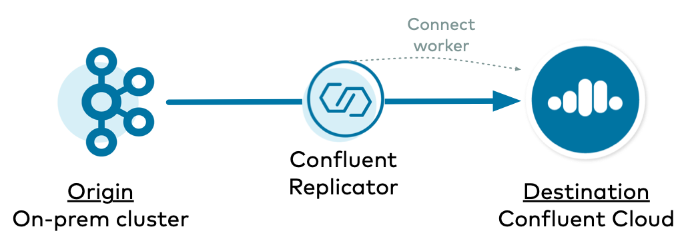

.. _replicator-to-cloud-configurations:

|crep-full| to |ccloud| Configurations
======================================

Whether you are migrating from on-prem to cloud or have a persistent multi-datacenter strategy, you can use |crep-full| to copy Kafka data to |ccloud|.

.. figure:: images/replicator-to-ccloud.png

=======================
Brief Concepts Overview
=======================

Before diving into the different ways to configure |crep|, let's first reprise some basic concepts regarding |crep| and |kconnect-long|.
This will help you understand the logic for configuring |crep|.

- As a Kafka connector, |crep| runs on Connect workers. Even the :ref:`Replicator executable <replicator_executable>` has a bundled Connect worker with it.
- |crep| has an embedded consumer that reads data from the origin cluster.
- |crep| is specifically a source connector, and as with all source connectors, it relies on the Connect worker's embedded producer to write data to the destination cluster, in this case |ccloud|.
- A Connect cluster uses the admin client to create three Kafka topics for its own management, ``offset.storage.topic``, ``config.storage.topic``, and ``status.storage.topic``, and these are in the Kafka cluster that backs the Connect worker.

===================
Configuration Types
===================

There are several ways to configure |crep| to copy Kafka data to |ccloud|.

The simplest configuration type is where |crep| runs on a self-managed Connect cluster that is backed to the destination |ccloud| cluster.
This allows |crep| to leverage the Connect worker's default behavior with regards to its admin client and embedded producer.

There are two examples of where |crep| runs on a :ref:`connect-backed-destination`:

- :ref:`On-prem to Confluent Cloud <onprem-cloud-destination>`
- :ref:`Confluent Cloud to Confluent Cloud <cloud-cloud-destination>`

However, if you do not want to back your self-managed Connect cluster backed to the destination |ccloud| cluster, you can also have a Connect cluster backed to the origin cluster instead of |ccloud|.
This also means that the Connect workers are using the origin cluster for its Connect management topics.
This configuration type is more complex because there are some additional overrides you will need to configure.

There are two examples of where |crep| runs on a :ref:`connect-backed-origin`:

- :ref:`On-prem to Confluent Cloud <onprem-cloud-origin>`
- :ref:`Confluent Cloud to Confluent Cloud <cloud-cloud-origin>`

.. _connect-backed-destination:

=====================================
Connect Cluster Backed to Destination
=====================================

.. figure:: images/replicator-worker-destination.png

.. _onprem-cloud-destination:

On-prem to |ccloud|
-------------------

In this example, |crep| copies data from an on-prem Kafka cluster to |ccloud|, and |crep| runs on a Connect cluster backed to the destination |ccloud| cluster.

.. include:: includes/generic-subset.rst

.. include:: includes/connect-worker-to-destination-ccloud.rst 

.. include:: includes/replicator-from-origin-onprem.rst

.. include:: includes/replicator-to-destination-ccloud.rst

.. include:: includes/set-acls-destination.rst

.. _cloud-cloud-destination:

|ccloud| to |ccloud|
--------------------

In this example, |crep| copies data from |ccloud| to |ccloud|, and |crep| runs on a Connect cluster backed to the destination |ccloud| cluster.

.. include:: includes/generic-subset.rst

.. figure:: images/ccloud-ccloud-destination.png

.. include:: includes/connect-worker-to-destination-ccloud.rst

.. include:: includes/replicator-from-origin-ccloud.rst

.. include:: includes/replicator-to-destination-ccloud.rst

.. include:: includes/set-acls-origin-and-destination.rst

.. _connect-backed-origin:

================================
Connect Cluster Backed to Origin
================================

.. _onprem-cloud-origin:

On-prem to |ccloud|
-------------------

In this example, |crep| copies data from an on-prem Kafka cluster to |ccloud|, and |crep| runs on a Connect cluster backed to the origin on-prem cluster.

.. include:: includes/generic-subset.rst

.. figure:: images/onprem-ccloud-origin.png

.. include:: includes/connect-worker-to-origin-onprem.rst

.. include:: includes/replicator-from-origin-onprem.rst

.. include:: includes/replicator-to-destination-ccloud.rst

.. include:: includes/replicator-overrides.rst

.. include:: includes/set-acls-destination.rst

.. _cloud-cloud-origin:

|ccloud| to |ccloud|
--------------------

In this example, |crep| copies data from |ccloud| to |ccloud|, and |crep| runs on a Connect cluster backed to the origin on-prem cluster.

.. include:: includes/generic-subset.rst

.. include:: includes/connect-worker-to-origin-ccloud.rst

.. include:: includes/replicator-from-origin-onprem.rst

.. include:: includes/replicator-to-destination-ccloud.rst

.. include:: includes/replicator-overrides.rst

.. include:: includes/set-acls-origin-and-destination.rst

==========================================================
Additional Resources
==========================================================

- For additional considerations on running |crep| to |ccloud|, refer to :ref:`cloud-migrate-topics`.
- To run a |ccloud| demo that showcases a hybrid Kafka cluster: one cluster is a self-managed Kafka cluster running locally, the other is a |ccloud| cluster, see :ref:`quickstart-demos-ccloud`..
- To find additional |ccloud| demos, see :ref:`Confluent Cloud Demos Overview<ccloud-demos-overview>`.
- For a practical guide to configuring, monitoring, and optimizing your |ak| client applications, see the `Best Practices for Developing Kafka Applications on Confluent Cloud <https://assets.confluent.io/m/14397e757459a58d/original/20200205-WP-Best_Practices_for_Developing_Apache_Kafka_Applications_on_Confluent_Cloud.pdf>`__ whitepaper.
- To run a |crep| tutorial with an active-active multi-datacenter design, with two instances of |crep-full| that copy data bidirectionally between the datacenters, see :ref:`replicator`.

