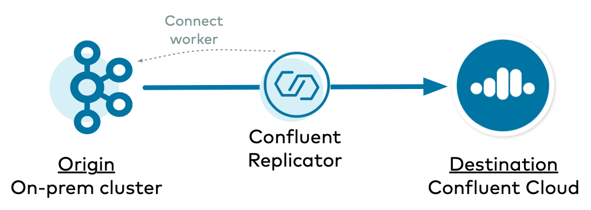

.. _replicator-to-cloud-deployment-models:

|crep-full| to |ccloud| Deployment Models
=========================================

There are several ways to deploy |crep-full| between two |ak| clusters, specifically where the destination Kafka cluster is |ccloud|.

To reprise some basic concepts regarding |crep| and |kconnect-long|:

- As a Kafka connector, |crep| runs on Connect workers. Even the :ref:`Replicator executable <replicator_executable>` has a bundled Connect worker with it.
- |crep| has an embedded consumer that reads data from the origin cluster.
- |crep| is specifically a source connector, and as with all source connectors, it relies on the Connect worker's embedded producer to write data to the destination cluster, in this case |ccloud|.
- A Connect cluster creates three Kafka topics for management, ``offset.storage.topic``, ``config.storage.topic``, and ``status.storage.topic``, and these are in the Kafka cluster that backs the Connect worker.

To replicate data to |ccloud|, the easiest deployment model is where |crep| runs on a self-managed Connect cluster that is backed to the destination |ccloud| cluster.

- :ref:`Example 1 <onprem-cloud-destination>`: on-prem to |ccloud| where |crep| runs on a Connect cluster backed to the destination |ccloud| cluster 
- :ref:`Example 2 <cloud-cloud-destination>`: |ccloud| to |ccloud| where |crep| runs on a Connect cluster backed to the destination |ccloud| cluster

However, if you do not want to back your self-managed Connect cluster backed to the destination |ccloud| cluster, you can also have a Connect cluster backed to the origin cluster instead of |ccloud|.
This also means that the Connect workers are using the origin cluster for its Connect management topics.
This deployment model is more complex because there are some additional overrides you will need to configure.

- :ref:`Example 3 <onprem-cloud-origin>`: on-prem to |ccloud| where |crep| runs on a Connect cluster backed to the origin on-prem cluster
- :ref:`Example 4 <cloud-cloud-origin>`: |ccloud| to |ccloud| where |crep| runs on a Connect cluster backed to the origin |ccloud| cluster

.. _onprem-cloud-destination:

==========================================================
On-prem to |ccloud|: Connect Cluster backed to Destination
==========================================================

In this example, |crep| copies data from an on-prem Kafka cluster to |ccloud|, and |crep| runs on a Connect cluster backed to the destination |ccloud| cluster.

.. include:: includes/generic-subset.rst

.. figure:: images/onprem-ccloud-destination.png

Connect Worker Configuration
----------------------------

.. include:: includes/connect-worker-to-destination-ccloud.rst 

|crep| Configuration
--------------------

.. include:: includes/replicator-from-origin-onprem.rst

.. include:: includes/replicator-to-destination-ccloud.rst

|crep| Authorization
--------------------

.. include:: includes/set-acls-destination.rst

.. _cloud-cloud-destination:

===========================================================
|ccloud| to |ccloud|: Connect Cluster backed to Destination
===========================================================

In this example, |crep| copies data from |ccloud| to |ccloud|, and |crep| runs on a Connect cluster backed to the destination |ccloud| cluster.

.. include:: includes/generic-subset.rst

.. figure:: images/ccloud-ccloud-destination.png

Connect Worker Configuration
----------------------------

.. include:: includes/connect-worker-to-destination-ccloud.rst

|crep| Configuration
--------------------

.. include:: includes/replicator-from-origin-ccloud.rst

.. include:: includes/replicator-to-destination-ccloud.rst

|crep| Authorization
--------------------

.. include:: includes/set-acls-destination.rst

.. include:: includes/set-acls-origin.rst

.. _onprem-cloud-origin:

=====================================================
On-prem to |ccloud|: Connect Cluster backed to Origin
=====================================================

In this example, |crep| copies data from an on-prem Kafka cluster to |ccloud|, and |crep| runs on a Connect cluster backed to the origin on-prem cluster.

.. include:: includes/generic-subset.rst

Connect Worker Configuration
----------------------------

.. include:: includes/connect-worker-to-origin-onprem.rst

|crep| Configuration
--------------------

.. include:: includes/replicator-from-origin-onprem.rst

.. include:: includes/replicator-to-destination-ccloud.rst

.. include:: includes/replicator-overrides.rst

|crep| Authorization
--------------------

.. include:: includes/set-acls-destination.rst

.. _cloud-cloud-origin:

======================================================
|ccloud| to |ccloud|: Connect Cluster backed to Origin
======================================================

In this example, |crep| copies data from |ccloud| to |ccloud|, and |crep| runs on a Connect cluster backed to the origin on-prem cluster.

.. include:: includes/generic-subset.rst

.. figure:: images/ccloud-ccloud-origin.png

Connect Worker Configuration
----------------------------

.. include:: includes/connect-worker-to-origin-ccloud.rst

|crep| Configuration
--------------------

.. include:: includes/replicator-from-origin-onprem.rst

.. include:: includes/replicator-to-destination-ccloud.rst

.. include:: includes/replicator-overrides.rst

|crep| Authorization
--------------------

.. include:: includes/set-acls-destination.rst

.. include:: includes/set-acls-origin.rst

==========================================================
Additional Resources
==========================================================

- For additional considerations on running |crep| to |ccloud|, refer to :ref:`cloud-migrate-topics`.
- To run a |ccloud| demo that showcases a hybrid Kafka cluster: one cluster is a self-managed Kafka cluster running locally, the other is a |ccloud| cluster, see :ref:`quickstart-demos-ccloud`..
- To find additional |ccloud| demos, see :ref:`Confluent Cloud Demos Overview<ccloud-demos-overview>`.
- For a practical guide to configuring, monitoring, and optimizing your |ak| client applications, see the `Best Practices for Developing Kafka Applications on Confluent Cloud <https://assets.confluent.io/m/14397e757459a58d/original/20200205-WP-Best_Practices_for_Developing_Apache_Kafka_Applications_on_Confluent_Cloud.pdf>`__ whitepaper.
- To run a |crep| tutorial with an active-active multi-datacenter design, with two instances of |crep-full| that copy data bidirectionally between the datacenters, see :ref:`replicator`.

