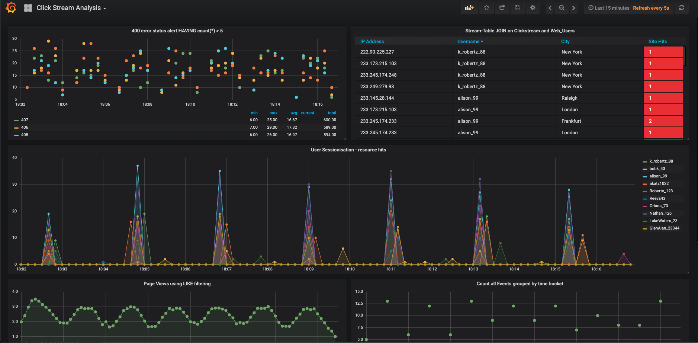

## Overview

This demo shows how KSQL can be used to process a stream of click data, aggregate and filter it, and join to information about the users. Visualisation of the results is provided by Grafana, on top of data streamed to Elasticsearch. 

You can [run it using Docker](https://docs.confluent.io/current/ksql/docs/tutorials/clickstream-docker.html), or with a local install of Confluent Platform and following the instructions below. 

## Prerequisites

* [Common demo prerequisites](https://github.com/confluentinc/examples#prerequisites)
* [Confluent Platform 5.0](https://www.confluent.io/download/)
* [Elasticsearch 5.6.5](https://www.elastic.co/downloads/past-releases/elasticsearch-5-6-5) to export data from Kafka
  * If you do not want to use Elasticsearch, comment out ``check_running_elasticsearch`` in the ``start.sh`` script
* Grafana 5.0.3 to visualize data
  * If you do not want to use Grafana, comment out ``check_running_grafana`` in the ``start.sh`` script

## What Should I see?

After you run `./start.sh`:

* If you are running Confluent Platform, open your browser and navigate to the Control Center web interface Monitoring -> Data streams tab at http://localhost:9021/monitoring/streams to see throughput and latency performance of the KSQL queries
* If you are running Confluent Platform, use Control Center to view and create KSQL queries. Otherwise, run the KSQL CLI `ksql http://localhost:8088`.
* Navigate to the Grafana dashboard at http://localhost:3000/dashboard/db/click-stream-analysis. Login with user ID `admin` and password `admin`.

