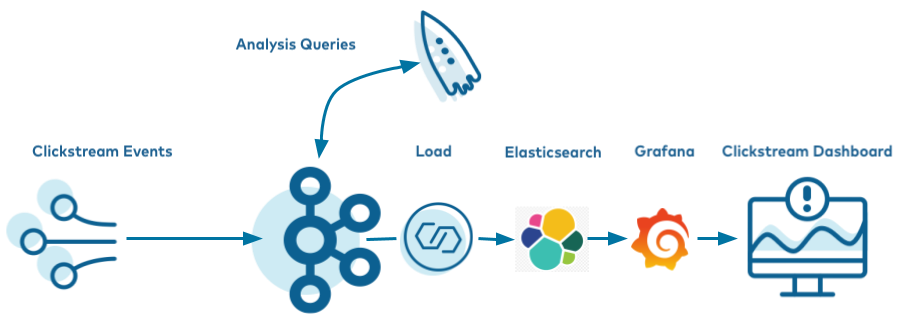

.. _clickstream-demo:

Clickstream Data Analysis Pipeline Using ksqlDB
===============================================

These steps will guide you through how to setup your environment and run the clickstream analysis tutorial from a Docker container.

.. include:: ../../../../quickstart/includes/docker-prereqs.rst

- If you are using Linux as your host, for the Elasticsearch container to start successfully you must first run: 

.. codewithvars:: bash

      sudo sysctl -w vm.max_map_count=262144
      

-----------------------------
Download and run the tutorial
-----------------------------

The tutorial is built using Docker Compose. It brings together several 
Docker images with the required networking and dependencies. The images
are quite large and depending on your network connection may take 
10-15 minutes to download.

#. Clone the `confluentinc/examples <https://github.com/confluentinc/examples>`__ GitHub repository.

   .. code:: bash

       git clone https://github.com/confluentinc/examples.git

#. Navigate to the ``examples/clickstream`` directory and switch to the |cp| release branch:

   .. codewithvars:: bash
   
       cd examples/clickstream
       git checkout |release_post_branch|

#. If you want to manually step through the Clickstream tutorial, which is advised for new users who want to gain familiarity with |cp|, skip ahead to the next section. Alternatively, you can run the full solution end-to-end with this script, which automates all the steps in the tutorial:

   .. code:: bash

       ./start.sh

#. You can apply the same concepts explained in this example to |ccloud|. |ccloud| also has fully managed connectors and ksqlDB applications that you can use, instead of self-managing your own.  To try it out, create your own |ccloud| instance (see :ref:`ccloud-stack` for an easy way to spin up a new environment), deploy the ``kafka-connect-datagen`` connectors, submit your ksqlDB queries, and then point your Elasticsearch connector to |ccloud|.

-------
Startup
-------

#. Get the Jar files for ``kafka-connect-datagen`` (source connector) and ``kafka-connect-elasticsearch`` (sink connector).

   .. code:: bash

       docker run -v $PWD/confluent-hub-components:/share/confluent-hub-components confluentinc/ksqldb-server:0.8.0 confluent-hub install --no-prompt confluentinc/kafka-connect-datagen:0.4.0
       docker run -v $PWD/confluent-hub-components:/share/confluent-hub-components confluentinc/ksqldb-server:0.8.0 confluent-hub install --no-prompt confluentinc/kafka-connect-elasticsearch:10.0.2

#. Launch the tutorial in Docker.

   .. code:: bash

       docker-compose up -d

#. After a minute or so, run the ``docker-compose ps`` status command to ensure that everything has started correctly: 

   .. code:: bash

        docker-compose ps

   Your output should resemble:

   ::

             Name                    Command               State                       Ports                     
        ---------------------------------------------------------------------------------------------------------
        control-center    /etc/confluent/docker/run        Up      0.0.0.0:9021->9021/tcp                        
        elasticsearch     /usr/local/bin/docker-entr ...   Up      0.0.0.0:9200->9200/tcp, 9300/tcp              
        grafana           /run.sh                          Up      0.0.0.0:3000->3000/tcp                        
        kafka             /etc/confluent/docker/run        Up      9092/tcp                                      
        ksqldb-cli        /bin/sh                          Up                                                    
        ksqldb-server     bash -c # Manually install ...   Up      0.0.0.0:8083->8083/tcp, 0.0.0.0:8088->8088/tcp
        schema-registry   /etc/confluent/docker/run        Up      8081/tcp                                      
        tools             /bin/bash                        Up                                                    
        zookeeper         /etc/confluent/docker/run        Up      2181/tcp, 2888/tcp, 3888/tcp   

---------------------------
Create the Clickstream Data
---------------------------

Once you've confirmed all the Docker containers are running, create the source connectors that generate mock data. This demo leverages the embedded Connect worker in ksqlDB. 

#.  Launch the ksqlDB CLI:

    .. code:: bash

        docker-compose exec ksqldb-cli ksql http://ksqldb-server:8088

#.  Ensure the ksqlDB server is ready to receive requests by running the following until it succeeds:

    .. code:: sql

        show topics;

    The output should look similar to:

    ::

         Kafka Topic | Partitions | Partition Replicas
        -----------------------------------------------
        -----------------------------------------------

#.  Run the script :devx-examples:`create-connectors.sql|clickstream/ksql/ksql-clickstream-demo/demo/create-connectors.sql` that executes the ksqlDB statements to create three source connectors for generating mock data.

    .. code:: sql

        RUN SCRIPT '/scripts/create-connectors.sql';

    The output should look similar to:

    ::

        CREATE SOURCE CONNECTOR datagen_clickstream_codes WITH (
          'connector.class'          = 'io.confluent.kafka.connect.datagen.DatagenConnector',
          'kafka.topic'              = 'clickstream_codes',
          'quickstart'               = 'clickstream_codes',
          'maxInterval'              = '20',
          'iterations'               = '100',
          'format'                   = 'json',
          'key.converter'            = 'org.apache.kafka.connect.converters.IntegerConverter');
         Message
        ---------------------------------------------
         Created connector DATAGEN_CLICKSTREAM_CODES
        ---------------------------------------------
        [...]

#. Now the ``clickstream`` generator is running, simulating the stream of clicks. Sample the messages in the ``clickstream`` topic:

   .. code:: sql

       print clickstream limit 3;

   Your output should resemble:

   .. code:: bash

      Key format: HOPPING(JSON) or TUMBLING(JSON) or HOPPING(KAFKA_STRING) or TUMBLING(KAFKA_STRING) or KAFKA_STRING
      Value format: JSON or KAFKA_STRING
      rowtime: 2020/06/11 10:38:42.449 Z, key: 222.90.225.227, value: {"ip":"222.90.225.227","userid":12,"remote_user":"-","time":"1","_time":1,"request":"GET /images/logo-small.png HTTP/1.1","status":"302","bytes":"1289","referrer":"-","agent":"Mozilla/5.0 (Windows NT 10.0; Win64; x64) AppleWebKit/537.36 (KHTML, like Gecko) Chrome/59.0.3071.115 Safari/537.36"}
      rowtime: 2020/06/11 10:38:42.528 Z, key: 111.245.174.248, value: {"ip":"111.245.174.248","userid":30,"remote_user":"-","time":"11","_time":11,"request":"GET /site/login.html HTTP/1.1","status":"302","bytes":"14096","referrer":"-","agent":"Mozilla/5.0 (Windows NT 10.0; Win64; x64) AppleWebKit/537.36 (KHTML, like Gecko) Chrome/59.0.3071.115 Safari/537.36"}
      rowtime: 2020/06/11 10:38:42.705 Z, key: 122.152.45.245, value: {"ip":"122.152.45.245","userid":11,"remote_user":"-","time":"21","_time":21,"request":"GET /images/logo-small.png HTTP/1.1","status":"407","bytes":"4196","referrer":"-","agent":"Mozilla/5.0 (Windows NT 10.0; Win64; x64) AppleWebKit/537.36 (KHTML, like Gecko) Chrome/59.0.3071.115 Safari/537.36"}
      Topic printing ceased

#. The second data generator running is for the HTTP status codes. Sample the messages in the ``clickstream_codes`` topic:

   .. code:: sql

       print clickstream_codes limit 3;

   Your output should resemble:

   .. code:: bash

      Key format: KAFKA_INT
      Value format: JSON or KAFKA_STRING
      rowtime: 2020/06/11 10:38:40.222 Z, key: 200, value: {"code":200,"definition":"Successful"}
      rowtime: 2020/06/11 10:38:40.688 Z, key: 404, value: {"code":404,"definition":"Page not found"}
      rowtime: 2020/06/11 10:38:41.006 Z, key: 200, value: {"code":200,"definition":"Successful"}
      Topic printing ceased

#. The third data generator is for the user information. Sample the messages in the ``clickstream_users`` topic:

   .. code:: sql

       print clickstream_users limit 3;

   Your output should resemble:

   .. code:: bash

      Key format: KAFKA_INT
      Value format: JSON or KAFKA_STRING
      rowtime: 2020/06/11 10:38:40.815 Z, key: 1, value: {"user_id":1,"username":"Roberto_123","registered_at":1410180399070,"first_name":"Greta","last_name":"Garrity","city":"San Francisco","level":"Platinum"}
      rowtime: 2020/06/11 10:38:41.001 Z, key: 2, value: {"user_id":2,"username":"akatz1022","registered_at":1410356353826,"first_name":"Ferd","last_name":"Pask","city":"London","level":"Gold"}
      rowtime: 2020/06/11 10:38:41.214 Z, key: 3, value: {"user_id":3,"username":"akatz1022","registered_at":1483293331831,"first_name":"Oriana","last_name":"Romagosa","city":"London","level":"Platinum"}
      Topic printing ceased

#. Go to |c3| UI at http://localhost:9021 and view the three kafka-connect-datagen source connectors created with the ksqlDB CLI.

   .. image:: images/c3_datagen_connectors.png
       :alt: Datagen Connectors 

---------------------------------
Load the Streaming Data to ksqlDB
---------------------------------

#.  Load the :devx-examples:`statements.sql|clickstream/ksql/ksql-clickstream-demo/demo/statements.sql` file that runs the tutorial app.

    **Important:** Before running this step, you must have already run
    ksql-datagen utility to create the clickstream data, status codes,
    and set of users.

    .. code:: sql

        RUN SCRIPT '/scripts/statements.sql';

    The output will show either a blank message, or ``Executing statement``, similar to this: 

    ::

         CREATE STREAM clickstream (
                _time bigint,
                time varchar,
                ip varchar,
                request varchar,
                status int,
                userid int,
                bytes bigint,
                agent varchar
            ) with (
                kafka_topic = 'clickstream',
                value_format = 'json'
            );
         Message
        ----------------
         Stream created
        ----------------
        [...]

    After the ``RUN SCRIPT`` command completes, exit out of the ``ksqldb-cli`` with a ``CTRL+D`` command

---------------------------------------------
Verify the data
---------------------------------------------

#.  Go to |c3| UI at http://localhost:9021, and view the ksqlDB view ``Flow``.

    .. image:: images/flow.png
       :alt: ksqlDB Flow

#.  Verify that data is being streamed through various tables and streams. Query one of the streams ``CLICKSTREAM``:

    .. image:: images/stream_clickstream.png
       :alt: Clickstream data

.. _clickstream-view-grafana:

---------------------------------------------
Load the Clickstream Data in Grafana
---------------------------------------------
Send the ksqlDB tables to Elasticsearch and Grafana.

#. Set up the required Elasticsearch document mapping template

   .. code:: bash

       docker-compose exec elasticsearch bash -c '/scripts/elastic-dynamic-template.sh'

#. Run this command to send the ksqlDB tables to Elasticsearch and
   Grafana:

   .. code:: bash

       docker-compose exec ksqldb-server bash -c '/scripts/ksql-tables-to-grafana.sh'

   Your output should resemble:

   ::

        Loading Clickstream-Demo TABLES to Confluent-Connect => Elastic => Grafana datasource

        ==================================================================
        Charting  CLICK_USER_SESSIONS
                -> Remove any existing Elastic search config
                -> Remove any existing Connect config
                -> Remove any existing Grafana config
                -> Connecting KSQL->Elastic->Grafana  click_user_sessions
                -> Connecting: click_user_sessions
                        -> Adding Kafka Connect Elastic Source es_sink_CLICK_USER_SESSIONS
                        -> Adding Grafana Source

        [...]

#. Load the dashboard into Grafana.

   .. code:: bash

       docker-compose exec grafana bash -c '/scripts/clickstream-analysis-dashboard.sh'

   Your output should resemble:

   ::

        Loading Grafana ClickStream Dashboard

#. Navigate to the Grafana dashboard at http://localhost:3000. Enter the username and password as ``user`` and ``user``. Then navigate to the ``Clickstream Analysis Dashboard``.

   .. image:: images/grafana-dashboard.png
      :alt: Grafana Dashboard

#. In the |c3| UI at http://localhost:9021, again view the running connectors. The three kafka-connect-datagen source connectors were created with the ksqlDB CLI, and the seven Elasticsearch sink connectors were created with the ksqlDB REST API.

   .. image:: images/c3_connectors.png
        :alt: Connectors

---------------------------------------------
Sessionize the data
---------------------------------------------

One of the tables created by the demo, CLICK_USER_SESSIONS, shows a count of user activity
for a given user session.  All clicks from the user count towards the total user activity for the current
session.  If a user is inactive for 30 seconds, then any subsequent click activity is counted
towards a new session.

The clickstream demo simulates user sessions with a script.  The script pauses the DATAGEN_CLICKSTREAM 
connector every 90 seconds for a 35 second period of inactivity.  By stopping the DATAGEN_CLICKSTREAM connector 
for some time greater than 30 seconds, you will see distinct user sessions.

You'll probably use a longer inactivity gap for session windows in practice.  But the demo uses 30 seconds so you can see the sessions
in action in a reasonable amount of time.

Session windows are different because they monitor user behavior and
other window implementations consider only time.

To generate the session data execute the following statement from the ``examples/clickstream`` directory:

.. code:: bash

    ./sessionize-data.sh

The script will issue some statements to the console about where it is in the process.

---------------------------------------------
View the data in Grafana
---------------------------------------------

#. Navigate to the Grafana dashboard at http://localhost:3000. Enter the username and password as ``user`` and ``user``. Then navigate to the ``Clickstream Analysis Dashboard``.

   .. image:: images/grafana-sessions.png
      :alt: Grafana UI success

This dashboard demonstrates a series of streaming functionality where the title of each panel describes the type of stream
processing required to generate the data. For example, the large chart in the middle is showing web-resource requests on a per-username basis
using a Session window - where a sessions expire after 300 seconds of inactivity. Editing the panel allows you to view the datasource - which
is named after the streams and tables captured in the ``statements.sql`` file.

---------------
Troubleshooting
---------------

-  Check the Data Sources page in Grafana.

   -  If your data source is shown, select it and scroll to the bottom
      and click the **Save & Test** button. This will indicate whether
      your data source is valid.
