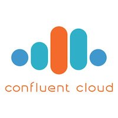

# Overview

This directory includes examples of Kafka client streaming applications connecting to [Confluent Cloud](https://www.confluent.io/confluent-cloud/), written in different languages:

# Other Confluent Cloud Demos

Note: you may also run an [end-to-end Confluent Cloud demo](https://docs.confluent.io/current/tutorials/examples/ccloud/docs/index.html) that showcases hybrid Kafka clusters: moving from self-managed to Confluent Cloud, with other streaming processing applications (e.g. KSQL) and components of the Confluent Platform (e.g. Confluent Replicator, Confluent Control Center, and Confluent Schema Registry).

# Confluent Cloud

