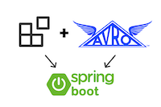
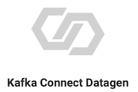

# Overview

## Programming Languages

This directory includes examples of Kafka client applications, showcasing producers and consumers, written in various programming languages.
The README for each language walks through the necessary steps to run each example.
Each client example takes as an argument a properties file with the configuration parameters that specify connection information for any of the following:

* Kafka cluster running on your local host (Download [Confluent Platform](https://www.confluent.io/download/?utm_source=github&utm_medium=demo&utm_campaign=ch.examples_type.community_content.clients-ccloud))
* [Confluent Cloud](https://www.confluent.io/confluent-cloud/?utm_source=github&utm_medium=demo&utm_campaign=ch.examples_type.community_content.clients-ccloud): the first 20 users to sign up for [Confluent Cloud](https://www.confluent.io/confluent-cloud/?utm_source=github&utm_medium=demo&utm_campaign=ch.examples_type.community_content.clients-ccloud) and use promo code ``C50INTEG`` will receive an additional $50 free usage ([details](https://www.confluent.io/confluent-cloud-promo-disclaimer/?utm_source=github&utm_medium=demo&utm_campaign=ch.examples_type.community_content.clients-ccloud)).
* Any other remote Kafka cluster

Click on any language in the table below:

|                                   |                                                 |                                   |
|:---------------------------------:|:-----------------------------------------------:|:---------------------------------:|
|      |                |          |
|    |   |      |
|  |                |  |
|  |            |  |
|  |  |  |
|  |  |   Confluent CLI |
|   Confluent Cloud CLI | | |

## With Schema Registry

The following subset includes examples with Schema Registry and Avro data:

|                                   |                                                 |                                   |
|:---------------------------------:|:-----------------------------------------------:|:---------------------------------:|
|      |                |  |
|  |  |   Confluent CLI |
|   Confluent Cloud CLI | | |

# Additional Resources

* For clusters in Confluent Cloud: refer to [Developing Client Applications on Confluent Cloud](https://docs.confluent.io/cloud/current/client-apps/index.html) for a practical guide to configuring, monitoring, and optimizing your Kafka client applications.
* For on-prem clusters: refer to [Optimizing Your Apache Kafka Deployment](https://www.confluent.io/white-paper/optimizing-your-apache-kafka-deployment?utm_source=github&utm_medium=demo&utm_campaign=ch.examples_type.community_content.clients) whitepaper for a practical guide to optimizing your Apache Kafka deployment for various services goals including throughput, latency, durability and availability, and useful metrics to monitor for performance and cluster health.
