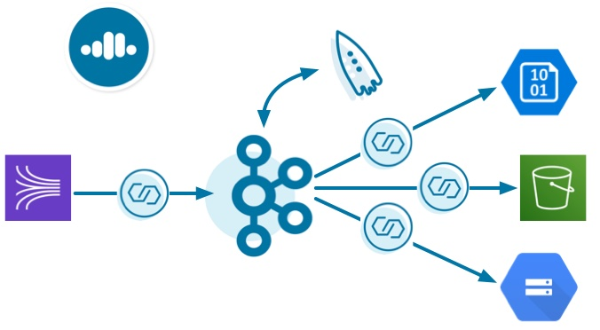

# Overview

This demo showcases a cloud ETL leveraging all fully-managed services on [Confluent Cloud](https://confluent.cloud?utm_source=github&utm_medium=demo&utm_campaign=ch.examples_type.community_content.cloud-etl)
A source connector reads data from an AWS Kinesis stream into Confluent Cloud, a Confluent KSQL application processes that data, and then a sink connector writes the output data into cloud storage in the provider of your choice.

# Documentation

You can find the documentation for running this demo and its accompanying tutorial at [https://docs.confluent.io/current/tutorials/examples/cloud-etl/docs/index.html](https://docs.confluent.io/current/tutorials/examples/microservices-orders/docs/index.html?utm_source=github&utm_medium=demo&utm_campaign=ch.examples_type.community_content.cloud-etl)
