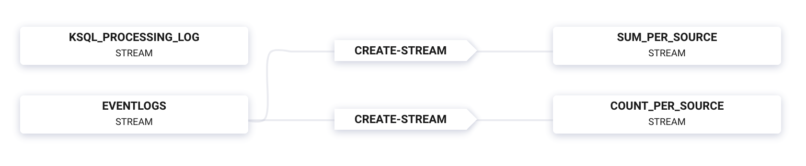

# Overview

This demo showcases a `AWS Kinesis -> Confluent Cloud -> cloud storage` pipeline.
You have freedom of choice in selecting the cloud storage provider that is right for your business needs.
Benefits of Confluent Cloud:

* Build business applications on a full event streaming platform
* Span multiple cloud providers (AWS, GCP, Azure) and on-prem datacenters
* Use Kafka to aggregate data in single source of truth
* Harness the power of [KSQL](https://www.confluent.io/product/ksql/?utm_source=github&utm_medium=demo&utm_campaign=ch.examples_type.community_content.kinesis)


# End-to-end Streaming ETL

This demo showcases an entire end-to-end streaming ETL deployment, built for 100% cloud services:

* Kinesis source connector: reads from a Kinesis stream and writes the data to a Kafka topic in Confluent Cloud
* ksqlDB: streaming SQL engine that enables real-time data processing against Kafka
* GCS or S3 sink connector: pushes data from Kafka topics to cloud storage

| Component                  | Consumes From             | Produces To             |
|----------------------------|---------------------------|-------------------------|
| Kinesis source connector   | Kinesis stream `s1`       | `locations`             |
| KSQL                       | `locations`               | KSQL streams and tables ([ksql.commands](ksql.commands)) |
| GCS/S3/Blob sink connector | KSQL tables `COUNT_PER_CITY`, `SUM_PER_CITY` | GCS/S3/Blob         |

# Warning

This demo uses real cloud resources, including that of Confluent Cloud, Amazon Kinesis, and one of the cloud storage providers.
To avoid unexpected charges, carefully evaluate the cost of resources before launching the demo and ensure all resources are destroyed after you are done running it.

# Prerequisites

## Cloud services

* [Confluent Cloud cluster](https://confluent.cloud?utm_source=github&utm_medium=demo&utm_campaign=ch.examples_type.community_content.kinesis): for development only. Do not use a production cluster.
* [Confluent Cloud KSQL](https://docs.confluent.io/current/quickstart/cloud-quickstart/ksql.html?utm_source=github&utm_medium=demo&utm_campaign=ch.examples_type.community_content.kinesis) provisioned in your Confluent Cloud
* AWS or GCP or Azure access

## Local install

* [Confluent Cloud CLI](https://docs.confluent.io/current/cloud/cli/install.html#ccloud-install-cli?utm_source=github&utm_medium=demo&utm_campaign=ch.examples_type.community_content.beginner-cloud) v0.234.0 or later
* AWS S3: `aws cli`, properly initialized with your credentials
* GCP GCS: `gsutils`, properly initialized with your credentials
* Azure Blob: `az`, properly initialized with your credentials
* `jq`
* `curl`

# Run the Demo

## Setup

1. Initialize a properties file at `$HOME/.ccloud/config` with the following configuration parameters for your Confluent Cloud cluster:

```shell
$ cat $HOME/.ccloud/config
bootstrap.servers=<BROKER ENDPOINT>
ssl.endpoint.identification.algorithm=https
security.protocol=SASL_SSL
sasl.mechanism=PLAIN
sasl.jaas.config=org.apache.kafka.common.security.plain.PlainLoginModule required username\="<API KEY>" password\="<API SECRET>";
basic.auth.credentials.source=USER_INFO
schema.registry.basic.auth.user.info=<SR API KEY>:<SR API SECRET>
schema.registry.url=https://<SR ENDPOINT>
ksql.endpoint=https://<KSQL ENDPOINT>
```

2. Modify the demo configuration file at `config/demo.cfg` for your particular cloud storage provider and other demo parameters.

3. Log into Confluent Cloud with the command 'ccloud login', and use your Confluent Cloud username and password.

```
ccloud login --url https://confluent.cloud
```

## Run

4. Run the demo. It takes under 10 minutes to run.

```bash
$ ./start.sh
```

5. View all the Kinesis, Kafka, and cloud storage data after running the demo:

```bash
$ ./read-data.sh
```

6. From the Confluent Cloud UI, view the Flow:



7. Stop the demo and clean up all the resources, delete Kafka topics, delete the fully-managed connectors, delete the data in the cloud storage:

```bash
$ ./stop.sh
```

