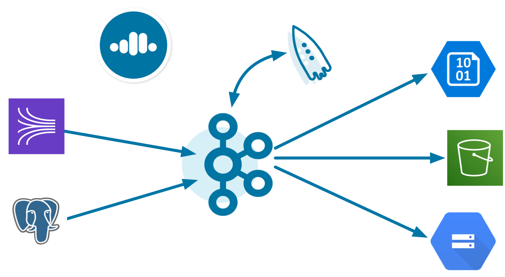
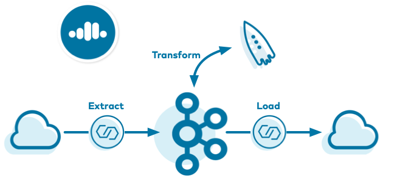
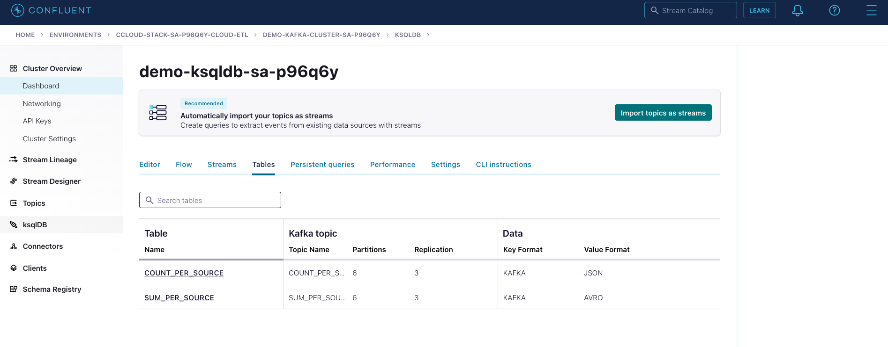
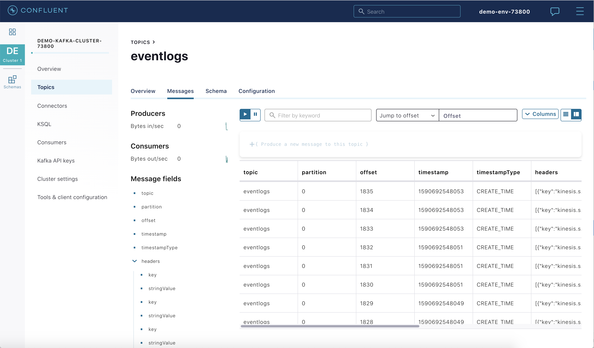

.. _cloud-etl:
  
.. toctree::
    :maxdepth: 2

Cloud ETL Example
=================

This example showcases an entire end-to-end cloud ETL deployment, built for 100% cloud services:

-  Cloud source connectors: writes data to Kafka topics in |ccloud| from a cloud service, one of:

   - `Amazon Kinesis Source Connector for Confluent Cloud <https://docs.confluent.io/cloud/current/connectors/cc-kinesis-source.html>`__
   - `PostgreSQL CDC Source Connector (Debezium) for Confluent Cloud <https://docs.confluent.io/cloud/current/connectors/cc-postgresql-cdc-source-debezium.html>`__

-  Cloud sink connectors: writes data from Kafka topics in |ccloud| to cloud storage, one of:

   - `Azure Blob Storage Sink Connector for Confluent Cloud <https://docs.confluent.io/cloud/current/connectors/cc-azure-blob-sink.html>`__
   - `Google Cloud Storage Sink Connector for Confluent Cloud <https://docs.confluent.io/cloud/current/connectors/cc-gcs-sink.html>`__
   - `Amazon S3 Sink Connector for Confluent Cloud <https://docs.confluent.io/cloud/current/connectors/cc-s3-sink.html>`__

-  `Confluent Cloud ksqlDB <https://docs.confluent.io/cloud/current/get-started/ksql.html>`__ : streaming SQL engine that enables real-time data processing against Kafka

-  `Confluent Cloud Schema Registry <https://docs.confluent.io/cloud/current/cp-component/schema-reg-cloud-config.html>`__: centralized management of schemas and compatibility checks as schemas evolve

========
Overview
========

As enterprises move more and more of their applications to the cloud, they are also moving their on-prem ETL (extract, transform, load) pipelines to the cloud, as well as building new ones.
This example showcases a cloud ETL solution leveraging all fully-managed services on `Confluent Cloud <https://confluent.cloud>`__.

There are many powerful use cases for these real-time cloud ETL pipelines, and this example showcases one such use case—a log ingestion pipeline that spans multiple cloud providers.
Using |ccloud| CLI, the example creates a source connector that reads data from either an AWS Kinesis stream or AWS RDS PostgreSQL database into |ccloud|.
Then it creates a |ccloud| ksqlDB application that processes that data.
Finally, a sink connector writes the output data into cloud storage in the provider of your choice (one of GCP GCS, AWS S3, or Azure Blob).

The end result is an event streaming ETL, running 100% in the cloud, spanning multiple cloud providers.
This enables you to:

*  Build business applications on a full event streaming platform
*  Span multiple cloud providers (AWS, GCP, Azure) and on-prem datacenters
*  Use Kafka to aggregate data into a single source of truth
*  Harness the power of `ksqlDB <https://www.confluent.io/product/ksql/>`__ for stream processing

.. tip:: For more information about building a cloud ETL pipeline on |ccloud|, see this
         `blog post <https://www.confluent.io/blog/build-a-cloud-etl-pipeline-with-confluent-cloud/>`__.

=========
Data Flow
=========

The data set is a stream of log messages, which in this example is mock data captured in :devx-examples:`eventlogs.json|cloud-etl/eventlogs.json`.
It resembles this:

.. sourcecode:: bash

   {"eventSourceIP":"192.168.1.1","eventAction":"Upload","result":"Pass","eventDuration":3}
   {"eventSourceIP":"192.168.1.1","eventAction":"Create","result":"Pass","eventDuration":2}
   {"eventSourceIP":"192.168.1.1","eventAction":"Delete","result":"Fail","eventDuration":5}
   {"eventSourceIP":"192.168.1.2","eventAction":"Upload","result":"Pass","eventDuration":1}
   {"eventSourceIP":"192.168.1.2","eventAction":"Create","result":"Pass","eventDuration":3}

+-----------------------+-----------------------+-----------------------+
| Component             | Consumes From         | Produces To           |
+=======================+=======================+=======================+
| Kinesis/PostgreSQL    | Kinesis stream or     | Kafka topic           |
| source connector      | RDS PostgreSQL table  | ``eventlogs``         |
+-----------------------+-----------------------+-----------------------+
| ksqlDB                | ``eventlogs``         | ksqlDB streams and    |
|                       |                       | tables                |
+-----------------------+-----------------------+-----------------------+
| GCS/S3/Blob           | ksqlDB tables         | GCS/S3/Blob           |
| sink connector        | ``COUNT_PER_SOURCE``, |                       |
|                       | ``SUM_PER_SOURCE``    |                       |
+-----------------------+-----------------------+-----------------------+

=============
Prerequisites
=============

Cloud services
~~~~~~~~~~~~~~

-  `Confluent Cloud cluster <https://confluent.cloud>`__
-  Access to AWS and (optional) GCP or Azure

Local Tools
~~~~~~~~~~~

-  `Confluent Cloud CLI <https://docs.confluent.io/ccloud-cli/current/install.html>`__ v1.25.0 or later, logged in with the ``--save`` argument which saves your |ccloud| user login credentials or refresh token (in the case of SSO) to the local ``netrc`` file.
-  ``gsutil`` CLI, properly initialized with your credentials: (optional) if destination is GCP GCS
-  ``aws`` CLI, properly initialized with your credentials: used for AWS Kinesis or RDS PostgreSQL, and (optional) if destination is AWS S3
-  ``az`` CLI, properly initialized with your credentials: (optional) if destination is Azure Blob storage
-  ``psql``: (optional) if source is RDS PostgreSQL
-  ``jq``
-  ``curl``
-  .. include:: ../../ccloud/docs/includes/prereq_timeout.rst
-  ``python``
-  Download `Confluent Platform <https://www.confluent.io/download/>`__ |release|: for more advanced Confluent CLI functionality (optional)

====================
Cost to Run Tutorial
====================

Caution
~~~~~~~

.. include:: ../../ccloud/docs/includes/ccloud-examples-caution.rst

This example also uses real resources from other cloud providers, including:

* AWS Kinesis or RDS PostgreSQL
* Cloud storage providers (one of GCP GCS, AWS S3, or Azure Blob) depending on your configuration

|ccloud| Promo Code
~~~~~~~~~~~~~~~~~~~

.. include:: ../../ccloud/docs/includes/ccloud-examples-promo-code.rst

===========
Run Example
===========

Setup
~~~~~

Because this example interacts with real resources in Kinesis or RDS PostgreSQL, a destination storage service, and |ccloud|, you must set up some initial parameters to communicate with these services.

#. This example creates a new |ccloud| environment with required resources to run this example. As a reminder, this example uses real |ccloud| resources and you may incur charges so carefully evaluate the cost of resources before launching the example.

#. Clone the `confluentinc/examples <https://github.com/confluentinc/examples>`__ GitHub repository, and check out the :litwithvars:`|release|-post` branch..

   .. codewithvars:: bash

     git clone https://github.com/confluentinc/examples
     cd examples
     git checkout |release|-post

#. Change directory to the ``cloud-etl`` example.

   .. sourcecode:: bash

     cd cloud-etl

#. Modify the example configuration file at :devx-examples:`config/demo.cfg|cloud-etl/config/demo.cfg`. Set the proper credentials and parameters for the source:

   - AWS Kinesis

     - ``DATA_SOURCE='kinesis'``
     - ``KINESIS_STREAM_NAME``
     - ``KINESIS_REGION``
     - ``AWS_PROFILE``

   - AWS RDS (PostgreSQL)

     - ``DATA_SOURCE='rds'``
     - ``DB_INSTANCE_IDENTIFIER``
     - ``RDS_REGION``
     - ``AWS_PROFILE``

#. In the same example configuration file at :devx-examples:`config/demo.cfg|cloud-etl/config/demo.cfg`, set the required parameters for the destination cloud storage provider:

   - GCP GCS

     - ``DESTINATION_STORAGE='gcs'``
     - ``GCS_CREDENTIALS_FILE``
     - ``GCS_BUCKET``

   - AWS S3

     - ``DESTINATION_STORAGE='s3'``
     - ``S3_PROFILE``
     - ``S3_BUCKET``

   - Azure Blob

     - ``DESTINATION_STORAGE='az'``
     - ``AZBLOB_STORAGE_ACCOUNT``
     - ``AZBLOB_CONTAINER``

#. Log in to |ccloud| with the command ``ccloud login --save``, and use your |ccloud| username and password. The ``--save`` argument saves your Confluent Cloud user login credentials or refresh token (in the case of SSO) to the local ``netrc`` file.

   .. code:: shell

      ccloud login --save

Run
~~~

.. include:: ../../ccloud/docs/includes/ccloud-stack-advanced-options.rst

#. Run the example. Set the cloud provider and region for your |ccloud| cluster when you start the example, so that they match the destination cloud storage provider and region. This will take several minutes to complete as it creates new resources in |ccloud| and other cloud providers.

   .. code:: bash

      # Example for running to AWS S3 in us-west-2
      CLUSTER_CLOUD=aws CLUSTER_REGION=us-west-2 ./start.sh

      # Example for running to GCP GCS in us-west2
      CLUSTER_CLOUD=gcp CLUSTER_REGION=us-west2 ./start.sh

      # Example for running to Azure Blob in westus2
      CLUSTER_CLOUD=azure CLUSTER_REGION=westus2 ./start.sh

#. As part of this script run, :ref:`ccloud-stack` creates a new |ccloud| stack of fully-managed resources and also generates a local configuration file with all connection information, cluster IDs, and credentials, which is useful for other demos/automation. View this local configuration file, where ``SERVICE ACCOUNT ID`` is auto-generated by the script.

   .. sourcecode:: bash

      cat stack-configs/java-service-account-<SERVICE ACCOUNT ID>.config

   Your output should resemble:

   ::

      # --------------------------------------
      # Confluent Cloud connection information
      # --------------------------------------
      # ENVIRONMENT ID: <ENVIRONMENT ID>
      # SERVICE ACCOUNT ID: <SERVICE ACCOUNT ID>
      # KAFKA CLUSTER ID: <KAFKA CLUSTER ID>
      # SCHEMA REGISTRY CLUSTER ID: <SCHEMA REGISTRY CLUSTER ID>
      # KSQLDB APP ID: <KSQLDB APP ID>
      # --------------------------------------
      security.protocol=SASL_SSL
      sasl.mechanism=PLAIN
      bootstrap.servers=<BROKER ENDPOINT>
      sasl.jaas.config=org.apache.kafka.common.security.plain.PlainLoginModule required username='<API KEY>' password='<API SECRET>';
      basic.auth.credentials.source=USER_INFO
      schema.registry.basic.auth.user.info=<SR API KEY>:<SR API SECRET>
      schema.registry.url=https://<SR ENDPOINT>
      ksql.endpoint=<KSQLDB ENDPOINT>
      ksql.basic.auth.user.info=<KSQLDB API KEY>:<KSQLDB API SECRET>

#. Log into the Confluent Cloud UI at http://confluent.cloud .

Connectors
~~~~~~~~~~

#. The example automatically created |kconnect-long| connectors using the |ccloud| CLI command ``ccloud connector create`` that included passing in connector configuration files from the :devx-examples:`connector configuration directory|cloud-etl/connectors/`:

   - :devx-examples:`AWS Kinesis source connector configuration file|cloud-etl/connectors/kinesis.json`
   - :devx-examples:`PostgreSQL source connector configuration file|cloud-etl/connectors/rds.json`
   - :devx-examples:`GCS sink connector configuration file|cloud-etl/connectors/gcs_no_avro.json`
   - :devx-examples:`GCS sink connector with Avro configuration file|cloud-etl/connectors/gcs_avro.json`
   - :devx-examples:`S3 sink connector configuration file|cloud-etl/connectors/s3_no_avro.json`
   - :devx-examples:`S3 sink connector with Avro configuration file|cloud-etl/connectors/s3_avro.json`
   - :devx-examples:`Azure Blob sink connector configuration file|cloud-etl/connectors/az_no_avro.json`
   - :devx-examples:`Azure Blob sink connector with Avro configuration file|cloud-etl/connectors/az_avro.json`

   For example, if you configured the example to source data from Kinesis, it ran this :devx-examples:`AWS Kinesis connector configuration file|cloud-etl/connectors/kinesis.json`.

   .. literalinclude:: ../connectors/kinesis.json

#. Let's say you ran the example with Kinesis as the source and S3 as the sink, the pipeline would resemble:

   .. figure:: images/data-kinesis-s3.png
      :alt: image

#. Using the `Confluent Cloud CLI <https://docs.confluent.io/ccloud-cli/current/install.html>`__, list all the fully-managed connectors created in this cluster.

   .. code:: bash

      ccloud connector list

   Your output should resemble:

   .. code:: bash

           ID     |        Name         | Status  |  Type  | Trace  
      +-----------+---------------------+---------+--------+-------+
        lcc-2jrx1 | demo-S3Sink-no-avro | RUNNING | sink   |        
        lcc-vnrqp | demo-KinesisSource  | RUNNING | source |        
        lcc-5qwrn | demo-S3Sink-avro    | RUNNING | sink   |       

#. Describe any running connector in more detail, in this case ``lcc-vnrqp`` which corresponds to the the AWS Kinesis connector. 

   .. code:: bash

      ccloud connector describe lcc-vnrqp

   Your output should resemble:

   .. code:: bash

      Connector Details
      +--------+--------------------+
      | ID     | lcc-vnrqp          |
      | Name   | demo-KinesisSource |
      | Status | RUNNING            |
      | Type   | source             |
      | Trace  |                    |
      +--------+--------------------+
      
      
      Task Level Details
        TaskId |  State   
      +--------+---------+
             0 | RUNNING  
      
      
      Configuration Details
              Config        |                          Value
      +---------------------+---------------------------------------------------------+
        name                | demo-KinesisSource
        kafka.api.key       | ****************
        kafka.api.secret    | ****************
        schema.registry.url | https://psrc-4yovk.us-east-2.aws.confluent.cloud
        cloud.environment   | prod
        kafka.endpoint      | SASL_SSL://pkc-4kgmg.us-west-2.aws.confluent.cloud:9092
        kafka.region        | us-west-2
        kafka.user.id       |                                                   73800
        kinesis.position    | TRIM_HORIZON
        kinesis.region      | us-west-2
        kinesis.stream      | demo-logs
        aws.secret.key.id   | ****************
        connector.class     | KinesisSource
        tasks.max           |                                                       1
        aws.access.key.id   | ****************

#. View these same connectors from the Confluent Cloud UI at https://confluent.cloud/ 

   .. figure:: images/connectors.png
      :alt: image

ksqlDB
~~~~~~

#. From the `Confluent Cloud UI <https://confluent.cloud>`__, select your Kafka cluster and click the ksqlDB tab to view the `flow <https://docs.confluent.io/cloud/current/get-started/ksql.html#use-flow-view-to-inspect-data>`__ through your ksqlDB application:

   .. figure:: images/flow.png
      :alt: image

#. This flow is the result of this set of :devx-examples:`ksqlDB statements|cloud-etl/statements.sql`. It generated a ksqlDB TABLE ``COUNT_PER_SOURCE``, formatted as JSON, and its underlying Kafka topic is ``COUNT_PER_SOURCE``. It also generated a ksqlDB TABLE ``SUM_PER_SOURCE``, formatted as Avro, and its underlying Kafka topic is ``SUM_PER_SOURCE``.

   .. literalinclude:: ../statements.sql

#. Use the Confluent Cloud ksqlDB UI or its REST API to interact with the ksqlDB application:

   .. code:: bash

      curl -X POST $KSQLDB_ENDPOINT/ksql \
             -H "Content-Type: application/vnd.ksql.v1+json; charset=utf-8" \
             -u $KSQLDB_BASIC_AUTH_USER_INFO \
             -d @<(cat <<EOF
      {
        "ksql": "SHOW QUERIES;",
        "streamsProperties": {}
      }
      EOF
      )

   Your output should resemble:

   .. code:: bash

      [
        {
          "@type": "queries",
          "statementText": "SHOW QUERIES;",
          "queries": [
            {
              "queryString": "CREATE TABLE COUNT_PER_SOURCE WITH (KAFKA_TOPIC='COUNT_PER_SOURCE', PARTITIONS=6, REPLICAS=3) AS SELECT\n  EVENTLOGS.EVENTSOURCEIP EVENTSOURCEIP,\n  COUNT(*) COUNT\nFROM EVENTLOGS EVENTLOGS\nGROUP BY EVENTLOGS.EVENTSOURCEIP\nEMIT CHANGES;",
              "sinks": [
                "COUNT_PER_SOURCE"
              ],
              "sinkKafkaTopics": [
                "COUNT_PER_SOURCE"
              ],
              "id": "CTAS_COUNT_PER_SOURCE_0",
              "statusCount": {
                "RUNNING": 1
              },
              "queryType": "PERSISTENT",
              "state": "RUNNING"
            },
            {
              "queryString": "CREATE TABLE SUM_PER_SOURCE WITH (KAFKA_TOPIC='SUM_PER_SOURCE', PARTITIONS=6, REPLICAS=3, VALUE_FORMAT='AVRO') AS SELECT\n  EVENTLOGS.EVENTSOURCEIP ROWKEY,\n  AS_VALUE(EVENTLOGS.EVENTSOURCEIP) EVENTSOURCEIP,\n  SUM(EVENTLOGS.EVENTDURATION) SUM\nFROM EVENTLOGS EVENTLOGS\nWHERE (EVENTLOGS.RESULT = 'Pass')\nGROUP BY EVENTLOGS.EVENTSOURCEIP\nEMIT CHANGES;",
              "sinks": [
                "SUM_PER_SOURCE"
              ],
              "sinkKafkaTopics": [
                "SUM_PER_SOURCE"
              ],
              "id": "CTAS_SUM_PER_SOURCE_5",
              "statusCount": {
                "RUNNING": 1
              },
              "queryType": "PERSISTENT",
              "state": "RUNNING"
            }
          ],
          "warnings": []
        }
      ]

#. View the Avro schema for the topic ``SUM_PER_SOURCE`` in |sr-ccloud|.

   .. code:: bash

      curl --silent -u <SR API KEY>:<SR API SECRET> https://<SR ENDPOINT>/subjects/SUM_PER_SOURCE-value/versions/latest | jq -r '.schema' | jq .

   Your output should resemble:

   .. code:: json

      {
        "type": "record",
        "name": "KsqlDataSourceSchema",
        "namespace": "io.confluent.ksql.avro_schemas",
        "fields": [
          {
            "name": "EVENTSOURCEIP",
            "type": [
              "null",
              "string"
            ],
            "default": null
          },
          {
            "name": "SUM",
            "type": [
              "null",
              "long"
            ],
            "default": null
          }
        ]
      }

#. View these same queries from the Confluent Cloud UI at https://confluent.cloud/ 

Validate
~~~~~~~~

#. View the data from Kinesis, |ak|, and cloud storage after running the example, running the :devx-examples:`read-data.sh|cloud-etl/read-data.sh` script.

   .. code:: bash

      ./read-data.sh stack-configs/java-service-account-<SERVICE ACCOUNT ID>.config

   Your output should resemble:

   .. code:: shell

      Data from Kinesis stream demo-logs --limit 10:
      {"eventSourceIP":"192.168.1.1","eventAction":"Upload","result":"Pass","eventDuration":3}
      {"eventSourceIP":"192.168.1.1","eventAction":"Create","result":"Pass","eventDuration":2}
      {"eventSourceIP":"192.168.1.1","eventAction":"Delete","result":"Fail","eventDuration":5}
      {"eventSourceIP":"192.168.1.2","eventAction":"Upload","result":"Pass","eventDuration":1}
      {"eventSourceIP":"192.168.1.2","eventAction":"Create","result":"Pass","eventDuration":3}
      {"eventSourceIP":"192.168.1.1","eventAction":"Upload","result":"Pass","eventDuration":3}
      {"eventSourceIP":"192.168.1.1","eventAction":"Create","result":"Pass","eventDuration":2}
      {"eventSourceIP":"192.168.1.1","eventAction":"Delete","result":"Fail","eventDuration":5}
      {"eventSourceIP":"192.168.1.2","eventAction":"Upload","result":"Pass","eventDuration":1}
      {"eventSourceIP":"192.168.1.2","eventAction":"Create","result":"Pass","eventDuration":3}
   
      Data from Kafka topic eventlogs:
      confluent local services kafka consume eventlogs --cloud --config stack-configs/java-service-account-<SERVICE ACCOUNT ID>.config --from-beginning --property print.key=true --max-messages 10
      5   {"eventSourceIP":"192.168.1.5","eventAction":"Upload","result":"Pass","eventDuration":4}
      5   {"eventSourceIP":"192.168.1.5","eventAction":"Create","result":"Pass","eventDuration":1}
      5   {"eventSourceIP":"192.168.1.5","eventAction":"Delete","result":"Fail","eventDuration":1}
      5   {"eventSourceIP":"192.168.1.5","eventAction":"Upload","result":"Pass","eventDuration":4}
      5   {"eventSourceIP":"192.168.1.5","eventAction":"Create","result":"Pass","eventDuration":1}
      5   {"eventSourceIP":"192.168.1.5","eventAction":"Delete","result":"Fail","eventDuration":1}
      5   {"eventSourceIP":"192.168.1.5","eventAction":"Upload","result":"Pass","eventDuration":4}
      5   {"eventSourceIP":"192.168.1.5","eventAction":"Create","result":"Pass","eventDuration":1}
      5   {"eventSourceIP":"192.168.1.5","eventAction":"Delete","result":"Fail","eventDuration":1}
      5   {"eventSourceIP":"192.168.1.5","eventAction":"Upload","result":"Pass","eventDuration":4}
   
      Data from Kafka topic COUNT_PER_SOURCE:
      confluent local services kafka consume COUNT_PER_SOURCE --cloud --config stack-configs/java-service-account-<SERVICE ACCOUNT ID>.config --from-beginning --property print.key=true --max-messages 10
      192.168.1.5	{"EVENTSOURCEIP":"192.168.1.5","COUNT":1}
      192.168.1.5	{"EVENTSOURCEIP":"192.168.1.5","COUNT":2}
      192.168.1.5	{"EVENTSOURCEIP":"192.168.1.5","COUNT":3}
      192.168.1.5	{"EVENTSOURCEIP":"192.168.1.5","COUNT":4}
      192.168.1.5	{"EVENTSOURCEIP":"192.168.1.5","COUNT":5}
      192.168.1.5	{"EVENTSOURCEIP":"192.168.1.5","COUNT":6}
      192.168.1.5	{"EVENTSOURCEIP":"192.168.1.5","COUNT":7}
      192.168.1.5	{"EVENTSOURCEIP":"192.168.1.5","COUNT":8}
      192.168.1.5	{"EVENTSOURCEIP":"192.168.1.5","COUNT":9}
      192.168.1.5	{"EVENTSOURCEIP":"192.168.1.5","COUNT":10}
   
      Data from Kafka topic SUM_PER_SOURCE:
      confluent local services kafka consume SUM_PER_SOURCE --cloud --config stack-configs/java-service-account-<SERVICE ACCOUNT ID>.config --from-beginning --property print.key=true --value-format avro --property basic.auth.credentials.source=USER_INFO --property schema.registry.basic.auth.user.info=$SCHEMA_REGISTRY_BASIC_AUTH_USER_INFO --property schema.registry.url=$SCHEMA_REGISTRY_URL --property key.deserializer=org.apache.kafka.common.serialization.StringDeserializer --max-messages 10
      192.168.1.2	{"EVENTSOURCEIP":{"string":"192.168.1.2"},"SUM":{"long":1}}
      192.168.1.2	{"EVENTSOURCEIP":{"string":"192.168.1.2"},"SUM":{"long":4}}
      192.168.1.2	{"EVENTSOURCEIP":{"string":"192.168.1.2"},"SUM":{"long":5}}
      192.168.1.2	{"EVENTSOURCEIP":{"string":"192.168.1.2"},"SUM":{"long":8}}
      192.168.1.2	{"EVENTSOURCEIP":{"string":"192.168.1.2"},"SUM":{"long":11}}
      192.168.1.2	{"EVENTSOURCEIP":{"string":"192.168.1.2"},"SUM":{"long":12}}
      192.168.1.2	{"EVENTSOURCEIP":{"string":"192.168.1.2"},"SUM":{"long":15}}
      192.168.1.2	{"EVENTSOURCEIP":{"string":"192.168.1.2"},"SUM":{"long":16}}
      192.168.1.2	{"EVENTSOURCEIP":{"string":"192.168.1.2"},"SUM":{"long":19}}
      192.168.1.2	{"EVENTSOURCEIP":{"string":"192.168.1.2"},"SUM":{"long":22}}
   
      Objects in Cloud storage gcs:
   
      gs://confluent-cloud-etl-demo/topics/COUNT_PER_SOURCE/year=2020/month=02/day=26/hour=03/COUNT_PER_SOURCE+1+0000000000.bin
      gs://confluent-cloud-etl-demo/topics/COUNT_PER_SOURCE/year=2020/month=02/day=26/hour=03/COUNT_PER_SOURCE+1+0000001000.bin
      gs://confluent-cloud-etl-demo/topics/COUNT_PER_SOURCE/year=2020/month=02/day=26/hour=03/COUNT_PER_SOURCE+1+0000002000.bin
      gs://confluent-cloud-etl-demo/topics/COUNT_PER_SOURCE/year=2020/month=02/day=26/hour=03/COUNT_PER_SOURCE+1+0000003000.bin
      gs://confluent-cloud-etl-demo/topics/COUNT_PER_SOURCE/year=2020/month=02/day=26/hour=03/COUNT_PER_SOURCE+1+0000004000.bin
      gs://confluent-cloud-etl-demo/topics/COUNT_PER_SOURCE/year=2020/month=02/day=26/hour=03/COUNT_PER_SOURCE+3+0000000000.bin
      gs://confluent-cloud-etl-demo/topics/COUNT_PER_SOURCE/year=2020/month=02/day=26/hour=03/COUNT_PER_SOURCE+3+0000001000.bin
      gs://confluent-cloud-etl-demo/topics/COUNT_PER_SOURCE/year=2020/month=02/day=26/hour=03/COUNT_PER_SOURCE+3+0000002000.bin
      gs://confluent-cloud-etl-demo/topics/COUNT_PER_SOURCE/year=2020/month=02/day=26/hour=03/COUNT_PER_SOURCE+3+0000003000.bin
      gs://confluent-cloud-etl-demo/topics/COUNT_PER_SOURCE/year=2020/month=02/day=26/hour=03/COUNT_PER_SOURCE+3+0000004000.bin
      gs://confluent-cloud-etl-demo/topics/SUM_PER_SOURCE/year=2020/month=02/day=26/hour=03/SUM_PER_SOURCE+1+0000000000.avro
      gs://confluent-cloud-etl-demo/topics/SUM_PER_SOURCE/year=2020/month=02/day=26/hour=03/SUM_PER_SOURCE+1+0000001000.avro
      gs://confluent-cloud-etl-demo/topics/SUM_PER_SOURCE/year=2020/month=02/day=26/hour=03/SUM_PER_SOURCE+1+0000002000.avro
      gs://confluent-cloud-etl-demo/topics/SUM_PER_SOURCE/year=2020/month=02/day=26/hour=03/SUM_PER_SOURCE+1+0000003000.avro
      gs://confluent-cloud-etl-demo/topics/SUM_PER_SOURCE/year=2020/month=02/day=26/hour=03/SUM_PER_SOURCE+3+0000000000.avro
      gs://confluent-cloud-etl-demo/topics/SUM_PER_SOURCE/year=2020/month=02/day=26/hour=03/SUM_PER_SOURCE+3+0000001000.avro
      gs://confluent-cloud-etl-demo/topics/SUM_PER_SOURCE/year=2020/month=02/day=26/hour=03/SUM_PER_SOURCE+3+0000002000.avro
      gs://confluent-cloud-etl-demo/topics/SUM_PER_SOURCE/year=2020/month=02/day=26/hour=03/SUM_PER_SOURCE+3+0000003000.avro

#. Add more entries in the source and see them propagate through the pipeline by viewing messages in the Confluent Cloud UI or CLI.

   If you are running Kinesis:

   .. code:: bash

      ./add_entries_kinesis.sh
      
   If you are running RDS PostgreSQL:

   .. code:: bash

      ./add_entries_rds.sh

#. View the new messages from the Confluent Cloud UI.

============
Stop Example
============

.. include:: ../../ccloud/docs/includes/ccloud-examples-terminate.rst

Details
~~~~~~~

#. Stop the example and clean up all the resources, delete Kafka topics, delete the fully-managed connectors, delete the data in the cloud storage:

   .. code:: bash

      ./stop.sh stack-configs/java-service-account-<SERVICE ACCOUNT ID>.config

#. Always verify that resources in |ccloud| have been destroyed.

====================
Additional Resources
====================

-  To find additional |ccloud| examples, see :ref:`Confluent Cloud Examples Overview<ccloud-demos-overview>`.
