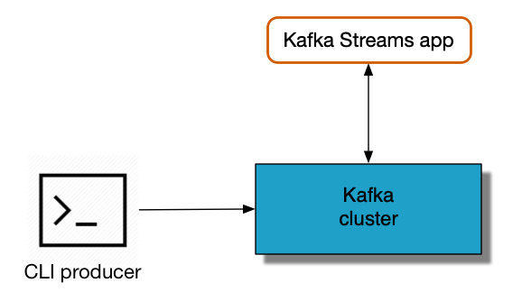
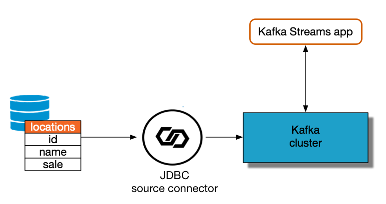
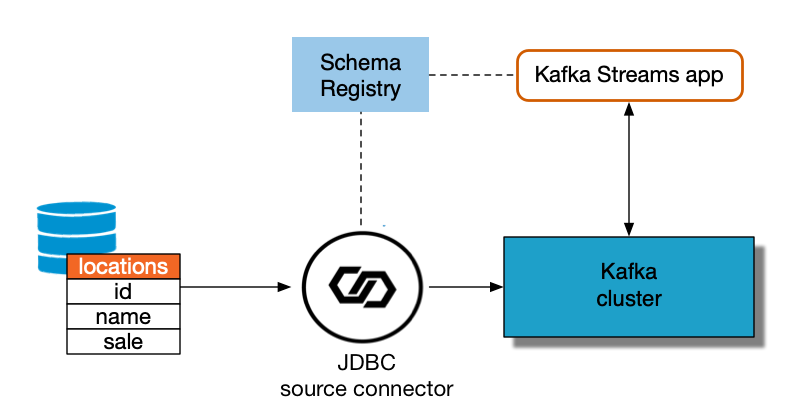
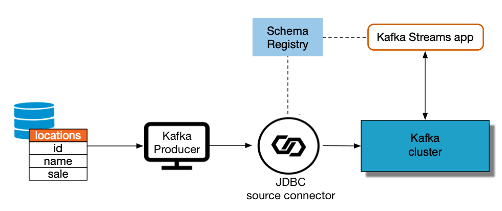
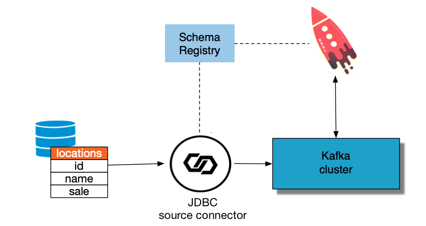

.. _examples-connect-streams-pipeline:

Pipelining with |kconnect-long|
===============================

This demo shows the various ways, with and without |kconnect-long|, to get data into |ak-tm| topics and then loaded for use by the |kstreams| API and ksqlDB.
2. Show some basic usage of the stream processing API

.. figure:: images/pipeline.jpg

Detailed walk-thru of this demo is available in the whitepaper `Kafka Serialization and Deserialization (SerDes) Examples <https://www.confluent.io/resources/kafka-streams-serialization-deserialization-code-examples>`__ and the blogpost `Building a Real-Time Streaming ETL Pipeline in 20 Minutes <https://www.confluent.io/blog/building-real-time-streaming-etl-pipeline-20-minutes/>`__

Prerequisites
=============

-  `Confluent Platform 5.5 <https://www.confluent.io/download/>`__
-  Maven command ``mvn`` to compile Java code
-  By default the ``timeout`` command is available on most Linux distributions but not Mac OS. This ``timeout`` command is used by the bash scripts to terminate consumer processes after a period of time.  To install it on a Mac:

.. code:: shell

   # Install coreutils
   brew install coreutils

   # Add a "gnubin" directory to your PATH
   PATH="/usr/local/opt/coreutils/libexec/gnubin:$PATH"

Description
===========

Example 1: Kafka console producer -> Key:String and Value:String
----------------------------------------------------------------

-  Command line ``confluent local produce`` produces ``String`` keys and ``String`` values to a Kafka topic.
-  :devx-examples:`Client application|connect-streams-pipeline/src/main/java/io/confluent/examples/connectandstreams/consoleproducer/StreamsIngest.java` reads from the Kafka topic using ``Serdes.String()`` for both key and value.

Notes
~~~~~

- `KAFKA-2526 <https://issues.apache.org/jira/browse/KAFKA-2526>`__: one cannot use the ``--key-serializer`` argument in the ``confluent local produce`` to serialize the key as a ``Long``. As a result, in this example the key is serialized as a ``String``. As a workaround, you could write your own kafka.common.MessageReader (e.g. check out the default implementation of LineMessageReader) and then you can specify ``--line-reader`` argument in the ``confluent local produce``.

Example 2: JDBC source connector with Single Message Transformations -> Key:Long and Value:JSON
-----------------------------------------------------------------------------------------------

-  :devx-examples:`Kafka Connect JDBC source connector|connect-streams-pipeline/jdbcjson-connector.properties` produces JSON values, and inserts the key using single message transformations, also known as ``SMTs``. This is helpful because by default JDBC source connector does not insert a key.
-  :devx-examples:`Client application|connect-streams-pipeline/src/main/java/io/confluent/examples/connectandstreams/jdbcjson/StreamsIngest.java` reads from the Kafka topic using ``Serdes.String()`` for key and a
   custom JSON Serde for the value.

Notes
~~~~~

- This example uses a few SMTs including one to cast the key to an ``int64``. The key uses the ``org.apache.kafka.connect.converters.LongConverter`` provided by `KAFKA-6913 <https://issues.apache.org/jira/browse/KAFKA-6913>`__.

Example 3: JDBC source connector with SpecificAvro -> Key:String(null) and Value:SpecificAvro
---------------------------------------------------------------------------------------------

-  :devx-examples:`Kafka Connect JDBC source connector|connect-streams-pipeline/jdbcspecificavro-connector.properties` produces Avro values, and null ``String`` keys, to a Kafka topic.
-  :devx-examples:`Client application|connect-streams-pipeline/src/main/java/io/confluent/examples/connectandstreams/jdbcspecificavro/StreamsIngest.java` reads from the Kafka topic using ``SpecificAvroSerde`` for the value and then the ``map`` function to convert the stream of messages to have ``Long`` keys and custom class values.

Notes
~~~~~

- This example uses a simple message transformation ``SetSchemaMetadata`` with code that has a fix for `KAFKA-5164 <https://issues.apache.org/jira/browse/KAFKA-5164>`__, allowing the connector to set the namespace in the schema. If you do not have the fix for `KAFKA-5164 <https://issues.apache.org/jira/browse/KAFKA-5164>`__, see Example 4 that uses ``GenericAvro`` instead of ``SpecificAvro``.

Example 4: JDBC source connector with GenericAvro -> Key:String(null) and Value:GenericAvro
-------------------------------------------------------------------------------------------

-  :devx-examples:`Kafka Connect JDBC source connector|connect-streams-pipeline/jdbcgenericavro-connector.properties` produces Avro values, and null ``String`` keys, to a Kafka topic.
-  :devx-examples:`Client application|connect-streams-pipeline/src/main/java/io/confluent/examples/connectandstreams/jdbcgenericavro/StreamsIngest.java` reads from the Kafka topic using ``GenericAvroSerde`` for the value and then the ``map`` function to convert the stream of messages to have ``Long`` keys and custom class values.

Notes
~~~~~

- This example currently uses ``GenericAvroSerde`` and not ``SpecificAvroSerde`` for a specific reason. JDBC source connector currently doesn’t set a namespace when it generates a schema name for the data it is producing to Kafka. For ``SpecificAvroSerde``, the lack of namespace is a problem when trying to match reader and writer schema because Avro uses the writer schema name and namespace to create a classname and tries to load this class, but without a namespace, the class will not be found.

Example 5: Java client producer with SpecificAvro -> Key:Long and Value:SpecificAvro
------------------------------------------------------------------------------------

-  :devx-examples:`Java client|connect-streams-pipeline/src/main/java/io/confluent/examples/connectandstreams/javaproducer/Driver.java` produces ``Long`` keys and ``SpecificAvro`` values to a Kafka topic.
-  :devx-examples:`Client application|connect-streams-pipeline/src/main/java/io/confluent/examples/connectandstreams/javaproducer/StreamsIngest.java` reads from the Kafka topic using ``Serdes.Long()`` for key and
   ``SpecificAvroSerde`` for the value.

Example 6: JDBC source connector with Avro to ksqlDB -> Key:Long and Value:Avro
-------------------------------------------------------------------------------

-  :devx-examples:`Kafka Connect JDBC source connector|connect-streams-pipeline/jdbcavroksql-connector.properties` produces Avro values, and null keys, to a Kafka topic.
-  :devx-examples:`ksqlDB|connect-streams-pipeline/jdbcavro_statements.sql` reads from the Kafka topic and then uses ``PARTITION BY`` to create a new stream of messages with ``BIGINT`` keys.

Stream processing
-----------------

All examples in this repo demonstrate the |kstreams| API methods ``count`` and ``reduce``.

Notes
~~~~~

- `KAFKA-5245 <https://issues.apache.org/jira/browse/KAFKA-5245>`__: one needs to provide the Serdes twice, (1) when calling ``StreamsBuilder#stream()`` and (2) when calling
``KStream#groupByKey()``
- `PR-531 <https://github.com/confluentinc/schema-registry/pull/531>`__: Confluent distribution provides packages for ``GenericAvroSerde`` and ``SpecificAvroSerde``
- `KAFKA-2378 <https://issues.apache.org/jira/browse/KAFKA-2378>`__: adds APIs to be able to embed Kafka Connect into client applications

Run
===

What Should I see?
------------------

After you run ``./start.sh``:

-  You should see each of the examples run end-to-end
-  If you are running Confluent Platform, open your browser and navigate to the Control Center web interface Management -> Kafka Connect tab at http://localhost:9021/management/connect to see the two deployed connectors
-  Beyond that, the real value of this demo is to see the provided configurations and client code

Original Dataset
----------------

:devx-examples:`Dataset|utils/table.locations`

::

   1|Raleigh|300
   2|Dusseldorf|100
   1|Raleigh|600
   3|Moscow|800
   4|Sydney|200
   2|Dusseldorf|400
   5|Chennai|400
   3|Moscow|100
   3|Moscow|200
   1|Raleigh|700

.. figure:: images/blog_stream.jpg

Expected Results
----------------

Count
~~~~~

::

   1|Raleigh|3
   2|Dusseldorf|2
   3|Moscow|3
   4|Sydney|1
   5|Chennai|1

.. figure:: images/blog_count.jpg

Sum
~~~

::

   1|Raleigh|1600
   2|Dusseldorf|500
   3|Moscow|1100
   4|Sydney|200
   5|Chennai|400

.. figure:: images/blog_sum.jpg
