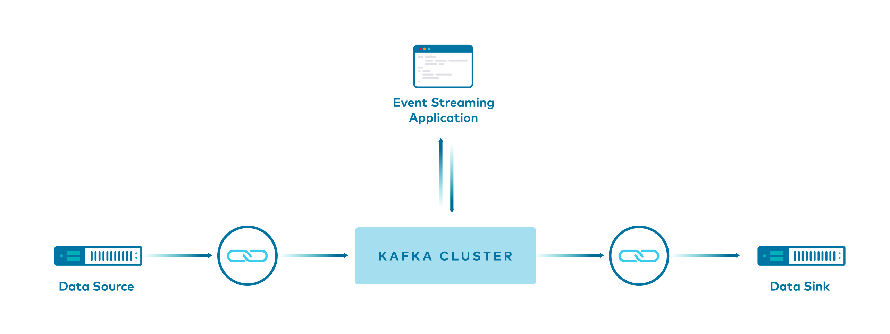
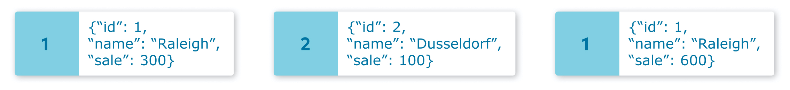
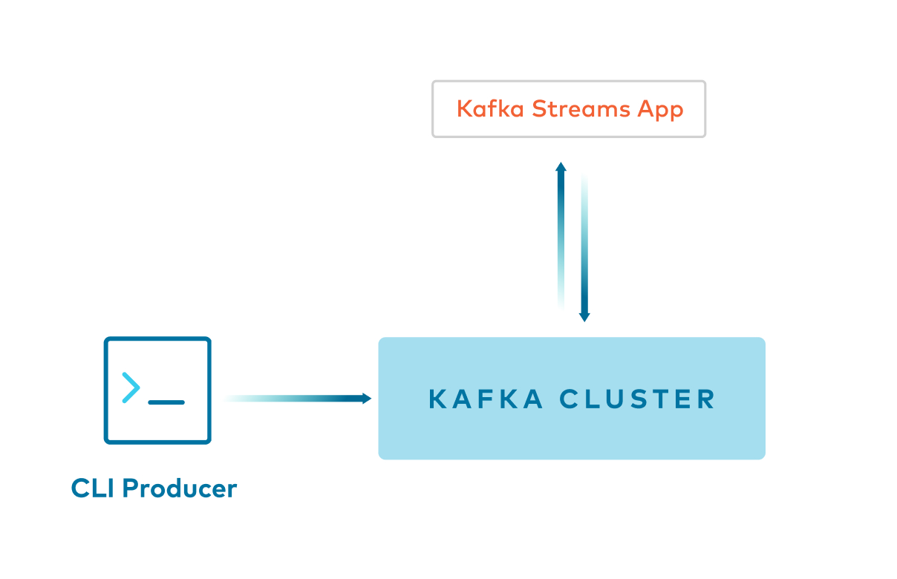
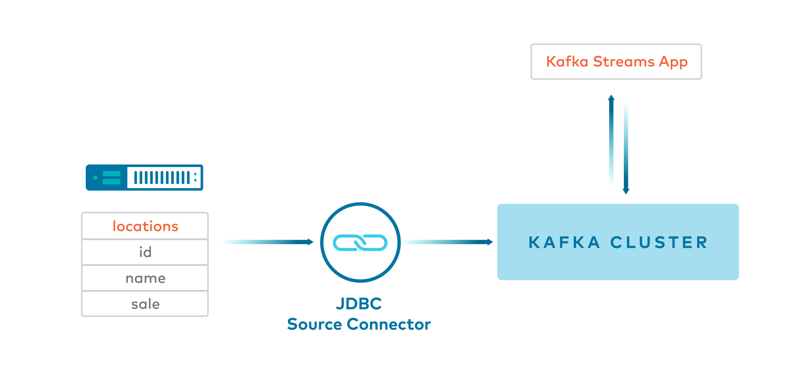
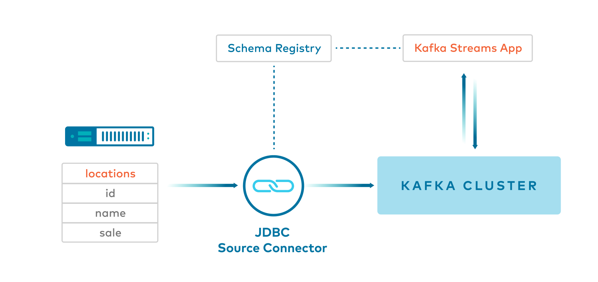
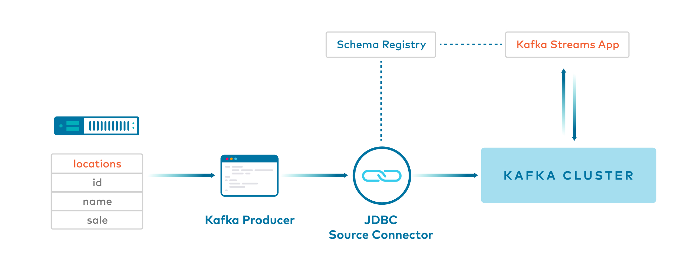
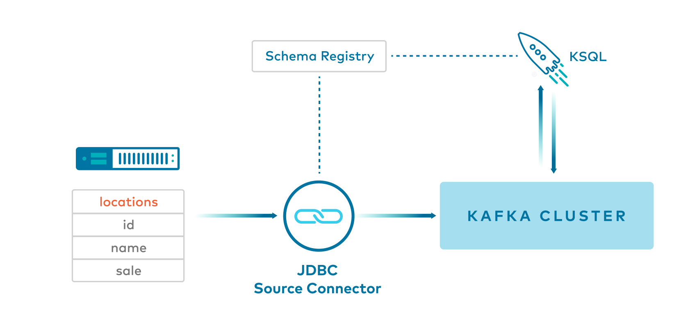

.. _demo-connect-streams-pipeline:

Pipelining with |kconnect-long| and |kstreams|
==============================================

Overview
--------

This example shows users how to build pipelines with |ak-tm|.

It showcases different ways to produce data to |ak-tm| topics, with and without |kconnect-long|, and various ways to serialize it for the |kstreams| API and ksqlDB.

+-----------------------------------------+--------------------------------+----------+----------------+-------------------+
| Example                                 | Produce to Kafka Topic         | Key      | Value          | Stream Processing |
+=========================================+================================+==========+================+===================+
| Confluent CLI Producer with String      | CLI                            | `String` | `String`       | Kafka Streams     |
+-----------------------------------------+--------------------------------+----------+----------------+-------------------+
| JDBC source connector with JSON         | JDBC with SMT to add key       | `Long`   | `Json`         | Kafka Streams     |
+-----------------------------------------+--------------------------------+----------+----------------+-------------------+
| JDBC source connector with SpecificAvro | JDBC with SMT to set namespace | null     | `SpecificAvro` | Kafka Streams     |
+-----------------------------------------+--------------------------------+----------+----------------+-------------------+
| JDBC source connector with GenericAvro  | JDBC                           | null     | `GenericAvro`  | Kafka Streams     |
+-----------------------------------------+--------------------------------+----------+----------------+-------------------+
| Java producer with SpecificAvro         | Producer                       | `Long`   | `SpecificAvro` | Kafka Streams     |
+-----------------------------------------+--------------------------------+----------+----------------+-------------------+
| JDBC source connector with Avro         | JDBC                           | `Long`   | `Avro`         | ksqlDB            |
+-----------------------------------------+--------------------------------+----------+----------------+-------------------+

Detailed walk-thru of this example is available in the whitepaper `Kafka Serialization and Deserialization (SerDes) Examples <https://www.confluent.io/resources/kafka-streams-serialization-deserialization-code-examples>`__ and the blog post `Building a Real-Time Streaming ETL Pipeline in 20 Minutes <https://www.confluent.io/blog/building-real-time-streaming-etl-pipeline-20-minutes/>`__

|ccloud|
--------

You can apply the same concepts explained in this example to |ccloud|.
|ccloud| also has fully managed connectors that you can use, instead of self-managing your own, so that you can run 100% in the cloud.
To try it out, create your own |ccloud| instance (see :ref:`ccloud-stack` for an easy way to spin up a new environment), deploy a connector, and then point your applications to |ccloud|.

.. include:: ../../ccloud/docs/includes/ccloud-examples-promo-code.rst

Description of Data
-------------------

The original data is a :devx-examples:`table of locations|utils/table.locations` that resembles this.

::

   id|name|sale

   1|Raleigh|300
   2|Dusseldorf|100
   1|Raleigh|600
   3|Moscow|800
   4|Sydney|200
   2|Dusseldorf|400
   5|Chennai|400
   3|Moscow|100
   3|Moscow|200
   1|Raleigh|700

It produces records to a Kafka topic:

The actual client application uses the methods ``count`` and ``sum`` to process this data, grouped by each city.

The output of ``count`` is:

::

   1|Raleigh|3
   2|Dusseldorf|2
   3|Moscow|3
   4|Sydney|1
   5|Chennai|1

The output of ``sum`` is:

::

   1|Raleigh|1600
   2|Dusseldorf|500
   3|Moscow|1100
   4|Sydney|200
   5|Chennai|400

Prerequisites
-------------

- Download `Confluent Platform <https://www.confluent.io/download/>`__
- Maven command ``mvn`` to compile Java code
- .. include:: ../../ccloud/docs/includes/prereq_timeout.rst

Run example
-----------

#. Clone the `examples GitHub repository <https://github.com/confluentinc/examples>`__ and check out the :litwithvars:`|release|-post` branch.

   .. codewithvars:: bash

     git clone https://github.com/confluentinc/examples
     cd examples
     git checkout |release|-post

#. Change directory to the connect-streams-pipeline example.

   .. sourcecode:: bash

     cd connect-streams-pipeline
   
#. Run the examples end-to-end:

   .. sourcecode:: bash

     ./start.sh

#. If you are running |cp|, open your browser and navigate to the |c3| web interface Management -> Connect tab at http://localhost:9021/management/connect to see the data in the Kafka topics and the deployed connectors.

.. _connect-streams-pipeline-example-1:

Example 1: Kafka console producer -> Key:String and Value:String
----------------------------------------------------------------

- Command line ``confluent local services kafka produce`` produces ``String`` keys and ``String`` values to a Kafka topic.
- :devx-examples:`Client application|connect-streams-pipeline/src/main/java/io/confluent/examples/connectandstreams/consoleproducer/StreamsIngest.java` reads from the Kafka topic using ``Serdes.String()`` for both key and value.

.. _connect-streams-pipeline-example-2:

Example 2: JDBC source connector with Single Message Transformations -> Key:Long and Value:JSON
-----------------------------------------------------------------------------------------------

- :devx-examples:`Kafka Connect JDBC source connector|connect-streams-pipeline/jdbcjson-connector.properties` produces JSON values, and inserts the key using single message transformations, also known as ``SMTs``. This is helpful because by default JDBC source connector does not insert a key.
- This example uses a few SMTs including one to cast the key to an ``int64``. The key uses the ``org.apache.kafka.connect.converters.LongConverter`` provided by `KAFKA-6913 <https://issues.apache.org/jira/browse/KAFKA-6913>`__.

.. literalinclude:: ../jdbcjson-connector.properties

- :devx-examples:`Client application|connect-streams-pipeline/src/main/java/io/confluent/examples/connectandstreams/jdbcjson/StreamsIngest.java` reads from the Kafka topic using ``Serdes.Long()`` for key and a custom JSON Serde for the value.

.. _connect-streams-pipeline-example-3:

Example 3: JDBC source connector with SpecificAvro -> Key:String(null) and Value:SpecificAvro
---------------------------------------------------------------------------------------------

- :devx-examples:`Kafka Connect JDBC source connector|connect-streams-pipeline/jdbcspecificavro-connector.properties` produces Avro values, and null ``String`` keys, to a Kafka topic.
- This example uses a single message transformation (SMT) called ``SetSchemaMetadata`` with code that has a fix for `KAFKA-5164 <https://issues.apache.org/jira/browse/KAFKA-5164>`__, allowing the connector to set the namespace in the schema. If you do not have the fix for `KAFKA-5164 <https://issues.apache.org/jira/browse/KAFKA-5164>`__, see Example 4 that uses ``GenericAvro`` instead of ``SpecificAvro``.

.. literalinclude:: ../jdbcspecificavro-connector.properties

- :devx-examples:`Client application|connect-streams-pipeline/src/main/java/io/confluent/examples/connectandstreams/jdbcspecificavro/StreamsIngest.java` reads from the Kafka topic using ``SpecificAvroSerde`` for the value and then the ``map`` function to convert the stream of messages to have ``Long`` keys and custom class values.

.. _connect-streams-pipeline-example-4:

Example 4: JDBC source connector with GenericAvro -> Key:String(null) and Value:GenericAvro
-------------------------------------------------------------------------------------------

- :devx-examples:`Kafka Connect JDBC source connector|connect-streams-pipeline/jdbcgenericavro-connector.properties` produces Avro values, and null ``String`` keys, to a Kafka topic.

.. literalinclude:: ../jdbcgenericavro-connector.properties

- :devx-examples:`Client application|connect-streams-pipeline/src/main/java/io/confluent/examples/connectandstreams/jdbcgenericavro/StreamsIngest.java` reads from the Kafka topic using ``GenericAvroSerde`` for the value and then the ``map`` function to convert the stream of messages to have ``Long`` keys and custom class values.
- This example currently uses ``GenericAvroSerde`` and not ``SpecificAvroSerde`` for a specific reason. JDBC source connector currently doesn’t set a namespace when it generates a schema name for the data it is producing to Kafka. For ``SpecificAvroSerde``, the lack of namespace is a problem when trying to match reader and writer schema because Avro uses the writer schema name and namespace to create a classname and tries to load this class, but without a namespace, the class will not be found.

.. _connect-streams-pipeline-example-5:

Example 5: Java client producer with SpecificAvro -> Key:Long and Value:SpecificAvro
------------------------------------------------------------------------------------

- :devx-examples:`Java client|connect-streams-pipeline/src/main/java/io/confluent/examples/connectandstreams/javaproducer/Driver.java` produces ``Long`` keys and ``SpecificAvro`` values to a Kafka topic.
- :devx-examples:`Client application|connect-streams-pipeline/src/main/java/io/confluent/examples/connectandstreams/javaproducer/StreamsIngest.java` reads from the Kafka topic using ``Serdes.Long()`` for key and ``SpecificAvroSerde`` for the value.

.. _connect-streams-pipeline-example-6:

Example 6: JDBC source connector with Avro to ksqlDB -> Key:Long and Value:Avro
-------------------------------------------------------------------------------

- :devx-examples:`Kafka Connect JDBC source connector|connect-streams-pipeline/jdbcavroksql-connector.properties` produces Avro values, and null keys, to a Kafka topic.

.. literalinclude:: ../jdbcavroksql-connector.properties

- :devx-examples:`ksqlDB|connect-streams-pipeline/jdbcavro_statements.sql` reads from the Kafka topic and then uses ``PARTITION BY`` to create a new stream of messages with ``BIGINT`` keys.

Technical Notes
---------------

- `KAFKA-5245 <https://issues.apache.org/jira/browse/KAFKA-5245>`__: one needs to provide the Serdes twice, (1) when calling ``StreamsBuilder#stream()`` and (2) when calling ``KStream#groupByKey()``
- `PR-531 <https://github.com/confluentinc/schema-registry/pull/531>`__: Confluent distribution provides packages for ``GenericAvroSerde`` and ``SpecificAvroSerde``
- `KAFKA-2378 <https://issues.apache.org/jira/browse/KAFKA-2378>`__: adds APIs to be able to embed Kafka Connect into client applications
- `KAFKA-2526 <https://issues.apache.org/jira/browse/KAFKA-2526>`__: one cannot use the ``--key-serializer`` argument in ``confluent local services kafka produce`` to serialize the key as a ``Long``. As a result, in this example the key is serialized as a ``String``. As a workaround, you could write your own kafka.common.MessageReader (e.g. check out the default implementation of LineMessageReader) and then you can specify ``--line-reader`` argument in ``confluent local services kafka produce``.
- `KAFKA-5164 <https://issues.apache.org/jira/browse/KAFKA-5164>`__: allows the connector to set the namespace in the schema.
