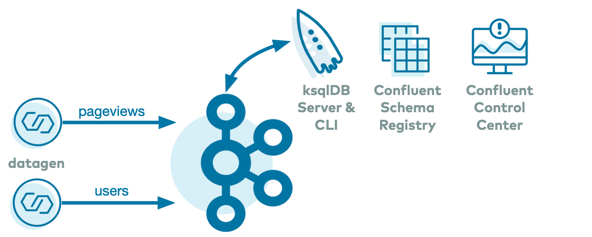

# Overview

The Confluent Platform Quickstart demo is the automated version of the [Confluent Platform Quickstart](https://docs.confluent.io/platform/current/quickstart/index.html?utm_source=github&utm_medium=demo&utm_campaign=ch.examples_type.community_content.cp-quickstart)



## Additional Examples

For additional examples that showcase streaming applications within an event streaming platform, please refer to [these demos](https://github.com/confluentinc/examples).

# Prerequisites

* [Common demo prerequisites](https://github.com/confluentinc/examples#prerequisites)
* [Confluent Platform 8.1](https://www.confluent.io/download/?utm_source=github&utm_medium=demo&utm_campaign=ch.examples_type.community_content.cp-quickstart)

# Run demo

## Confluent Platform

* [Confluent Platform Quick Start](https://docs.confluent.io/platform/current/platform-quickstart.html?utm_source=github&utm_medium=demo&utm_campaign=ch.examples_type.community_content.cp-quickstart) for the local Docker version of Confluent Platform: run the command below and then open your browser and navigate to the Control Center at http://localhost:9021/:

```bash
./start.sh
```

In order to Confluent Platform with community components only, run the command below:

```bash
./start-community.sh
```

## Confluent Cloud

* This quickstart for Confluent Cloud is similar to those above for Confluent Platform, but leverages 100% Confluent Cloud services, including a [ksqlDB application](statements-cloud.sql) which builds streams and tables using Avro, Protobuf and JSON based formats. After logging into the Confluent CLI, run the command below and open your browser navigating to https://confluent.cloud. Note: the demo creates real cloud resources and incurs charges.

```bash
./start-cloud.sh
```

### Advanced usage

You may explicitly set the cloud provider and region. For example:

```bash
CLUSTER_CLOUD=aws CLUSTER_REGION=us-west-2 ./start-cloud.sh
```

Here are the variables and their default values:

| Variable | Default |
| --- | --- |
| CLUSTER_CLOUD | aws |
| CLUSTER_REGION | us-west-2 |
