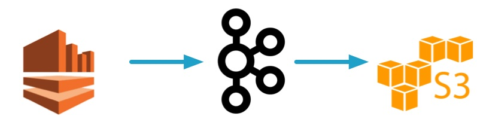

# Overview

This demo showcases a Kinesis -> Kafka -> AWS S3 pipeline.



Benefits:

* Leverage Kafka's rich ecosystem of a full event streaming platform
* Span datacenters and cloud providers
* Aggregate data in single source of truth
* Use KSQL


# Prerequisites

## Local

As with the other demos in this repo, you may run the entire demo end-to-end with `./start.sh`, and it runs on your local Confluent Platform install.  This requires the following:

* [Common demo prerequisites](https://github.com/confluentinc/examples#prerequisites)
* [Confluent Platform 5.2](https://www.confluent.io/download/)
* [An initialized Confluent Cloud cluster used for development only](https://confluent.cloud)
* `jq`
* AWS related requirements
  * `aws cli`
  * AWS properly credentials configured on your host
  * Access to Kinesis S3


# Run the demo

1. Run the demo:

```bash
$ ./start.sh
```

2. View all the Kinesis, Kafka, and S3 data after bring-up:

```bash
$ ./read-data.sh
```

3. Stop the demo and clean up:

```bash
$ ./stop.sh
```
