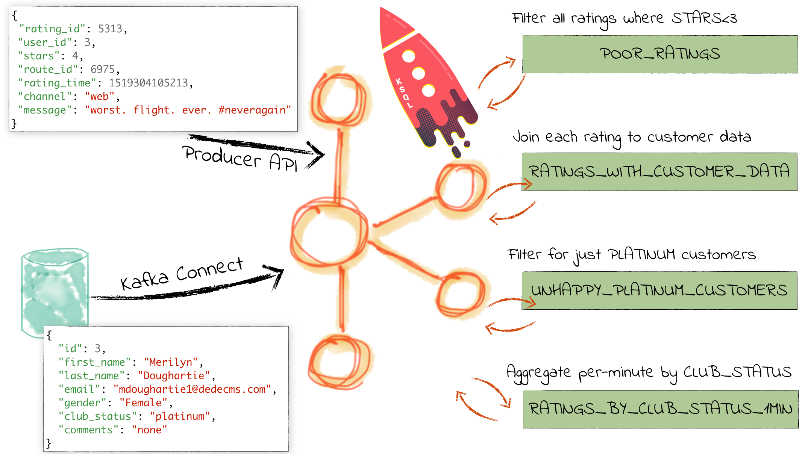
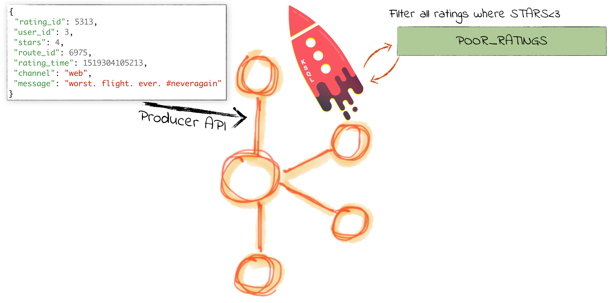
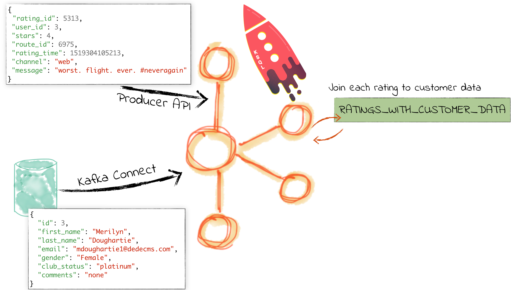
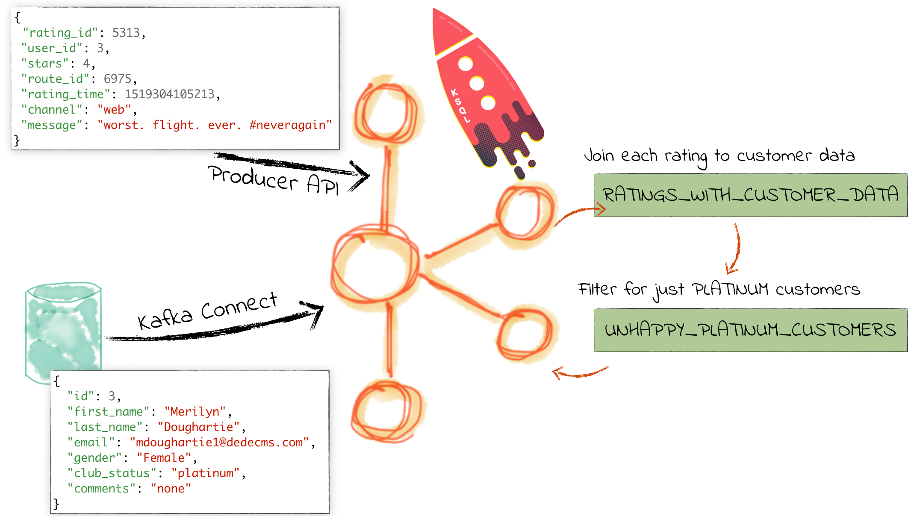
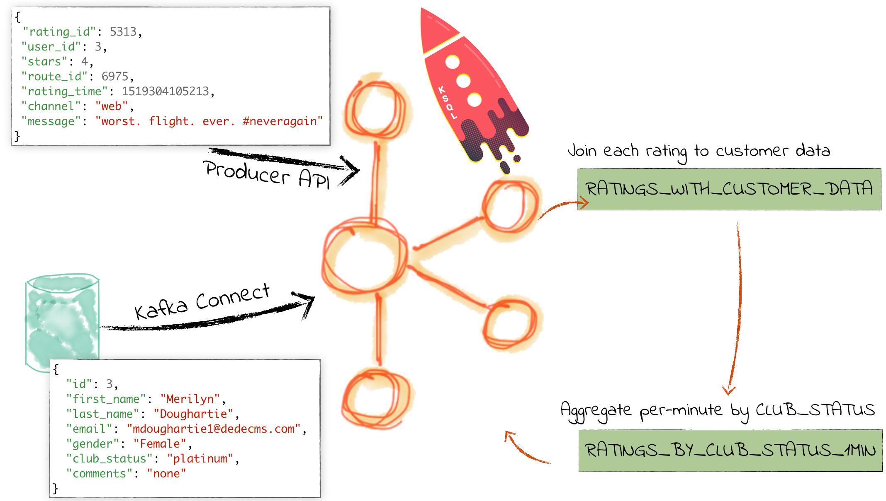

= Workshop: Real-time SQL Stream Processing at Scale with Apache Kafka and KSQL
:source-highlighter: pygments
:doctype: book
:sectnums:
Robin Moffatt <@rmoff>
v0.10, 19 Jun 2018

:toc:

== Introduction

This is a two-hour hands-on workshop.

[quote]
____
KSQL is the streaming SQL engine for Apache Kafka. Using just SQL it is possible for developers to build powerful stream processing applications. This talk will show practical examples of KSQL:

* Filtering streams of data
* Joining live events with reference data (e.g. from a database)
* Stateful aggregations
* Convert streams from JSON to AVRO
____

Don't forget to check out the #ksql channel on our https://slackpass.io/confluentcommunity[Community Slack group]

——_Robin Moffatt https://twitter.com/rmoff/[@rmoff], 19 Jun 2018_

== Pre-requisites

* Docker
* Docker Compose
* 8GB+ RAM

IMPORTANT: *THIS MUST BE DONE _BEFORE_ THE WORKSHOP - The docker images are large and will take time to download. Please don't wait until the workshop as the wi-fi will not cope!*

[IMPORTANT]
====

0. In Docker’s advanced settings, increase the memory dedicated to Docker to at least 8GB.
** Don't forget to do this

1. Clone the workshop repo to your local machine:
+
[source,bash]
----
git clone https://github.com/confluentinc/demo-scene.git
----

0. Did you remember to increase the memory dedicated to Docker to at least 8GB?
** You really do need to do this

2. Change working directory
+
[source,bash]
----
cd ksql-workshop
----

0. How much memory did you allocate to Docker? It needs to be >= 8 GB!
** Nothing will work if you don't do this

3. Pull all required docker images—this will take a while!
+
[source,bash]
----
docker-compose pull
----
====

== Start Confluent Platform

NOTE: In Docker’s advanced settings, increase the memory dedicated to Docker to at least 8GB.

[source,bash]
----
cd ksql-workshop
docker-compose up -d
docker-compose logs -f kafka|grep "INFO Kafka version"
----

Once you see output then it means Kafka is running and you can proceed

[source,bash]
----
$ docker-compose logs -f kafka|grep "INFO Kafka version"
kafka_1                 | [2018-06-19 11:37:32,586] INFO Kafka version : 1.1.1-cp1 (org.apache.kafka.common.utils.AppInfoParser)
----

Press Ctrl-C twice to exit the `docker-compose logs` command

Run `docker-compose ps` to confirm that all components are running:

[source,bash]
----
$ docker-compose ps
Name                            Command               State                        Ports
---------------------------------------------------------------------------------------------------------------------------
ksql-workshop_datagen-ratings_1   bash -c echo Waiting for K ...   Up
ksql-workshop_kafka_1             /etc/confluent/docker/run        Up      0.0.0.0:29092->29092/tcp, 0.0.0.0:9092->9092/tcp
ksql-workshop_ksql-cli_1          perl -e while(1){ sleep 99 ...   Up
ksql-workshop_ksql-server_1       bash -c echo Waiting for K ...   Up      0.0.0.0:8088->8088/tcp
ksql-workshop_schema-registry_1   /etc/confluent/docker/run        Up      0.0.0.0:8081->8081/tcp
ksql-workshop_zookeeper_1         /etc/confluent/docker/run        Up      0.0.0.0:2181->2181/tcp, 2888/tcp, 3888/tcp
----

== Source Data : Rating events

The event stream driving this example is a simulated stream of events purporting to show the ratings left by users on a website, with data elements including the device type that they used, the star rating, and a message associated with the rating.

=== Inspect the ratings data

[source,bash]
----
docker run --network ksql-workshop_default \
          --tty --interactive \
          confluentinc/cp-kafkacat \
          kafkacat -b kafka:29092 -C -K: \
          -f '\nKey (%K bytes): %k\t\nValue (%S bytes): %s\n\Partition: %p\tOffset: %o\n--\n' \
          -t ratings
----

Note that the data is in Avro, so you will see lots of special characters in the output.

Press Ctrl-C to cancel and return to the command prompt.

== Source Data : Customers

To keep things simple, we're going to mock up the data that would be coming from our customers table on a database. In practice you would ingest the data using https://www.confluent.io/blog/no-more-silos-how-to-integrate-your-databases-with-apache-kafka-and-cdc[Kafka Connect and CDC]

=== Populate customer data

Run the following command to send the customer data to the `customers` topic:

[source,bash]
----
cat data/customers.json | \
docker run --interactive \
           --network ksql-workshop_default \
           confluentinc/cp-kafkacat \
           kafkacat -b kafka:29092 \
                    -t customers \
                    -P
----

Note that there is no output from this command. We will verify its success in the next step.

=== Inspect customer data

Run this command to inspect the content of the `customers` topic that we populated above. Note the use of https://github.com/edenhill/kafkacat/[`kafkacat` ] for showing the messages and detailed metadata.

[source,bash]
----
docker run --network ksql-workshop_default \
          --tty --interactive \
          confluentinc/cp-kafkacat \
          kafkacat -b kafka:29092 -C -K: \
          -f '\nKey (%K bytes): %k\t\nValue (%S bytes): %s\n\Partition: %p\tOffset: %o\n--\n' \
          -t customers
----

You should see ten messages, similar to this:

----
Key (-1 bytes):
Value (168 bytes): {"id":1,"first_name":"Annemarie","last_name":"Arent","email":"aarent0@cpanel.net","gender":"Female","club_status":"platinum","comments":"Organized web-enabled ability"}
Partition: 0    Offset: 0
--
----

Press Ctrl-C to cancel and return to the command prompt.

<<<

== KSQL CLI

KSQL can be used via the command line interface (CLI), a graphical UI built into Confluent Control Center, or the documented https://docs.confluent.io/current/ksql/docs/api.html[REST API].

In this workshop we will use the CLI, which if you have used Oracle's sql*plus, MySQL CLI, and so on will feel very familiar to you.

Launch the CLI:

[source,bash]
----
docker-compose exec ksql-cli ksql http://ksql-server:8088
----

Make sure that you get a successful start up screen:

[source,bash]
----
Copyright 2017 Confluent Inc.

CLI v5.0.0-SNAPSHOT, Server v5.0.0-SNAPSHOT located at http://ksql-server:8088

Having trouble? Type 'help' (case-insensitive) for a rundown of how things work!

ksql>
----

== See available Kafka topics

KSQL can be used to view the topic metadata on a Kafka cluster (`SHOW TOPICS;`), as well as inspect the messages in a topic (`PRINT <topic>;`).

[source,sql]
----
ksql> SHOW TOPICS;
 Kafka Topic        | Registered | Partitions | Partition Replicas | Consumers | ConsumerGroups
------------------------------------------------------------------------------------------------
 _confluent-metrics | false      | 12         | 1                  | 0         | 0
 _schemas           | false      | 1          | 1                  | 0         | 0
 customers          | false      | 1          | 1                  | 0         | 0
 ratings            | false      | 1          | 1                  | 0         | 0
------------------------------------------------------------------------------------------------
----

=== Inspect a topic contents - Ratings

Using the `PRINT` command we can easily see column names and values within a topic's messages. Kafka messages consist of a timestamp, key, and message (payload), which are all shown in the `PRINT` output.

[TIP]
====
Note that we don't need to know the format of the data; KSQL introspects the data and understands how to deserialise it.
====

[source,sql]
----
ksql> PRINT 'ratings';
Format:AVRO
22/02/18 12:55:04 GMT, 5312, {"rating_id": 5312, "user_id": 4, "stars": 4, "route_id": 2440, "rating_time": 1519304104965, "channel": "web", "message": "Surprisingly good, maybe you are getting your mojo back at long last!"}
22/02/18 12:55:05 GMT, 5313, {"rating_id": 5313, "user_id": 3, "stars": 4, "route_id": 6975, "rating_time": 1519304105213, "channel": "web", "message": "why is it so difficult to keep the bathrooms clean ?"}
----

Press Ctrl-C to cancel and return to the KSQL prompt.

<<<
=== Inspect a topic contents - Customers

Here we use the `FROM BEGINNING` argument, which tells KSQL to go back to the _beginning_ of the topic and show all data from there

[source,sql]
----
ksql> PRINT 'customers' FROM BEGINNING;
Format:JSON
{"ROWTIME":1529499994472,"ROWKEY":"null","id":1,"first_name":"Annemarie","last_name":"Arent","email":"aarent0@cpanel.net","gender":"Female","club_status":"platinum","comments":"Organized web-enabled ability"}
{"ROWTIME":1529499994472,"ROWKEY":"null","id":2,"first_name":"Merilyn","last_name":"Doughartie","email":"mdoughartie1@dedecms.com","gender":"Female","club_status":"platinum","comments":"Optimized local definition"}
----

Press Ctrl-C to cancel and return to the KSQL prompt.

<<<
== KSQL offsets

Since Apache Kafka persists data, it is possible to use KSQL to query and process data from the past, as well as new events that arrive on the topic.

To tell KSQL to process from beginning of topic run:

`SET 'auto.offset.reset' = 'earliest';`

Run this now, so that future processing includes all existing data—this is important for the Customer data, since no new messages are arriving on this topic and thus we need to make sure we work with the messages already present.

[source,sql]
----
ksql> SET 'auto.offset.reset' = 'earliest';
Successfully changed local property 'auto.offset.reset' from 'null' to 'earliest'
----

<<<
== Querying and processing the Ratings topic

Having inspected the topics and contents of them, let's get into some SQL now. The first step in KSQL is to register the source topic with KSQL.

=== Register the ratings topic

The inbound event stream of ratings data is a `STREAM`—later we will talk about `TABLE`, but for now, we just need a simple `CREATE STREAM` with the appropriate values in the `WITH` clause:

[source,sql]
----
ksql> CREATE STREAM ratings WITH (KAFKA_TOPIC='ratings', VALUE_FORMAT='AVRO');

 Message
---------------
 Table created
---------------
----

=== Describe ratings stream

You'll notice that in the above `CREATE STREAM` statement we didn't specify any of the column names. That's because the data is in Avro format, and the Confluent Schema Registry supplies the actual schema details. You can use `DESCRIBE` to examine an object's columns:

[source,sql]
----
ksql> DESCRIBE ratings;
Name                 : RATINGS
 Field       | Type
-----------------------------------------
 ROWTIME     | BIGINT           (system)
 ROWKEY      | VARCHAR(STRING)  (system)
 RATING_ID   | BIGINT
 USER_ID     | INTEGER
 STARS       | INTEGER
 ROUTE_ID    | INTEGER
 RATING_TIME | BIGINT
 CHANNEL     | VARCHAR(STRING)
 MESSAGE     | VARCHAR(STRING)
-----------------------------------------
For runtime statistics and query details run: DESCRIBE EXTENDED <Stream,Table>;
ksql>
----

Note the presence of a couple of `(system)` columns here. `ROWTIME` is the timestamp of the Kafka message—important for when we do time-based aggregations later— and `ROWKEY` is the key of the Kafka message.

=== Querying data in KSQL

Let's run our first SQL. As anyone familar with SQL knows, `SELECT *` will return all columns from a given object. So let's try it!

[source,sql]
----
ksql> SELECT * FROM ratings;
1529501380124 | 6229 | 6229 | 17 | 2 | 3957 | 1529501380124 | iOS-test | why is it so difficult to keep the bathrooms clean ?
1529501380197 | 6230 | 6230 | 14 | 2 | 2638 | 1529501380197 | iOS | your team here rocks!
1529501380641 | 6231 | 6231 | 12 | 1 | 9870 | 1529501380641 | iOS-test | (expletive deleted)
[…]
----

You'll notice that the data keeps on coming. That is because KSQL is fundamentally a _streaming engine_, and the queries that you run are _continuous queries_. Having previously set the offset to `earliest` KSQL is showing us the *past* (data from the beginning of the topic), the *present* (data now arriving in the topic), and the *future* (all new data that arrives in the topic from now on).

Press Ctrl-C to cancel the query and return to the KSQL command prompt.

To inspect a finite set of data, you can use the `LIMIT` clause. Try it out now:

[source,sql]
----
ksql> SELECT * FROM ratings LIMIT 5;
1529499830648 | 1 | 1 | 8 | 1 | 7562 | 1529499829398 | ios | more peanuts please
1529499830972 | 2 | 2 | 5 | 4 | 54 | 1529499830972 | iOS | your team here rocks!
1529499831203 | 3 | 3 | 16 | 1 | 9809 | 1529499831203 | web | airport refurb looks great, will fly outta here more!
1529499831521 | 4 | 4 | 5 | 1 | 7691 | 1529499831521 | web | thank you for the most friendly, helpful experience today at your new lounge
1529499831814 | 5 | 5 | 19 | 3 | 389 | 1529499831814 | ios | thank you for the most friendly, helpful experience today at your new lounge
Limit Reached
Query terminated
ksql>
----

=== Filtering streams of data in KSQL

Since KSQL is heavily based on SQL, you can do many of the standard SQL things you'd expect to be able to do, including predicates and selection of specific columns:

[source,sql]
----
ksql> SELECT USER_ID, STARS, CHANNEL, MESSAGE FROM ratings WHERE STARS <3 AND CHANNEL='iOS' LIMIT 3;
3 | 2 | iOS | your team here rocks!
2 | 1 | iOS | worst. flight. ever. #neveragain
15 | 2 | iOS | worst. flight. ever. #neveragain
Limit Reached
Query terminated
ksql>
----

=== Creating a Kafka topic populated by a filtered stream

Let's take the poor ratings from people with iOS devices, and create a new stream from them!

[source,sql]
----
ksql> CREATE STREAM POOR_RATINGS AS SELECT * FROM ratings WHERE STARS <3 AND CHANNEL='iOS';

 Message
----------------------------
 Stream created and running
----------------------------
----

What this does is set a KSQL continuous query running that processes messages on the source `ratings` topic to:

* applies the predicates (`STARS<3 AND CHANNEL='iOS'``)
* selects just the specified columns
** If you wanted to take all columns from the source stream, you would simply use `SELECT *`

Each processed message is written to a new Kafka topic. Remember, this is a _continuous query_, so every single source message—past, present, and future—will be processed with low-latency in this way.

_This method of creating derived topics is frequently referred to by the acronym of the statement—`CSAS` (-> `CREATE STREAM … AS SELECT`)._

==== Inspect the derived stream

Using `DESCRIBE` we can see that the new stream has the same columns as the source one.

[source,sql]
----
ksql> DESCRIBE POOR_RATINGS;
Name                 : POOR_RATINGS
 Field       | Type
-----------------------------------------
 ROWTIME     | BIGINT           (system)
 ROWKEY      | VARCHAR(STRING)  (system)
 RATING_ID   | BIGINT
 USER_ID     | INTEGER
 STARS       | INTEGER
 ROUTE_ID    | INTEGER
 RATING_TIME | BIGINT
 CHANNEL     | VARCHAR(STRING)
 MESSAGE     | VARCHAR(STRING)
-----------------------------------------
For runtime statistics and query details run: DESCRIBE EXTENDED <Stream,Table>;
ksql>
----

Additional information about the derived stream is available with the `DESCRIBE EXTENDED` command:

[source,sql]
----
ksql> DESCRIBE EXTENDED POOR_RATINGS;
Name                 : POOR_RATINGS
Type                 : STREAM
Key field            :
Key format           : STRING
Timestamp field      : Not set - using <ROWTIME>
Value format         : AVRO
Kafka topic          : POOR_RATINGS (partitions: 4, replication: 1)

 Field       | Type
-----------------------------------------
 ROWTIME     | BIGINT           (system)
 ROWKEY      | VARCHAR(STRING)  (system)
 RATING_ID   | BIGINT
 USER_ID     | INTEGER
 STARS       | INTEGER
 ROUTE_ID    | INTEGER
 RATING_TIME | BIGINT
 CHANNEL     | VARCHAR(STRING)
 MESSAGE     | VARCHAR(STRING)
-----------------------------------------

Queries that write into this STREAM
-----------------------------------
CSAS_POOR_RATINGS_0 : CREATE STREAM POOR_RATINGS AS SELECT * FROM ratings WHERE STARS <3 AND CHANNEL='iOS';

For query topology and execution plan please run: EXPLAIN <QueryId>

Local runtime statistics
------------------------
messages-per-sec:     10.04   total-messages:       998     last-message: 6/20/18 1:46:09 PM UTC
 failed-messages:         0 failed-messages-per-sec:         0      last-failed:       n/a
(Statistics of the local KSQL server interaction with the Kafka topic POOR_RATINGS)
ksql>
----

Note the *runtime statistics* above. If you re-run the `DESCRIBE EXTENDED` command you'll see these values increasing.

----
Local runtime statistics
------------------------
messages-per-sec:      0.33   total-messages:      1857     last-message: 6/20/18 2:33:26 PM UTC
 failed-messages:         0 failed-messages-per-sec:         0      last-failed:       n/a
(Statistics of the local KSQL server interaction with the Kafka topic POOR_RATINGS)
----

_N.B. you can use the up arrow on your keyboard to cycle through KSQL command history for easy access and replay of previous commands. Ctrl-R also works for searching command history._

==== Query the stream

The derived stream that we've created is just another stream that we can interact with in KSQL as any other. If you run a `SELECT` against the stream you'll see new messages arriving based on those coming from the source `ratings` topic:

[source,sql]
----
ksql> SELECT STARS, CHANNEL, MESSAGE FROM POOR_RATINGS;
1 | iOS | worst. flight. ever. #neveragain
2 | iOS | Surprisingly good, maybe you are getting your mojo back at long last!
2 | iOS | thank you for the most friendly, helpful experience today at your new lounge
----

Press Ctrl-C to cancel and return to the KSQL prompt.

==== It's just a Kafka topic…

The query that we created above (`CREATE STREAM POOR_RATINGS AS…`) populates a Kafka topic, which we can also access as a KSQL stream (as in the previous step). Let's inspect this topic now, using KSQL.

Observe that the topic exists:

[source,sql]
----
ksql> SHOW TOPICS;

 Kafka Topic        | Registered | Partitions | Partition Replicas | Consumers | ConsumerGroups
------------------------------------------------------------------------------------------------
 _confluent-metrics | false      | 12         | 1                  | 0         | 0
 _schemas           | false      | 1          | 1                  | 0         | 0
 customers          | false      | 1          | 1                  | 0         | 0
 POOR_RATINGS       | true       | 4          | 1                  | 0         | 0
 ratings            | true       | 1          | 1                  | 1         | 1
------------------------------------------------------------------------------------------------
ksql>
----

Inspect the Kafka topic's data

[source,bash]
----
ksql> print 'POOR_RATINGS';
Format:AVRO
6/20/18 11:01:03 AM UTC, 37, {"RATING_ID": 37, "USER_ID": 12, "STARS": 2, "ROUTE_ID": 8916, "RATING_TIME": 1529492463400, "CHANNEL": "iOS", "MESSAGE": "more peanuts please"}
6/20/18 11:01:07 AM UTC, 55, {"RATING_ID": 55, "USER_ID": 10, "STARS": 2, "ROUTE_ID": 5232, "RATING_TIME": 1529492467552, "CHANNEL": "iOS", "MESSAGE": "why is it so difficult to keep the bathrooms clean ?"}
----

<<<

== Joining Data in KSQL

Remember our Customer data? Let's bring that into play, and use it to enrich the inbound stream of ratings data to show against each rating who the customer is, and their club status ('platinum','gold', etc).

=== Inspect Customers Data

Let's check the data first, using the very handy `PRINT` command:

`PRINT 'customers' FROM BEGINNING;`

[source,sql]
----
ksql> PRINT 'customers' FROM BEGINNING;
Format:JSON
{"ROWTIME":1529492614185,"ROWKEY":"null","id":1,"first_name":"Annemarie","last_name":"Arent","email":"aarent0@cpanel.net","gender":"Female","club_status":"platinum","comments":"Organized web-enabled ability"}
----

=== Re-Key Customers Topic

When we join the customer data to the ratings, the customer Kafka messages _must be keyed on the field on which we are performing the join_. If this is not the case the join will fail and we'll get `NULL` values in the result.

Our source customer messages are not currently keyed—observe the `"ROWKEY":"null"` in the `PRINT` output above (and in the `kafkacat` output earlier on too). To re-key a topic in Kafka we can use KSQL!

First we will register the customer topic. Note that because it is in JSON format we need to declare all of the columns and their datatypes:

[source,sql]
----
ksql> CREATE STREAM CUSTOMERS_SRC (id BIGINT, first_name VARCHAR, last_name VARCHAR, email VARCHAR, gender VARCHAR, club_status VARCHAR, comments VARCHAR) WITH (KAFKA_TOPIC='customers', VALUE_FORMAT='JSON');

 Message
----------------
 Stream created
----------------
ksql>
----

With the stream registered, we can now re-key the topic, using a KSQL `CSAS` and the `PARTITION BY` clause. Note that we're taking the opportunity to re-serialise the data into Avro format. We're also changing the number of partitions from that of the source (4) to match that of the `ratings` topic (1):

[source,sql]
----
ksql> CREATE STREAM CUSTOMERS_SRC_REKEY WITH (PARTITIONS=1, VALUE_FORMAT='AVRO') AS SELECT * FROM CUSTOMERS_SRC PARTITION BY ID;

 Message
----------------------------
 Stream created and running
----------------------------
ksql>
----

[NOTE]
====
*Optional*

To inspect the key for a given stream/table, use the `ROWKEY` system column.

Here we compare it to the join column (`ID`); for the join to succeed they must be equal.

In the source stream, the `ROWKEY` is null because the key of the underlying Kafka messages is null:

[source,sql]
----
ksql> SELECT C.ROWKEY, C.ID FROM CUSTOMERS_SRC C LIMIT 3;
null | 1
null | 2
null | 3
Limit Reached
Query terminated
----

In the re-keyed stream the `ROWKEY` and `ID` are equal:

[source,sql]
----
ksql> SELECT C.ROWKEY, C.ID FROM CUSTOMERS C LIMIT 3;
1 | 1
2 | 2
3 | 3
Limit Reached
Query terminated
ksql>
----
====

=== Create Customers Table

Now, create a `TABLE` over the new re-keyed Kafka topic. Why's it a table? Because *for each key* (user id), we want to know *its current value* (name, status, etc)

[source,sql]
----
ksql> CREATE TABLE CUSTOMERS WITH (KAFKA_TOPIC='CUSTOMERS_SRC_REKEY', VALUE_FORMAT ='AVRO', KEY='ID');

 Message
---------------
 Table created
---------------
ksql>
----

Query the table:

[source,sql]
----
ksql> SELECT ID, FIRST_NAME, LAST_NAME, EMAIL, CLUB_STATUS FROM CUSTOMERS;
1 | Annemarie | Arent | aarent0@cpanel.net | platinum
2 | Merilyn | Doughartie | mdoughartie1@dedecms.com | platinum
----

<<<
=== Stream-Table join

Now let's join our ratings data (`RATINGS`), which includes user ID, to our user information (`CUSTOMERS`).

Run the following SQL:

[source,sql]
----
SELECT R.MESSAGE, C.FIRST_NAME, C.LAST_NAME \
FROM RATINGS R LEFT JOIN CUSTOMERS C \
ON R.USER_ID = C.ID \
LIMIT 5;
----

There are a couple of things to note about this query :

* We're aliasing the table and stream names to make column names unambiguous
* I'm using the backspace line continuation character

In the output you should see a rating message, and the name of the customer who left it:

[source,sql]
----
more peanuts please | Gianina | Mixhel
your team here rocks! | Munmro | Igounet
airport refurb looks great, will fly outta here more! | null | null
thank you for the most friendly, helpful experience today at your new lounge | Munmro | Igounet
thank you for the most friendly, helpful experience today at your new lounge | null | null
Limit Reached
Query terminated
ksql>
----

Now let's pull the full set of data, including a reformat of the timestamp into something human readable. Note the `IS NOT NULL` clause to filter out any ratings with no corresponding user data (i.e. making it in-effect an `INNER JOIN`):

[source,sql]
----
SELECT TIMESTAMPTOSTRING(R.RATING_TIME, 'yyyy-MM-dd HH:mm:ss'), R.RATING_ID, R.STARS, R.ROUTE_ID,  R.CHANNEL, \
R.MESSAGE, C.FIRST_NAME, C.LAST_NAME, C.CLUB_STATUS \
FROM RATINGS R LEFT JOIN CUSTOMERS C \
ON R.USER_ID = C.ID WHERE C.LAST_NAME IS NOT NULL;
----

[source,sql]
----
2018-06-20 13:03:49 | 1 | 1 | 7562 | ios | more peanuts please | Gianina | Mixhel | gold
2018-06-20 13:03:50 | 2 | 4 | 54 | iOS | your team here rocks! | Munmro | Igounet | gold
2018-06-20 13:03:51 | 4 | 1 | 7691 | web | thank you for the most friendly, helpful experience today at your new lounge | Munmro | Igounet | gold
2018-06-20 13:03:51 | 6 | 2 | 6902 | web | Surprisingly good, maybe you are getting your mojo back at long last! | Gianina | Mixhel | gold
----

<<<
=== Populating a Kafka topic with the results of a Stream-Table join

Let's persist this as an enriched stream, by simply prefixing the query with `CREATE STREAM … AS`:

[source,sql]
----
CREATE STREAM RATINGS_WITH_CUSTOMER_DATA WITH (PARTITIONS=1) AS \
SELECT R.RATING_ID, R.CHANNEL, R.STARS, R.MESSAGE, \
       C.ID, C.CLUB_STATUS, C.EMAIL, \
       C.FIRST_NAME, C.LAST_NAME \
FROM RATINGS R \
     LEFT JOIN CUSTOMERS C \
       ON R.USER_ID = C.ID \
WHERE C.FIRST_NAME IS NOT NULL ;
----

[source,sql]
----
 Message
----------------------------
 Stream created and running
----------------------------
----

=== Filtering an enriched stream

Now that we have customer information added to every rating event, we can easily answer questions such as "Which of our Premier customers are not happy?":

[source,sql]
----
SELECT EMAIL, STARS, MESSAGE \
FROM RATINGS_WITH_CUSTOMER_DATA \
WHERE CLUB_STATUS='platinum' \
  AND STARS <3;
----

[source,sql]
----
aarent0@cpanel.net | 2 | thank you for the most friendly, helpful experience today at your new lounge
mdoughartie1@dedecms.com | 1 | worst. flight. ever. #neveragain
----

<<<
=== Daisy-chaining derived streams

Having enriched the initial stream of ratings events with customer data, we can now persist a filtered version of that stream that includes a predicate to identify just those VIP customers who have left bad reviews:

[source,sql]
----
CREATE STREAM UNHAPPY_PLATINUM_CUSTOMERS AS \
SELECT CLUB_STATUS, EMAIL, STARS, MESSAGE \
FROM   RATINGS_WITH_CUSTOMER_DATA \
WHERE  STARS < 3 \
  AND  CLUB_STATUS = 'platinum';
----

[source,sql]
----

 Message
----------------------------
 Stream created and running
----------------------------
ksql>
----

=== Query the new stream

Now we can query the derived stream to easily identify important customers who are not happy. Since this is backed by a Kafka topic being continually popuated by KSQL we can also drive other applications with this data, as well as land it to datastores down-stream for visualisation.

[source,sql]
----
ksql> SELECT STARS, MESSAGE, EMAIL FROM UNHAPPY_PLATINUM_CUSTOMERS;
1 | is this as good as it gets? really ? | aarent0@cpanel.net
2 | airport refurb looks great, will fly outta here more! | aarent0@cpanel.net
2 | meh | aarent0@cpanel.net
----

== Streaming Aggregates

KSQL can create aggregations of event data, either over all events to date (and continuing to update with new data), or based on a time window. The time window types supported are:

* Tumbling (e.g. every 5 minutes : 00:00, 00:05, 00:10)
* Hopping (e.g. every 5 minutes, advancing 1 minute: 00:00-00:05, 00:01-00:06)
* Session (Sets a timeout for the given key, after which any new data is treated as a new session)

To understand more about these time windows, you can read the related https://docs.confluent.io/current/streams/developer-guide/dsl-api.html#windowing[Kafka Streams documentation]. Since KSQL is built on Kafka Streams, the concepts are the same. The https://docs.confluent.io/current/ksql/docs/tutorials/examples.html#aggregating-windowing-and-sessionization[KSQL-specific documentation] is also useful.

=== Running Count per Minute

This shows the number of ratings per customer status, per minute:

[source,sql]
----
SELECT CLUB_STATUS, COUNT(*) AS RATING_COUNT \
FROM RATINGS_WITH_CUSTOMER_DATA \
     WINDOW TUMBLING (SIZE 1 MINUTES) \
GROUP BY CLUB_STATUS;
----

[source,sql]
----
platinum | 1
bronze | 2
gold | 12
bronze | 13
----

Note that the time window itself is not shown in the output here. To access that we need to persist the results. Instead of `CREATE STREAM` as we did above, we're going to instead persist with a `CREATE TABLE`, since aggregates are always a table (key + value). Just as before though, a Kafka topic is continually populated with the results of the query:

[source,sql]
----
CREATE TABLE RATINGS_BY_CLUB_STATUS AS \
SELECT CLUB_STATUS, COUNT(*) AS RATING_COUNT \
FROM RATINGS_WITH_CUSTOMER_DATA \
     WINDOW TUMBLING (SIZE 1 MINUTES) \
GROUP BY CLUB_STATUS;
----

[source,sql]
----
 Message
---------------------------
 Table created and running
---------------------------
ksql>
----

In the resulting `TABLE` there are some characteristics to note:

* The `ROWTIME` is the _start_ of the timestamp window. This is always a multiple offset from the epoch, regardless of when the first event arrived in the system.
* The `ROWKEY` is a composite key of the timestamp window start plus the column(s) defined in the `GROUP BY`

Using the `ROWKEY` column it's possible to examine the aggregate values and associated window:

[source,sql]
----
SELECT TIMESTAMPTOSTRING(ROWTIME, 'yyyy-MM-dd HH:mm:ss') AS WINDOW_START_TS, \
        CLUB_STATUS, RATING_COUNT \
FROM RATINGS_BY_CLUB_STATUS \
LIMIT 5;
----

[source,sql]
----
2018-06-20 13:03:00 | platinum | 3
2018-06-20 13:04:00 | platinum | 26
2018-06-20 13:05:00 | platinum | 26
2018-06-20 13:06:00 | platinum | 20
2018-06-20 13:07:00 | platinum | 23
Limit Reached
Query terminated
ksql>
----

This table that we've created is just a first class object in KSQL, updated in real time with the results from the aggregate query. Because it's just another object in KSQL, we can query and filter it as any other:

[source,sql]
----
SELECT TIMESTAMPTOSTRING(ROWTIME, 'yyyy-MM-dd HH:mm:ss') AS WINDOW_START_TS, \
        CLUB_STATUS, RATING_COUNT \
FROM RATINGS_BY_CLUB_STATUS \
WHERE CLUB_STATUS='bronze';
----

[source,sql]
----
2018-06-20 15:19:00 | bronze | 27
2018-06-20 15:20:00 | bronze | 22
2018-06-20 15:21:00 | bronze | 23
2018-06-20 15:22:00 | bronze | 22
2018-06-20 15:23:00 | bronze | 28
----

If you let the `SELECT` output continue to run, you'll see all of the past time window aggregate values—but also the current one. Note that the _current_ time window's aggregate value will continue to update, because new events are being continually processed and reflected in the value. If you were to send an event to the source `ratings` topic with a timestamp in the past, the corresponding time window's aggregate would be re-emitted.

== Next steps

With the enriched and filtered data being populated into Kafka topics from KSQL you can use it to :

* Power event-drive applications. For example, notify the ops team if a VIP user leaves a poor review.
* Stream to analytics platforms. For example, use Kafka Connect to stream the enriched data stream to Elasticsearch and visualise the real time with Kibana.

== Shutting down the environment

To terminate the workshop environment, run `docker-compose down`:

[source,bash]
----
$ docker-compose down
Stopping ksql-workshop_ksql-cli_1        ... done
Stopping ksql-workshop_ksql-server_1     ... done
Stopping ksql-workshop_datagen-ratings_1 ... done
Stopping ksql-workshop_schema-registry_1 ... done
Stopping ksql-workshop_kafka_1           ... done
Stopping ksql-workshop_zookeeper_1       ... done
Removing ksql-workshop_ksql-cli_1        ... done
Removing ksql-workshop_ksql-server_1     ... done
Removing ksql-workshop_datagen-ratings_1 ... done
Removing ksql-workshop_schema-registry_1 ... done
Removing ksql-workshop_kafka_1           ... done
Removing ksql-workshop_zookeeper_1       ... done
Removing network ksql-workshop_default
----

_If you want to preserve the state of all containers, run `docker-compose stop` instead._
