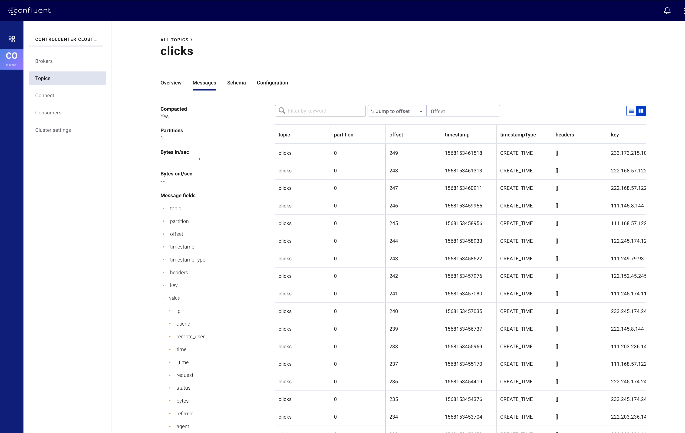
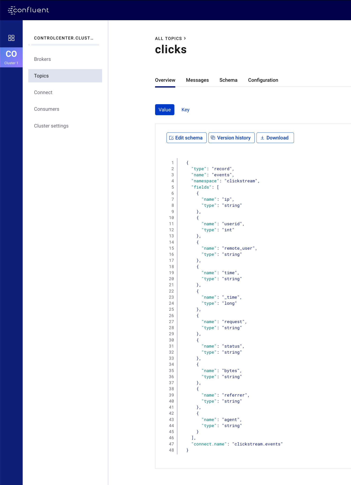

.. _quickstart-demos-operator-gke

|cp| on Google Kubernetes Engine
======================================

Overview
--------

This demo shows a deployment of |cp| on Google Kubernetes Engine (GKE) leveraging |co-long| with mock data generation provided via the `Kafka Connect Datagen <https://www.confluent.io/hub/confluentinc/kafka-connect-datagen>`__.

The major components of this demo are:

* A Kubernetes cluster running on GKE.
* |co-long| which is used to manage the following |cp| components

  * A single node |zk|
  * A single node |ak|
  * A single node |sr|
  * |c3|
  * A single node |kconnect-long|
  * One instance of `kafka-connect-datagen` to produce mock data

.. figure:: images/operator.png
    :alt: operator

Demo Prerequisites
-------------------
The following applications or libraries are required to be installed and available in the system path in order to properly run the demo.

+------------------+----------------+---------------------------------------------------------+
| Application      | Tested Version | Info                                                    |
+==================+================+=========================================================+
| ``kubectl``      | ``1.14.3``     | https://kubernetes.io/docs/tasks/tools/install-kubectl/ |
+------------------+----------------+---------------------------------------------------------+
| ``helm``         | ``2.14.3``     | https://helm.sh/docs/using_helm/#install-helm           |
+------------------+----------------+---------------------------------------------------------+
| ``gcloud``       | ``259.0.0``    |  https://cloud.google.com/sdk/install                   |
| ``GCP sdk core`` | ``2019.08.23`` |                                                         |
+------------------+----------------+---------------------------------------------------------+

Running the Demo
----------------

.. warning:: This demo uses the real GCP SDK to launch real resources. To avoid unexpected charges, carefully evaluate the cost of resources before launching the demo and ensure all resources are destroyed after you are done evaluating the demonstration.  Optionally, refer to the |co| :ref:`Sizing Recommendations <co-env-sizing>` document and the :ref:`examples-operator-gke-base-variable-reference` section for more information on required resources for running |cp| on Kubernetes.

 
Setup
*****

Clone the Confluent examples repository and change directories on your terminal into the ``gke-base`` directory.

.. sourcecode:: bash

    git clone git@github.com:confluentinc/examples.git
    cd examples/kubernetes/gke-base

This demo requires a Kubernetes Cluster and ``kubectl`` context configured properly to manage it.

The remaining steps in the **Setup** section of the instructions help you build a Kubernetes cluster on Google Kubernetes Engine (GKE).  If you already have a cluster you wish to use for the demo, you can skip to the :ref:`examples-operator-gke-base-validate` section of these instructions.

To verify the Google Cloud Platform (GCP) Project in which a new cluster will be created, run the following and verify it is the desired `GCP Project ID <https://support.google.com/googleapi/answer/7014113?hl=en>`__:

.. sourcecode:: bash

    gcloud config list --format 'value(core.project)'

.. note::

    For specific details on how the cluster will be created (size, region, zone, etc...), view the :ref:`examples-operator-gke-base-variable-reference` section of these instructions.  You may also use these variables to modify the default behavior of the demo create cluster functionality.

To create the cluster, run the following (estimated running time, 4 minutes):

.. sourcecode:: bash

    make gke-create-cluster

Verify that ``gcloud`` has created the cluster properly::

    ...
    Created [https://container.googleapis.com/v1/projects/<project-id>/zones/us-central1-a/clusters/cp-examples-operator-<username>].
    To inspect the contents of your cluster, go to: <link> 
    kubeconfig entry generated for cp-examples-operator-<username>.
    NAME                            LOCATION  MASTER_VERSION  MASTER_IP     MACHINE_TYPE  NODE_VERSION   NUM_NODES  STATUS
    cp-examples-operator-<username> <zone>    1.12.8-gke.10   <ip-address>  n1-highmem-2  1.12.8-gke.10  3          RUNNING
    ✔  ++++++++++ GKE Cluster Created

.. _examples-operator-gke-base-validate:

Validate
********

The demo uses ``kubectl`` to control the cluster.  To verify that your local ``kubectl`` configured as intended, run:

.. sourcecode:: bash

    kubectl config current-context

The context should contain the proper region and cluster name.  If you used the demo ``gke-create-cluster`` function to create your cluster, the context name should have the format: ``gke_<google-project-id>_<region>_<cp-examples-operator>-<username>``

.. _examples-operator-gke-base-run:

Run
***

To deploy |cp| run (estimated running time, 7 minutes):

.. sourcecode:: bash

    make demo

The last output message you should see is::

	✔ GKE Base Demo running

.. _examples-operator-gke-verify-confluent-platform:

Verify 
******

Verify the Kubernetes Deployment
````````````````````````````````

You can view the deployed components with:

.. sourcecode:: bash

    kubectl -n operator get all

Using the default demo variable values, ``kubectl`` should report something like the following

::

	NAME                                        READY   STATUS      RESTARTS   AGE
	pod/cc-manager-566965d74f-4hblt             1/1     Running     0          11m
	pod/cc-operator-76c54d65cd-28czd            1/1     Running     0          11m
	pod/clicks-datagen-connector-deploy-2vd8q   0/1     Completed   0          8m6s
	pod/connectors-0                            1/1     Running     0          9m36s
	pod/controlcenter-0                         1/1     Running     0          8m4s
	pod/client-console                          1/1     Running     0          10m
	pod/kafka-0                                 1/1     Running     0          10m
	pod/schemaregistry-0                        1/1     Running     0          9m59s
	pod/zookeeper-0                             1/1     Running     0          11m

	NAME                                TYPE        CLUSTER-IP    EXTERNAL-IP   PORT(S)                                        AGE
	service/connectors                  ClusterIP   None          <none>        8083/TCP,7203/TCP,7777/TCP                     9m36s
	service/connectors-0-internal       ClusterIP   10.0.8.147    <none>        8083/TCP,7203/TCP,7777/TCP                     9m36s
	service/controlcenter               ClusterIP   None          <none>        9021/TCP,7203/TCP,7777/TCP                     8m5s
	service/controlcenter-0-internal    ClusterIP   10.0.14.242   <none>        9021/TCP,7203/TCP,7777/TCP                     8m5s
	service/kafka                       ClusterIP   None          <none>        9071/TCP,9072/TCP,9092/TCP,7203/TCP,7777/TCP   10m
	service/kafka-0-internal            ClusterIP   10.0.14.239   <none>        9071/TCP,9072/TCP,9092/TCP,7203/TCP,7777/TCP   10m
	service/schemaregistry              ClusterIP   None          <none>        8081/TCP,7203/TCP,7777/TCP                     10m
	service/schemaregistry-0-internal   ClusterIP   10.0.6.93     <none>        8081/TCP,7203/TCP,7777/TCP                     10m
	service/zookeeper                   ClusterIP   None          <none>        3888/TCP,2888/TCP,2181/TCP,7203/TCP,7777/TCP   11m
	service/zookeeper-0-internal        ClusterIP   10.0.8.51     <none>        3888/TCP,2888/TCP,2181/TCP,7203/TCP,7777/TCP   11m

	NAME                          DESIRED   CURRENT   UP-TO-DATE   AVAILABLE   AGE
	deployment.apps/cc-manager    1         1         1            1           11m
	deployment.apps/cc-operator   1         1         1            1           11m

	NAME                                     DESIRED   CURRENT   READY   AGE
	replicaset.apps/cc-manager-566965d74f    1         1         1       11m
	replicaset.apps/cc-operator-76c54d65cd   1         1         1       11m

	NAME                              DESIRED   CURRENT   AGE
	statefulset.apps/connectors       1         1         9m36s
	statefulset.apps/controlcenter    1         1         8m4s
	statefulset.apps/kafka            1         1         10m
	statefulset.apps/schemaregistry   1         1         9m59s
	statefulset.apps/zookeeper        1         1         11m

	NAME                                        COMPLETIONS   DURATION   AGE
	job.batch/clicks-datagen-connector-deploy   1/1           4s         8m6s

	NAME                                               AGE
	zookeepercluster.cluster.confluent.com/zookeeper   11m

	NAME                                       AGE
	kafkacluster.cluster.confluent.com/kafka   10m

Verify Confluent Platform on the CLI 
````````````````````````````````````

By default the demo is deployed without any `Kubernetes Ingress <https://kubernetes.io/docs/concepts/services-networking/ingress/>`__, which means the |cp| resources inside the Kubernetes cluster cannot be reached from external clients.  If you used a pre-existing cluster with Ingress enabled, the following validation instructions may not be applicable to your setup.

The demo deploys a ``client-console`` pod that can be used to open a terminal inside the cluster with network connectivity to the |cp| services.  For example::

	kubectl -n operator exec -it client-console bash

From here you can execute standard |ak| commands to validate the cluster.  You need to provide the commands with the required connectivity and security configurations, which are provided in mapped files on the ``client-console`` pod.  See the :ref:`examples-operator-gke-base-client-configurations` Highlight for more information.

.. sourcecode:: bash

		kafka-topics --bootstrap-server kafka:9071 --command-config /etc/kafka-client-properties/kafka-client.properties --list

You could view the output of the mock click data generator with the console consumer::

	kafka-console-consumer --bootstrap-server kafka:9071 --consumer.config /etc/kafka-client-properties/kafka-client.properties --topic clicks

Example output might look like::

	222.152.45.45F-
	16141<GET /images/track.png HTTP/1.1204006-Mozilla/5.0 (Windows NT 10.0; Win64; x64) AppleWebKit/537.36 (KHTML, like Gecko) Chrome/59.0.3071.115 Safari/537.36
	122.173.165.203L-
	16151FGET /site/user_status.html HTTP/1.1401289-Mozilla/5.0 (compatible; Googlebot/2.1; +http://www.google.com/bot.html)
	...

Verify Confluent Platform Control Center
````````````````````````````````````````

In order to view |c3|, network connectivity will need to be available between your local machine and the Kubernetes pod running the |c3| service.  If you used an existing cluster you may already have external cluster access configured.  If you used the demo ``gke-create-cluster`` function, you can use the following ``kubectl`` command to open a forwarded port connection between your local host and |c3|.

.. sourcecode:: bash

		kubectl -n operator port-forward controlcenter-0 12345:9021

Now open a web-browser to http://localhost:12345, and you should see |c3| with your operational |ak| cluster, |sr|, and |kconnect-long| with the running ``clicks`` connector.





Highlights 
**********

.. _examples-operator-gke-base-configuration:

Service Configurations
``````````````````````

The |cp| Helm Charts deliver a reasonable base configuration for most deployments.  What is left to the user is the 'last mile' of configuration specific to your environment.  For this demo we specify the non-default configuration in the :devx-examples:`values.yaml|kubernetes/gke-base/cfg/values.yaml` file.   The YAML file facilitates a declarative infastructure approach, but can also be useful for viewing non-default configuration in a single place, bootstrapping a new environment, or sharing in general.

The following is an example section of the demo's ``values.yaml`` file showing how |ak| server properties (``configOverrides``) can be configured using Helm Charts.  The example also shows a YAML anchor (``<<: *cpImage``) to promote reuse within the YAML file itself.  See the :devx-examples:`values.yaml|kubernetes/gke-base/cfg/values.yaml` for further details.

::

  kafka:
    <<: *cpImage
    resources:
      cpu: 200m
      memory: 1Gi
    loadBalancer:
      enabled: false
    tls:
      enabled: false
    metricReporter:
      enabled: true
    configOverrides:
      server:
      - "auto.create.topics.enabled=true"

Remaining configuration details are specificied in individual ``helm`` commands. An example is included below showing the setting to actually enable zookeeper deployment with the ``--set`` argument on the ``helm upgrade`` command.  See the :devx-examples:`Makefile|kubernetes/gke-base/Makefile` for the full commands.

.. sourcecode:: bash

  helm upgrade --install --namespace operator --set zookeeper.enabled=true ... 

.. _examples-operator-gke-base-client-configurations:

Client Configurations
`````````````````````

.. warning:: The default security deployment for the |cp| Helm Charts is to use SASL/PLAIN security.  This is useful for demonstration purposes, however, you should use greater security for production environments.  See `Configuring security <https://docs.confluent.io/current/installation/operator/co-security.html>`__ for more details.

Using the |cp| `Helm Charts <https://github.com/confluentinc/cp-helm-charts>`__, |ak| is deployed with Plaintext SASL security enabled.  In order for clients to authenticate, they will require configuration values including SASL credentials.   The Kubernetes API supports `Secrets <https://kubernetes.io/docs/concepts/configuration/secret/>`__ and `ConfigMap <https://kubernetes.io/docs/tasks/configure-pod-container/configure-pod-configmap/>`__ types which can be used to push configuration values into files that applications on Pods can use.   This demo uses these mechanisms to launch a ``client-console`` Pod preconfigured with the required client properties file.  The properties file on the Pod is a mapped version of the centrally stored Secret.  

Here is how it works:

The configuration file values, including the SASL secrets, are defined in a Kubernetes Object file, like the following.  Note how everything beyond the ``kafka-client.properties`` line looks like a typical Java Properties file::

  apiVersion: v1
  kind: Secret
  metadata:
    name: kafka-client.properties
  type: Opaque
  stringData:
    kafka-client.properties: |-
      bootstrap.servers=kafka:9071
      sasl.jaas.config=org.apache.kafka.common.security.plain.PlainLoginModule required username="test" password="test123";
      sasl.mechanism=PLAIN
      security.protocol=SASL_PLAINTEXT

The demo applies this object to the cluster with the ``kubectl apply`` command::

	kubectl --context <k8s-context> -n operator apply -f <path-to-examples-repo>kubernetes/gke-base/cfg/kafka-client-secrets.yaml

The ``client-console`` is deployed with this Secret Object mapped as a volume to the Pod::

  apiVersion: v1
  kind: Pod
  metadata:
    namespace: operator
    name: client-console
  spec:
    containers:
    - name: client-console
      image: docker.io/confluentinc/cp-server-operator:5.3.0.0
      command: [sleep, "86400"]
      volumeMounts:
      - name: kafka-client-properties
        mountPath: /etc/kafka-client-properties/
    volumes:
    - name: kafka-client-properties
      secret:
        secretName: kafka-client.properties

The end result is the Secret object named ``kafka-client.properties`` is located on the Pod in the file location ``/etc/kafka-client-properties/kafka-client.properties``::

	kubectl -n operator exec -it client-console bash

	root@client-console:/opt# cat /etc/kafka-client-properties/kafka-client.properties
	bootstrap.servers=kafka:9071
	sasl.jaas.config=org.apache.kafka.common.security.plain.PlainLoginModule required username="test" password="test123";
	sasl.mechanism=PLAIN
	security.protocol=SASL_PLAINTEXT

.. _examples-operator-gke-base-connector-deployments:

Connector Deployments
`````````````````````

|kconnect-long| utilizes a `REST endpoint <https://docs.confluent.io/current/connect/references/restapi.html>`__, which accepts JSON objects, for Connector deployments.  This demo shows one approach for deploying a connector inside the Kubernetes cluster using Kubernetes `ConfigMap <https://kubernetes.io/docs/tasks/configure-pod-container/configure-pod-configmap/>`__ objects, a standard Docker image with an overridden command, and the Kubernetes `Batch Job API <https://kubernetes.io/docs/concepts/workloads/controllers/jobs-run-to-completion/>`__.

First the connector definition is defined inside a ConfigMap object.  Notice how everything after the ``clicks-datagen-connector.json`` name is a full JSON object::

	apiVersion: v1
	kind: ConfigMap
	metadata:
	  name: clicks-datagen-connector
	data:
	  clicks-datagen-connector.json: '{
	    "name":"clicks",
	    "config": {
	      "connector.class": "io.confluent.kafka.connect.datagen.DatagenConnector",
	      "kafka.topic": "clicks",
	      "key.converter": "org.apache.kafka.connect.storage.StringConverter",
	      "value.converter": "io.confluent.connect.avro.AvroConverter",
	      "value.converter.schema.registry.url": "http://schemaregistry:8081",
	      "value.converter.schemas.enable": "true",
	      "quickstart": "clickstream",
	      "max.interval": 1000,
	      "iterations": -1,
	      "tasks.max": "1"
	    }
	  }'

This ConfigMap is applied to the cluster with the following command::

	kubectl --context <k8s-context> -n operator apply -f <path-to-examples-repo>kubernetes/gke-base/cfg/clicks-datagen-connector-configmap.yaml

Next, a Kubernetes Job Object is defined.  Using a docker image with the ``curl`` program installed, the Job adds arguments to the ``curl`` command in order to deploy the connector configuration.  Note how the ConfigMap defined above is mounted to the Job specification and the config file passed into the ``curl`` command matches the path of the file mounted::

	apiVersion: batch/v1
	kind: Job
	metadata:
	  name: clicks-datagen-connector-deploy
	spec:
	  ttlSecondsAfterFinished: 5
	  template:
	    spec:
	      volumes:
	      - name: clicks-datagen-connector
	        configMap:
	          name: clicks-datagen-connector
	      containers:
	      - name: clicks-datagen-connector-deploy
	        image: cnfldemos/alpine-curl:3.10.2_7.65.1
	        args: [ 
	          "-s",
	          "-X", "POST",
	          "-H", "Content-Type: application/json",
	          "--data", "@/etc/config/connector/clicks-datagen-connector.json",
	          "http://connectors:8083/connectors"
	        ]
	        volumeMounts:
	          - name: clicks-datagen-connector
	            mountPath: /etc/config/connector
	      restartPolicy: Never
	  backoffLimit: 1

The job is applied to the cluster, after the Kafka Connect system is deployed with::

	kubectl --context <k8s-context> -n operator apply -f <path-to-examples-repo>kubernetes/gke-base/cfg/clicks-datagen-connector-deploy-job.yaml

After the job is applied, the following command shows the deployed connector::

	kubectl -n operator exec -it client-console bash
	root@client-console:/opt# curl http://connectors:8083/connectors;echo;
	["clicks"]

.. _examples-operator-gke-base-tear-down:

Tear down
*********

To tear down the |cp| components inside the cluster, run the following (estimated running time, 4 minutes):

.. sourcecode:: bash

  make destroy-demo

You can verify that all resources are removed with::

  kubectl -n operator get all

If you used the demo to create the Kubernetes cluster for you, destroy the cluster with (estimated running time, 3 minutes):

.. sourcecode:: bash

  make gke-destroy-cluster

Advanced Demo Usage
*******************

.. _examples-operator-gke-base-variable-reference:

Variable Reference
``````````````````

The following table documents variables that can be used to configure various demo behaviors.  Variables can be ``exported`` or set in each individual ``make`` command with either sample syntax below:

.. sourcecode:: bash

   VARIABLE=value make <make-target>
 
.. sourcecode:: bash

   make <make-target> VARIABLE=value

+--------------------------+------------------------------------------------------------------------------------------------------+--------------------------------------------------------------------------------+
| Variable                 | Description                                                                                          | Default                                                                        |
+==========================+======================================================================================================+================================================================================+
| GCP_PROJECT_ID           | Maps to your GCP Project ID.                                                                         | The output of the command ``gcloud config list --format 'value(core.project)`` |
|                          | This is used by the demo to build a new GKE cluster as well as configuring the kubectl context.      |                                                                                |
|                          | If you wish to use a different project id that the current active configuration in ``glcoud``        |                                                                                |
|                          | you should export this value in the current shell where you are running the demo.                    |                                                                                |
+--------------------------+------------------------------------------------------------------------------------------------------+--------------------------------------------------------------------------------+
| GKE_BASE_CLUSTER_ID      | Identifies the GKE Cluster.  Substitutes in the current user to help with project uniqueness on GCP. | ``cp-examples-operator-$USER``                                                 |
+--------------------------+------------------------------------------------------------------------------------------------------+--------------------------------------------------------------------------------+
| GKE_BASE_REGION          | Used in the ``--subnetwork`` flag to define the networking region                                    | ``us-central1``                                                                |
+--------------------------+------------------------------------------------------------------------------------------------------+--------------------------------------------------------------------------------+
| GKE_BASE_ZONE            | Maps to the ``--zone`` flag                                                                          | ``us-central1-a``                                                              |
+--------------------------+------------------------------------------------------------------------------------------------------+--------------------------------------------------------------------------------+
| GKE_BASE_SUBNET          | Used in the ``--subnetwork`` flag to define the subnet                                               | ``default``                                                                    |
+--------------------------+------------------------------------------------------------------------------------------------------+--------------------------------------------------------------------------------+
| GKE_BASE_CLUSTER_VERSION | Maps to the ``--cluster-version`` flag                                                               | ``1.12.8-gke.10``                                                              |
+--------------------------+------------------------------------------------------------------------------------------------------+--------------------------------------------------------------------------------+
| GKE_BASE_MACHINE_TYPE    | Maps to the ``--machine-type`` flag                                                                  | ``n1-highmem-2``                                                               |
+--------------------------+------------------------------------------------------------------------------------------------------+--------------------------------------------------------------------------------+
| GKE_BASE_IMAGE_TYPE      | Maps to the ``--image-type`` flag.  Verify CPU Platform minimums if changing                         | ``COS``                                                                        |
+--------------------------+------------------------------------------------------------------------------------------------------+--------------------------------------------------------------------------------+
| GKE_BASE_DISK_TYPE       | Maps to the ``--disk-type`` flag                                                                     | ``pd-standard``                                                                |
+--------------------------+------------------------------------------------------------------------------------------------------+--------------------------------------------------------------------------------+
| GKE_BASE_DISK_SIZE       | Maps to the ``--disksize`` flag                                                                      | ``100``                                                                        |
+--------------------------+------------------------------------------------------------------------------------------------------+--------------------------------------------------------------------------------+
| GKE_BASE_NUM_NODES       | Maps to the ``--num-nodes`` flag                                                                     | ``3``                                                                          |
+--------------------------+------------------------------------------------------------------------------------------------------+--------------------------------------------------------------------------------+
| KUBECTL_CONTEXT          | Used to explicitly set the ``kubectl`` context within the demo                                       | ``gke_$(GCP_PROJECT_ID)_$(GKE_BASE_ZONE)_$(GKE_BASE_CLUSTER_ID)``              |
+--------------------------+------------------------------------------------------------------------------------------------------+--------------------------------------------------------------------------------+

