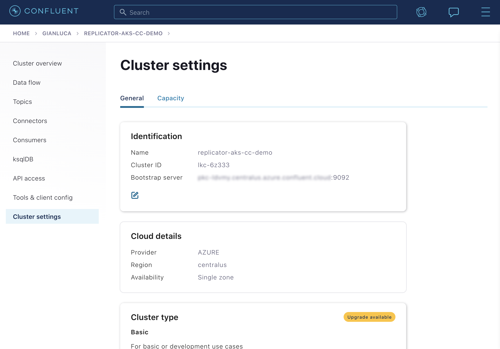
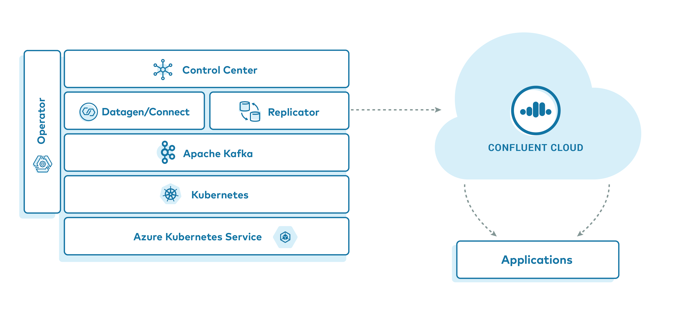

.. _quickstart-demos-operator-replicator-aks-cc:

.. |k8s-service-name-long| replace:: Azure Kubernetes Service
.. |k8s-service-name| replace:: AKS
.. |operator-demo-prefix| replace:: aks
.. |kubectl-context-pattern| replace:: aks_project-name_us-central1-a_cp-examples-operator-jdoe
.. |k8s-service-docs-link| replace:: `Azure Kubernetes Service (AKS) <https://azure.microsoft.com/en-us/services/kubernetes-service/>`__
.. |operator-base-demo-link| replace:: `Confluent Platform on Azure Kubernetes Service example <https://docs.confluent.io/platform/current/tutorials/examples/kubernetes/aks-base/docs/index.html>`__

|k8s-service-name-long| to |ccloud| with |crep-full|
=====================================================

Overview
--------

.. include:: ../../docs/includes/replicator-cc-demo/overview.rst

Prerequisites
-------------

The following applications or libraries are required to be installed and available in the system path in order to properly run the example.

+------------------+----------------+-------------------------------------------------------------------------------------+
| Application      | Tested Version | Info                                                                                |
+==================+================+=====================================================================================+
| ``kubectl``      | ``1.18.0``     | https://kubernetes.io/docs/tasks/tools/install-kubectl/                             |
+------------------+----------------+-------------------------------------------------------------------------------------+
| ``helm``         | ``3.1.2``      | https://github.com/helm/helm/releases/tag/v3.1.2                                    |
+------------------+----------------+-------------------------------------------------------------------------------------+
| ``az``           | ``2.10.1``     | https://docs.microsoft.com/en-us/cli/azure/install-azure-cli?view=azure-cli-latest  |
+------------------+----------------+-------------------------------------------------------------------------------------+
| ``ccloud``       | ``v1.25.0``    | https://docs.confluent.io/ccloud-cli/current/install.html                           |
+------------------+----------------+-------------------------------------------------------------------------------------+

.. include:: ../../docs/includes/helm3-requirement-note.rst

Cost to Run Example
-------------------

Caution
~~~~~~~

.. include:: ../../../ccloud/docs/includes/ccloud-examples-caution.rst

In addition to |ccloud| resources, this example uses |az-long| resources: 

* Refer to `Sizing recommendations <https://docs.confluent.io/operator/current/co-plan.html#co-env-sizing>`__ document contains information on required sizing for |co-long|.
* Refer to `Azure <https://azure.microsoft.com/en-us/pricing/calculator/>`__ pricing data for more information.

Ensure all :ref:`resources are destroyed <quickstart-demos-operator-replicator-aks-cc-destroy>` after you are done.

|ccloud| Promo Code
~~~~~~~~~~~~~~~~~~~

.. include:: ../../../ccloud/docs/includes/ccloud-examples-promo-code.rst

Run Example
-----------

Clone the `confluentinc/examples <https://github.com/confluentinc/examples>`__ GitHub repository, and change directories to the ``kubernetes/replicator-aks-cc`` directory.

.. sourcecode:: bash

    git clone https://github.com/confluentinc/examples.git
    cd examples/kubernetes/replicator-aks-cc

AKS Setup
~~~~~~~~~

In order to properly simulate a realistic replication scenario to |ccloud|, the example requires a AKS Node Pool sufficiently large to support a 3 node clusters for both |ak| and |zk|.  In testing of this demonstration, a sufficient cluster consisted of 7 nodes of machine type ``Standard_D4s_v4``.  

.. tip:: The :ref:`examples-operator-aks-base-variable-reference` section can be used to control the size of the deployed resources in this example.

If you wish to use an existing AKS cluster, and your ``kubectl`` client is already configured to operate with it, skip to the :ref:`quickstart-demos-operator-replicator-aks-cc-ccloud-setup` section of these instructions.

If you wish to create a new AKS cluster for this example, the ``Makefile`` contains a function to assist you in creating a cluster, assuming you have your ``az`` CLI properly configured to access your account.  If you wish to override the behavior of the create cluster function, see the :ref:`quickstart-demos-operator-replicator-aks-cc-ccloud-advanced-usage` section of this document.

.. include:: ../../docs/includes/aks-cli-setup.rst

To create the standard cluster you can run the following:

.. sourcecode:: bash

    export AZ_RESOURCE_GROUP={{ azure resource group name }}
    make aks-create-cluster

Verify that ``az`` has created the cluster properly::

    ...

    provisioningState: Succeeded
    sku:
      name: Basic
      tier: Free
    tags: null
    type: Microsoft.ContainerService/ManagedClusters
    
    ...

    az aks get-credentials --only-show-errors --resource-group confluent-operator-demo --name cp-examples-operator-user --context aks_confluent-operator-demo_centralus_cp-examples-operator-user
    Merged "aks_confluent-operator-demo_centralus_cp-examples-operator-user" as current context in /Users/user/.kube/config
    ✔  ++++++++++ AKS Cluster Created

.. _quickstart-demos-operator-replicator-aks-cc-ccloud-setup:

|ccloud| Setup
~~~~~~~~~~~~~~~~~~~~~

.. include:: ../../docs/includes/replicator-cc-demo/ccloud-setup-aks.rst

Preflight Checks
++++++++++++++++

Prior to running the example you may want to verify the setup.

To verify your AKS cluster status:

.. sourcecode:: bash

    az aks list --output table

To verify that your ``kubectl`` command is configured with the proper context to control your AKS cluster, run:

.. sourcecode:: bash

    kubectl config current-context

The context should contain the proper region and cluster name.  If you used the demo ``aks-create-cluster`` function to create your cluster, the context name should have the format: ``aks_<azure_resource_group>_<region>_<cp-examples-operator>-<username>``

Example Execution
+++++++++++++++++

.. include:: ../../docs/includes/replicator-cc-demo/demo-execution.rst

Validate
~~~~~~~~

.. include:: ../../docs/includes/replicator-cc-demo/verify-demo.rst

.. _quickstart-demos-operator-replicator-aks-cc-destroy:

Stop Example
------------

.. include:: ../../../ccloud/docs/includes/ccloud-examples-terminate.rst

After you are done evaluating the results of the example, you can destroy all the provisioned Kubernetes resources with:

.. sourcecode:: bash

    make destroy-demo

If you used the example to create your cluster, you can destroy the AKS cluster with:

.. sourcecode:: bash

    make aks-destroy-cluster

Highlights
----------

.. include:: ../../docs/includes/replicator-cc-demo/highlight-connector-deployment.rst

.. include:: ../../docs/includes/deploy-jars-k8s.rst

.. _quickstart-demos-operator-replicator-aks-cc-ccloud-advanced-usage:

Advanced Usage
--------------

Customize AKS Cluster Creation
~~~~~~~~~~~~~~~~~~~~~~~~~~~~~~

.. include:: ../../docs/includes/aks-custom-variables.rst

.. include:: ../../docs/includes/replicator-cc-demo/closing.rst
