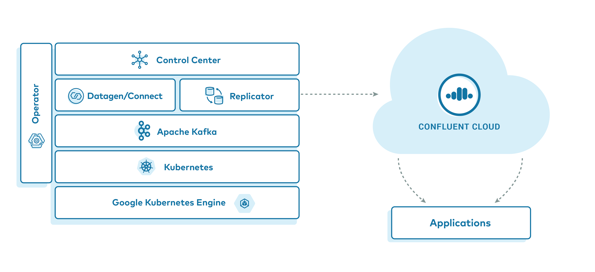
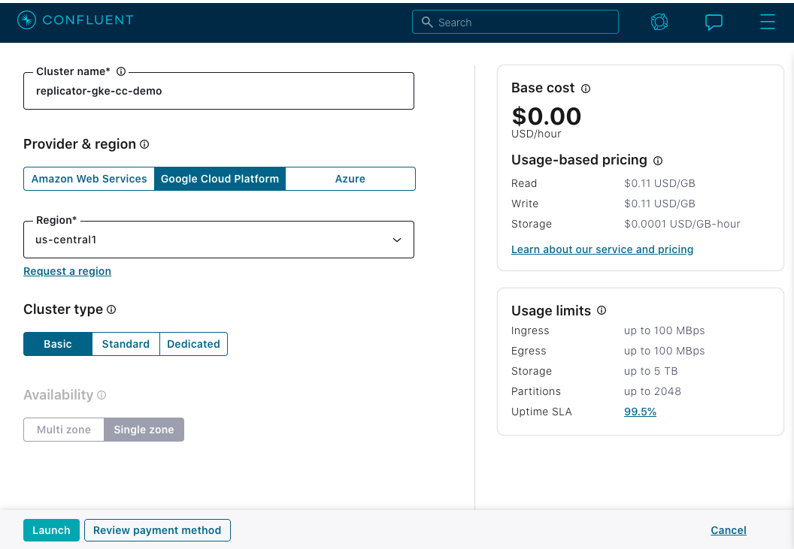
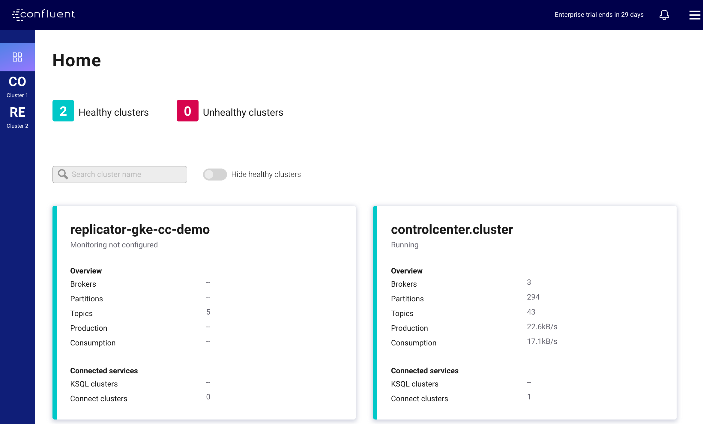
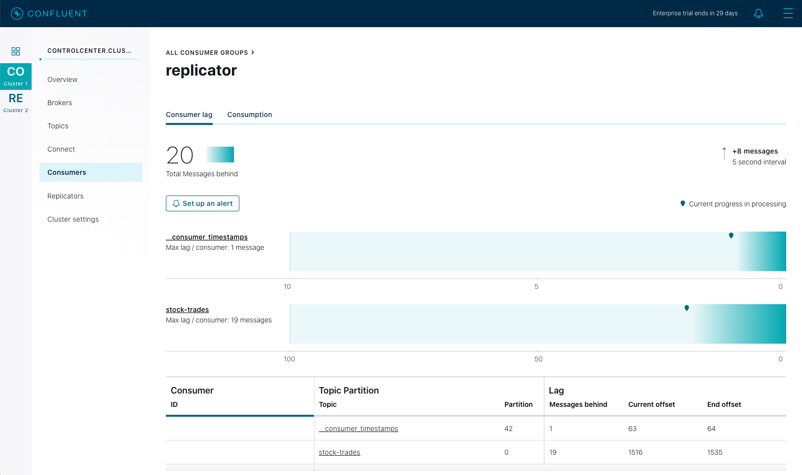

.. _quickstart-demos-operator-replicator-gke-cc:

.. |cluster-settings| image:: images/cluster-settings.png
   :align: middle
   :width: 80%

Google Kubernetes Engine to |ccloud| with |crep-full|
=====================================================

Overview
--------

This example features a deployment of `Confluent Platform <https://www.confluent.io/product/confluent-platform/>`__ on `Google Kubernetes Engine (GKE) <https://cloud.google.com/kubernetes-engine/>`__ leveraging `Confluent Operator <https://docs.confluent.io/current/installation/operator/index.html>`__ and `Confluent Replicator <https://docs.confluent.io/current/connect/kafka-connect-replicator/index.html>`__, highlighting a data replication strategy to `Confluent Cloud <https://www.confluent.io/confluent-cloud/>`__.  Upon running this demo, you will have a GKE based |cp| deployment with simulated data replicating to your |ccloud| cluster.  We will verify the replication by running client applications against the |ccloud| cluster to view the simulated data originating in the source GKE cluster.  

If you'd like a primer on running |co-long| in GKE with lower resource requirements, see the `Confluent Platform on Google Kubernetes Engine demo <https://docs.confluent.io/current/tutorials/examples/kubernetes/gke-base/docs/index.html>`__.  

This demo is featured in the `Conquering Hybrid Cloud with Replicated Event-Driven Architectures blog post <https://www.confluent.io/blog/replicated-event-driven-architectures-for-hybrid-cloud-kafka/>`__ which provides more details on use cases for replicated event streaming architectures.

The major components of this demo are:

* A |ccloud| Environment and |ak| Cluster
* A Kubernetes cluster running on GKE.
* |co-long| which is used to manage the following |cp| components

  * A 3 node |zk| cluster
  * A 3 node |ak| cluster
  * A single node |crep|
  * A single node |sr|
  * A single node |kconnect-long|
  * |c3|
  * One instance of `kafka-connect-datagen <https://github.com/confluentinc/kafka-connect-datagen>`__ to produce mock stock trading data

Demo Prerequisites
-------------------

The following applications or libraries are required to be installed and available in the system path in order to properly run the demo.

+------------------+-------------------+----------------------------------------------------------+
| Application      | Tested Version    | Info                                                     |
+==================+===================+==========================================================+
| ``kubectl``      | ``1.18.0``        | https://kubernetes.io/docs/tasks/tools/install-kubectl/  |
+------------------+-------------------+----------------------------------------------------------+
| ``helm``         | ``3.1.2``         | https://github.com/helm/helm/releases/tag/v3.1.2         |
+------------------+-------------------+----------------------------------------------------------+
| ``gcloud``       | ``286.0.0``       | https://cloud.google.com/sdk/install                     |
| ``GCP sdk core`` | ``2020.03.24``    |                                                          |
| ``GKE cluster``  | ``1.15.11-gke.1`` |                                                          |
+------------------+-------------------+----------------------------------------------------------+
| ``ccloud``       | ``v1.0.0``        | https://docs.confluent.io/current/cloud/cli/install.html |
+------------------+-------------------+----------------------------------------------------------+

.. include:: ../../docs/includes/helm3-requirement-note.rst

Running the Demo
----------------

.. warning:: This demo consumes real cloud resources on both |ccloud| and |gcp-long|.  To avoid unexpected charges, carefully evaluate the cost of resources before launching the demo and ensure all :ref:`resources are destroyed <quickstart-demos-operator-replicator-gke-cc-destroy>` after you are done evaluating the demonstration.  Refer to `Confluent Cloud <https://www.confluent.io/confluent-cloud/>`__ and `Google Cloud <https://cloud.google.com/pricing/>`__ pricing data for more information.  The |co| :ref:`Sizing Recommendations <co-env-sizing>` document contains information on required sizing for |co-long|.

Clone the `Confluent examples repository <https://github.com/confluentinc/examples>`__ and change directories on your terminal into the ``kubernetes/replicator-gke-cc`` directory.

.. sourcecode:: bash

    git clone https://github.com/confluentinc/examples.git
    cd examples/kubernetes/replicator-gke-cc

GKE Setup
~~~~~~~~~

In order to properly simulate a realistic replication scenario to |ccloud|, the demo requires a GKE Node Pool sufficiently large to support a 3 node clusters for both |ak| and |zk|.  In testing of this demonstration, a sufficient cluster consisted of 7 nodes of machine type ``h1-highmem-2``.  

.. tip:: The :ref:`examples-operator-gke-base-variable-reference` section can be used to control the size of the deployed resources in this demo.

If you wish to use an existing GKE cluster, and your ``kubectl`` client is already configured to operate with it, skip to the :ref:`quickstart-demos-operator-replicator-gke-cc-ccloud-setup` section of these instructions.

If you wish to create a new GKE cluster for this demo, the ``Makefile`` contains a function to assist you in creating a cluster, assuming you have your ``glcoud`` SDK properly configured to access your account.  If you wish to override the behavior of the create cluster function, see the :ref:`quickstart-demos-operator-replicator-gke-cc-ccloud-advanced-usage` section of this document.

To verify which GCP Project your ``gcloud`` SDK is currently configured to, run:

.. include:: ../../docs/includes/gcloud-config-list.rst

To create the standard cluster you can run the following:

.. sourcecode:: bash

    make gke-create-cluster

.. _quickstart-demos-operator-replicator-gke-cc-ccloud-setup:

|ccloud| Setup
~~~~~~~~~~~~~~~~~~~~~

|ccloud| Account Setup
+++++++++++++++++++++++++++++

This demonstration requires that you have a |ccloud| account and a |ak| cluster ready for use.  The `Confluent Cloud <https://www.confluent.io/confluent-cloud/>`__ home page can help you get setup with your own account if you do not yet have access.   

.. note:: This demonstration highlights a multi-cloud replication strategy using |crep-full|.  One benefit of |crep| is that the destination cluster topics and partitions will be identicial in message offsets, timestamps, keys, and values.   If you re-use a cluster with an existing ``stock-trades`` topic, the messages will be appeneded to the end of the existing topic data and the offsets will not match the source cluster.  It's advised to build a new cluster for each run of this demo, or delete the ``stock-trades`` |ak| topic in the destination cluster prior to running.  See: :ref:`ccloud kafka topic delete <ccloud_kafka_topic_delete>` for instructions on deleting |ccloud| topics.

|ak| Cluster Setup
+++++++++++++++++++

If you are creating a new cluster, it is advised to create it within the same Cloud Provider and region as this demo.  This demonstration runs on top of Google Cloud Platform (GCP) and, by default, in the ``us-central1`` region.  It is recommended to name your new cluster ``replicator-gke-cc-demo`` to match names used later in this demo.  The following illustrates the recommended configuration:

.. tip:: See the `Confluent Cloud Quick Start <https://docs.confluent.io/current/quickstart/cloud-quickstart/index.html>`__ for more information.

|ak| Bootstrap Server Configuration
++++++++++++++++++++++++++++++++++++

After you have established the |ccloud| cluster you are going to use for the demo you will need the public bootstrap server.

You can use the ``ccloud`` CLI to retrieve the bootstrap server value for your cluster.

.. tip:: You can also view the bootstrap server value on the |ccloud| UI under the **Cluster settings**
  
  |cluster-settings| 

#.  If you haven't already, `install the ccloud CLI <https://docs.confluent.io/current/quickstart/cloud-quickstart/index.html#step-2-install-the-ccloud-cli>`__

#.  Log in to your |ccloud| cluster. The ``--save`` argument saves your |ccloud| user login credentials or refresh token (in the case of SSO) to the local ``netrc`` file.

    ::

        ccloud login --save

    Your output should resemble:

    ::

        Enter your Confluent credentials:
        Email: jdoe@myemail.io
        Password:
        
        Logged in as jdoe@myemail.io
        Using environment t118 ("default")

#.  List your available |ak| clusters.

    ::

        ccloud kafka cluster list

    This should produce a list of clusters you have access to:

    ::

              Id      |          Name          | Provider |   Region    | Durability | Status  
        +-------------+------------------------+----------+-------------+------------+--------+
            lkc-xmm5g | abc-test               | gcp      | us-central1 | LOW        | UP      
            lkc-kngnv | rjs-gcp-us-central1    | gcp      | us-central1 | LOW        | UP      
            lkc-3r3vj | replicator-gke-cc-demo | gcp      | us-central1 | LOW        | UP      

#.  Describe the cluster to obtain the bootstrap server

    ::

        ccloud kafka cluster describe lkc-3r3vj

    This will produce a detailed view of the cluster.  The ``Endpoint`` field contains the Boostrap Server value

    ::

        +-------------+------------------------------------------------------------+
        | Id          | lkc-3r3vj                                                  |
        | Name        | replicator-gke-cc-demo                                     |
        | Ingress     |                                                        100 |
        | Egress      |                                                        100 |
        | Storage     |                                                       5000 |
        | Provider    | gcp                                                        |
        | Region      | us-central1                                                |
        | Status      | UP                                                         |
        | Endpoint    | SASL_SSL://abc-12345.us-central1.gcp.stag.cpdev.cloud:9092 |
        | ApiEndpoint | https://abc-12345.us-central1.gcp.stag.cpdev.cloud         |
        +-------------+------------------------------------------------------------+

API Key and Secret Configuration
++++++++++++++++++++++++++++++++

The ``ccloud`` CLI allows you to create API Keys to be used with client applications.

.. tip:: You can also create the API Key using the :ref:`Confluent Cloud UI <create-api-key-ui>`.

#.  To create a new API Key:

    ::

        ccloud api-key create --resource lkc-3r3vj

    The tool will display a new Key and secret as below.  You will need to save these values elsewhere as they cannot be retrieved later.

    ::

        Save the API key and secret. The secret is **not** retrievable later.
        +---------+------------------------------------------------------------------+
        | API Key | LD35EM2YJTCTRQRM                                                 |
        | Secret  | 67JImN+9vk+Hj3eaj2/UcwUlbDNlGGC3KAIOy5JNRVSnweumPBUpW31JWZSBeawz |
        +---------+------------------------------------------------------------------+

Configure Helm Values
+++++++++++++++++++++

To configure the demo to access your |ccloud| account, we are going to create a `Helm Chart <https://helm.sh/docs/chart_template_guide/>`__ values file, which the demo looks for in a particular location to pass to ``helm`` commands to weave your cloud account details into the configuration of the |cp| configurations.

#.  Create a values file by executing the following command, first replacing the ``{{ mustache bracket }}`` values for  ``bootstrapEndpoint``, ``username``, and ``password`` with your relevant values obtained above. 

    ::

        cat <<'EOF' > ./cfg/my-values.yaml
        destinationCluster: &destinationCluster
          name: replicator-gke-cc-demo
          tls:
            enabled: true
            internal: true
            authentication:
              type: plain
          bootstrapEndpoint: {{ cloud bootstrap server }}
          username: {{ cloud API key }}
          password: {{ cloud API secret }}
        
        controlcenter:
          dependencies:
            monitoringKafkaClusters:
            - <<: *destinationCluster
        
        replicator:
          replicas: 1
          dependencies:
            kafka:
              <<: *destinationCluster
        EOF

    You can now verify the values of the file prior to running the demo.  The demo `Makefile` will integrate these values into the Helm deployment.

    ::

        cat ./cfg/my-values.yaml

Preflight Checks
++++++++++++++++

Prior to running the demo you may want to verify the setup.

To verify your GKE cluster status:

.. sourcecode:: bash

    gcloud container clusters list

To verify that your ``kubectl`` command is configured with the proper context to control your GKE cluster, run:

.. sourcecode:: bash

    kubectl config current-context

The output of the previous command should be a name with the combination of your GKE project, the region, and the value of the ``Makefile`` variable ``GKE_BASE_CLUSTER_ID`` and your machine username, for example:

.. sourcecode:: bash

    kubectl config current-context
    gke_gkeproject_us-central1-a_cp-examples-operator-jdoe

Demo Execution
++++++++++++++

To run the automated demo (estimated running time, 8 minutes):

.. sourcecode:: bash

    make demo

The demo will deploy |cp| leverging |co-long|.   As the various components are deployed, the demonstration will echo the various commands as executing them so you can observe the process.  For example, the deployment message for |ak| will look similar to::

    +++++++++++++ deploy kafka
    helm upgrade --install --namespace operator --wait --timeout=500 -f examples/kubernetes/gke-base/cfg/values.yaml --set global.provider.region=us-central1 --set global.provider.kubernetes.deployment.zones={us-central1-a} -f examples/kubernetes/replicator-gke-cc/cfg/values.yaml -f examples/kubernetes/replicator-gke-cc/cfg/my-values.yaml  --set kafka.replicas=3 --set kafka.enabled=true kafka examples/kubernetes/common/cp/operator/20190912-v0.65.1/helm/confluent-operator
    Release "kafka" does not exist. Installing it now.
    NAME:   kafka
    LAST DEPLOYED: Mon Oct 28 11:42:07 2019
    NAMESPACE: operator
    STATUS: DEPLOYED
    ...
    ✔  ++++++++++ Kafka deployed

    +++++++++++++ Wait for Kafka
    source examples/kubernetes/common/bin/retry.sh; retry 15 kubectl --context gke_project-name_us-central1-a_cp-examples-operator-jdoe -n operator get sts kafka
    NAME    READY   AGE
    kafka   0/3     1s
    kubectl --context gke_project-name_us-central1-a_cp-examples-operator-jdoe -n operator rollout status statefulset/kafka
    Waiting for 3 pods to be ready...
    Waiting for 2 pods to be ready...
    Waiting for 1 pods to be ready...
    statefulset rolling update complete 3 pods at revision kafka-775f97f98b...
    ✔  ++++++++++ Kafka ready

The last output message you should see is::

    ✔ Replicator GKE->CC Demo running

Validate
~~~~~~~~

Verify |c3-short|'s View of Multiple Clusters
+++++++++++++++++++++++++++++++++++++++++++++++++

.. include:: ../../docs/includes/port-forward-c3.rst

Now open a web-browser to http://localhost:12345, and you should see |c3| with 2 Healthy Clusters.  

The ``replicator-gke-cc-demo`` cluster is the |ccloud| cluster and the ``controlcenter.cluster`` is the GKE based |co-long| managed cluster.  At this time, detailed monitoring of |ccloud| clusters is not possible from on-premises |c3|.  You will notice that the ``replicator-gke-cc-demo`` cluster does not list the number of Brokers as the `Confluent Cloud managed Kafka service is serverless <https://www.confluent.io/blog/kafka-made-serverless-with-confluent-cloud>`__ and the concept of brokers is abstracted away.

Next click on the ``controlcenter.cluster`` and then ``Consumers``, and then ``replicator``.  This will give you a view of the |crep-full| consumer group as it replicates the ``stock-trades`` topics to |ccloud|.

This |c3-short| screen highlights the consumer group lag for the ``replicator`` consumer group.  In the above screenshot, |c3-short| is telling us that the ``replicator`` consumer's total lag across all topics and partitions is 27 messages.  As |crep| processes messages, it's consumer group lag will fluctuate and the chart on this screen will indicate the current value as well as maximum amount of lag over time.

Verify replicated stock-trades topic with clients
+++++++++++++++++++++++++++++++++++++++++++++++++

To view the ``stock-trades`` topic data streaming on both clusters, you can open two terminals and run the following series of commands.

#.  To view the ``stock-trades`` events on the source (GKE) cluster, in the first terminal, first open a shell on the ``client-console`` pod:

    ::

        kubectl -n operator exec -it client-console bash

#.  Then use the ``kafka-console-consumer`` to stream the values from the ``stock-trades`` topic.  The required configuraiton is provided in the ``/etc/kafka-client-properties/kafka-client.properties`` file already mounted in a volume on the pod:

    ::

        kafka-console-consumer --bootstrap-server kafka:9071 --consumer.config /etc/kafka-client-properties/kafka-client.properties --topic stock-trades --property print.value=false --property print.key=true --property print.timestamp=true

#.  To view the ``stock-trades`` events on the destination (Confluent Cloud) cluster, in a second terminal open another shell on the ``client-console`` pod:

    ::

        kubectl -n operator exec -it client-console bash

#.  Again, use the ``kafka-console-consumer`` to stream the values from the ``stock-trades`` topic, this time from the destination cluster.   The required configuration has been mounted in a volume on the pod in the ``/etc/destination-cluster-client-properties/destination-cluster-client.properties`` file.   Additionally, the bootstrap server value has been added in the ``/etc/destination-cluster-client-properties/destination-cluster-bootstrap`` file.  This command will use both of those files to create the connection to the destination cluster:

    ::

        kafka-console-consumer --bootstrap-server $(cat /etc/destination-cluster-client-properties/destination-cluster-bootstrap)  --consumer.config /etc/destination-cluster-client-properties/destination-cluster-client.properties --topic stock-trades --property print.value=false --property print.key=true --property print.timestamp=true

    These commands will print out the timestamp and key of messages as they arrive in each cluster.  You an visually match up the events by these values and observe the replication process, for example, in terminal 1 you might see:

    ::

        ...
        CreateTime:1572380698171        ZJZZT
        CreateTime:1572380698280        ZWZZT
        CreateTime:1572380698351        ZWZZT
        CreateTime:1572380698577        ZJZZT
        CreateTime:1572380699340        ZVZZT

    And in terminal 2 shortly after identicial messages:

    ::

        ...
        CreateTime:1572380698171        ZJZZT
        CreateTime:1572380698280        ZWZZT
        CreateTime:1572380698351        ZWZZT
      
.. _quickstart-demos-operator-replicator-gke-cc-destroy:

Destroy Resources
~~~~~~~~~~~~~~~~~

After you are done evaluating the results of the demo, you can destroy all the provisioned Kubernetes resources with:

.. sourcecode:: bash

    make destroy-demo

If you used the demo to create your cluster, you can destroy the GKE cluster with:

.. sourcecode:: bash

    make gke-destroy-cluster

Highlights
----------

Deploying Kafka Connectors with Helm
~~~~~~~~~~~~~~~~~~~~~~~~~~~~~~~~~~~~

The following highlights a simple Helm chart that can be used to deploy |kconnect-long| Connector configurations using the standard `Kafka Connect REST Interface <https://docs.confluent.io/current/connect/references/restapi.html>`__.  This is how this demonstration deploys the |crep-full| configuration, however, the same method could be used to deploy any |kconnect-long| configuration.  In future versions of |co-long|, |kconnect-long| connectors wil be managed by the Operator `Controller <https://kubernetes.io/docs/concepts/architecture/controller/>`__.

The Helm chart is located in the ``helm/replicator-gke-cc`` folder of this demonstration.  The ``templates/replicator-configmap.yaml`` file contains a ``data`` section with a templated JSON value that conforms to the |kconnect-long| `connectors API <https://docs.confluent.io/current/connect/references/restapi.html#post--connectors>`__.  The Destination and Source cluster configuration values are filled in at runtime by the ``helm`` templating system, and are proivded by your ``my-values.yaml`` file created in the demo instructions above.

:: 

     apiVersion: v1
     kind: ConfigMap
     metadata:
       name: replicator-connector
     data:
       replicator-connector.json: '{
         "name":"replicator",
         "config": {
           "connector.class": "io.confluent.connect.replicator.ReplicatorSourceConnector",
           "topic.whitelist": "{{.Values.replicator.topic.whitelist}}",
           "key.converter": "io.confluent.connect.replicator.util.ByteArrayConverter",
           "value.converter": "io.confluent.connect.replicator.util.ByteArrayConverter",
           "dest.kafka.bootstrap.servers": "{{.Values.replicator.dependencies.kafka.bootstrapEndpoint}}",
           "dest.kafka.security.protocol": "{{$destProtocol}}",
           "dest.kafka.sasl.mechanism": "PLAIN",
           "dest.kafka.sasl.jaas.config": "{{$destJaasConfig}}",
           "src.consumer.group.id": "replicator",
           "src.kafka.bootstrap.servers": "kafka:9071",
           "src.kafka.security.protocol": "{{$srcProtocol}}",
           "src.kafka.sasl.mechanism": "PLAIN",
           "src.kafka.sasl.jaas.config": "{{$srcJaasConfig}}",
           "src.consumer.interceptor.classes": "io.confluent.monitoring.clients.interceptor.MonitoringConsumerInterceptor",
           "src.consumer.confluent.monitoring.interceptor.bootstrap.servers": "kafka:9071",
           "src.consumer.confluent.monitoring.interceptor.security.protocol": "{{$srcProtocol}}",
           "src.consumer.confluent.monitoring.interceptor.sasl.mechanism": "PLAIN",
           "src.consumer.confluent.monitoring.interceptor.sasl.jaas.config": "{{$srcJaasConfig}}",
           "src.kafka.timestamps.producer.interceptor.classes": "io.confluent.monitoring.clients.interceptor.MonitoringProducerInterceptor",
           "src.kafka.timestamps.producer.confluent.monitoring.interceptor.bootstrap.servers": "kafka:9071",
           "src.kafka.timestamps.producer.confluent.monitoring.interceptor.security.protocol": "{{$srcProtocol}}",
           "src.kafka.timestamps.producer.confluent.monitoring.interceptor.sasl.mechanism": "PLAIN",
           "src.kafka.timestamps.producer.confluent.monitoring.interceptor.sasl.jaas.config": "{{$srcJaasConfig}}",
           "tasks.max": "1"
         }
       }'

In the same directory as the ConfigMap manifest file is a `Kubernetes Job <https://kubernetes.io/docs/concepts/workloads/controllers/jobs-run-to-completion/>`__ manifest (``replicator-connector-deploy-job.yaml``).  This defines a Kuberenetes `Job <https://kubernetes.io/docs/concepts/workloads/controllers/jobs-run-to-completion/>`__ that will successfully execute a job to completion and terminate.  Using a Docker image that contains the ``curl`` program, the ConfigMap defined above is mounted to the batch job Pod, and then ``curl`` executes a ``POST`` to the |kconnect-long| REST API to deploy |crep|.

::

    apiVersion: batch/v1
    kind: Job
    metadata:
      name: replicator-connector-deploy
    spec:
      ttlSecondsAfterFinished: 5
      template:
        spec:
          volumes:
          - name: replicator-connector
            configMap:
              name: replicator-connector
          containers:
          - name: replicator-connector-deploy
            image: cnfldemos/alpine-curl:3.10.2_7.65.1
            args: [ 
              "-s",
              "-X", "POST",
              "-H", "Content-Type: application/json",
              "--data", "@/etc/config/connector/replicator-connector.json",
              "http://replicator:8083/connectors"
            ]
            volumeMounts:
              - name: replicator-connector
                mountPath: /etc/config/connector
          restartPolicy: Never
      backoffLimit: 1

Of note is the way in which the ConfigMap is associated to the Job Pod by name.  The value, ``replicator-connector`` in the ``volumes`` stanza of the Job manifest matches the ConfigMap name in the metadata section of the ConfigMap manifest.

.. include:: ../../docs/includes/deploy-jars-k8s.rst

.. _quickstart-demos-operator-replicator-gke-cc-ccloud-advanced-usage:

Advanced Usage
--------------

Customize GKE Cluster Creation
~~~~~~~~~~~~~~~~~~~~~~~~~~~~~~

There are variables you can override and pass to the `make` command.  The following table shows the variables and their defaults.  The variables can be set on the ``make`` command, such as:

.. sourcecode:: bash

  GKE_BASE_ZONE=us-central1-b make gke-create-cluster

Or they can be exported to the current environment prior to running the make command:

.. sourcecode:: bash

    export GKE_BASE_ZONE=us-central1-b
    make gke-create-cluster

.. table:: Cluster Creation Variables

    +--------------------------+---------------+
    | Variable                 | Default       |
    +==========================+===============+
    | GKE_BASE_REGION          | us-central1   |
    +--------------------------+---------------+
    | GKE_BASE_ZONE            | us-central1-a |
    +--------------------------+---------------+
    | GKE_BASE_SUBNET          | default       |
    +--------------------------+---------------+
    | GKE_BASE_CLUSTER_VERSION | 1.13.7-gke.24 |
    +--------------------------+---------------+
    | GKE_BASE_MACHINE_TYPE    | n1-highmem-2  |
    +--------------------------+---------------+
    | GKE_BASE_IMAGE_TYPE      | COS           |
    +--------------------------+---------------+
    | GKE_BASE_DISK_TYPE       | pd-standard   |
    +--------------------------+---------------+
    | GKE_BASE_DISK_SIZE       | 100           |
    +--------------------------+---------------+

Troubleshooting
---------------

- If you observe that the replicated offsets do not match in the source and destination cluster, the destination cluster may have existed prior to starting the cluster in situations where you may have restarted the demonstration.  To see the full demonstration function properly, use a new cluster or delete and recreate the destination topic prior to running the demo.

Suggested Reading
-----------------

- Blog post: `Conquering Hybrid Cloud with Replicated Event-Driven Architectures <https://www.confluent.io/blog/replicated-event-driven-architectures-for-hybrid-cloud-kafka/>`__
