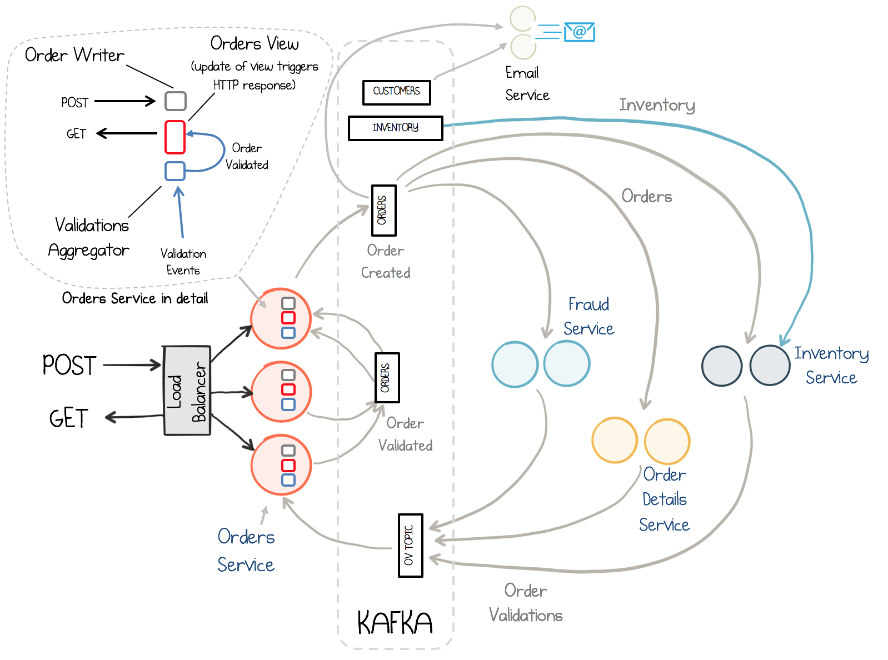
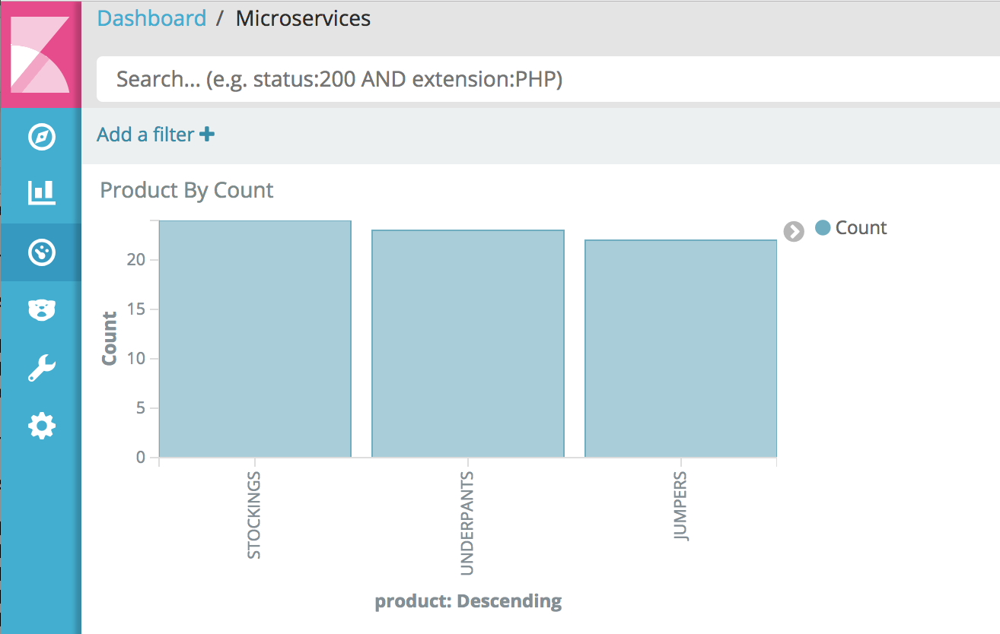

# Overview

This demo integrates the [Microservices Orders Demo Application](https://github.com/confluentinc/kafka-streams-examples/tree/5.0.x/src/main/java/io/confluent/examples/streams/microservices) fully into the Confluent Platform and Confluent Cloud.

# Prerequisites

* [Common demo prerequisites](https://github.com/confluentinc/quickstart-demos#prerequisites)
* [Confluent Platform 5.0](https://www.confluent.io/download/)
* Java 1.8 to compile the demo application
* Elasticsearch 5.6.5 to export data from Kafka
  * If you do not want to use Elasticsearch, comment out ``check_running_elasticsearch`` in the ``start.sh`` script
* Kibana 5.5.2 to visualize data
  * If you do not want to use Kibana, comment out ``check_running_kibana`` in the ``start.sh`` script

# What Should I see?

After you run `./start.sh`:

* If you are running Confluent Enterprise, open your browser and navigate to the Control Center web interface Monitoring -> Data streams tab at http://localhost:9021/monitoring/streams to see throughput and latency performance of the KSQL queries
* If you are running Confluent Enterprise, use Control Center to view and create KSQL queries. Otherwise, run the KSQL CLI `ksql http://localhost:8088`.
* Navigate to the Kibana dashboard at http://localhost:5601/app/kibana#/dashboard/Microservices

