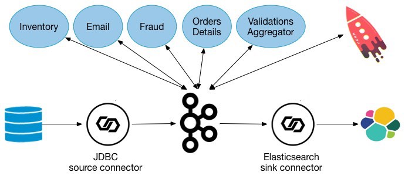

# Overview

This self-paced tutorial provides exercises for developers to apply the basic principles of streaming applications, by using a small demo microservice ecosystem built with Kafka Streams.

# Documentation

You can find the documentation for running this demo and its accompanying tutorial at [https://docs.confluent.io/platform/current/tutorials/examples/microservices-orders/docs/index.html](https://docs.confluent.io/platform/current/tutorials/examples/microservices-orders/docs/index.html?utm_source=github&utm_medium=demo&utm_campaign=ch.examples_type.community_content.microservices-orders)
