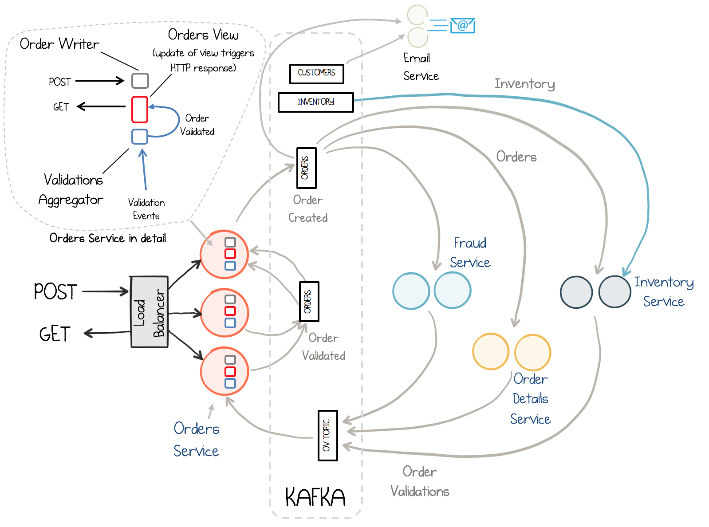

# Overview

This demo is based on the [Microservices Orders Demo Application](https://github.com/confluentinc/kafka-streams-examples/tree/5.0.x/src/main/java/io/confluent/examples/streams/microservices) 

This demo augments that Microservices Orders scenario by fully integrating it into streaming ETL built on Confluent Platform:

* [JDBC source connector](connector_jdbc_customers.config): reads from a sqlite database that has a table of customers information and writes the data to a Kafka topic called `customers`
* [Elasticsearch sink connector](connector_elasticsearch.config): reads from a Kafka topic called `orders` and pushes to Elasticsearch
* [KSQL](ksql.commands): creates streams and tables and joins data from a STREAM of orders with a TABLE of customer data

# Prerequisites

* [Common demo prerequisites](https://github.com/confluentinc/quickstart-demos#prerequisites)
* [Confluent Platform 5.0](https://www.confluent.io/download/)
* Java 1.8 to compile the demo application
* Elasticsearch 5.6.5 to export data from Kafka
  * If you do not want to use Elasticsearch, comment out ``check_running_elasticsearch`` in the ``start.sh`` script
* Kibana 5.5.2 to visualize data
  * If you do not want to use Kibana, comment out ``check_running_kibana`` in the ``start.sh`` script

# Dataflow

Here is a description of which microservices and clients are producing to and reading from which topics (excludes internal topics).

## Microservices

| Service                             | Consuming From                    | Producing To          |
| ----------------------------------- | --------------------------------- | --------------------- |
| InventoryService                    | `orders`, `warehouse-inventory`   | `order-validations`   |
| FraudService                        | `orders`                          | `order-validations`   |
| OrderDetailsService                 | `orders`                          | `order-validations`   |
| ValidationsAggregatorService        | `order-validations`, `orders`     | `orders`              |
| EmailService                        | `orders`, `payments`, `customers` | -                     |

## Other clients

| Other Clients                       | Consuming From        | Producing To            |
| ----------------------------------- | --------------------- | ----------------------- |
| OrdersService                       | -                     | `orders`                |
| PostOrdersAndPayments               | -                     | `payments`              |
| AddInventory                        | -                     | `warehouse-inventory`   |
| KSQL                                | `orders`, `customers` | KSQL streams and tables |
| JDBC source connector               | DB                    | `customers`             |
| Elasticsearch sink connector        | `orders`              | ES                      |

# What Should I see?

After you run `./start.sh`:

* If you are running Confluent Enterprise, open your browser and navigate to the Control Center [Data streams tab](http://localhost:9021/monitoring/streams) to see throughput and latency performance of the KSQL queries
* If you are running Confluent Enterprise, navigate to the Control Center [KSQL tab](http://localhost:9021/development/ksql/localhost%3A8088/streams) to view KSQL streams and tables, and to create KSQL queries. Otherwise, run the KSQL CLI `ksql http://localhost:8088`.
* Navigate to the Kibana dashboard at http://localhost:5601/app/kibana#/dashboard/Microservices

